# 1 An introduction to `D3.js`

# 第一章 `D3.js` 入门


### This chapter covers

- Understanding the role of D3.js and the philosophy behind it
- Recognizing the tools that are used in combination with D3 to create data visualizations
- Creating and styling Scalable Vector Graphics (SVG) with code
- Learning how data visualization best practices can support your journey as a D3 developer

本章要点

- 理解 `D3.js` 的定位及设计理念；
- 了解可与 `D3` 搭配使用的数据可视化工具；
- 用代码创建并设置 `SVG` 图形；
- 了解数据可视化最佳实践在 `D3` 开发过程中的支撑作用


D3.js is behind nearly all the most innovative and exciting information visualizations. D3, which stands for Data-Driven Documents, is a brand name but also a class of applications that have been offered on the web in one form or another for years. We can use this library to build an extended variety of data-driven projects, from simple bar charts to dynamic maps to intricate explorations of space and time. D3 is the tool of choice when you want to have total creative and technical freedom over your data visualizations, whether you build prototypes for research, extensive data dashboards at a top tech company, or innovative data scrollytelling pages for the web.

`D3.js` 支持几乎所有最具创造力的、令人振奋的信息可视化展示。`D3` 即数据驱动文档（**Data-Driven Documents**）的英文首字母缩写，它既是一个商标名，也是近年来网上以某种形式提供的一类应用程序。`D3` 可用于构建各种各样的数据驱动项目：从简单的条形图到动态地图、再到对空间和时间的复杂效果探索。无论是研究构建原型、打造顶级科技公司全覆盖的数据仪表盘，还是绘制富有创意的 `Web` 滚动讲述页面，当您希望在数据可视化上拥有完全的创意空间和技术自由时，`D3` 将是您的不二之选。


## 1.1 D3.js 是什么 What is D3.js

D3 is an open-source JavaScript library created in 2011 by Mike Bostock to generate dynamic and interactive data visualizations for the web. Although many new data visualization libraries have been introduced in the past few years, they often use D3 under the hood. This is because D3 is extremely flexible and powerful.

`D3` 是由美国设计师 *Mike Bostock* 于 2011 年创建的、用于生成动态的、交互式 `Web` 端数据可视化效果的开源 `JavaScript` 工具库。尽管过去这些年涌现了大量新的可视化工具库，其底层往往用到的都是 `D3`。这是因为 `D3` 非常灵活且功能强大。


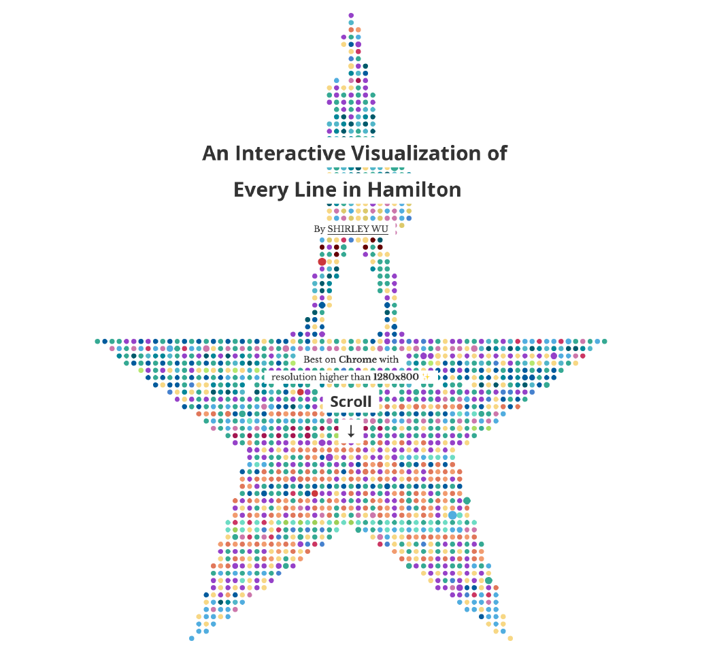

**图 1.1 汉密尔顿每句台词的交互式可视化展示效果（由 *Shirley Wu* 创建的 `D3` [可视化](https://pudding.cool/2017/03/hamilton))**


### 1.1.1 Web 端访问数据可视化的需要 A need for web-accessible data visualizations

`D3.js` 的诞生是为了满足在 `Web` 端访问复杂的数据可视化的迫切需求。假如您的公司正在使用的商业智能工具无法提供团队需要的那种数据展示效果，这时就必须根据特定需求量身定制一个数据面板，来准确展示客户的行为模式。该面板要能快速响应、可供交互并且能在整个组织中共享数据。为此您需要选用 `D3`。

或者想象一下：您受雇实现一个网页效果，旨在反映全球范围内 `LGBTQ` 的群体权力在过去几十年和演变情况。此页面包含许多随着页面滚动而变换的创新性可视化效果，能通过鼠标事件显示更多的信息、并自动适应屏幕大小。`D3` 将是构建此类项目的首选工具。

*Mike Bostock* 创建 `D3` 的初衷，是为了利用新兴的 `Web` 标准，正如他所说：“避免专享的表现形式，并提供极致的灵活性，充分挖掘 `CSS3`、`HTML5` 和 `SVG` 等 `Web` 标准的最大潜力”（http://d3js.org)。 `D3.js` 第七版是目前这个热门工具库的最新版，通过模块化 `D3` 的各个组件，使其与 `ECMAScript` 模块和现代应用程序开发完全兼容，从而引领流行趋势。

`D3.js` 使开发者不仅能制作出具有丰富交互效果的应用程序，而且也能像传统 `Web` 应用程序那样提供样式和服务。这使得它们的可移植性更强，更适合不断扩展；对于大型团队中不了解 `D3` 特定语法的其他成员而言，也能通过设置 `CSS` 样式，很方便地进行项目维护。


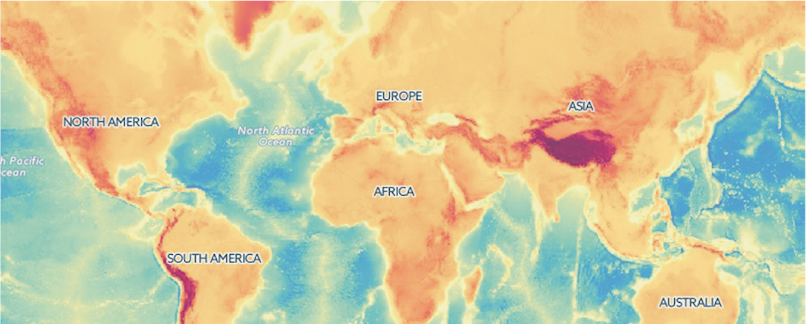

**图1.2 D3 开发者能接触到各类数据呈现方式，例如地图。这是 [Christophe Viau](https://christopheviau.com/) 绘制的地图效果**


*Bostock* 决定对数据进行最泛化的处理并创建一个通用工具库，使其展示出的地图效果，能够像展示图表、展示网络或者展示列表那样容易。这也意味着，开发者无需为了展示地图去单独了解具体某个库的抽象层及语法、为了实现动态文本效果再学习另一个库的语法、或者仅仅为了绘制传统图形再去学习相应的某个库。相反，用于实现交互式网络可视化效果的代码接近于纯原生 `JavaScript`，也类似于在 `D3` 地图上动态描点的代码。不仅方法相同，数据也可以相同，只是以一种方式表示网络的节点与链接，而以另一种方式表示地图上的地理空间罢了。

`D3` 不仅可以创建复杂多样的图形，还可以嵌入用户期望的高级交互，这对现代 `Web` 开发至关重要。使用 `D3`，每个图表的每个元素，从旋转的地球仪到饼状图的一部分，都以相同的方式进行交互。由于 `D3` 是由精通数据可视化实践的专家创建的，因此它涵盖了数据可视化和 `Web` 开发中众多标准的交互式组件和行为。

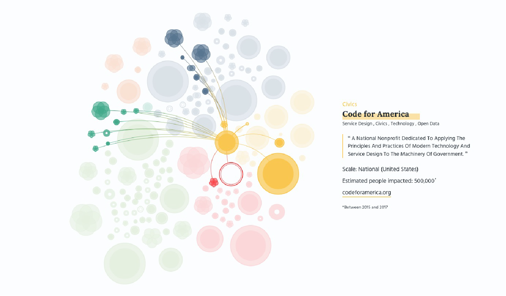

**图1.3 页面交互是 D3 的核心。该 [网络可视化效果](https://amdufour.github.io/organizations-against-polarization) 的鼠标事件交互揭示了不同组织之间的关系，以及特定于所选节点的信息**


### 1.1.2 何时使用 `D3.js` When do we use D3.js?

数据可视化领域方兴未艾，可用于生成数据绑定图形的工具，其数量在过去十年中呈爆炸式增长。我们拥有商业智能工具，如数据可视化的入门级工具 `Excel`，以及微软用于构建数据仪表盘的 `Power BI`。数据科学家通常会求助于 `R` 语言的 `ggplot2` 库或 `Python` 的 `matplotlib` 库。我们都听说过 `Tableau`，利用它可以非常快速地生成数据可视化效果。数据分析师、科学家和统计学家可以使用 `Tableau` 正式地交流数据，而数据可视化设计师则可以使用它制作出令人惊叹的作品。我们现在还可以使用面向信息图表（`infographics`）的工具，例如 `Visme` 等，以快速生成像 `RawGraphs` 这样的特定图表。此外还有为新闻编辑室提供技术支撑的 `Datawrapper`。

如今，新一类专注于网络数据可视化的工具库层出不穷，像 `HighCharts`、`Google Charts`、`Flourish`、`C3.js`、`Chart.js` 等等，当然还有 `D3.js`，不一而足。

那么，`D3` 在这片数据可视化工具的海洋中处于什么位置呢？我们该何时以及如何使用它呢？可以这么说，尽管 `D3` 可以完全构建此处列出的数据可视化库提供的任何图表，但它通常不是构建传统意义上的简单图表或探索阶段的首选工具。我们在探索阶段考察的重点，是找出最适合我们展示意图的可视化效果。构建 `D3` 项目的确需要时间，但它却能在复杂、交互式和定制项目中真正大放异彩。数据可视化可不仅仅是绘制折线图和散点图！虽然上述工具通常专注于特定的图表，但 `D3` 允许我们将数据绑定到任何图形元素中，并以独特的方式组合这些视觉元素来打破常规。我们使用 `D3` 是因为想要跳出条条框框自由地思考，不受制与工具库所提供的现有功能。

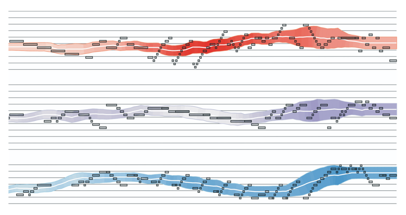

**图 1.4 `D3` 拥有 `SVG` 和 `canvas` 的绘图函数，允许开发人员构建自定义可视化效果，例如 [Elijah Meeks](http://elijahmeeks.com/) 制作的乐谱演示效果。**

上例演示了如何在数据可视化项目范围内使用 `D3`。首先从预先存在的数据集或手动收集的数据开始。在开始数据分析之前，我们通常会花费大量时间清理、格式化和准备数据。 `Python` 和 `R` 语言等数据科学工具在这方面非常强大，可以帮助我们识别隐藏在数据中的（诸多）真相。`Excel` 也可以完成简单的数据整理和分析工作，并且对技术背景的要求也不高。 我们甚至可以使用 `JavaScript` 和 `D3` 进行基本的数据探索，因为它们提供了后续章节还会讲到的统计学的方法。

进行数据分析，通常会创建一些原型来帮助完善我们的展示内容。`Tableau` 和 `RawGraphs` 等工具使我们能够快速生成此类图表。这是一个非常重要的步骤，在这个阶段创建的可视化效果通常并不花哨或多么精致。我们不想在这个原型设计阶段花很多时间在我们的想法上。我们可能最终会发现，自己不得不“杀死我们的宝贝”并重复操作几次，直到确定最适合当前故事讲述的可视化效果。这当中网络图可能是个例外，直接选用 `D3` 通常对这些项目而言更有意义。

最后，一旦明确即将创建的可视化类型，就该卷起袖子进行编码，并使用 `D3` 进行改进。 如今，编码这步通常发生在使用 `React` 或 `Svelte` 等框架的单页面应用程序 (`SPA`) 。

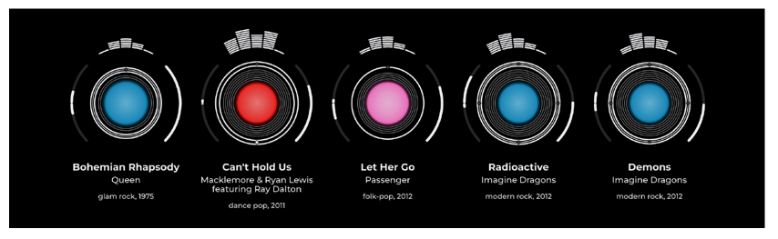

**图 1.5 使用 `D3` 构建自定义可视化效果的又一示例，其中形状与每首歌曲的不同属性（如持续时间、流派和节奏）成比例（[https://amdufour.github.io/spotify-hits](https ://amdufour.github.io/spotify-hits/)）**


### 1.1.3 `D3.js` 工作原理 How D3.js works

您可能已经尝试过 `D3` 并发现它并不容易上手，或许是因为您把 `D3` 当成了一个简单的 `JS` 图表库。一个典型的例子是创建条形图，我们将在第二章中完成。`D3` 没有专门的函数来创建一个条形图，而是先提供了一个函数将 `<svg>` 容器追加到文档对象模型 `DOM` 中，然后用另一组函数为每个数据点添加一个 `<rect>` 元素。再使用比例尺（`scales`）来计算各矩形的长度并设置它们的属性。最后还得调用另一组函数，将 `x` 轴和 `y` 轴添加到条形图上。如图 1.6 所示，`D3` 的处理过程比 `Highcharts` 这样的专用图表库要长得多。但 `D3` 对数据和图形的显示处理也恰恰是它的强项所在。尽管其他图表库在制作折线图和饼图方面提供了便利，但一遇到超出传统图表范围的可视化效果，甚至是想实现自定义的扭转效果时，就会有些捉襟见肘；而 `D3` 则不会。`D3` 可以构建出任何您能想象得到的、基于数据驱动的图形与交互效果。

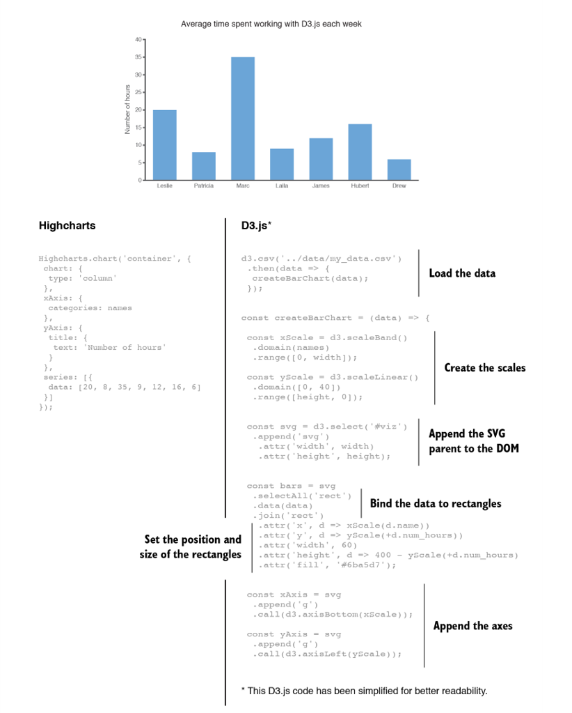

**图 1.6 使用 `Highcharts` 与 `D3.js` 绘制简单条形图的实现过程对比** 

图 1.7 展示了用 `D3` 进行数据可视化编程的常规路线图。从一个数据集开始（通常是一个 `CSV` 或 `JSON` 格式的文件），然后利用 `d3-fetch` 模块将数据集加载到项目中。我们经常需要执行一些数据格式化操作，以确保像数字和日期这样的数据格式正确无误。就算不进行格式化，可能也需要找出数据集的主要特征，例如，提前知晓它的最大值和最小值等等；然后准备构建可视化效果，需要用到本书介绍的不同的 D3 函数；最后，通过监听鼠标事件来增加交互性，让用户自行过滤数据或缩放可视化视图。

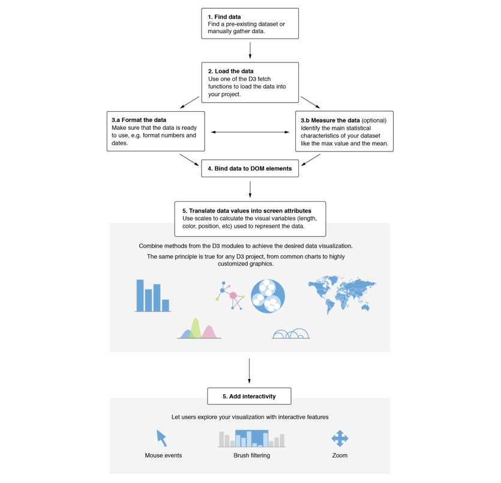

**图 1.7 如何使用 `D3.js` 实现数据可视化**


## 1.2 D3 生态——开始前需要明白的事 The D3 ecosystem - What you need to know to get started

D3.js is never used alone but is rather part of an ecosystem of technologies and tools that we combine the create rich web interfaces. Like any web page, D3 projects are built within the DOM (Document Object Model) and leverage the power of HTML5. Although D3 can create and manipulate traditional HTML elements like divisions (`<div>`) and lists (`<ul>`, `<ol>`), we mainly generate our visualizations with SVG graphics or within canvas, an HTML element that renders bitmap images from scripts. Then we might also use good old CSS stylesheets which can enhance D3 projects and make their design easier to maintain, especially across broad teams.

In this section, we will briefly discuss these technologies and their role in the D3 ecosystem. Since SVG knowledge is foundational to understanding D3, we will spend time explaining in greater detail the basics that you will need to comprehend to start building visualizations. If you are already familiar with HTML, SVG elements, CSS, JavaScript and JavaScript modules, feel free to skim or skip ahead to section 1.3.

### 1.2.1 HTML and the DOM

We’ve come a long way from the days when animated GIFs and frames were the pinnacles of dynamic content on the web. In figure 1.8, you can see why GIFs never caught on for robust web-based data visualizations. GIFs, like the infoviz libraries designed to use VML, were necessary for earlier browsers, but D3 is designed for the modern browsers that no longer need backward compatibility.

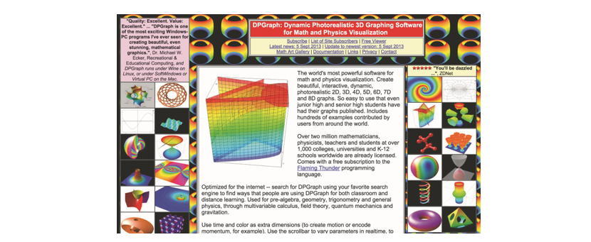

**Figure 1.8 Before GIFs were weaponized to share cute animal behavior, they were your only hope for animated data visualization on the web. Few examples from the 1990s like dpgraph.com still exist, but this page has more than enough GIFs to remind us of their dangers.**

When you land on a web page, the first file to be loaded is a HyperText Markup Language or HTML file, like the example below. The browser parses the HTML file to build the Document Object Model or DOM. We often refer to it as the DOM tree because it consists in a set of nested elements, also called nodes or tags. In our example, the `<head>` and the `<body>` elements are children of the `<html>` parent. Similarly, the `<body>` tag is the parent of the `<h1>`, the `<div>` and the `<p>` tags. The `<h1>` title is also a sibling of the `<div>` element. When you load a web page, what you see on the screen is the elements contained within the `<body>` tag.

```html
<!DOCTYPE html>
<html>
    <head>
        <meta charset="UTF-8">  
        <title>A simple HTML file | D3.js in Action</title>
    </head>
    <body>
        <h1>I am a title</h1>
        <div>
            <p>I am a paragraph.</p>
            <p>I am another paragraph.</p>
        </div>
    </body>
</html>
```

In the DOM, three categories of information about each element define its behavior and appearance: styles, attributes, and properties. Styles determine color, size, borders, opacity, and so on. Attributes include classes, ids, and interactive behavior, though some attributes can also determine appearance, depending on which type of element you're dealing with. For SVG elements, attributes are used to set the position, size and proportions of the different shapes. Properties typically refer to states, such as the "checked" property of a check box, which is true if the box is checked and false if the box is unchecked. In chapter 2, we will discuss the D3 methods used to generate or modify the style and attributes of elements.

The DOM also determines the onscreen drawing order of elements, with child elements drawn after and inside parent elements. Although the CSS property `z-index` gives us partial control over the order in which traditional HTML elements are drawn onto the screen, SVG elements strictly follow the order in which they appear in the DOM.

### 1.2.2 SVG - Scalable Vector Graphics

The introduction of Scalable Vector Graphics (SVG) changed the face of the web, literally. Within a few years, SVG graphics became a major web development tool. While raster graphics (PNG and JPG) are composed of tiny pixels that become visible when we zoom in too close, vector graphics are built with math and geometry. They maintain a crisp look at any size and any screen resolution. Another considerable advantage of SVG graphics is that they can be injected directly into the DOM, allowing developers to manipulate and animate their elements and making them accessible to screen readers. If built properly, SVGs are also performant, their file size being only a fraction of their equivalent raster images.

When creating data visualizations with D3, we usually inject SVG shapes into the DOM and modify their attributes to generate the visual elements that compose the visualization. Understanding how SVG works, the main SVG shapes, and their presentational attributes are essential to most D3 projects.

> ##### HOW TO ACCESS THE CODE FILES
>
> Every chapter in this book includes code-along exercises designed to support your learning experience. We highly recommend that you “do” the book rather than just “read” the book, which means completing the exercises as you read the chapters. You will retain much more information this way and will soon be on your way to building your own D3 projects!
>
> For every exercise and project, you have access to ready-to-use code files. You can find them on the book’s [Github](https://github.com/d3js-in-action-third-edition/book-exercises) [repository](https://github.com/d3js-in-action-third-edition/code-files) (https://github.com/d3js-in-action-third-edition/code-files). If you are familiar with Git, you can clone the repository on your computer. You can also download the zipped files.
>
> 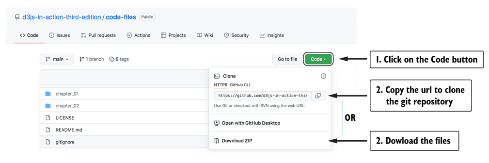
>
> Each chapter has its own folder that contains one or multiple exercises numbered as per the sections in each chapter. The exercises include a `start` folder containing all the files you need to get started. You’ll find the complete solution of the exercise in the `end` folder.

Let’s start exploring vector graphics. Go to the code files provided with this book. Find the `end` folder in `chapter_01/SVG_Shapes_Gallery` and right-click on the file `index.html`. In the menu, go to *Open with* and select a browser. We recommend working with Chrome or Firefox for their great inspector tools. The file will open in a new browser tab, and the vector graphic that you see in figure 1.9 will appear. You can also view these SVG shapes on the Github hosted project (https://d3js-in-action-third-edition.github.io/svg-shapes-gallery).

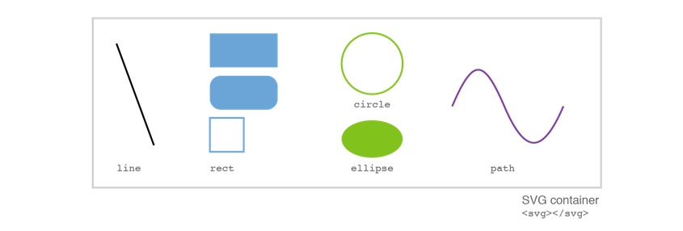

The SVG graphic you are looking at contains the shapes you will use most often as you create D3 visualizations: lines, rectangles, circles, ellipses, paths, and text.

When working with D3, you usually tell the library which shape(s) it should append to the DOM. You are also responsible for knowing which presentational attributes need to be calculated for the shape(s) to have the dimensions, color, and position that you are looking for. In the following exercise, you will write the code that creates each of the SVG elements from figure 1.9. We will refer to this exercise as our *Gallery of SVG Shapes*. Afterward, you’ll know all the SVG basics you need to get started.

Open the file `index.html` from the `start` folder of the exercise `SVG_Shapes_Gallery` in your code editor of choice. We recommend *VS Code*, a code editor that is free, easy to use, and has a lot of functionality that you will find helpful for frontend development.

As you can see, `index.html` is a simple HTML file. If you open this file in your browser (right-click on the file and choose a browser in the *Open with* menu), you will only see a blank page. This is because the `<body>` element is empty. In the next subsections, we will add SVG shapes into this `<body>` element.

```html
<!DOCTYPE html>
<html>
    <head>
        <meta charset="UTF-8">
        <meta name="viewport" content="width=device-width, initial-scale=1.0">  
        <title>SVG Shapes Gallery | D3.js in Action</title>
    </head>
    <body>

    </body>
</html>
```

> ##### WHERE TO FIND MORE INFORMATION
>
> The following sections will introduce multiple SVG elements and their attributes. As developers, we heavily rely on online resources when building our projects, using SVG elements that we are not familiar with, or looking for a JavaScript function to perform a specific action. In frontend development, [MDN Web Docs](https://developer.mozilla.org/) (developer.mozilla.org) is always a reliable and comprehensive resource. It contains easy-to-understand and often editable examples for HTML elements and their attributes, CSS properties, and JavaScript functions.

#### responsive svg container

In the world of SVG graphics, the [&lt;svg>&lt;/svg>](https://developer.mozilla.org/en-US/docs/Web/SVG/Element/svg) container is the whiteboard on which everything is drawn. Every single SVG shape is nested inside a `<svg>` parent. To see it in action, edit `index.html` and add a SVG container inside the `<body>` element. Reload your page in the browser. Nothing is visible yet.

```html
<body>
    <svg></svg>
</body>
```

Open the inspector tool of your browser (right-click in your browser window and choose *Inspect*). Within the inspector window, you will see the DOM that composes the page. Find the `<svg></svg>` container, also called the SVG node. When you pass your mouse over it in the inspector, the SVG element gets highlighted on the page. You can see this effect in figure 1.5.

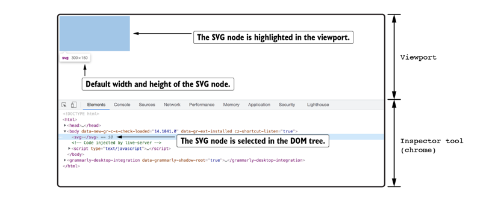

**Figure 1.10 SVG node selected in the DOM tree and highlighted in the viewport**

By default, the browser gives a width of `300px` and a height of `150px` to the SVG container. But we can also use the attributes of the SVG container to assign these values. Attributes are there to provide additional information about HTML elements. With inline SVG, we mainly use attributes to set the size and positions of the elements and shapes that compose a SVG graphic.

For example, we can set the [width](https://developer.mozilla.org/en-US/docs/Web/SVG/Attribute/width) and [height](https://developer.mozilla.org/en-US/docs/Web/SVG/Attribute/height) attributes of a SVG container. Go back to your text editor, and add a `width` and a `height` attributes to the SVG container. Set their values to `900` and `300` and save the file.

```xml
<svg width="900" height="300"></svg>
```

Reload your project in the browser and find the SVG node in the inspect tool. Notice that the width and height attributes now appear within the brackets of the SVG container. If you pass your mouse over the SVG node in the DOM tree of the inspect tool, you'll also see that the SVG container in the viewport now has a size of 900px by 300px.

##### Figure 1.11 SVG node taking the size specified by its attributes

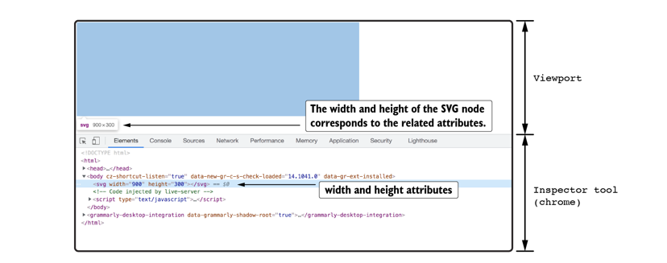

To help us see the SVG container without having to highlight it from the inspector, let's give it a border. Add a style attribute to the SVG container and insert the CSS border property. In the next snippet, we used the border shorthand property to create a black, solid border of 1px width.

```xml
<svg width="900" height="300" style="border:1px solid black;"></svg>
```

Save your file, reload the page and confirm that there is a border around your SVG container. Now, resize your browser window until it is smaller than the SVG container. You will observe that the SVG container keeps a fixed width and height and doesn't adapt to the browser window's size. Let's try to make our SVG container responsive.

Previously, we have set the SVG attributes as absolute values (`900` and `300`) and the browser interpreted them as measurements in pixels (`900px` and `300px`). But we can also use percentages. In your text editor, change the width attribute to a relative value of "`100%`", save the file and reload the page.

```xml
<svg width="100%" height="300" style="border:1px solid black;"></svg>
```

Resize your browser again and notice how the SVG takes the full width available and keeps a fixed height of 300px. That's better, but we've lost our original aspect ratio.

To make inline SVG responsive, we can use the [viewBox attribute](https://developer.mozilla.org/en-US/docs/Web/SVG/Attribute/viewBox). In your code editor, remove the `width` and the `height` attributes from the SVG container and replace them with a `viewBox` attribute. Give it a value of `"0 0 900 300"`.

```xml
<svg viewBox="0 0 900 300" style="border:1px solid black;"></svg>
```

Play again with resizing your browser window. What do you notice? The SVG container now adapts to any screen size while maintaining its aspect ratio of 900:300. We have a responsive SVG!

As you've noted, the viewBox attribute consists of a list of four values. The first two numbers specify the origin of the coordinate system of the viewBox (x and y). In this book, we will always use `0 0`, but it is good to know that these values can be used to change which portion of the SVG container is visible on the screen. The last two numbers of the viewBox attribute are its width and its height. They define the aspect ratio of the SVG and ensure that it scales perfectly to fit within any container without distortion.

Fitting within a container is the key here. So far, the container of our inline SVG is the HTML `<body>` element, which generally extends to fit the browser's viewport. If the viewport gets very large, the SVG gets very large too. Usually, we want our SVG to have a maximum width so that it doesn't get larger than the rest of the content on the page. To do so, wrap the SVG container inside a div with a width of 100% and a max-width of 1200px. For simplicity, we have set these properties as inline styles, but in real-life projects, these would be attributed from a CSS file. Notice that we have also added a margin of value "`0 auto`" to center the SVG horizontally on the page.

```html
<div style="width:100%; max-width:1200px; margin:0 auto;">
    <svg viewBox="0 0 900 300" style="border:1px solid black;"> ... </svg>
</div>
```

Try resizing your browser one more time and see how our SVG adapts gracefully to any screen size while respecting the maximum width of its container. This strategy is helpful to inject D3 visualizations into responsive web pages, and we will use it throughout this book.

#### svg coordinate system

Now that we know how to make inline SVG responsive, it's important to address how the SVG shapes are positioned within the SVG container. The SVG container is like a blank sheet on which we draw vectorial shapes. Vectorial shapes are defined with basic geometric principles and positioned in reference to the coordinate system of the SVG container.

The SVG coordinate system is similar to the cartesian coordinate system. Its 2D plane uses two perpendicular axes to determine the position of elements, referred to as x and y. These two axes originate from the **top-left corner** of the SVG container, as you can see in figure 1.12. It means that the positive direction of the y-axis goes **from top to bottom**. Remembering this will save you from a few headaches!

##### Figure 1.12 Coordinate system of the SVG container and position of an element

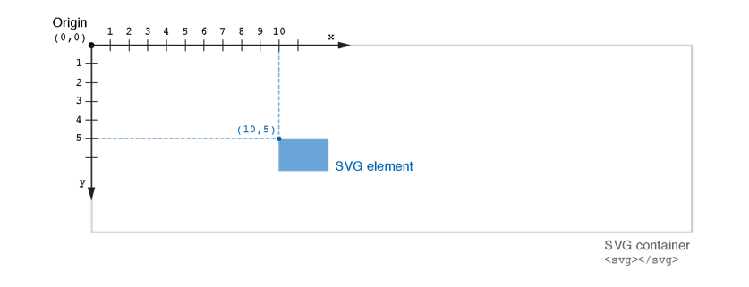

To position an element inside the SVG container, we start from the origin at the top-left corner and move toward the right. This will give us the horizontal (x) position of the element. For the vertical (y) position, we start at the top and move down. These positions are defined by the presentational attributes of each SVG shape.

We will now look at the SVG shapes that you will often meet while building D3 projects. We will also discuss their main presentational attributes. The goal here is by no means to write a comprehensive guide of all the shapes and features SVG has to offer, but rather to cover the basic knowledge that will support your D3 journey.

> ##### DATA VISUALIZATION TIP: GEOMETRIC PRIMITIVES
>
> Accomplished artists can draw anything with vector graphics, but you're probably not looking at D3 because you're an artist. Instead, you're dealing with graphics and have more pragmatic goals in mind. From that perspective, it's essential to understand the concept of geometric primitives (also known as graphical primitives). Geometric primitives are simple shapes such as points, lines, circles, and rectangles. These shapes, which can be combined to make more complex graphics, are particularly convenient for displaying information visually.
>
> Primitives are also useful for understanding complex information visualizations that you see in the real world. Dendrograms, like the ones we will build in chapter 6, are far less intimidating when you realize they're only circles and lines. Interactive timelines are easier to understand and create when you think of them as collections of rectangles and points. Even geographic data, which primarily comes in the form of polygons, points, and lines, is less confusing when you break it down into its most basic graphical structures.

#### line

The line element is probably the simplest of all SVG shapes. It takes the position of two points, set as attributes, and draws a straight line between them. Go back to the `index.html` file, and add a [](https://developer.mozilla.org/en-US/docs/Web/SVG/Element/line) element inside the SVG container. Declare its attributes [x1](https://developer.mozilla.org/en-US/docs/Web/SVG/Attribute/x1) and [y1](https://developer.mozilla.org/en-US/docs/Web/SVG/Attribute/y1) and give them a value of 50 and 45, respectively. This means that the starting point of our line is positioned at `(50, 45)` in the coordinate system of the SVG container. If you start at the top-left corner of the SVG container, move 50px to the right and 45px down, you will meet the line's starting point. Similarly, set the line's endpoint to `(140, 225)`, using the attributes [x2](https://developer.mozilla.org/en-US/docs/Web/SVG/Attribute/x2) and [y2](https://developer.mozilla.org/en-US/docs/Web/SVG/Attribute/y2).

```xml
<svg>
    <line x1="50" y1="45" x2="140" y2="225" />
</svg>
```

##### Figure 1.13 Positioning a line element in the coordinate system of a SVG container

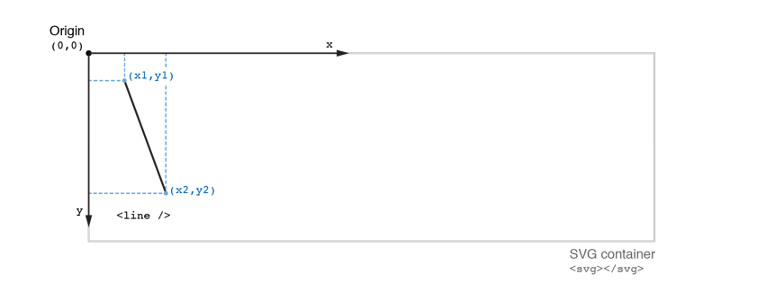

If you save and reload your project, your line won't be visible, and you might wonder what's going on. For a SVG line to be visible on the screen, we also need to set its [stroke](https://developer.mozilla.org/en-US/docs/Web/SVG/Attribute/stroke) attribute, which controls the line's color. The value of the stroke attribute is similar to the CSS color property. It can be a color name (`black`, `blue`, ...), a RGB color (`rgb(255,0,0)`) or a hexadecimal value (`#808080`). Add a stroke attribute to your line and give it the color of your choice (we used black). It should now be visible on the screen.

```xml
<line x1="50" y1="45" x2="140" y2="225" stroke="black" />
```

If we want to set the width of the line, we use the [stroke-width](https://developer.mozilla.org/en-US/docs/Web/SVG/Attribute/stroke-width) attribute. This attribute accepts an absolute number, which translates into pixels or a relative value (%). For example, the following line will have a `stroke-width` of 3px. If the `stroke-width` attribute is not declared, the browser applies a default value of 1px.

```xml
<line x1="50" y1="45" x2="140" y2="225" stroke="black" stroke-width="3" />
```

Open the inspector tool of your browser and find the SVG node and the line it contains. Double-click on one of the attributes, change its value and observe how the new value modifies the line's starting or endpoint. Take the time to play with different values to confirm that you understand how the attributes `x1`, `y1`, `x2`, and `y2` affect the position and length of the line.

Now, give a value of `-20` to the attribute `x1`. Do you see how the starting point of the line disappeared? *Any shape or portion of a shape that falls outside of the SVG viewBox is not visible on the screen.* The element still exists in the DOM, though. We can access and manipulate it. If an element in your SVG is not visible and you don't know why the first thing to check is if it is outside of the SVG viewBox! Remember that you can always find it by using the developer tools to inspect the DOM. As we did earlier, if you pass your mouse over the element in the inspector tool, it will be highlighted in the viewport, even if it is outside of the SVG viewBox.

##### Figure 1.14 SVG line partially hidden when outside of SVG container

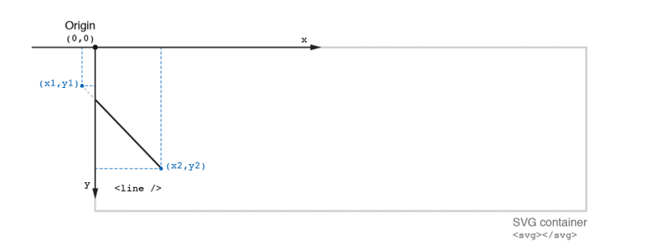

#### rectangle

As its name suggests, the rectangle element [](https://developer.mozilla.org/en-US/docs/Web/SVG/Element/rect) draws a rectangular shape on the screen. The `<rect />` element requires four attributes to be visible. The attributes [x](https://developer.mozilla.org/en-US/docs/Web/SVG/Attribute/x) and [y](https://developer.mozilla.org/en-US/docs/Web/SVG/Attribute/y) declare the position of the rectangle's top-left corner, while the attributes [width](https://developer.mozilla.org/en-US/docs/Web/SVG/Attribute/width) and [height](https://developer.mozilla.org/en-US/docs/Web/SVG/Attribute/height) respectively control its width and height. Add the following `<rect />` element and its attributes in your SVG container.

```xml
<rect x="260" y="25" width="120" height="60" />
```

In our example, the top-left corner of the rectangle is positioned `260px` to the right and `25px` below the origin of the SVG container. It has a width of `120px` and a height of `60px`. Like with other positional attributes, we can set their values using percentages instead of absolute numbers. For instance, if we set the `width` attribute to `50%`, the rectangle will spread on half of the width of the SVG container.

##### Figure 1.15 Positioning and sizing a rectangle in the coordinate system of a SVG containers

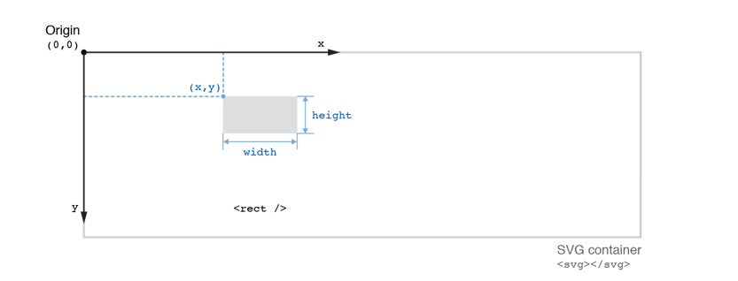

You might have noticed that our rectangle is filled with black color. By default, browsers apply a black fill to most SVG shapes. We can change that color by setting the [fill](https://developer.mozilla.org/en-US/docs/Web/SVG/Attribute/fill) attribute and giving it any CSS color. If we want to add a border to the rectangle, we add a stroke attribute. figure 1.16 shows a few examples. Note how no border is drawn around the rectangle if you don't declare a `stroke` attribute. Also, in the last rectangle, the attributes [fill-opacity](https://developer.mozilla.org/en-US/docs/Web/SVG/Attribute/fill-opacity) and [stroke-opacity](https://developer.mozilla.org/en-US/docs/Web/SVG/Attribute/stroke-opacity) are used to make the `fill` and the `stroke` semi-transparent. Like in CSS, the opacity can be set as an absolute value (`0.3`) or a percentage (`30%`). All the attributes related to the fill and the stroke can also be set or modified from a CSS file.

##### Figure 1.16 Different styling attributes applied to rectangle SVG shapes

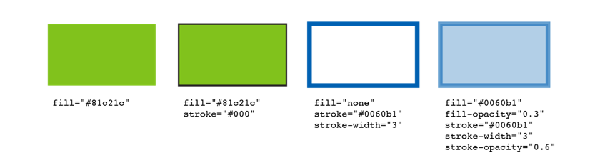

If you want your rectangle to have rounded corners, you simply need to add the [rx](https://developer.mozilla.org/en-US/docs/Web/SVG/Attribute/rx) and [ry](https://developer.mozilla.org/en-US/docs/Web/SVG/Attribute/ry) attributes, respectively the horizontal and vertical corner radius. These attributes accept absolute (in pixels) and relative values (percentages). For example, each corner of the rectangle below has a radius of 20px. Add this rectangle to your gallery of shapes.

```xml
<rect x="260" y="100" width="120" height="60" rx="20" ry="20" />
```

At this point, you might wonder if there is an element to draw square shapes in SVG. We don't need one! In SVG, we draw squares with `<rect />` elements, by giving them equal `width` and `height` attributes. For example, the following `<rect />` element will draw a square of 60px by 60px. Add it to your gallery of shapes as well.

```xml
<rect x="260" y="175" width="60" height="60" />
```

As a reference, we now have three types of SVG rectangles in our gallery of shapes: a classical rectangle, a rectangle with rounded corners, and a square. For fun, I gave them a color of `#6ba5d7` and played with their `stroke` and `fill` attributes. Note that only the stroke is visible on the square because its `fill` attribute has a value of `transparent` or `none`. Your rectangles should look similar to the ones on figure 1.17, unless you changed their attributes, which I encourage you to do!

```xml
<rect x="260" y="25" width="120" height="60" fill="#6ba5d7" />
<rect x="260" y="100" width="120" height="60" rx="20" ry="20"  fill="#6ba5d7" />
<rect x="260" y="175" width="60" height="60" fill="transparent" stroke="#6ba5d7" />
```

##### Figure 1.17 Three types of SVG rectangles

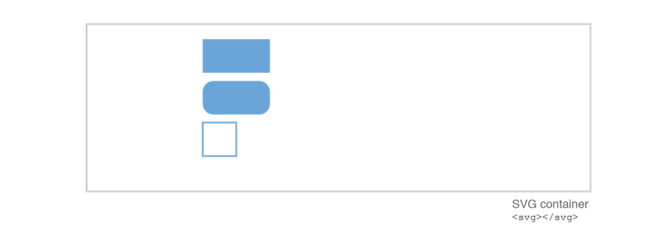

> ##### THE POSITION OF SVG STROKES
>
> Something to keep in mind when you’re trying to align shapes in a visualization is that strokes are drawn evenly over the inside and the outside border of SVG shapes. As you can see on the figure below, if a rectangle has a `width` attribute of 40px, applying a `stroke-width` of `1` will visually add 0.5px to the left and 0.5px to the right of the rectangle (and not 1px to each side like we might instinctively think), for an actual total width of 41px. If the `stroke-width` is `2`, it will add 1px to each side and so on.
>
> ##### Effect of the stroke-width on the actual width of a SVG shape
>
> 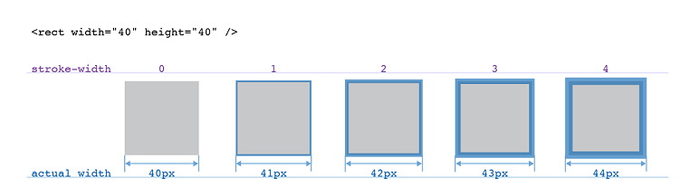

#### circle and ellipse

Circular shapes are used regularly in data visualization. They naturally attract the eye and make the visualization feel more friendly and playful. We draw SVG circles with the [&lt;circle/>](https://developer.mozilla.org/en-US/docs/Web/SVG/Element/circle) element. Its required attributes are the position of the center of the circle ([cx](https://developer.mozilla.org/en-US/docs/Web/SVG/Attribute/cx), [cy](https://developer.mozilla.org/en-US/docs/Web/SVG/Attribute/cy)) and its radius ([r](https://developer.mozilla.org/en-US/docs/Web/SVG/Attribute/r)). A circle's radius is the length of a line drawn from its center to any point on its border. Add the following circle to your gallery of shapes. Position its center at `(530, 80)` and give it a radius of 50px.

```xml
<circle cx="530" cy="80" r="50" />
```

##### Figure 1.18 Positioning and sizing a circle and an ellipse in the coordinate system of a SVG containers

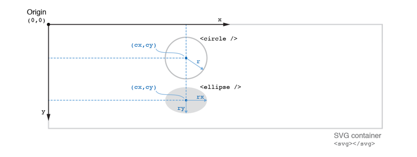

You can also play with the fill and the stroke attributes of the circle. To generate the one in figure 1.18, we used a transparent fill and a stroke of 3px with a color of `#81c21c`.

Similarly, the [](https://developer.mozilla.org/en-US/docs/Web/SVG/Element/ellipse) element requires attributes for the position of the center of the shape (`cx`, `cy`). While circles have a constant radius, the radius of ellipses varies, giving it its flattened structure. We create this flattened effect by declaring a horizontal radius ([rx](https://developer.mozilla.org/en-US/docs/Web/SVG/Attribute/rx)) and a vertical radius ([ry](https://developer.mozilla.org/en-US/docs/Web/SVG/Attribute/ry)). Add the next snippet to your gallery. It will draw an ellipse below the circle, with a horizontal radius of 50px and a vertical radius of 30px.

```xml
<ellipse cx="530" cy="205" rx="50" ry="30" />
```

#### path

SVG [paths](https://developer.mozilla.org/en-US/docs/Web/SVG/Element/path) are by far the most flexible of all the SVG elements. They are extensively used in D3 to draw pretty much all the complex shapes and curves that cannot be represented by one of the shape primitives discussed so far (line, rectangle, circle, and ellipse).

We instruct the browser on how to draw a path by declaring its `d` attribute. The `d` attribute contains a list of commands, from where to start drawing the path to the types of curves to use, up to specifying if we want the path to be a closed shape or not. As an example, add the following path element to your gallery.

```xml
<path d="M680 150 C 710 80, 725 80, 755 150 S 810 220, 840 150" fill="none" stroke="#773b9a" stroke-width="3" />
```

##### Figure 1.19 A simple SVG path drawn

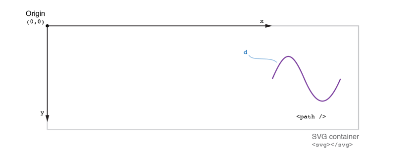

You can see the resulting path in figure 1.19. From the code of the `d` attribute, we can deduce that the path's starting point is located at `(680, 150)`and its endpoint at `(840, 150)`. In between, we see the locations of the control points of the curves.

Manually writing the `d` attribute is feasible for simple shapes but gets tedious as the shapes gain in complexity. Fortunately, D3 has powerful shape generators that we will discuss in chapter 4.

Another important thing to remember about paths is that browsers will fill them with black color, unless we set their `fill` attribute to `none` or `transparent`. This is true even if the path is not closed, like in our example.

#### text

One of the greatest advantages of inline SVG graphics is that they can contain text that is navigable like any other HTML text inserted in a `<div>` or a `<p>` element. This is a big plus for accessibility.

Since data visualizations often contain multiple labels, it is necessary to understand how to manipulate SVG text using the [](https://developer.mozilla.org/en-US/docs/Web/SVG/Element/text) element. Let's add labels to our gallery of shapes to understand the basic principles of SVG text.

You might have noticed that the SVG shapes discussed so far use a self-closing tag (`<line />`, `<rect />`, `<path />`, ...). When working with SVG `text` elements, we need to use both an opening and a closing tag. We position the text to display in between these two tags. For example, let's add a text element into our SVG that says "line".

```xml
<text>line</text>
```

Save your file and reload the page. You might expect the text to appear at the top-left corner of the SVG container, but it's nowhere to be seen... Why is that? By default, the position of SVG text is calculated in reference to its baseline, controlled by the `dominant-baseline` attribute. If the coordinate of the text's baseline is `(0, 0)`, you can see in figure 1.20 how the actual text ends up outside of the SVG container. Since any element positioned outside of the SVG container is invisible, we don't see our text.

##### Figure 1.20 Text positioned outside of the SVG container


Another point to consider when working with SVG text is how the text will flow. Regular HTML elements are positioned on the page following specific rules that control the flow of content. If you insert a bunch of `<div></div>` elements into your page, they will naturally stack one over another, and their content will reflow so that it never goes outside of their container. SVG text doesn't flow at all and each SVG element must be positioned individually. One way to proceed is to set their `x` and `y` attributes. If we use these attributes to place our text at `(60, 260)`, the label "line" will appear below the SVG line in our gallery of shapes.

```xml
<text x="60" y="260">line</text>
```

To practice, create a new text element that positions a label "rect" below the rectangle and square shapes.

So far, we have used the `x` and `y` attributes to declare the bottom-left corner of our text elements. But what if we want to set the position of the middle point of our text instead? We can do so by using the attribute [text-anchor](https://developer.mozilla.org/en-US/docs/Web/SVG/Attribute/text-anchor) and giving it a value of `middle`. For example, we can center a text label for our circle shape using this attribute.

```xml
<text x="530" y="155" style="text-anchor:middle">circle</text>
```

##### Figure 1.21 How the text-anchor attribute affects the alignment of SVG text

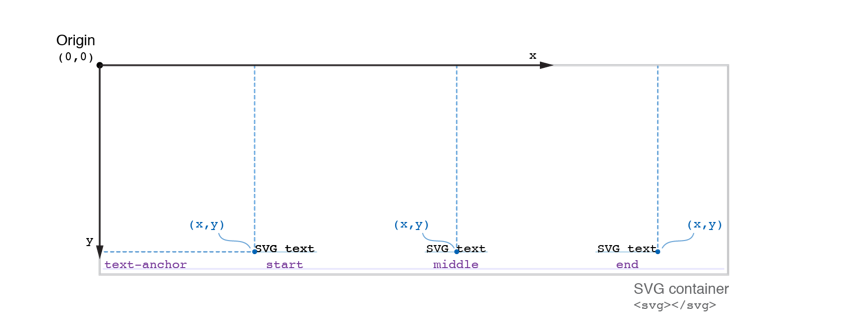

Finish by adding a label for the ellipse and another one for the path element. By default, SVG text is black. You can change its color with the `fill` attribute.

