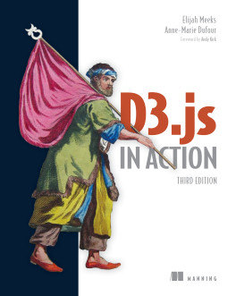

# Notes, Codes & Translations for《D3.js in Action, 3rd Edition》


## 1. Profiles



|    **Title**    | **D3.js in Action, Third Edition** [[buy](https://www.manning.com/books/d3js-in-action-third-edition)] |
| :-------------: | :----------------------------------------------------------: |
|   **Author**    |             **Elijah Meeks, Anne-Marie Dufour**              |
| **Publication** | **Manning, MEAP began in April 2022, published in May 2024** |
|    **Pages**    |                           **658**                            |

> **Create stunning web-based data visualizations with D3.js.**
> **使用 D3.js 创建令人惊叹的基于 Web 的数据可视化。**
>
> This totally-revised new edition of ***D3.js in Action*** guides you from simple charts to powerful interactive graphics. Chapter-by-chapter you’ll assemble an impressive portfolio of visualizations—including intricate networks, maps, and even a complete customized visualization layout. Plus, you'll learn best practices for building interactive graphics, animations, and integrating your work into frontend development frameworks like React and Svelte.
> **D3.js in Action** 的全新修订版将指导您从简单的图表到强大的交互式图形。通过一章又一章的学习，您将获得一部令人惊叹的可视化作品集，包括错综复杂的网络、地图，甚至完整自定义的可视化布局。此外，您还将习得一系列数据可视化领域的最佳实践，用于构建交互式图形、动画设计以及将可视化作品集成到 `React` 和 `Svelte` 等前端开发框架等。
>
> In ***D3.js in Action, Third Edition*** you will learn how to:
> 使用 ***D3.js in Action 第 3 版***，您将学习：
>
> - Set up a local development environment for D3
>   搭建 D3 本地开发环境
> - Include D3 in web development projects, including Node-based web apps
>   在 Web 开发项目中使用 D3，包括基于 Node 的 Web 应用
> - Select and append DOM elements
>   选择并附加 DOM 元素
> - Size and position elements on screen
>   调整屏幕上元素的大小和位置
> - Assemble components and layouts into creative data visualizations
>   将组件和布局组装成创意数据可视化效果
>
> ***D3.js in Action, Third Edition*** has been extensively revised for D3.js version 7, and modern best practices for web visualizations. Its brand new chapters dive into interactive visualizations, cover responsiveness for dataviz, and show you how you can improve accessibility.
> ***《D3.js 实战》第三版*** 针对 `D3.js` 第 7 版和现代 Web 可视化最佳实践进行了全面修订。其全新章节深入探讨交互式可视化，涵盖数据可视化的响应能力，并展示如何提高可访问性。
>
> ## about the technology 关于该技术
>
> With D3.js, you can create sophisticated infographics, charts, and interactive data visualizations using standard frontend tools like JavaScript, HTML, and CSS. Granting D3 its VIS Test of Time award, the IEEE credited this powerful library for bringing data visualization to the mainstream. You’ll be blown away by how beautiful your results can be!
> 借助 D3.js，您可以使用 JavaScript、HTML 和 CSS 等标准前端工具创建复杂的图表、图表和交互式数据可视化。IEEE 授予 D3 其 VIS Test of Time 奖，认可了这个强大的库将数据可视化带入主流。您一定会被您的结果有多么漂亮而感到惊讶！
>
> ## about the book 关于本书
>
> ***D3.js in Action, Third Edition*** is a roadmap for creating brilliant and beautiful visualizations with D3.js. Like a gentle mentor, it guides you from basic charts all the way to advanced interactive visualizations like networks and maps. You’ll learn to build graphics, create animations, and set up mobile-friendly responsiveness. Each chapter contains a complete data visualization project to put your new skills into action.
> ***《D3.js 实战》第三版*** 是创建精彩可视化的路线图，它像一位温柔的导师，带领您从基本的图表到高级交互式可视化（如网络和地图）。您将学习如何构建图形、创建动画并设置移动友好型响应。每章包含一个完整的数据可视化项目，以便将您的新技能付诸实践。
>
> ## about the reader 本书读者
>
> For web developers with HTML, CSS, and JavaScript skills.
> 适用于掌握 HTML、CSS 和 JavaScript 技能的网络开发人员。
>
> ## about the authors 本书作者
>
> **Elijah Meeks** was a data visualization pioneer at Stanford and the first Senior Data Visualization Engineer at Netflix. **Anne-Marie Dufour** is a Data Visualization Engineer.
> **Elijah Meeks** 是斯坦福大学的数据可视化先驱，也是 Netflix 的第一位高级数据可视化工程师。**Anne-Marie Dufour** 是一位数据可视化工程师。


## 2. Outlines

Status available：:heavy_check_mark: (Completed) | :hourglass_flowing_sand: (Working) | :no_entry: (Not Started) | :orange_book: (Finished reading)

| No.  |                       Chapter Title                       |          Status          |
| :--: | :-------------------------------------------------------: | :----------------------: |
| Ch00 |                [Welcome](./notes/Ch00.md)                 |    :heavy_check_mark:    |
|      |              **PART 1: D3.js fundamentals**               |                          |
| Ch01 |        [An introduction to D3.js](./notes/Ch01.md)        | :hourglass_flowing_sand: |
| Ch02 |          [Manipulating the DOM](./notes/Ch02.md)          |        :no_entry:        |
| Ch03 |           [Working with data](./notes/Ch03.md)            |        :no_entry:        |
| Ch04 |     [Drawing lines, curves and arcs](./notes/Ch04.md)     |        :no_entry:        |
| Ch05 |         [Pie and stack layouts](./notes/Ch05.md)          |        :no_entry:        |
| Ch06 |       [Visualizing distributions](./notes/Ch06.md)        |        :no_entry:        |
|      |           **PART 2: Meeting the new standards**           |                          |
| Ch07 |       [Interactive visualizations](./notes/Ch07.md)       |        :no_entry:        |
| Ch08 | [Integrating D3 in a frontend framework](./notes/Ch08.md) |        :no_entry:        |
| Ch09 |        [Responsive visulizations](./notes/Ch09.md)        |        :no_entry:        |
| Ch10 |       [Accessible visualizations](./notes/Ch10.md)        |        :no_entry:        |
|      |        **PART 3: Interactive data visualizations**        |                          |
| Ch11 |       [Interactive visualizations](./notes/Ch11.md)       |        :no_entry:        |
| Ch12 |       [Responsive visualizations](./notes/Ch12.md)        |        :no_entry:        |
| Ch13 |       [Accessible visualizations](./notes/Ch13.md)        |        :no_entry:        |
|      |              **PART 4: Advanced techniques**              |                          |
| Ch14 |    [Creating a custom visualization](./notes/Ch14.md)     |        :no_entry:        |
| Ch15 |  [Rendering visualizations with Canvas](./notes/Ch15.md)  |        :no_entry:        |
|      |                      **APPENDIXES**                       |                          |
|  A   |        Setting up a local development environment         |        :no_entry:        |
|  B   |                     Selecting a scale                     |        :no_entry:        |
|  C   |                 An overview of D3 modules                 |        :no_entry:        |
|  D   |                    Exercise solutions                     |        :no_entry:        |
|  E   |            A very brief introduction to Svelte            |        :no_entry:        |


Powershell script for generating markdown files in batch:

```powershell
# Create 15 empty markdown files named Ch##.md:
for($i=0; $i -le 14; $i=$i+1){ New-Item -Name "Ch$('{0:d2}' -f $i).md"; }
```

 
