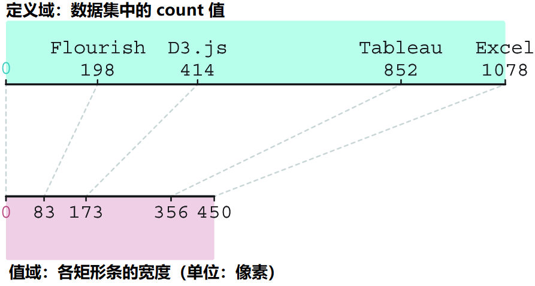

# Ch03 Working with data


## 3.3 Binding data to DOM elements

**【实测与复盘】** （2024-09-27）

- 实测分支引用 D3 最好使用本地文件，统一放到各章节 `start/js/` 文件夹下；

- 对每小节的实测代码单独新建分支，以免干扰翻译+学习笔记主分支；

- 新建分支的名称，最好统一为：`EX##-<Topic>`，例如：`EX04-Scales`、`EX03-DataBinding`；

- 新增分支不会主动推送到远程仓库，必须手动关联，如：

  ```bash
  $ git push --up-stream origin EX03-DataBinding
  $ git push --up-stream origin EX04-Scales
  # update the current branch name to newBranchName
  $ git branch -m newBranchName
  ```


## 3.4 Adapting data for the screen

### 3.4.2 Linear scale

**【实测与复盘】** （2024-9-30 00:46:37）

发布译文后，按小节要求本地实操。主要改动有：

1. `start` 项目引入 D3 官方图标 `logo.png`
2. 使用 CSS3 逻辑属性：`margin-inline: auto;`
3. 使用 `D3.csv()` 的新语法：`async-await` 语法糖

之后引入图 3.26 中的测试数据：



测试用例代码如下：

```js
const testXScale = (xScale) => {
    const data = new Map([
        [198, 83], [414, 173], [852, 356], [1078, 450]
    ]);
    data.forEach((expected, domain) => {
        const actual = xScale(domain);
        console.assert(actual === expected, 
            `Assertion failed: Expected ${expected}, but got ${actual} (${domain}, ${expected})`);
    })
};
```

测试情况：


不通过原因：D3 比例尺计算值的精度与真实值不完全匹配。令计算值强制保留到个位即可（L6、L7）：

```js
const testXScale = (xScale) => {
    const data = new Map([
        [198, 83], [414, 173], [852, 356], [1078, 450]
    ]);
    data.forEach((expected, domain) => {
        const actual = xScale(domain).toFixed(0); // L6: Force to ignore its fraction part
        console.assert(actual === `${expected}`,  // L7: Perform string comparison
            `Assertion failed: Expected ${expected}, but got ${actual} (${domain}, ${expected})`);
    })
};
```

