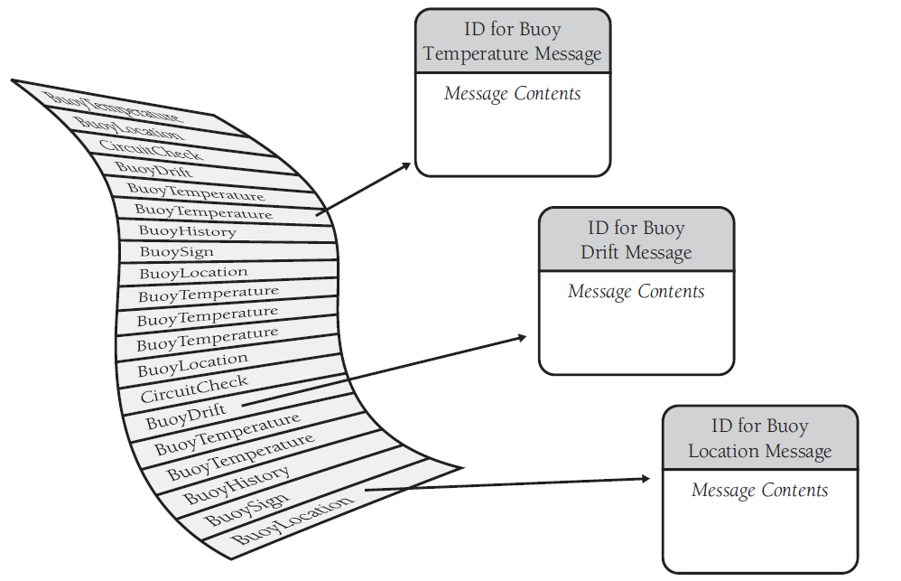
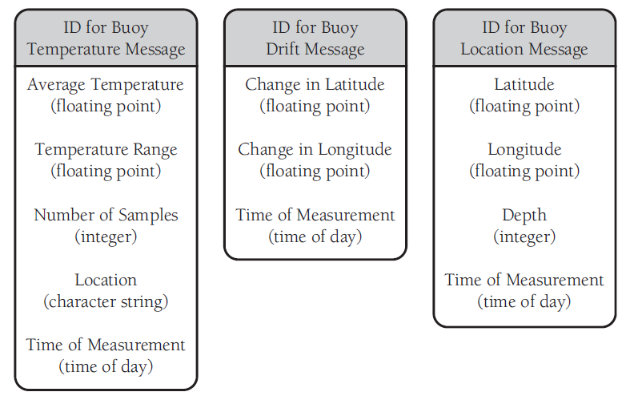

# 【代码大全2 选读】看看骨灰级高手消灭 if-else 逻辑的瑞士军刀长啥样


## 1 【写在前面】

随手一翻吃灰多年的《代码大全2》，偶然看到一篇讲重构 `if-else` / `case` 的三个案例，很有启发，便有了今天这篇分享。


## 2 【心法】这把瑞士军刀长啥样

它就是大名鼎鼎的 **表驱动方法（table-driven method）**。原文是这样说的：

> A table-driven method is a *scheme* that allows you to look up information in a table rather than using *logic statements* (if and case) to figure it out.
>
> 直译：表驱动法是一种 **编程模式**——从 **表** 里面查找信息，而不使用 **逻辑语句**（`if` 和 `case`）

实际开发中，凡是能通过逻辑语句来实现的功能，都可以通过查表来实现（这个语气是不是似曾相识？）。对于简单情况，用逻辑语句更容易也更直白；随着逻辑链越来越复杂，查表法的作用就愈发凸显出来了。例如，要把字符分为 **字母**、**标点** 和 **数字** 三类，若用逻辑语句来实现，可能写成：

```java
if ( (('a' <= inputChar) && (inputChar <= 'z')) ||
        (('A' <= inputChar) && (inputChar <= 'Z'))) {
    charType = CharacterType.Letter;
} else if ( (inputChar == ' ') || (inputChar == ',') ||
        (inputChar == '.') || (inputChar == '!') || (inputChar == '(') ||
        (inputChar == ')') || (inputChar == ':') || (inputChar == ';') ||
        (inputChar == '?') || (inputChar == '-')) {
    charType = CharacterType.Punctuation;
} else if ( ('0' <= inputChar) && (inputChar <= '9') ) {
    charType = CharacterType.Digit;
}
```

而如果用查表法，上述代码也就一句搞定：

```java
charType = charTypeTable[ inputChar ];
```

前提是数组 `charTypeTable` 提前建好。这里的核心在于，把程序中的信息存到 **数据** 里，而非 **逻辑** 里；放到表中，而非 *`if`* 检测中。（... put your program’s knowledge into its data rather than into its logic — in the table instead of in the *if* tests.）

使用表驱动法必须回答的两方面问题：

- 怎样从表中查到数据？推荐方法有三——
  - 直接访问（Direct access）
  - 索引访问（Indexed access）
  - 阶梯访问（Stair-step access）
- 应该在表里存什么内容？即查出的结果是数据（data）还是操作（action）？
  - 存数据：直接放表里即可；
  - 存操作：要么存一段代码逻辑（想想 Lambda 表达式）；要么存某个引用（如 Java8 的方法引用）

心法讲完了，来看三个具体案例。


## 3 【示例1】确定某个月份的天数（Days-in-Month Example）

先不考虑闰年，逻辑语句法可以写成（Visual Basic 版）：

```visual basic
If ( month = 1 ) Then
    days = 31
ElseIf ( month = 2 ) Then
    days = 28
ElseIf ( month = 3 ) Then
    days = 31
ElseIf ( month = 4 ) Then
    days = 30
ElseIf ( month = 5 ) Then
    days = 31
ElseIf ( month = 6 ) Then
    days = 30
ElseIf ( month = 7 ) Then
    days = 31
ElseIf ( month = 8 ) Then
    days = 31
ElseIf ( month = 9 ) Then
    days = 30
ElseIf ( month = 10 ) Then
    days = 31
ElseIf ( month = 11 ) Then
    days = 30
ElseIf ( month = 12 ) Then
    days = 31
End If
```

这是一段如假包换的经典屎山代码。

再来看看查表法怎么重构的：

```visual basic
' Initialize Table of "Days Per Month" Data
Dim daysPerMonth() As Integer = _
{ 31, 28, 31, 30, 31, 30, 31, 31, 30, 31, 30, 31 }
days = daysPerMonth( month-1 )
```

考虑闰年的话，改造查表法也很简单，引入一个标志位变成二维数组就行了（如函数 `LeapYearIndex`），闰年取 `1` 否则取 `0`：

```visual basic
days = daysPerMonth( month-1, LeapYearIndex() )
```

可以想象一下，`if-else` 逻辑语句法的闰年版长啥样……（此处省略 25,000 字）


## 4 【示例2】确定保险费率（Insurance Rates Example）

写一个算医保费率的程序，该费率随年龄、性别、婚姻状况及吸烟状况的不同而变化。逻辑语句版实现如下：

```java
// Java Example of a Clumsy Way to Determine an Insurance Rate
if ( gender == Gender.Female ) {
    if ( maritalStatus == MaritalStatus.Single ) {
        if ( smokingStatus == SmokingStatus.NonSmoking ) {
            if ( age < 18 ) {
                rate = 200.00;
            } else if ( age == 18 ) {
                rate = 250.00;
            } else if ( age == 19 ) {
                rate = 300.00;
            }
// ...
            else if ( 65 < age ) {
                rate = 450.00;
            }
        else {
            if ( age < 18 ) {
                rate = 250.00;
            } else if ( age == 18 ) {
                rate = 300.00;
            } else if ( age == 19 ) {
                rate = 350.00;
            }
// ...
            else if ( 65 < age ) {
                rate = 575.00;
            }
        }
    else if ( maritalStatus == MaritalStatus.Married )
//  ...
}
```

这还只是其中一小部分情况，还没包含已婚女士、所有男士、或者 18 ~ 65 岁人群。按这个思路写下去，写成屎山中的“珠穆朗玛”也只是时间的问题。

那么，换成查表法呢？

书中还是用 VB 来实现（当时的 VB 正如日中天，也可能是因为 VB 对多维数组的支持更友好吧）：

首先构建数据表：

```visual basic
' Visual Basic Example of Declaring Data to Set Up an Insurance Rates Table
Public Enum SmokingStatus
    SmokingStatus_First = 0
    SmokingStatus_Smoking = 0
    SmokingStatus_NonSmoking = 1
    SmokingStatus_Last = 1
End Enum

Public Enum Gender
    Gender_First = 0
    Gender_Male = 0
    Gender_Female = 1
    Gender_Last = 1
End Enum

Public Enum MaritalStatus
    MaritalStatus_First = 0
    MaritalStatus_Single = 0
    MaritalStatus_Married = 1
    MaritalStatus_Last = 1
End Enum

Const MAX_AGE As Integer = 125
Dim rateTable ( SmokingStatus_Last, Gender_Last, MaritalStatus_Last, _
                MAX_AGE ) As Double
```

然后调用该数据表：

```visual basic
' Visual Basic Example of an Elegant Way to Determine an Insurance Rate
rate = rateTable( smokingStatus, gender, maritalStatus, age )
```


## 5 【示例3】灵活的消息格式（Flexible-Message-Format Example）

如果前两个示例觉得没啥挑战，那你就太小看写《代码大全2》的这帮大宗师了。下面这个案例要解决的，就是针对查询表中的 `key` 值（或 `index` 索引值）复杂到难以用代码完全硬编码的情况：

> **问题描述**
>
> 编写一个消息打印程序，所有的消息都存放在某类文件中，通常每个文件大概有 500 条这样的消息，涉及大概 20 种消息类型。这些数据采集自一些水上浮标（buoy），提供水温、漂移、方位等信息。
>
> 每条消息都包含一个消息头和一段消息正文。消息头有一个标识消息类型的 ID；消息正文由数量不等的字段构成，每一类消息的格式也不尽相同，如图1、图2所示：
>
> <br/>**图1 浮标信息没有特定顺序，每条消息用 ID 标识**<br/><br/>
>
> <br/>**图2 除了消息 ID 外，每类消息有各自的格式**
> 

为了突出重点，具体的输出格式就省略了，书中用伪代码一笔带过，最终的一条关于浮标温度的消息，输出结果大概长这样：

```markdown
Print "Buoy Temperature Message"

Read a floating-point value
Print "Average Temperature"
Print the floating-point value

Read a floating-point value
Print "Temperature Range"
Print the floating-point value

Read an integer value
Print "Number of Samples"
Print the integer value

Read a character string
Print "Location"
Print the character string

Read a time of day
Print "Time of Measurement"
Print the time of day
```

拿到这样的需求，映入你脑海的第一方案是怎样的？

是不是也像写逻辑分支那样，分 20 多种情况，写到 20 多个 `if-else` 或 `select-case` 分支，然后每个分支再实现对应的输出逻辑……是这样吗：（伪代码形式）

```visual basic
While more messages to read
    Read a message header
    Decode the message ID from the message header
    If the message header is type 1 then
        Print a type 1 message
    Else if the message header is type 2 then
        Print a type 2 message
...
    Else if the message header is type 19 then
        Print a type 19 message
    Else if the message header is type 20 then
        Print a type 20 message
End While
```

或者用面向对象的思想来解决：（伪代码形式）

```java
While more messages to read
    Read a message header
    Decode the message ID from the message header
    If the message header is type 1 then
        Instantiate a type 1 message object
    Else if the message header is type 2 then
        Instantiate a type 2 message object
// ...
    Else if the message header is type 19 then
        Instantiate a type 19 message object
    Else if the message header is type 20 then
        Instantiate a type 20 message object
    End if
End While
```

作者鄙视道：不管是直接写一堆语句、还是抽成 20 多个子类去分别调用公共接口的方法，本质都一样；而且像这样照搬的面向对象编程，写了还不如不写：写成父级接口+子类实现的多态形式，只会让问题更加复杂，后续扩展看似简单，实则比直接写 `if-else` 还要麻烦。也要改代码、重新编译打包、重新更新发布……

这种情况下，瑞士军刀怎样证明自己呢？

首先，绕过那 20 多种消息类型，直接看消息正文中每个字段出现过的数据类型，并收集到一起（枚举）：

```c++
// C++ Example of Defining Message Data Types
enum FieldType {
    FieldType_FloatingPoint,
    FieldType_Integer,
    FieldType_String,
    FieldType_TimeOfDay,
    FieldType_Boolean,
    FieldType_BitField,
    FieldType_Last = FieldType_BitField
};
```

然后把每类消息按如下形式抽象出来，变成一组配置：

```c++
// Example of Defining a Message Table Entry
Message Begin
    NumFields 5
    MessageName "Buoy Temperature Message"
    Field 1, FloatingPoint, "Average Temperature"
    Field 2, FloatingPoint, "Temperature Range"
    Field 3, Integer, "Number of Samples"
    Field 4, String, "Location"
    Field 5, TimeOfDay, "Time of Measurement"
Message End
```

然后，主程序只需要写成下面的伪代码形式即可：

```c++
While more messages to read
    Read a message header
    Decode the message ID from the message header
    Look up the message description in the message-description table
    Read the message fields and print them based on the message description
End While
```

然后，第 4 行用心法中的那三个方法解决检索的问题。

第 5 行输出模块用下面的伪代码实现：

```c++
While more fields to print
    Get the field type from the message description
    case ( field type )
        of ( floating point )
            read a floating-point value
            print the field label
            print the floating-point value
        of ( integer )
            read an integer value
            print the field label
            print the integer value
        of ( character string )
            read a character string
            print the field label
            print the character string
        of ( time of day )
            read a time of day
            print the field label
            print the time of day
        of ( boolean )
            read a single flag
            print the field label
            print the single flag
        of ( bit field )
            read a bit field
            print the field label
            print the bit field
    End Case
End While
```

这样，20 多个消息类型的实现，就转变成了 6 个基本数据类型的实现，并且后者还无视了消息类型数量的变化——无非是修改配置的活，代码可以一直沿用（只要基本类型一直是这 6 个）。

这样改造后，再写成父接口+子类实现的形式，**才是面向对象编程的正确打开方式**。

所谓好人做到底，送佛送到西，作者还是把大致流程用 C++ 过了一遍（大宗师级别还需要手把手敲代码吗？开什么玩笑）：

先声明接口和子类实现：

```c++
// C++ Example of Setting Up Object Types
class AbstractField {
    public:
    virtual void ReadAndPrint( string, FileStatus & ) = 0;
};
class FloatingPointField : public AbstractField {
    public:
    virtual void ReadAndPrint( string, FileStatus & ) {
    // ...
}
};
class IntegerField // ...
class StringField // ...
// ...
```

再声明一个容纳所有六种情况的数组并初始化：

```c++
// C++ Example of Setting Up a Table to Hold an Object of Each Type
AbstractField* field[ Field_Last+1];

// C++ Example of Setting Up a List of Objects
field[ Field_FloatingPoint ] = new FloatingPointField();
field[ Field_Integer ] = new IntegerField();
field[ Field_String ] = new StringField();
field[ Field_TimeOfDay ] = new TimeOfDayField();
field[ Field_Boolean ] = new BooleanField();
field[ Field_BitField ] = new BitFieldField();
```

最后是放到主程序模块：

```c++
// C++ Example of Looking Up Objects and Member Routines in a Table
fieldIdx = 1;
while ( (fieldIdx <= numFieldsInMessage) && (fileStatus == OK) ) {
    fieldType = fieldDescription[ fieldIdx ].FieldType;
    fieldName = fieldDescription[ fieldIdx ].FieldName;
    /* This is the table lookup that calls a routine depending on the 
       type of the field just by looking it up in a table of objects. */
    field[ fieldType ].ReadAndPrint( fieldName, fileStatus );
    fieldIdx++;
}
```

后面的检索实现和瑞士军刀无关，就不介绍了。


## 6 【结语】

我是看到第三个示例，才下决心写一写这个心得的，因为之前的工作就刚好遇到了类似的情况，自己自认为十分牛逼的写法，放到看过这一段或真正理解了表驱动法的开发者眼里，也不过是另一堆屎山罢了。拿到需求的第一时间，可能面临的很多因素都是非技术层面的，比如“时间紧、任务重”，或者“立等可取”，“明早出一版”，“这是上面的死命令”……要想甩锅，在职场打拼多年的老油条们谁又不会呢？但我想说的是，自己的代码写成什么样，说到底还是你对自己整个职业生涯的定位决定的。不求代码流芳百世，但求尽量别遗臭万年，被后来接盘的某某骂到春秋战国时期就行。

关键的关键，是要明白，这样的问题其实是有瑞士军刀级的解决方案的。

> P.S.：对《代码大全2》感兴趣的朋友，可以自行感受一下作者那大宗师级别的气场——详见原书第 18 章《表驱动方法》（*Chapter 18：Table-Driven Methods*）

