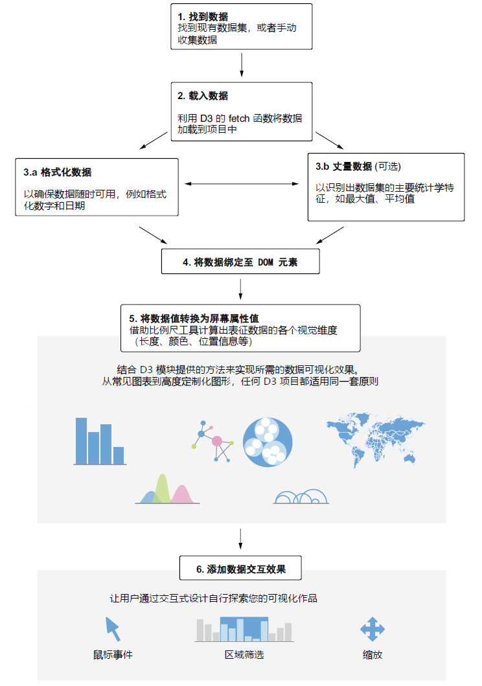

# 关于本书

---

 
**D3.js 项目的传统开发步骤** 

---

## 本书读者

这本书适用于所有渴望在数据可视化工作中获得完全创意自由的人，从定制化的经典图表到创建独特的数据可视化布局，涵盖内容广泛，应有尽有。您可能拥有数据分析的相关背景，也可能是记者、设计师，甚至是数据可视化的发烧友。恭喜您考虑学习 D3.js ！您很快就会意识到，这是在您的时间上一笔多么明智的投资。通过掌握 D3，您将解锁无与伦比的创意自由与创作潜能——这是当今无数数据可视化工具无法企及的高度。

## 本书结构与路线图

正如您所了解的，D3 活跃在前端开发工具的生态系统中：HTML、CSS 和 JavaScript。在深入阅读第二章之前，您需要确保了解这些工具的基础知识，并充分理解怎样将它们结合起来创建美观大气的交互式网页。您不必是这方面的行家里手，但具备一些基础知识将使您的 D3 学习体验更加流畅。如果您希望提升前端开发技能，我们推荐以下资源：

- 由 **Maximilian Schwarzmüller** 主讲的《2023 Web 开发训练营》（*2023 Web Development Bootcamp*，详见 http://mng.bz/WEe4）
- 由 **Frontend Masters** 网站出品的《Web 开发·完全入门》（*Complete Intro to Web Development*，详见 http://mng.bz/8wyZ）

本书按照循序渐进的方式来组织内容。第一部分涵盖了诸如数据处理与简单图表创建等基础内容；第二部分则重点介绍了让项目具备可交互性与响应性的方法、提升项目可访问性的途径，以及将 D3 整合到 React、Svelte 等 JavaScript 框架的具体思路，以不断满足新的数字化需求；第三部分的每一章都涵盖了更高级的数据可视化内容：层次结构、网络及各类地图等等。最后，在第四部分，我们将邀您一道深入了解完全定制的可视化布局的创建过程，并探讨性能相关的话题，以及怎样将 D3 与 Canvas 结合使用。

如果您是 D3 的新手，我们建议您按顺序阅读第 1 ~ 7 章。这些前置章节将帮助您构建 D3 的思维模型，确保在探讨更高级的主题之前，您的工具箱中已拥有全部的基础构件。D3 因学习曲线陡峭而声名狼藉，但只要按照这些章节提供的步骤学下去，D3 可以变得非常直观。

如果您先前了解过 D3 并且熟悉这些基础知识，您也可以开启个性化的学习之旅。第 8 ~ 15 章专注于特定的概念及图表类型，当您手里的项目需要这些知识时，对应章节的内容或许值得一试。

对于书本前的所有读者，强烈建议大家不仅要阅读本书，更要躬身实践。每一章都包含了各自的数据可视化项目，旨在帮助您整合消化书中阐释的概念。将这些概念、想法付诸实践将会让整个世界因为您的努力而变得不同，也会让您的学习之旅更加便捷与顺畅。

对于每个项目和练习，您可以在本书的 GitHub 仓库（http://mng.bz/Xqjv）访问相应的初始代码文件和参考解决方案。附录 D 还提供了各章练习的参考答案。本书所有代码文件及代码片段均采用第 7 版的 D3 语法，这也是本书撰写时的最新版本。想要运行并编辑代码，您只需要一个代码编辑器和一个浏览器。代码编辑器我们推荐 VS Code；浏览器则推荐 Chrome 或 Firefox。

## 本书代码

本书包含许多源代码示例，有的是在带编号的代码清单中，有的是在正文里。所有源代码都采用了等宽字体（`fixed-width font
like this`），以便跟普通文字区分开。有时源代码还会加粗，以突出显示某章节内容中与前一步的不同之处，例如给已有的一行代码加上新特性时。

在许多情况下，书中出现的源代码已经重新做了格式化处理；我们添加了换行并重新调整了缩进，以适应本书版面。由于在极少数情况下，这样做还不够，故而代码清单还会加入该行继续的标记（➥）。此外，如果正文中已经对代码做了解释，则会将代码清单中的注释内容删除。许多代码清单中出现的注释，旨在强调重要概念。

您可以从本书的线上版本 liveBook 中获取可执行的代码片段，网址为 https://livebook.manning.com/book/d3js-in-action-third-edition。本书示例的完整代码可从 Manning 官网 www.manning.com/books/d3js-in-action-third-edition 及 GitHub 仓库 http://mng.bz/Xqjv 进行下载。

## liveBook 在线论坛

购买《D3.js 实战》第三版即可免费访问 liveBook —— Manning 出版社的在线阅读平台。利用 liveBook 独有的讨论功能，您可以在全书范围内或特定章节、段落上评论相关内容、轻松记笔记、咨询技术问题并参与回答，还可以从作者和其他用户那里获得帮助。访问线上论坛，请移步 https://livebook.manning.com/book/d3js-in-action-third-edition/discussion。您还可以访问 https://livebook.manning.com/discussion 了解更多关于 Manning 论坛和行为规范等内容。

Manning 向读者承诺提供一个交流平台，以供读者与读者之间、以及读者与作者之间进行有意义的对话。这并不意味着硬性要求作者一定要投入多少精力参与到交流讨论中，因为作者对论坛的贡献仍然是志愿行为（并且是免费的）。我们建议读者尝试向作者询问一些富有挑战的问题，以免作者不感兴趣。只要图书在印刷中，论坛和之前讨论的存档都可以在出版社的网站找到。
