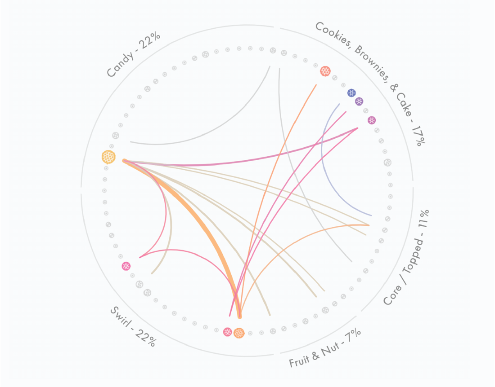
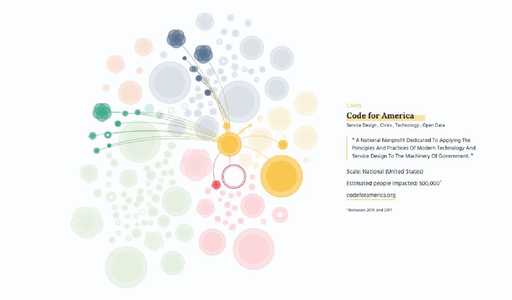

### 1.1.1 Web 可访问数据的可视化需求

D3 的诞生就是为了满足可在 Web 端访问的、复杂数据可视化的迫切需求。假设您的公司正使用的一款商业智能工具无法提供团队需要的数据呈现形式。他们希望针对您特定领域构建出一款定制化的仪表盘，用来准确展示客户行为。该仪表板要求反应灵敏、交互良好，并且能在全公司范围内共享。这种情况下，D3 将是一个很自然的选择。

或者再想象一下：您被聘请来创建一个滚动叙事的可视化作品，用以展示 LGBTQ+ 社区权利在过去几十年以及全球范围内的演变历程。该页面应该包含许多有创意的可视化效果，既可以随着用户的交互式滚动而动态更新，又能通过鼠标事件来显示更多详情，还能根据屏幕大小进行自适应调整。那么 D3 无疑是构建这样一个项目的首选工具。

Mike Bostock 创建 D3 的初衷，旨在充分利用新兴的 Web 标准。正如他所言，D3“避免了专属的呈现形式，提供了非凡的灵活性，并充分展示了 CSS3、HTML5 以及 SVG 等 Web 标准的全部功能”（[http://d3js.org](http://d3js.org)）。本书撰稿时，D3.js 第七版是该流行工具库的最新迭代版本。通过将 D3 的各部分做模块化处理，现已完全兼容 ECMAScript 模块，可以便捷地将 JavaScript 代码打包重用，以供后续 Web 开发。

D3.js 不仅让开发人员具备创建交互效果极其丰富的应用程序的能力，而且还能像部署传统 Web 项目那样设计样式并提供服务（如图 1.2 所示作品《本&杰瑞的内幕》）。从而使这些项目具备更强的可移植性、更易于增长，同时也更方便维护，即便其他团队成员未必熟悉 D3 的特定语法。

 **图 1.2 D3 是一个为可视化项目提供完全技术自由与创意自由的底层库。以上和弦图摘自 Hesham Eissa 和 Lindsey Poulter 的合著项目“本&杰瑞的内幕”（[https://benjerry.heshlindsdataviz.com/](https://benjerry.heshlindsdataviz.com/)）** 

Bostock 决心广泛处理数据，并创建出这样一个工具库来：利用它绘制的地图，就如同绘制折线图、网络图或项目列表那样轻松自如。也就是说，开发人员今后再也不必为了绘制地图而去专门学习某个地图工具库的特定语法了；或者专门处理动态文本的、专门绘制网络图的……诸如此类的破事了。相反，一个交互式的可视化网络图的代码近乎纯 JavaScript，而且写法上也与 D3 展示地图动态内容的代码并无二致；它们的实现方法是相同的，甚至数据也可以是相同的：前者以某种方式按节点和链接来组织数据；后者以另一种方式按地图的地理空间来组织数据。尽管 D3 相对于其他工具库而言，学习曲线是陡峭了点，但学习 D3 绝对是稳赚不赔的买卖。

D3 不仅可以创建复杂多样的图形，还可以嵌入用户期望的高级交互功能——这对于现代 Web 开发而言至关重要。有了 D3，从旋转的地球到饼图的一小块，每个图表的每个元素都能以相同的方式实现各类交互效果；更何况 D3 是由精通数据可视化实践的专家亲手打造，因此天生就拥有数据可视化与 Web 开发规范中标准的交互式组件与行为，例如选中网络图中的节点，如图 1.3 所示。

 **图 1.3 图 1.3 D3 的核心在交互。在上述可视化网络图中，鼠标交互效果揭示了各组织间的联系及其与所选节点关联的特定信息（详见 [https://amdufour.github.io/organizations-against-polarization](https://amdufour.github.io/organizations-against-polarization))。** 