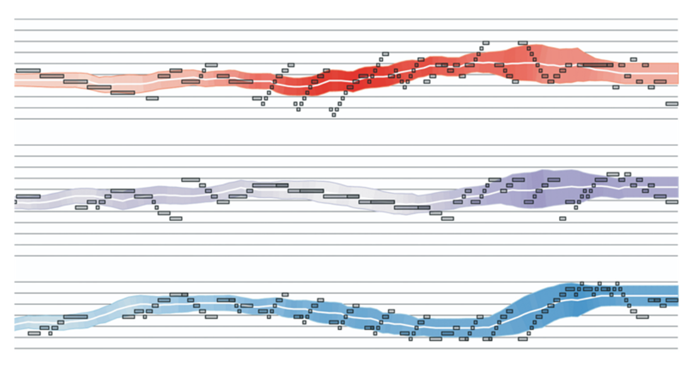
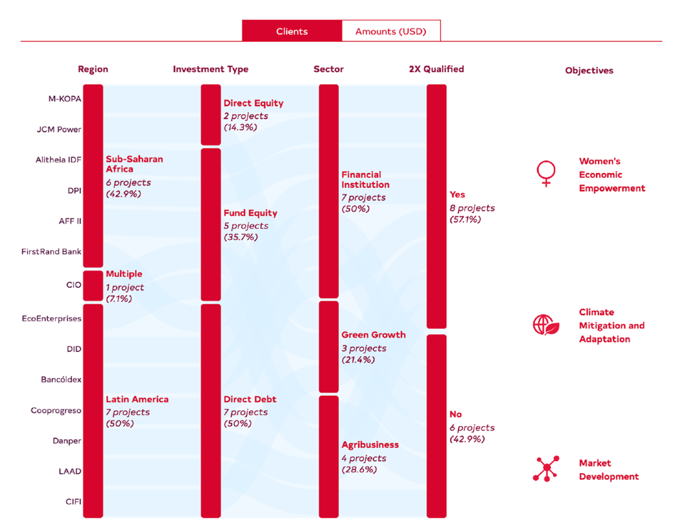

### 1.1.2 D3.js 的适用场景

数据可视化领域正蓬勃发展，且备受青睐。过去十年间用于生成数据驱动图形的工具数量已呈现爆发式增长。一方面，我们有像 Microsoft [Excel](https://www.microsoft.com/en-us/microsoft-365/excel) 这样的商业智能工具，它是一款常见的数据可视化入门级产品；还有像 [Power BI](https://powerbi.microsoft.com/en-us/) 这样用于构建仪表盘的微软一站式解决方案；另一方面，数据科学家们经常利用 R 语言的 [ggplot2](https://ggplot2.tidyverse.org/) 或 Python 中的 [Matplotlib](https://matplotlib.org/) 来实现数据可视化效果。

而基于浏览器的拖拽式（point-and-click）数据可视化工具，如 [Tableau](https://www.tableau.com/)、[Flourish](https://flourish.studio/)、[Datawrapper](https://www.datawrapper.de/) 和 [RAWGraphs](https://www.rawgraphs.io/) 也已经成为主流，让您可以在投入最少技术储备的情况下创建出令人惊叹的作品。

最后，像 [Highcharts](https://www.highcharts.com/)、[Chart.js](https://www.chartjs.org/) 和 [Plotly](https://plotly.com/) 等 JavaScript 库专门用于开发基于 Web 的交互式可视化效果。

上面列举的工具仅仅只是冰山一角，不一而足。

那么，在可视化工具的浩瀚海洋中，D3 又处于什么位置呢？我们又该在什么时候用、怎么用好它呢？应该说，尽管 D3 可以完全构建出上述工具库提供的任何图表，但它通常不是传统简单图表或探索阶段的首选工具。探索阶段考察的是最适合呈现当下数据的可视化类型。构建 D3 项目需要时间，而令 D3 真正大放异彩的，是复杂多变的、交互式的定制化项目环境。数据可视化远远不止创建折线图及散点图那么简单！虽然刚才提到的工具通常侧重于事先定义好的图表，但 D3 可以将数据绑定到任何图形元素，并像图 1.4 展示的乐谱那样，以独特的方式组合这些视觉元素来创建新的可视化效果。选择 D3 正是为了跳出思维定势，拥有更多自由思考的空间，不必受制于工具库所提供的开发能力。

 **图 1.4 D3 具备 SVG 和 Canvas 的绘图功能，支持构建自定义可视化效果。该乐谱图由 Elijah Meeks 绘制** 

至于如何在数据可视化项目的范围内使用 D3，下面举例说明大致流程。首先是从现有数据集或手动收集的数据入手。在开始数据分析之前，通常会花费大量时间用于数据清洗、格式化等准备工作；而这正是 Python 和 R 语言的强项，借助它们往往可以发现潜藏的数据信息。Excel 由于对技术背景要求不高，也可以完成一些简单的数据整理与分析工作。您甚至可以通过 JavaScript 和 D3 提供的统计学方法（后续内容会讲解）进行基本的数据探索。

一旦数据分析开始进行，人们通常会创建一些原型（prototypes）来完善想要呈现的核心内容。借助 Tableau 和 RAWGraphs 可以让快速生成这些图表。这一步尤为重要，其间实现的效果往往无需过于花哨或精美。在原型设计阶段，大可不必耗费太多时间沉迷于自己的想法，有时甚至不得不忍痛割爱、反复推倒重来，直到找出最能突出数据核心主旨的可视化效果。网络图或许是个例外，遇到这样的项目通常直接使用 D3 就行了。

最后，一旦明确即将创建的可视化类型，如图 1.5 所示的桑基图（Sankey diagram），就可以用 D3 来编程了！现如今，代码的书写通常是在 React 或 Svelte 框架的单页应用（single-page applications，即 SPA）中实现的。

 
**图 1.5 来自 Voilà 的获奖作品“打造未来可持续的包容性业务组合”（[https://chezvoila.com/project/findevportfolio/](https://chezvoila.com/project/findevportfolio/#anchor-findev-portfolio)).** 
