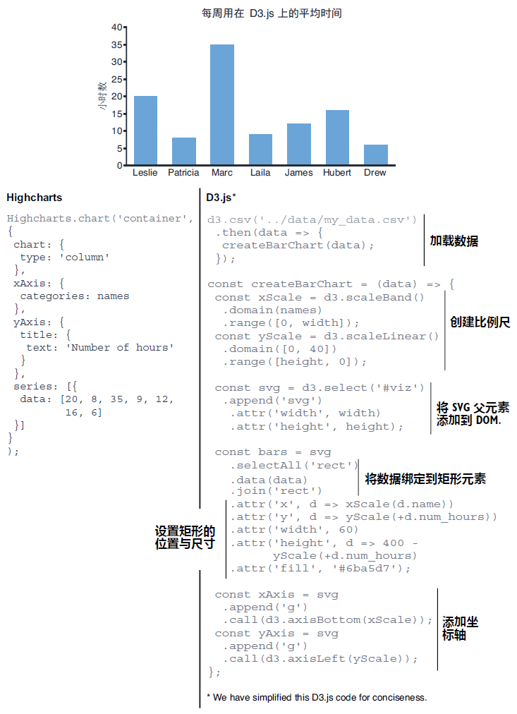

### 1.1.3 D3.js 的工作原理

您可能已经体验过 D3 并且发现它不太容易上手。这也许是因为您把它当成了一款普通的绘图工具库。以本书第 2 章和第 3 章即将重点介绍的柱状图为例，D3 并没有提供现成的单一函数来创建柱状图；相反，它提供了一个用于将 `<svg>` 容器追加到 DOM（Document Object Model，即文档对象模型）中的函数，以及一组专为每个数据点添加一个 `<rect>` 元素的函数。然后利用提供的比例尺工具，计算出构成柱状图的各矩形的长度并将其赋给对应的 `height` 属性。最后再调用另一组函数，将 x 轴和 y 轴添加到柱状图中。

正如图 1.6 所示，整个绘制过程比专用的图表工具库（如 Highcharts）要复杂得多；但把数据和图形放到明面上来处理也恰好是 D3 的优势所在。尽管其他图表库可以很方便地快速绘制线形图和饼图，可一旦想要的可视化效果超出了传统图表的能力边界，或者需要定制开发一些交互逻辑的时候，依靠这些工具库就有些捉襟见肘了。而此时的 D3 则会一枝独秀——它能构建出任何您可以想象出的、基于数据驱动的图形和交互效果来。

 **图 1.6 使用 Highcharts 和 D3.js 生成柱状图的代码量对比。前者更简短，而 D3.js 更加灵活** 

如图 1.7 所示，这是一张关于如何利用 D3 实现数据可视化效果的通用版思维导图。先是从数据集入手（通常是一个 CSV 或 JSON 格式的数据文件），并利用 `d3-fetch` 模块将该数据集加载到项目中。通常需要对数据做一些格式化处理，例如数值和日期格式的校验与统一。此外，可能还会考察该数据集的主要统计学特征，例如提前了解其最大值、最小值以备后用。紧接着就是结合本书即将介绍的各类 D3 函数，开始构建想要的可视化效果。最后，通过监听鼠标事件来添加用户交互逻辑，例如让用户自行筛选数据或放大图表。

 **图 1.7 如何使用 D3.js 进行数据可视化** 

> **与 Elijah Meeks 的访谈记录**
>
> **Elijah Meeks** 是 Noteable 公司的联合创始人兼首席创新官（Chief Innovation Officer，即 CIO），同时也是《D3.js 实战》第一版的作者。
>
> **问：您能告诉我们一些您的背景信息，聊聊您是怎样进入数据可视化领域的吗?**
>
> **Elijah Meeks**：我曾先后在苹果公司、奈飞（Netflix）公司、数据可视化协会（Data Visualization Society）、斯坦福大学以及合伙创办的 Noteable 公司中从事了近 15 年的数据可视化工作。我以一种不太传统的方式进入的数据可视化领域——起初是通过地理信息系统（Geographic Information System，即 GIS）来支撑我在中国早期国家形成方面的博士课题研究。之后才开始接触网络可视化相关的问题，最终才画起了柱状图和折线图。
>
> **问：您是如何发现 D3 的，是什么激励您进一步学习这个工具库?**
>
> **Elijah Meeks**：在我职业生涯的早期阶段，我利用 `Flash` 和 `ActionScript3` 创建了一些交互式的数据可视化应用。当 `Flash` 逐渐式微，我便开始探索 `Protovis` 作为替代方案，不过它很快就被 D3 取代了。我越深入了解 D3，就越深刻理解数据可视化。更重要的是，借助 D3 来实现数据可视化可以帮助我更好地学习数据结构、数据分析和机器学习方面的知识。
>
> **问：在 D3 相关资源还不多的时候，您就成功编写了前两版的《D3.js in Action》实战类书籍。这个项目是如何诞生的？**
>
> **Elijah Meeks**：我永远感谢 Manning 出版社给予我编写这些书籍的机会。相对于仅仅将 D3 用于项目实践而言，这项工作迫使我更全面、更深入地去理解D3。撰写 D3 相关的教学内容让我在使用和规划书籍内容方面更加得心应手。第一版内容包括如何利用 D3 来创建 HTML 的示例，几乎是将 D3 视为某种意义上的 MVC（Model-View-Controller）来进行演示的；此外也包括在手机或平板电脑上自定义触摸事件（touch events），以及定制开发自己的布局、生成工具和组件。第二版中删除了部分内容，转而增加了更多实用的知识，例如怎样将 D3 集成到 React 框架等等。
>
> **问：在过去十年里，您在数据可视化领域发挥了关键作用。从 Netflix 排名第一的数据可视化工程师、到成为 Noteable 公司的首席创新官，在此期间，您见证了这个行业所经历的重大变革。您是如何看待数据可视化经历的这些演变？未来的数据可视化又将何去何从?**
>
> **Elijah Meeks**：我坚信任何文化都有其特定的时代烙印，数据可视化的相关实践也不例外。我们从计算机最初提供的简单图表的配置选项开始（例如 Excel 图表），利用它们来实现表格数据的可视化；等到 D3 出现以后，社区的主要精力更多集中在探索图形相关的语法，以及如何通过代码来实现日益复杂的动态图表。如今我们已经到达一个新的阶段，在这个特定阶段中，各行各业都能看到大量的数据可视化案例（无论是商业智能、新闻报刊业、抑或是数据科学，比比皆是）；对于这些可视化作品的期望，各领域早年间看起来非常明显的界限也在慢慢消融，并逐渐趋于一致——不再专注于新奇的图表，而是聚焦更多具有整合意义的可视化解决方案，让拥有不同技能与期望的不同角色，共同参与到同一个基于数据驱动的可视化产品研发中来。