### 1.2.2 SVG - 可缩放矢量图形

可伸缩矢量图形（Scalable Vector Graphics，即 SVG）的引入从根本上改变了网络的面貌。SVG 图形在短短几年内就成为了主要的 Web 开发工具。与栅格图形（如 `PNG` 和 `JPG` 格式图片）由微小像素构成、并且像素点在放大倍数过高时清晰可见的设计理念不同，矢量图形则是基于数学和几何学构建而成的，能够在任何尺寸、任何屏幕分辨率下保持清晰的外观。SVG 图形的另一个重要优势是可以直接注入到 DOM 中，不仅可以让开发人员直接操作该元素并添加动画效果，而且还可以供屏幕阅读器访问。如果构建得当，SVG 图形也能具备高性能，其文件大小仅为相同效果的栅格图像的一小部分。

用 D3 来创作数据可视化作品，通常会将 SVG 图形注入 DOM，通过修改它们的 `attribute` 属性来生成各种可视化视觉元素。了解 SVG 的工作原理、主要图形及其主导视觉呈现的 `attribute` 属性，对大多数 D3 项目而言至关重要。本节后续内容将逐一介绍整个 D3 项目中会被反复重用的 SVG 形状。如果您对 SVG 还不太熟悉，请务必花点时间与我们一起敲敲代码。我们承诺这将大幅降低您未来使用 D3 的难度。

> **如何访问代码文件**
>
> 本书的每一章都包含了编程练习（code-along exercises），旨在进一步提升学习体验。强烈建议您在阅读本书时“动手”实践，而不仅仅满足于“阅读”学习。完成每一章设置的练习环节，可以让您更好地消化吸收所学知识，并尽快开始构建您自己的 D3 项目。
>
> 对于每个练习项目，您都可以访问现成的源代码文件，在本书的 `Github` 仓库（[http://mng.bz/Xqjv](http://mng.bz/Xqjv)）中找到它们。如果熟悉 `Git`，还可以克隆该仓库到您本地计算机，或者下载对应的压缩文件。
>
> 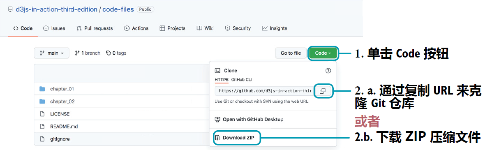<br/>**图 从 GitHub 仓库下载源码文件**<br/>
>
> 每个章节都有各自的文件夹，包含一个或多个练习。每个练习都按章节顺序进行了编号。练习包括一个 `start` 文件夹，其中包含开始练习所需的所有文件；而在 `end` 文件夹中有对应练习的完整参考答案。根据您在每一章、各个小节的学习进展，您既可以沿用上一小节练习后的代码，也可以使用与当前小节对应的代码文件夹进行练习，两种方式殊途同归。

先从矢量图开始。根据本书提供的源码文件，找到 `chapter_01/SVG_Shapes_Gallary` 下的 `end` 文件夹，在 `index.html` 文件上单击鼠标右键，从 **打开方式（*Open with*）** 菜单项选择一个浏览器。推荐使用 Chrome 或 Firefox 浏览器， 因为它们有出色的检查工具（inspector tools）。文件将从一个新的浏览器标签页打开，并看到如图 1.8 所示的矢量图。您也可以从托管到 GitHub 上的在线项目浏览这些 SVG 图形（[http://mng.bz/yZmB](http://mng.bz/yZmB)）。

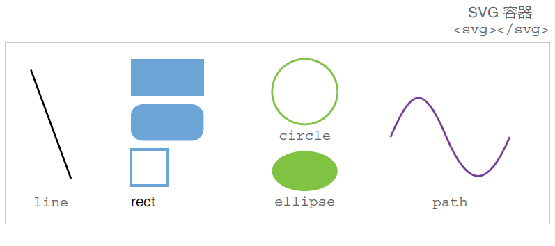<br/>**图 1.8 本节待构建的基本 SVG 图形**<br/>

您看到的这些都是今后用 D3 构建可视化项目时最常用的一些 SVG 图形，包括：直线（lines）、矩形（rectangles）、圆形（circles）、椭圆（ellipses）、路径（path）和文本（text）。

使用时，通常需要告诉 D3 哪些形状需要追加到 DOM 中，以及需要包含哪些视觉呈现属性，以便找出与这些尺寸、颜色及位置信息相匹配的理想图形。接下来的练习环节将通过代码来逐一创建图 1.8 中展示的 SVG 图形。我们不妨将该练习称为 **SVG 画廊（*Gallery of SVG Shapes*）**。通过此次练习，您将进一步了解入手 D3 项目需要掌握的所有 SVG 相关的基础知识。

用您习惯的代码编辑器打开练习项目 `SVG_Shapes_Gallery` 下位于 `start` 文件夹内的 `index.html` 文件。推荐使用 `VS Code` 编辑器——一款免费又好用的多功能代码编辑器，拥有许多前端开发需要的实用工具。

如代码清单 1.1 所示，`index.html` 是一个简单的 HTML 文件。如果用浏览器打开（鼠标右键单击文件，从 **打开方式（*Open With*）** 菜单选择一款浏览器即可）将看到一片空白，因为 `<body>` 元素是空的。下一小节，将给 `<body>` 元素添加各类 SVG 图形。

**代码清单 1.1 练习项目 SVG 画廊的初始 HTML 文件**

```html
<!DOCTYPE html>
<html>
<head>
  <meta charset="UTF-8">
  <meta name="viewport" content="width=device-width, initial-scale=1.0">  
  <title>SVG Shapes Gallery | D3.js in Action</title>
</head>
<body>
  
</body>
</html>
```

> [!tip]
>
> **如何查找更多信息**
>
> 后续内容将介绍多个 SVG 元素及其 `attribute` 属性。作为前端开发人员，常常会借助一些在线资源来构建项目、引入不太熟悉的 SVG 元素、或者寻找某个 JavaScript 功能来实现特定操作。MDN 在线文档（MDN Web Docs，详见 [https://developer.mozilla.org/](https://developer.mozilla.org/)）就是这样一个可靠且全面的资源，其中包含了大量通俗易懂并且支持修改的实用示例，如 SVG 元素及其属性用法、CSS 样式属性以及 JavaScript 函数等。

#### 1 响应式 SVG 容器

在 SVG 的图形世界中，`<svg>` 容器是用于绘图的白板。每个 SVG 形状都嵌套在该 `<svg>` 父元素中。想查看实际效果，编辑 `index.html` 文件并在 `<body>` 元素内添加一个 SVG 容器，然后在浏览器中重新加载该页面。目前还看不到任何内容：

```html
<body>
  <svg></svg>
</body>
```

打开浏览器的检查工具（在浏览器窗口中右键单击并选择 **检查（*Inspect*）**）。在检查窗口中会看到组成当前页面的 DOM 结构。找到 `<svg></svg>` 容器（又称 SVG 节点）。将鼠标移动到检查窗口内的容器上，SVG 元素就会在页面上高亮显示，如图 1.9 所示：

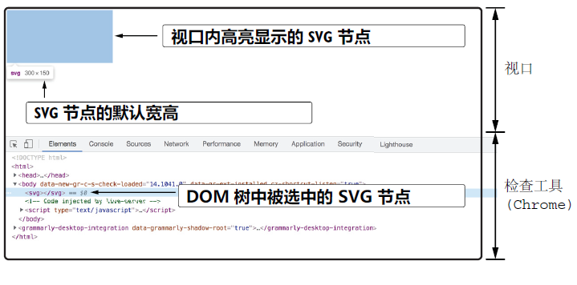<br/>**图 1.9 从 DOM 树选中 SVG 节点，并在视口中高亮显示**<br/>

默认情况下，浏览器中的 SVG 容器宽 `300px` 像素、高 `150px` 像素，但可以通过给 `attribute` 属性赋值进行调整。此时的 `attribute` 属性就是用来提供 HTML 元素的附加信息。在 SVG 行内元素中（With inline SVG），主要是通过 `attribute` 属性来设置构成 SVG 图形的各个形状的尺寸及位置信息。

例如，可以设置 SVG 元素的宽度（width）和高度（height）属性（`attribute`）。返回文本编辑器，向 SVG 容器添加一个 `width` 和 `height` 属性，属性值分别设为 `900` 和 `300`，然后保存：

```html
<svg width="900" height="300"></svg>
```

在浏览器中重新加载项目，并在检查工具中定位 SVG 节点。请注意，现在 SVG 元素上出现了宽度和高度属性。如果将鼠标悬停在 DOM 树的 SVG 节点上，还将看到视口中的 SVG 容器此时的大小为 `900px × 300px`，如图 1.10 所示：

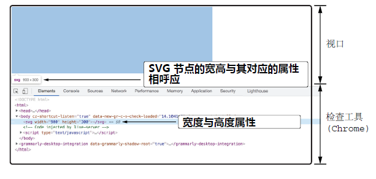<br/>**图 1.10 SVG 节点通过属性来指定大小**<br/>

为了方便查看 SVG 容器，不必每次从检查工具高亮展示，不妨给它加上一个边框。向 SVG 元素添加一个 `style` 属性（`attribute`），并插入 CSS 边框属性（`property`）。如以下代码片段所示，通过边框简写属性（`property`）来创建一个宽 `1px` 像素的黑色实线边框：

```html
<svg width="900" height="300" style="border:1px solid black;"></svg>
```

保存并重新加载页面，确认 SVG 容器周围存在边框；再调整浏览器窗口大小，直到小于 SVG 容器。可以看到 SVG 容器保持固定宽高，不会适应浏览器窗口大小。接下来，尝试让 SVG 容器变为响应式容器。

前面将 SVG 的 `attribute` 属性设置为绝对值（`900` 和 `300`），浏览器以像素为单位将其解析为相应的测量值（`900px` 和 `300px`）；这里也可以使用百分比。回到文本编辑器中，将宽度改为相对值 `100%`，保存后重新加载页面：

```html
<svg width="100%" height="300" style="border:1px solid black;"></svg>
```

再次调整浏览器窗口大小，留意 SVG 是如何占据整个可用宽度、并同时保持固定高度 `300px` 的。情况好多了，只是容器的原始宽高比（aspect ratio）也丢失了。

要让 SVG 元素变为响应式设计，可以使用 `viewBox` 属性（[viewBox attribute](https://developer.mozilla.org/en-US/docs/Web/SVG/Attribute/viewBox)）。删除编辑器中的 `width` 和 `height` 属性，并将其替换为 `viewBox` 属性，赋值为 `"0 0 900 300"`：

```html
<svg viewBox="0 0 900 300" style="border:1px solid black;"></svg>
```

再次调整浏览器窗口大小进行验证。注意到了吗？此时 SVG 容器在保持宽高比 `900:300` 不变的情况下适应了任何屏幕尺寸，从而得到一个响应式的 SVG！

正如您看到的那样，`viewBox` 属性由四个属性值组成。前两个数值指定了 `viewBox` 的坐标系原点（`x` 和 `y`）。本书将统一使用 `0 0`，知道这些值可以调整 SVG 容器在屏幕的可见部分还是很有帮助的。`viewBox` 后两个数值分别指定了宽度（width）和高度（height）。它们定义了 SVG 的宽高比，并确保它能完美适应任何容器并作相应缩放而不致失真。

#### ***(PART ONE：2585 words)***

这里的关键是让 SVG 的尺寸与容器相适应。此时 SVG 所在容器为 `<body>` 元素，而 `<body>` 的尺寸又常常与浏览器视口（viewport）相适应。如果视口变得非常大，SVG 也会相应变大。通常，SVG 需要一个最大宽度，以免宽度超过页面上的其他内容。因此，SVG 需要放进一个 `div` 里面，并让该 `div` 的宽度为 `100%`、最大宽度为 `1200px`。为简便起见，我们将这些样式设为行内样式；实际项目中，它们都应该来自某个 CSS 文件。注意，为了让 SVG 水平居中，还多加了一个值为 `0 auto` 的外边距：

```html
<div style="width:100%; max-width:1200px; margin:0 auto;">
  <svg viewBox="0 0 900 300" style="border:1px solid black;"> ... </svg>
</div>
```

改好后，再次调整浏览器大小，看看 SVG 是否能在保持最大宽度的情况下优雅适应任意屏幕大小。该方案有助于将 D3 可视化模块注入到响应式网页中，本书后续都将采用该方案进行演示。


#### 2 SVG 的坐标系

实现 SVG 的响应式设计后，接下来需要重点考虑 SVG 图形在容器内的定位问题。SVG 容器就像一个空白画布，我们可以在上面绘制矢量图形。矢量图形是根据基本几何原理定义的，并相对于 SVG 容器的坐标系进行定位。

SVG 坐标系类似于直角坐标系，其二维平面通过两个相互垂直的轴来定位元素，即 `x` 轴和 `y` 轴；这两个轴的起点均为 SVG 容器的 **左上角**，如图 1.11 所示。`y` 轴的正方向为 **从上到下**，记住它可以少走很多弯路。

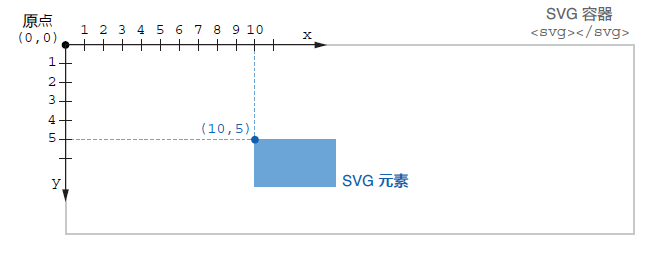<br/>**图 1.11 SVG 容器坐标系与元素位置**<br/>

要在 SVG 容器内定位一个元素，可以从左上角的原点开始向右移动。这样就得到了元素的水平位置（即 x）；垂直位置（即 y）则从顶部开始向下移动。这些位置信息均由 SVG 图形的呈现属性（presentational attributes）来定义。

下面来看看构建 D3 项目常见的 SVG 图形及其主要的呈现属性。我们的目标并不是编写一份涵盖所有 SVG 图形及其功能特性的全方位指南，而是希望这些基础知识不会在后续的 D3 学习中拖您后腿。

> [!tip]
>
> **数据可视化小知识：几何基元（Geometric primitives）**
>
> 出色的艺术家可以用矢量图形来绘制任何事物，但您可能是带着更实际的目标来学习 D3 的。从这个角度来看，理解几何基元（也称图形基元（graphical primitives））的概念至关重要。几何基元是一些简单的形状，如点、线、圆和矩形。这些图形可以组合成更复杂的图形，尤其便于直观地展示信息。
>
> 几何基元对于理解现实世界中复杂的信息可视化也很有用。比如本书第 11 章要构建的树形布局，在您意识到它们也不过是一些圆和线时，也就不会那么令人生畏了；当您把交互式时间线看作是矩形和点的集合时，它们就更容易理解和创建了；即使是主要以多边形、点和线的形式出现的地理数据，如果将其分解为最基本的图形结构，也就不会那么令人困惑了。

#### 3 直线

直线元素可能是所有 SVG 图形中最简单的。它需要两个点的位置信息作属性值，并在它们之间绘制出一条直线。回到 `index.html` 示例文件，在 SVG 容器内添加一个 [`<line />`](https://developer.mozilla.org/en-US/docs/Web/SVG/Element/line) 元素，并令其 [`x1`](https://developer.mozilla.org/en-US/docs/Web/SVG/Attribute/x1) 和 [`y1`](https://developer.mozilla.org/en-US/docs/Web/SVG/Attribute/y1) 属性分别为 `50` 和 `45`。也就是说，该直线的起点位于 SVG 坐标系的 `(50, 45)`。如果从 SVG 容器的左上角开始，右移 `50px`、下移 `45px`，就会到达该起点；同理，利用属性 [`x2`](https://developer.mozilla.org/en-US/docs/Web/SVG/Attribute/x2) 和 [`y2`](https://developer.mozilla.org/en-US/docs/Web/SVG/Attribute/y2) 可将该直线的终点坐标设为 `(140, 225)`，如图 1.12 所示。

```html
<svg>
  <line x1="50" y1="45" x2="140" y2="225" />
</svg>
```

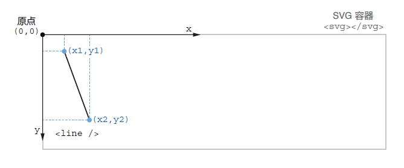<br/>**图 1.12 在 SVG 容器坐标系中定位直线元素**<br/>

如果保存并重新加载项目，会发现直线不可见——要让它可见，还需要设置其 [`stroke`](https://developer.mozilla.org/en-US/docs/Web/SVG/Attribute/stroke) 属性（attribute）。`stroke` 用于控制直线段的描边颜色，其值与 CSS 的 `color` 属性（property）类似；该取值可以是一个颜色名称（`black`、`blue` ...）、一个 RGB 颜色值（`rgb(255,0,0)`）或一个十六进制值（`#808080`）。给直线段添加一个 `stroke` 描边属性，并选择合适的颜色（示例为黑色），应该就能显示了：

```html
<line x1="50" y1="45" x2="140" y2="225" stroke="black" />
```

要设置线条宽度，使用 [`stroke-width`](https://developer.mozilla.org/en-US/docs/Web/SVG/Attribute/stroke-width) 属性。该属性可接受一个绝对数（转换为像素）或一个相对值（%）。例如下面一行代码，直线的 `stroke-width` 为 `3px`。如果未声明 `stroke-width` ，浏览器将默认取 `1px`。

```html
<line x1="50" y1="45" x2="140" y2="225" stroke="black" stroke-width="3" />
```

打开浏览器的检查工具（Inspect），找到 SVG 节点及其包含的直线。双击其中一个属性并修改它的值，观察新的属性值对直线起点或终点的影响。再尝试不同的值，以确认您充分理解了属性 `x1`、`y1`、`x2` 及 `y2` 对直线位置和长度的影响。

接着，令 `x1` 属性值为 `-20`，如图 1.13 所示：

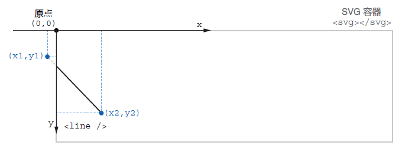<br/>**图 1.13 直线在 SVG 容器外的部分被隐藏**<br/>

看到直线的起点消失了吗？**在 SVG 中，任何位于 `viewBox` 之外的形状（或形状的一部分）在屏幕上都是不可见的。**此时该元素仍然在 DOM 中，并且可以访问和操作。当 SVG 元素不可见，而您又不清楚原因时，则需要首先检查该元素是否在 SVG 的 `viewBox` 之外！请牢牢记住，您可以随时通过开发工具查看 DOM 来找到它。前面讲过，在检查工具中只要将鼠标放到该元素上，就算它在 SVG 的 `viewBox` 之外，也会在视口中高亮显示。


> [!note]
>
> **注意**
>
> 大多数 SVG 元素只需要一个自闭合标签即可（如使用 `<line />` 而非 `<line></line>`）。与其他一些 HTML 标签一样，SVG 元素的固有结构在它们的自闭合标签内已经提供了所有必要的信息；但文本元素属于例外——其文本须放到开闭标签之间。

#### 4 矩形

矩形元素 [`<rect />`](https://developer.mozilla.org/en-US/docs/Web/SVG/Element/rect)，顾名思义，会在屏幕上画出一个矩形。`<rect />` 元素需要四个属性（attributes）才能正常显示。如图 1.14 所示，属性 [`x`](https://developer.mozilla.org/en-US/docs/Web/SVG/Attribute/x) 和 [`y`](https://developer.mozilla.org/en-US/docs/Web/SVG/Attribute/y) 声明了矩形左上角的位置；属性 [`width`](https://developer.mozilla.org/en-US/docs/Web/SVG/Attribute/width) 和 [`height`](https://developer.mozilla.org/en-US/docs/Web/SVG/Attribute/height) 分别控制其宽度和高度。在 SVG 容器中添加以下 `<rect />` 元素及其属性：

```html
<rect x="260" y="25" width="120" height="60"  fill="#6ba5d7" />
```

示例中，矩形的左上角位于 SVG 容器原点的右侧 `260px` ，下方 `25px`；该矩形宽 `120px` ，高 `60px`。与其他定位属性一样，这些属性值也可以用百分比来进行设置。例如将 `width` 设置为 `50%`，则该矩形将占据 SVG 容器宽度的一半。

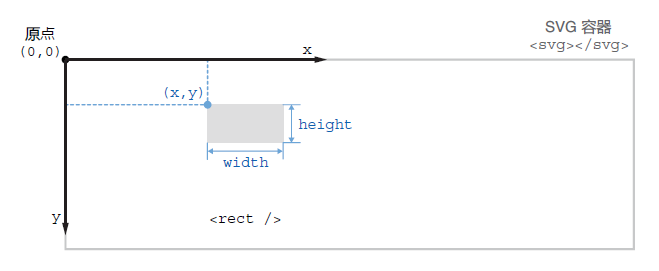<br/>**图 1.14 在 SVG 坐标系中定位和调整矩形尺寸**<br/>

您或许注意到了，示例中的矩形被填充成了黑色。默认情况下，浏览器会将大多数 SVG 图形填充为黑色。要修改默认的填充色，可以设置元素的 [`fill`](https://developer.mozilla.org/en-US/docs/Web/SVG/Attribute/fill) 属性，令其值为任意 CSS 颜色值即可；要给矩形添加边框，则可以添加 `stroke` 属性。图 1.15 展示了几个例子。注意，如果不声明 `stroke` 属性，则矩形四周不会描边。此外，在最后一个示例矩形中，属性 [`fill-opacity`](https://developer.mozilla.org/en-US/docs/Web/SVG/Attribute/fill-opacity) 和 [`stroke-opacity`](https://developer.mozilla.org/en-US/docs/Web/SVG/Attribute/stroke-opacity) 可分别令 `fill` 和 `stroke` 属性变为半透明效果。与 CSS 一样，不透明程度（opacity）可设为绝对值（介于 `0` 和 `1` 之间）或百分比（`30%`）；与填充和描边相关的所有属性也都可以通过 CSS 文件进行设置或修改。

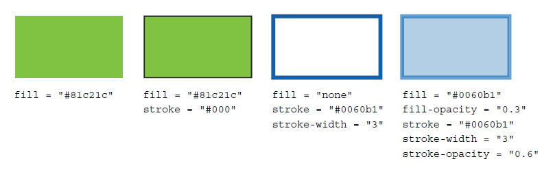<br/>**图 1.15 应用于矩形 SVG 图形的不同样式属性**<br/>

如果想绘制带圆角的矩形，只需添加 [`rx`](https://developer.mozilla.org/en-US/docs/Web/SVG/Attribute/rx) 和 [`ry`](https://developer.mozilla.org/en-US/docs/Web/SVG/Attribute/ry) 属性即可，分别表示水平与垂直角半径。这些属性接受绝对值（像素）和相对值（百分比）。例如，下面矩形的每个角的半径都是 `20px`。将该矩形添加到示例中：

```html
<rect x="260" y="100" width="120" height="60" rx="20" ry="20"  fill="#6ba5d7" />
```

讲到这您可能会问：SVG 中有没有专门画正方形的元素呢？答案是不需要——只要让 `<rect />` 元素 `width` 和 `height` 属性相同就行了。例如下面的 `<rect />` 元素，最终将画出一个 `60px × 60px` 的正方形。在示例页中添加以下内容：

```html
<rect x="260" y="175" width="60" height="60"  fill="transparent" stroke="#6ba5d7" />
```

作为参考，现在 SVG 画廊里有三种矩形：经典矩形、圆角矩形以及正方形。为了增添趣味性，先将颜色统一设为 `#6ba5d7` ，再来玩玩它们的 `stroke` 和 `fill` 属性。注意，正方形上只有描边（stroke）是可见的，因为其 `fill` 属性值为 `transparent`（为 `none` 也是一样的）。这些矩形应该与图 1.16 相似，除非您更改了属性值，我们也希望您改改看！

```html
<rect x="260" y="25" width="120" height="60" fill="#6ba5d7" />
<rect x="260" y="100" width="120" height="60" rx="20" ry="20" fill="#6ba5d7" />
<rect x="260" y="175" width="60" height="60" fill="transparent" stroke="#6ba5d7" />
```

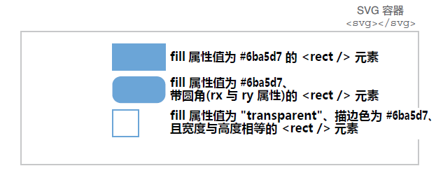<br/>**图 1.16 三种 SVG 矩形效果**<br/>

> [!note]
>
> **关于 SVG 描边（strokes）的位置**
>
> 当对齐可视化项目中的图形时，需要特别注意：SVG 图形绘制出的描边是在内外边界上平均展布的。如下图所示，已知一个 `width` 属性为 `40px` 的矩形，令 `stroke-width` 的值为 `1`，则在视觉效果上会在矩形的左右两边各增加宽度为 `0.5px` 的描边（而不是下意识地以为的那样在各边均增加 `1px`），最终实际的总宽度为 `41px`；若令 `stroke-width` 的值为 `2`，则左右两边各增加 `1px`，以此类推。
>
> 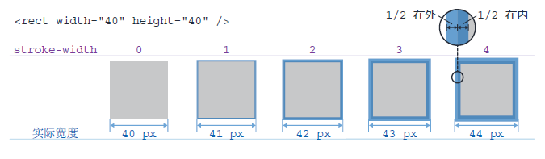<br/>**描边宽度 `stroke-width` 对 SVG 图形实际宽度的影响**<br/>

#### ***(PART TWO：5400 words)***

