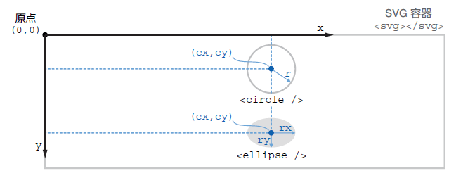
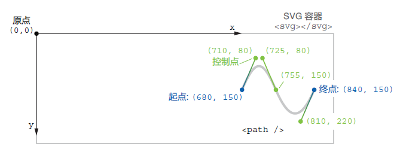
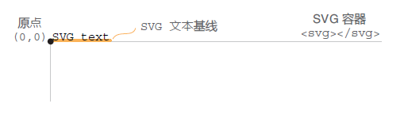
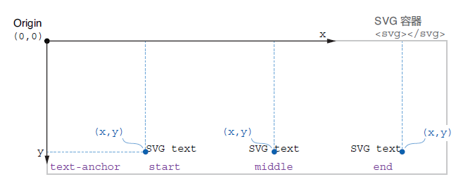
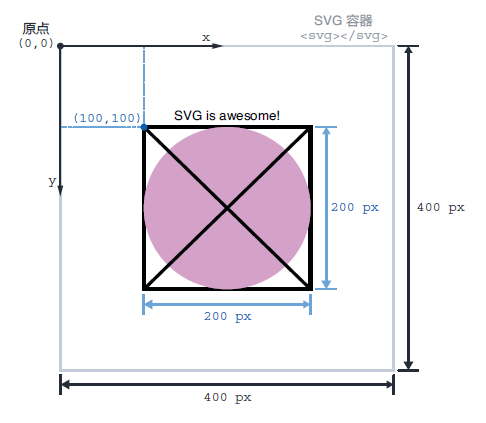

### 1.2.2 SVG - 可缩放矢量图形

可伸缩矢量图形（Scalable Vector Graphics，即 SVG）的引入从根本上改变了网络的面貌。SVG 图形在短短几年内就成为了主要的 Web 开发工具。与栅格图形（如 `PNG` 和 `JPG` 格式图片）由微小像素构成、并且像素点在放大倍数过高时清晰可见的设计理念不同，矢量图形则是基于数学和几何学构建而成的，能够在任何尺寸、任何屏幕分辨率下保持清晰的外观。SVG 图形的另一个重要优势是可以直接注入到 DOM 中，不仅可以让开发人员直接操作该元素并添加动画效果，而且还可以供屏幕阅读器访问。如果构建得当，SVG 图形也能具备高性能，其文件大小仅为相同效果的栅格图像的一小部分。

用 D3 来创作数据可视化作品，通常会将 SVG 图形注入 DOM，通过修改它们的 `attribute` 属性来生成各种可视化视觉元素。了解 SVG 的工作原理、主要图形及其主导视觉呈现的 `attribute` 属性，对大多数 D3 项目而言至关重要。本节后续内容将逐一介绍整个 D3 项目中会被反复重用的 SVG 形状。如果您对 SVG 还不太熟悉，请务必花点时间与我们一起敲敲代码。我们承诺这将大幅降低您未来使用 D3 的难度。

> **如何访问代码文件**
>
> 本书的每一章都包含了编程练习（code-along exercises），旨在进一步提升学习体验。强烈建议您在阅读本书时“动手”实践，而不仅仅满足于“阅读”学习。完成每一章设置的练习环节，可以让您更好地消化吸收所学知识，并尽快开始构建您自己的 D3 项目。
>
> 对于每个练习项目，您都可以访问现成的源代码文件，在本书的 `Github` 仓库（[http://mng.bz/Xqjv](http://mng.bz/Xqjv)）中找到它们。如果熟悉 `Git`，还可以克隆该仓库到您本地计算机，或者下载对应的压缩文件。
>
> <br/>**图 从 GitHub 仓库下载源码文件**<br/>
>
> 每个章节都有各自的文件夹，包含一个或多个练习。每个练习都按章节顺序进行了编号。练习包括一个 `start` 文件夹，其中包含开始练习所需的所有文件；而在 `end` 文件夹中有对应练习的完整参考答案。根据您在每一章、各个小节的学习进展，您既可以沿用上一小节练习后的代码，也可以使用与当前小节对应的代码文件夹进行练习，两种方式殊途同归。

先从矢量图开始。根据本书提供的源码文件，找到 `chapter_01/SVG_Shapes_Gallary` 下的 `end` 文件夹，在 `index.html` 文件上单击鼠标右键，从 **打开方式（*Open with*）** 菜单项选择一个浏览器。推荐使用 Chrome 或 Firefox 浏览器， 因为它们有出色的检查工具（inspector tools）。文件将从一个新的浏览器标签页打开，并看到如图 1.8 所示的矢量图。您也可以从托管到 GitHub 上的在线项目浏览这些 SVG 图形（[http://mng.bz/yZmB](http://mng.bz/yZmB)）。

<br/>**图 1.8 本节待构建的基本 SVG 图形**<br/>

您看到的这些都是今后用 D3 构建可视化项目时最常用的一些 SVG 图形，包括：直线（lines）、矩形（rectangles）、圆形（circles）、椭圆（ellipses）、路径（path）和文本（text）。

使用时，通常需要告诉 D3 哪些形状需要追加到 DOM 中，以及需要包含哪些视觉呈现属性，以便找出与这些尺寸、颜色及位置信息相匹配的理想图形。接下来的练习环节将通过代码来逐一创建图 1.8 中展示的 SVG 图形。我们不妨将该练习称为 **SVG 画廊（*Gallery of SVG Shapes*）**。通过此次练习，您将进一步了解入手 D3 项目需要掌握的所有 SVG 相关的基础知识。

用您习惯的代码编辑器打开练习项目 `SVG_Shapes_Gallery` 下位于 `start` 文件夹内的 `index.html` 文件。推荐使用 `VS Code` 编辑器——一款免费又好用的多功能代码编辑器，拥有许多前端开发需要的实用工具。

如代码清单 1.1 所示，`index.html` 是一个简单的 HTML 文件。如果用浏览器打开（鼠标右键单击文件，从 **打开方式（*Open With*）** 菜单选择一款浏览器即可）将看到一片空白，因为 `<body>` 元素是空的。下一小节，将给 `<body>` 元素添加各类 SVG 图形。

**代码清单 1.1 练习项目 SVG 画廊的初始 HTML 文件**

```html
<!DOCTYPE html>
<html>
<head>
  <meta charset="UTF-8">
  <meta name="viewport" content="width=device-width, initial-scale=1.0">  
  <title>SVG Shapes Gallery | D3.js in Action</title>
</head>
<body>
  
</body>
</html>
```

> [!tip]
>
> **如何查找更多信息**
>
> 后续内容将介绍多个 SVG 元素及其 `attribute` 属性。作为前端开发人员，常常会借助一些在线资源来构建项目、引入不太熟悉的 SVG 元素、或者寻找某个 JavaScript 功能来实现特定操作。MDN 在线文档（MDN Web Docs，详见 [https://developer.mozilla.org/](https://developer.mozilla.org/)）就是这样一个可靠且全面的资源，其中包含了大量通俗易懂并且支持修改的实用示例，如 SVG 元素及其属性用法、CSS 样式属性以及 JavaScript 函数等。

#### 1 响应式 SVG 容器

在 SVG 的图形世界中，`<svg>` 容器是用于绘图的白板。每个 SVG 形状都嵌套在该 `<svg>` 父元素中。想查看实际效果，编辑 `index.html` 文件并在 `<body>` 元素内添加一个 SVG 容器，然后在浏览器中重新加载该页面。目前还看不到任何内容：

```html
<body>
  <svg></svg>
</body>
```

打开浏览器的检查工具（在浏览器窗口中右键单击并选择 **检查（*Inspect*）**）。在检查窗口中会看到组成当前页面的 DOM 结构。找到 `<svg></svg>` 容器（又称 SVG 节点）。将鼠标移动到检查窗口内的容器上，SVG 元素就会在页面上高亮显示，如图 1.9 所示：

<br/>**图 1.9 从 DOM 树选中 SVG 节点，并在视口中高亮显示**<br/>

默认情况下，浏览器中的 SVG 容器宽 `300px` 像素、高 `150px` 像素，但可以通过给 `attribute` 属性赋值进行调整。此时的 `attribute` 属性就是用来提供 HTML 元素的附加信息。在 SVG 行内元素中（With inline SVG），主要是通过 `attribute` 属性来设置构成 SVG 图形的各个形状的尺寸及位置信息。

例如，可以设置 SVG 元素的宽度（width）和高度（height）属性（`attribute`）。返回文本编辑器，向 SVG 容器添加一个 `width` 和 `height` 属性，属性值分别设为 `900` 和 `300`，然后保存：

```html
<svg width="900" height="300"></svg>
```

在浏览器中重新加载项目，并在检查工具中定位 SVG 节点。请注意，现在 SVG 元素上出现了宽度和高度属性。如果将鼠标悬停在 DOM 树的 SVG 节点上，还将看到视口中的 SVG 容器此时的大小为 `900px × 300px`，如图 1.10 所示：

<br/>**图 1.10 SVG 节点通过属性来指定大小**<br/>

为了方便查看 SVG 容器，不必每次从检查工具高亮展示，不妨给它加上一个边框。向 SVG 元素添加一个 `style` 属性（`attribute`），并插入 CSS 边框属性（`property`）。如以下代码片段所示，通过边框简写属性（`property`）来创建一个宽 `1px` 像素的黑色实线边框：

```html
<svg width="900" height="300" style="border:1px solid black;"></svg>
```

保存并重新加载页面，确认 SVG 容器周围存在边框；再调整浏览器窗口大小，直到小于 SVG 容器。可以看到 SVG 容器保持固定宽高，不会适应浏览器窗口大小。接下来，尝试让 SVG 容器变为响应式容器。

前面将 SVG 的 `attribute` 属性设置为绝对值（`900` 和 `300`），浏览器以像素为单位将其解析为相应的测量值（`900px` 和 `300px`）；这里也可以使用百分比。回到文本编辑器中，将宽度改为相对值 `100%`，保存后重新加载页面：

```html
<svg width="100%" height="300" style="border:1px solid black;"></svg>
```

再次调整浏览器窗口大小，留意 SVG 是如何占据整个可用宽度、并同时保持固定高度 `300px` 的。情况好多了，只是容器的原始宽高比（aspect ratio）也丢失了。

要让 SVG 元素变为响应式设计，可以使用 `viewBox` 属性（[viewBox attribute](https://developer.mozilla.org/en-US/docs/Web/SVG/Attribute/viewBox)）。删除编辑器中的 `width` 和 `height` 属性，并将其替换为 `viewBox` 属性，赋值为 `"0 0 900 300"`：

```html
<svg viewBox="0 0 900 300" style="border:1px solid black;"></svg>
```

再次调整浏览器窗口大小进行验证。注意到了吗？此时 SVG 容器在保持宽高比 `900:300` 不变的情况下适应了任何屏幕尺寸，从而得到一个响应式的 SVG！

正如您看到的那样，`viewBox` 属性由四个属性值组成。前两个数值指定了 `viewBox` 的坐标系原点（`x` 和 `y`）。本书将统一使用 `0 0`，知道这些值可以调整 SVG 容器在屏幕的可见部分还是很有帮助的。`viewBox` 后两个数值分别指定了宽度（width）和高度（height）。它们定义了 SVG 的宽高比，并确保它能完美适应任何容器并作相应缩放而不致失真。

#### ***(PART ONE：2585 words)***

这里的关键是让 SVG 的尺寸与容器相适应。此时 SVG 所在容器为 `<body>` 元素，而 `<body>` 的尺寸又常常与浏览器视口（viewport）相适应。如果视口变得非常大，SVG 也会相应变大。通常，SVG 需要一个最大宽度，以免宽度超过页面上的其他内容。因此，SVG 需要放进一个 `div` 里面，并让该 `div` 的宽度为 `100%`、最大宽度为 `1200px`。为简便起见，我们将这些样式设为行内样式；实际项目中，它们都应该来自某个 CSS 文件。注意，为了让 SVG 水平居中，还多加了一个值为 `0 auto` 的外边距：

```html
<div style="width:100%; max-width:1200px; margin:0 auto;">
  <svg viewBox="0 0 900 300" style="border:1px solid black;"> ... </svg>
</div>
```

改好后，再次调整浏览器大小，看看 SVG 是否能在保持最大宽度的情况下优雅适应任意屏幕大小。该方案有助于将 D3 可视化模块注入到响应式网页中，本书后续都将采用该方案进行演示。


#### 2 SVG 的坐标系

实现 SVG 的响应式设计后，接下来需要重点考虑 SVG 图形在容器内的定位问题。SVG 容器就像一个空白画布，我们可以在上面绘制矢量图形。矢量图形是根据基本几何原理定义的，并相对于 SVG 容器的坐标系进行定位。

SVG 坐标系类似于直角坐标系，其二维平面通过两个相互垂直的轴来定位元素，即 `x` 轴和 `y` 轴；这两个轴的起点均为 SVG 容器的 **左上角**，如图 1.11 所示。`y` 轴的正方向为 **从上到下**，记住它可以少走很多弯路。

<br/>**图 1.11 SVG 容器坐标系与元素位置**<br/>

要在 SVG 容器内定位一个元素，可以从左上角的原点开始向右移动。这样就得到了元素的水平位置（即 x）；垂直位置（即 y）则从顶部开始向下移动。这些位置信息均由 SVG 图形的呈现属性（presentational attributes）来定义。

下面来看看构建 D3 项目常见的 SVG 图形及其主要的呈现属性。我们的目标并不是编写一份涵盖所有 SVG 图形及其功能特性的全方位指南，而是希望这些基础知识不会在后续的 D3 学习中拖您后腿。

> [!tip]
>
> **数据可视化小知识：几何基元（Geometric primitives）**
>
> 出色的艺术家可以用矢量图形来绘制任何事物，但您可能是带着更实际的目标来学习 D3 的。从这个角度来看，理解几何基元（也称图形基元（graphical primitives））的概念至关重要。几何基元是一些简单的形状，如点、线、圆和矩形。这些图形可以组合成更复杂的图形，尤其便于直观地展示信息。
>
> 几何基元对于理解现实世界中复杂的信息可视化也很有用。比如本书第 11 章要构建的树形布局，在您意识到它们也不过是一些圆和线时，也就不会那么令人生畏了；当您把交互式时间线看作是矩形和点的集合时，它们就更容易理解和创建了；即使是主要以多边形、点和线的形式出现的地理数据，如果将其分解为最基本的图形结构，也就不会那么令人困惑了。

#### 3 直线

直线元素可能是所有 SVG 图形中最简单的。它需要两个点的位置信息作属性值，并在它们之间绘制出一条直线。回到 `index.html` 示例文件，在 SVG 容器内添加一个 [`<line />`](https://developer.mozilla.org/en-US/docs/Web/SVG/Element/line) 元素，并令其 [`x1`](https://developer.mozilla.org/en-US/docs/Web/SVG/Attribute/x1) 和 [`y1`](https://developer.mozilla.org/en-US/docs/Web/SVG/Attribute/y1) 属性分别为 `50` 和 `45`。也就是说，该直线的起点位于 SVG 坐标系的 `(50, 45)`。如果从 SVG 容器的左上角开始，右移 `50px`、下移 `45px`，就会到达该起点；同理，利用属性 [`x2`](https://developer.mozilla.org/en-US/docs/Web/SVG/Attribute/x2) 和 [`y2`](https://developer.mozilla.org/en-US/docs/Web/SVG/Attribute/y2) 可将该直线的终点坐标设为 `(140, 225)`，如图 1.12 所示。

```html
<svg>
  <line x1="50" y1="45" x2="140" y2="225" />
</svg>
```

<br/>**图 1.12 在 SVG 容器坐标系中定位直线元素**<br/>

如果保存并重新加载项目，会发现直线不可见——要让它可见，还需要设置其 [`stroke`](https://developer.mozilla.org/en-US/docs/Web/SVG/Attribute/stroke) 属性（attribute）。`stroke` 用于控制直线段的描边颜色，其值与 CSS 的 `color` 属性（property）类似；该取值可以是一个颜色名称（`black`、`blue` ...）、一个 RGB 颜色值（`rgb(255,0,0)`）或一个十六进制值（`#808080`）。给直线段添加一个 `stroke` 描边属性，并选择合适的颜色（示例为黑色），应该就能显示了：

```html
<line x1="50" y1="45" x2="140" y2="225" stroke="black" />
```

要设置线条宽度，使用 [`stroke-width`](https://developer.mozilla.org/en-US/docs/Web/SVG/Attribute/stroke-width) 属性。该属性可接受一个绝对数（转换为像素）或一个相对值（%）。例如下面一行代码，直线的 `stroke-width` 为 `3px`。如果未声明 `stroke-width` ，浏览器将默认取 `1px`。

```html
<line x1="50" y1="45" x2="140" y2="225" stroke="black" stroke-width="3" />
```

打开浏览器的检查工具（Inspect），找到 SVG 节点及其包含的直线。双击其中一个属性并修改它的值，观察新的属性值对直线起点或终点的影响。再尝试不同的值，以确认您充分理解了属性 `x1`、`y1`、`x2` 及 `y2` 对直线位置和长度的影响。

接着，令 `x1` 属性值为 `-20`，如图 1.13 所示：

<br/>**图 1.13 直线在 SVG 容器外的部分被隐藏**<br/>

看到直线的起点消失了吗？**在 SVG 中，任何位于 `viewBox` 之外的形状（或形状的一部分）在屏幕上都是不可见的。**此时该元素仍然在 DOM 中，并且可以访问和操作。当 SVG 元素不可见，而您又不清楚原因时，则需要首先检查该元素是否在 SVG 的 `viewBox` 之外！请牢牢记住，您可以随时通过开发工具查看 DOM 来找到它。前面讲过，在检查工具中只要将鼠标放到该元素上，就算它在 SVG 的 `viewBox` 之外，也会在视口中高亮显示。


> [!note]
>
> **注意**
>
> 大多数 SVG 元素只需要一个自闭合标签即可（如使用 `<line />` 而非 `<line></line>`）。与其他一些 HTML 标签一样，SVG 元素的固有结构在它们的自闭合标签内已经提供了所有必要的信息；但文本元素属于例外——其文本须放到开闭标签之间。

#### 4 矩形

矩形元素 [`<rect />`](https://developer.mozilla.org/en-US/docs/Web/SVG/Element/rect)，顾名思义，会在屏幕上画出一个矩形。`<rect />` 元素需要四个属性（attributes）才能正常显示。如图 1.14 所示，属性 [`x`](https://developer.mozilla.org/en-US/docs/Web/SVG/Attribute/x) 和 [`y`](https://developer.mozilla.org/en-US/docs/Web/SVG/Attribute/y) 声明了矩形左上角的位置；属性 [`width`](https://developer.mozilla.org/en-US/docs/Web/SVG/Attribute/width) 和 [`height`](https://developer.mozilla.org/en-US/docs/Web/SVG/Attribute/height) 分别控制其宽度和高度。在 SVG 容器中添加以下 `<rect />` 元素及其属性：

```html
<rect x="260" y="25" width="120" height="60"  fill="#6ba5d7" />
```

示例中，矩形的左上角位于 SVG 容器原点的右侧 `260px` ，下方 `25px`；该矩形宽 `120px` ，高 `60px`。与其他定位属性一样，这些属性值也可以用百分比来进行设置。例如将 `width` 设置为 `50%`，则该矩形将占据 SVG 容器宽度的一半。

<br/>**图 1.14 在 SVG 坐标系中定位和调整矩形尺寸**<br/>

您或许注意到了，示例中的矩形被填充成了黑色。默认情况下，浏览器会将大多数 SVG 图形填充为黑色。要修改默认的填充色，可以设置元素的 [`fill`](https://developer.mozilla.org/en-US/docs/Web/SVG/Attribute/fill) 属性，令其值为任意 CSS 颜色值即可；要给矩形添加边框，则可以添加 `stroke` 属性。图 1.15 展示了几个例子。注意，如果不声明 `stroke` 属性，则矩形四周不会描边。此外，在最后一个示例矩形中，属性 [`fill-opacity`](https://developer.mozilla.org/en-US/docs/Web/SVG/Attribute/fill-opacity) 和 [`stroke-opacity`](https://developer.mozilla.org/en-US/docs/Web/SVG/Attribute/stroke-opacity) 可分别令 `fill` 和 `stroke` 属性变为半透明效果。与 CSS 一样，不透明程度（opacity）可设为绝对值（介于 `0` 和 `1` 之间）或百分比（`30%`）；与填充和描边相关的所有属性也都可以通过 CSS 文件进行设置或修改。

<br/>**图 1.15 应用于矩形 SVG 图形的不同样式属性**<br/>

如果想绘制带圆角的矩形，只需添加 [`rx`](https://developer.mozilla.org/en-US/docs/Web/SVG/Attribute/rx) 和 [`ry`](https://developer.mozilla.org/en-US/docs/Web/SVG/Attribute/ry) 属性即可，分别表示水平与垂直角半径。这些属性接受绝对值（像素）和相对值（百分比）。例如，下面矩形的每个角的半径都是 `20px`。将该矩形添加到示例中：

```html
<rect x="260" y="100" width="120" height="60" rx="20" ry="20"  fill="#6ba5d7" />
```

讲到这您可能会问：SVG 中有没有专门画正方形的元素呢？答案是不需要——只要让 `<rect />` 元素 `width` 和 `height` 属性相同就行了。例如下面的 `<rect />` 元素，最终将画出一个 `60px × 60px` 的正方形。在示例页中添加以下内容：

```html
<rect x="260" y="175" width="60" height="60"  fill="transparent" stroke="#6ba5d7" />
```

作为参考，现在 SVG 画廊里有三种矩形：经典矩形、圆角矩形以及正方形。为了增添趣味性，先将颜色统一设为 `#6ba5d7` ，再来玩玩它们的 `stroke` 和 `fill` 属性。注意，正方形上只有描边（stroke）是可见的，因为其 `fill` 属性值为 `transparent`（为 `none` 也是一样的）。这些矩形应该与图 1.16 相似，除非您更改了属性值，我们也希望您改改看！

```html
<rect x="260" y="25" width="120" height="60" fill="#6ba5d7" />
<rect x="260" y="100" width="120" height="60" rx="20" ry="20" fill="#6ba5d7" />
<rect x="260" y="175" width="60" height="60" fill="transparent" stroke="#6ba5d7" />
```

<br/>**图 1.16 三种 SVG 矩形效果**<br/>

> [!note]
>
> **关于 SVG 描边（strokes）的位置**
>
> 当对齐可视化项目中的图形时，需要特别注意：SVG 图形绘制出的描边是在内外边界上平均展布的。如下图所示，已知一个 `width` 属性为 `40px` 的矩形，令 `stroke-width` 的值为 `1`，则在视觉效果上会在矩形的左右两边各增加宽度为 `0.5px` 的描边（而不是下意识地以为的那样在各边均增加 `1px`），最终实际的总宽度为 `41px`；若令 `stroke-width` 的值为 `2`，则左右两边各增加 `1px`，以此类推。
>
> <br/>**描边宽度 `stroke-width` 对 SVG 图形实际宽度的影响**<br/>

#### ***(PART TWO：5400 words)***

#### 5 圆与椭圆

在数据可视化中常常会用到圆形。它们天然吸引眼球，使可视化效果看起来更友好、更有趣。SVG 的圆是通过 [`<circle />`](https://developer.mozilla.org/en-US/docs/Web/SVG/Element/circle) 元素绘制的，其必选属性包括圆心位置（[`cx`](https://developer.mozilla.org/en-US/docs/Web/SVG/Attribute/cx), [`cy`](https://developer.mozilla.org/en-US/docs/Web/SVG/Attribute/cy)）与半径（[`r`](https://developer.mozilla.org/en-US/docs/Web/SVG/Attribute/r)），如图 1.17 所示。圆的半径是从圆心到圆周上任意一点绘制的线的长度。将以下圆形添加到示例中，令圆心位于 `(530, 80)` 处，且半径为 `50px`：

```html
<circle cx="530" cy="80" r="50" />
```

<br/>**图 1.17 在 SVG 容器的坐标系中定位圆和椭圆并调整其大小**<br/><br/>

还可以为圆设置填充（`fill`）与描边（`stroke`）属性（attribute）。要生成图 1.17 中的圆，令填充色为透明（`transparent`）、描边宽度为 `3px`、描边颜色为 `#81c21c`（译注：这里应该参考的是最终效果图 1.8，图 1.17 只是示意图）。

同理，[`<ellipse />`](https://developer.mozilla.org/en-US/docs/Web/SVG/Element/ellipse) 元素必须指定圆心坐标（`cx`, `cy`），但不像圆有固定半径，椭圆的半径会变化，使其呈扁平状——这是通过声明椭圆的水平半径（[`rx`](https://developer.mozilla.org/en-US/docs/Web/SVG/Attribute/rx)）和垂直半径（[`ry`](https://developer.mozilla.org/en-US/docs/Web/SVG/Attribute/ry)）来实现的。将如下代码片段添加到示例中，将在圆的下方绘制一个椭圆，其水平半径为 `50px`、垂直半径为 `30px`：

```html
<ellipse cx="530" cy="205" rx="50" ry="30" />
```


#### 6 路径

SVG 的路径（path）元素是目前为止所有 SVG 元素中最灵活的一种。在 D3 中，路径被广泛用于绘制几乎所有的复杂形状和曲线。这些形状和曲线是无法用目前讨论过的图形基元（线、矩形、圆和椭圆）来表示的。

路径元素通过声明 `d` 属性（这里的“d”代表“draw”，即“绘制”）来指示浏览器进行绘制。`d` 属性包含一系列命令：从开始绘制路径的位置，到使用的一系列曲线类型，一直到确定该路径是否为一个封闭图形为止。例如，在图形画廊示例中添加以下路径元素：

```html
<path d="M680 150 C 710 80, 725 80, 755 150 S 810 220, 840 150" fill="none" stroke="#773b9a" stroke-width="3" />
```

如图 1.18 所示， `d` 属性以 `M680 150` 开头，表示“移动（`M`）到坐标（680，150）处”。接着从起点坐标（`680 150`）到 `d` 属性最后一个坐标（`840 150`）所指定的终点，绘制一条三阶贝塞尔曲线（cubic Bézier curve）。三阶贝塞尔曲线还需要设置控制点来定义曲线的陡峭程度和弯曲方向。这些控制点从字母 `C`（这里的“C”代表“cubic curve”，即“三次方曲线”）之后开始，直到字母 `S`（这里的“S”代表“stop”，即“停止”）之后结束。

<br/>**图 1.18 一条简单的 SVG 路径及其控制点**<br/><br/>

> [!note]
>
> **注意**
>
> 如需深入了解 SVG 路径，请参阅 MDN 的教程：[https://developer.mozilla.org/en-US/docs/Web/SVG/Tutorial/Paths](https://developer.mozilla.org/en-US/docs/Web/SVG/Tutorial/Paths)。

手动设置 `d` 属性仅适用于简单的图形，随着图形复杂度增加，纯手动编写将会变得非常繁琐。所幸 D3 提供了强大的图形生成工具来专门处理 `d` 属性的计算。本书第 4 章将深入讨论。

路径还有一个需要牢记的重要知识点：无论路径元素是否闭合，只要其 `fill` 属性值不为 `none` 或 `transparent`，浏览器就会默认填充为黑色，如本例所示。


#### 7 文本

内联 SVG 图形的最大优势之一在于支持屏幕阅读器访问其包含的文本内容。这对于可访问性而言是一大优势。由于数据可视化通常包含多个标签，因此有必要了解如何使用 [`<text>`](https://developer.mozilla.org/en-US/docs/Web/SVG/Element/text) 元素来操作 SVG 文本。通过往示例中添加标签可以了解 SVG 文本的基本工作原理。

目前为止我们讨论的 SVG 图形都使用了自闭合标签（如 `<line />`、`<rect />`、`<path />` ……）。在使用 SVG 的 `<text>` 元素时，需要同时使用开标签和闭标签，并将待显示文本放置在这两个标签之间。例如，添加一个内容为“line”的文本元素：

```html
<text>line</text>
```

保存并重新加载页面。您可能以为文本会出现在 SVG 容器的左上角，但却看不到……这是为什么呢？默认情况下，SVG 文本的位置是参照其基线计算得来的，通过 `dominant-baseline` 属性控制。如果文本基线的坐标是 `(0, 0)`，如图 1.19 所示，实际文本最终将位于 SVG 容器之外。由于任何位于 SVG 容器之外的元素都是不可见的，所以看不到文本。

<br/>**图 1.19 在 SVG 容器外定位文本**<br/><br/>

在使用 SVG 文本元素时，另一个需要考虑的问题是文本如何流动（flow）。常规 HTML 元素在页面上的位置是按照控制内容流动的特定规则来确定的。如果在页面中插入大量 `<div>` 元素，它们会自然地堆叠在一起，其内容也会回流（reflow)，不会超出容器的范围；而 SVG 文本根本不会流动，开发人员必须单独设置每个文本元素的 `x` 和 `y` 属性。例如通过它们将文本放在坐标点 `(60, 260)` 处，标签“line”才会出现在图形画廊示例中 SVG 直线段的下方：

```html
<text x="60" y="260">line</text>
```

作为练习，再创建一个新的文本元素，并将标签“rect”置于矩形和正方形的下方。

至此，我们通过 `x` 和 `y` 属性声明了文本元素 **左下角** 的位置。怎样设置文本中点位置呢？通过属性 [`text-anchor`](https://developer.mozilla.org/en-US/docs/Web/SVG/Attribute/text-anchor) 来实现：令其值为 `middle` 即可，如图 1.20 所示。再比如，利用该属性还可以将圆形的文本标签居中。

```html
<text x="530" y="155" text-anchor="middle">circle</text>
```

<br/>**图 1.20 `text-anchor` 属性对 SVG 文本对齐方式的影响。默认值为 start；根据其中间位置对齐，值为 middle；设置末尾对齐，值为 end**<br/><br/>

最后，分别为椭圆和路径元素各添加一个文本标签。SVG 文本默认为黑色，可以通过 `fill` 属性（attribute）进行更改。

#### 8 分组元素

本小节要讨论的最后一个 SVG 元素为分组元素（group element）。分组元素（即 `<g>` 元素）与之前讨论过的其他 SVG 元素有所不同。它既没有视觉上的图形表示，也不存在具有边界的空间；相反，它是 SVG 各元素的逻辑分组，广泛应用于由多个图形和标签组成的可视化效果中。

如果希望正方形标签和“rect”文本标签一同显示，并在 SVG 容器中整体平移，可以如以下示例将它们放到一个 `<g>` 元素中。注意，`<rect>` 元素的左上角已变为了坐标原点 `(0, 0)`。`<text>` 位于 `(0, 85)` 处，保持在 `<rect>` 的下方：

```html
<g>
  <rect x="0" y="0" width="60" height="60" />
  <text x="0" y="85">rect</text>
</g>
```

此时，包含正方形及其文本标签的组出现在了 SVG 容器的左上角。我们可以在 SVG 容器中任意移动这个组及其包含的所有元素，始终保持正方形与文本标签之间的对齐方式不变。

使用 `transform` 属性可以在 SVG 容器中平移该分组。`transform` 属性比之前学过的其他属性略显复杂，但与 CSS 中 `transform` 属性的用法相同。它接受一个或一系列变换（transformation，如平移、旋转、缩放等）作为属性值。平移一个分组使用 `translate(x, y)` 变换。如果要将 `<rect>` 和 `<text>` 元素移回原位，需要令分组元素右移 `260px` 并下移 `175px`，即令 `<g>` 元素 `transform` 属性的值为 `transform="translate(260,175)"`。

```html
<g transform="translate(260,175)">
  <rect x="0" y="0" width="60" height="60" />
  <text x="0" y="85">rect</text>
</g>
```

`<g>` 元素的另一个特点，是其子元素可以继承它的样式属性（styling attributes）。下面举例说明。由于前面“rect”文本标签已经和正方形归为同一组，故先将其余文本元签统一放到另一个 `<g>` 元素内：

```html
<g>
  <text x="60" y="260">line</text>
  <text x="530" y="155" style="text-anchor:middle">circle</text>
  <text x="530" y="260" style="text-anchor:middle">ellipse</text>
  <text x="730" y="260">path</text>
</g>
```

如果令 `<g>` 的 `fill` 属性值为 `#636466`，则里面的每个 `<text>` 元素都将继承相同的颜色；同理，如果添加的是 `font-family` 或 `font-size` 属性，同一组内的文本元素也将继承这些样式属性（properties）。

```html
<g fill="#636466" style="font-size:16px; font-family:monospace">
  <text x="60" y="260">line</text>
  <text x="530" y="155" style="text-anchor:middle">circle</text>
  <text x="530" y="260" style="text-anchor:middle">ellipse</text>
  <text x="730" y="260">path</text>
</g>
```

最后一次再重新加载页面，注意观察分组内的标签继承的颜色和字体效果；再看看分组外的标签是否保持原来的外观不变。像这样在分组元素上应用共享样式的做法非常方便，可以帮助您在工作中遵循 DRY（即 Don't Repeat Yourself，不要重复自己）原则。需要更新属性时，在分组容器上操作也会很简单。

恭喜您完成了本书的第一个练习！您可以在代码清单 1.2 及源码文件的 [end](https://github.com/d3js-in-action-third-edition/code-files/tree/main/chapter_01/01_SVG_Shapes_Gallery/) 文件夹找到 SVG 图形画廊的完整代码。在构建首个 D3 项目时，该练习可以作为参考。

**代码清单 1.2 SVG 图形画廊示例的完整 HTML 代码**

```html
<!DOCTYPE html>
<html>
<head> <!-- [略] --> </head>
<body>
  <div style="width:100%; max-width:1200px; margin:0 auto;">
    <svg viewBox="0 0 900 300" style="border:1px solid black;">
 
      <line x1="50" y1="45" x2="140" y2="225" stroke="black" />
 
      <rect x="260" y="25" width="120" height="60" fill="#6ba5d7" />
      <rect x="260" y="100" width="120" height="60" rx="20" ry="20" fill="#6ba5d7" /> 
      <g transform="translate(260, 175)">
        <rect x="0" y="0" width="60" height="60" fill="transparent"  stroke="#6ba5d7" />
        <text x="0" y="85">rect</text>
      </g>
 
      <circle cx="530" cy="80" r="50" fill="none" stroke="#81c21c" stroke- width="3" />
      <ellipse cx="530" cy="205" rx="50" ry="30" fill="#81c21c" />
 
      <path d="M680 150 C 710 80, 725 80, 755 150 S 810 220, 840 150" fill="none" stroke="#773b9a" stroke-width="3" />
 
      <g fill="#636466" style="font-size:16px; font-family:monospace">
        <text x="60" y="260">line</text>
        <text x="530" y="155" style="text-anchor:middle">circle</text>
        <text x="530" y="260" style="text-anchor:middle">ellipse</text>
        <text x="730" y="260">path</text>
      </g>
 
    </svg>
  </div>
</body>
</html>
```

> [!tip]
>
> **强化练习：创建 SVG 图形**
>
> 现在该您小试牛刀了——创建如下图所示的 SVG 图形。您可以在源码文件夹 `02_SVG_exercise/start` 中进行操作。具体要求如下：
>
> - 创建一个响应式 SVG 容器，宽高均为 `400px`（屏幕上留足空间）。
> - 绘制一个宽高均为 `200px` 的正方形。将其置于 SVG 容器的中心位置，并指定透明色填充及 `5px` 的黑色描边。
> - 在 SVG 容器的中心添加一个半径为 `100px` 的圆。将其 `fill` 属性设置为 CSS 颜色名称“plum”。
> - 绘制两条描边为 `5px` 的黑色对角线：一条从正方形的左上角画到右下角；另一条从正方形的右上角画到左下角。
> - 在正方形上方添加文本“SVG is awesome!”字样，并将其置于 SVG 容器的中心。其他文本样式：字号 `18px`、无衬线字体。
>
> <br/>**强烈建议通过练习该 SVG 图形来强化本小节介绍的知识点**<br/><br/>
>
> 该练手项目的完整参考代码，请参阅 **附录 D** 的 `D.1.1` 小节或随书源码文件中的 `02_SVG_exercise/end` 文件夹中。建议尽量独立完成。


（SVG 基础知识译完了，内容有点多，再自己做个小结吧）
#### 本节 SVG 基础知识要点梳理
- 圆（`circle`）与椭圆（`ellipse`）：都具有圆心坐标（`cx` / `cy`）和半径，只是椭圆的半径有两个（`rx` 与 `ry`），圆只有一个（`r`）；圆其实是椭圆的 **特殊情况**；
- 路径（`path`）是 SVG 图形中最复杂的几何基元，其属性 `d` 包含一系列命令，可借助 D3 的生成工具代替纯手工赋值；
- 文本（`text`）——
  - 在 SVG 中不随常规 HTML 内容流动；
  - 其位置是基于文本基线计算得来的，需要手动设置（`x` 与 `y`）；
  - 文本对齐通过 `text-anchor` 属性调整，可选值：`start` | `middle` | `end`；
- 分组（`g`）元素——
  - 没有视觉图形表示，也不占据空间；
  - 放入同一分组的元素可整体移动；
  - 设置在 `g` 上的样式可被子元素继承：如 `fill`、`font-size`、`font-family` 等；
