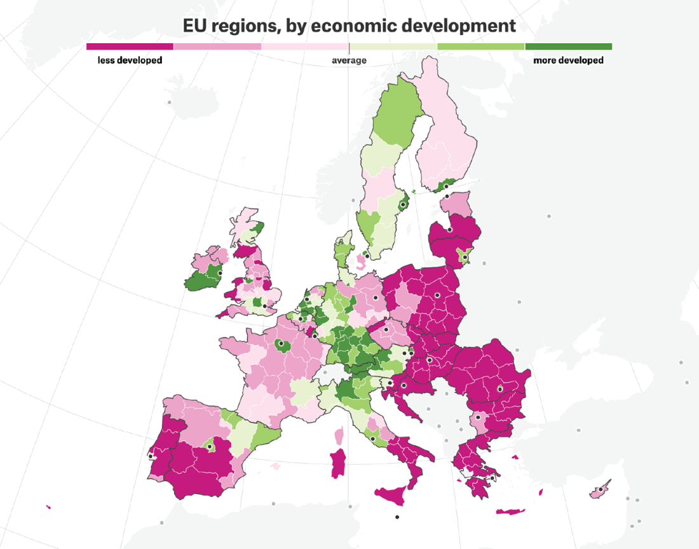

# 第一章 D3.js 简介

> **本章概要**
>
> - 理解 D3.js 的作用及其背后的设计理念
> - 认识与 D3.js 结合并用于创建数据可视化的相关工具
> - 借助代码创建并美化可缩放矢量图（SVG）
> - 了解数据可视化最佳实践，助力 D3.js 开发之路

鉴于过去十年来市面上涌现出了大量的数据可视化工具，您可能会怀疑 D3 这趟浑水是否还值得一试。咱们就开门见山吧——当下学习 D3 仍然是一个明智的投资之举。尽管 D3 的学习曲线可能会比较陡峭，并且需要付出坚持不懈的努力；但您最终收获的，将不仅仅是其他工具库所提供的各类传统图表的开发能力，此外还能随心所欲地对其进行定制化改造，更重要的是可以实现数据可视化意义上的创作自由，真正打破常规藩篱、直击数据本质、打造出完美贴合受众需求的精品佳作。

D3.js 是互联网上大多数振奋人心的数据可视化作品背后的工具库。无论是制作用于研究的交互式原型、还是绘制响应式的数据仪表盘、抑或是讲述长篇数据故事（例如 *Maarten Lambrechts* 的作品《布达佩斯、华沙和立陶宛为何一分为二》（“Why Budapest, Warsaw, and Lithuania split themselves in two”），如图 1.1 所示），当您希望拥有完全的创意自由与技术自由时，D3 必将是您的首选工具。

 **图 1.1 D3 开发者可以访问像地图这样的各种数据格式。图为 Maarten Lambrechts 的作品示例（[https://pudding.cool/2019/04/eu-regions/](https://pudding.cool/2019/04/eu-regions/))** 

本书第一章将介绍 D3 的生态系统，以及在深入探讨数据可视化相关主题前一些至关重要的核心概念，如 SVG 图形、JavaScript 对象操作方法等。

> [!note]
>
> **注意**
>
> “D3.js”与“D3”的叫法将贯穿全书。二者交替使用，不作区分。