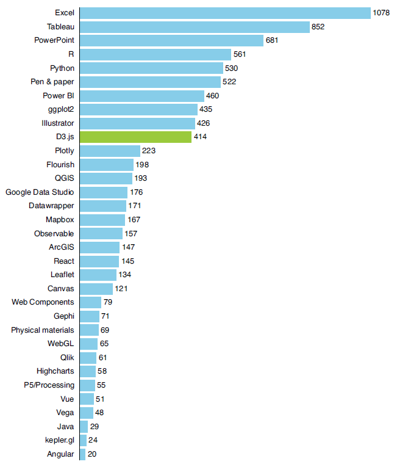

## 2.1 第一个 D3 可视化图表

在本章及下一章中，我们都将聚焦首个 D3 可视化图表的开发——如图 2.1 所示的条形图。虽然第一章中提到过，D3 未必是绘制简单经典图表的最有效工具，但条形图却是了解 D3 基本概念的完美切入点。只要紧跟我们的节奏，很快您就能打牢基础，轻松构建出复杂的可视化效果。

 **图 2.1 最受数据可视化从业者欢迎的技术对比图。本章将介绍该条形图的构建方法（资料来源：数据可视化协会《2021 年数据可视化行业现状调查》)**  

条形图中的数据出自数据可视化协会（[www.datavisualizationsociety.org](www.datavisualizationsociety.org)）开展的《2021 年数据可视化行业状况调查》。

在参与该调查的 2181 名数据可视化从业者中，既有专业人士，也有学生和业余爱好者。本书仅选取其中一个问卷题目作为示例——“您经常使用哪些技术来实现数据的可视化？”。受访者可以从预设的列表中选择所有适用的工具。如图 2.1 所示，该条形图垂直列出了各种工具，每个横条的长度代表了选择该工具的受访者人数。根据这项调查，D3 排在数据可视化工具前十名的末尾。让我们开始吧！

> [!note]
>
> **注意**
>
> 数据可视化协会每年都会进行一次行业现状调查。了解行业的最新情况，获取最新数据请访问 [www.datavisualizationsociety.org/survey](https://www.datavisualizationsociety.org/survey)。

