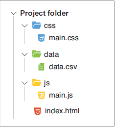

### 2.2.1 首个 D3 项目的结构

在接下来的章节中，我们要学习的 D3 项目都具有类似的项目结构，如图 2.2 所示：

 **图 2.2 首个 D3 项目的文件夹结构**  

在项目根目录下，有一个 `index.html` 文件，用于存放项目的初始 HTML 标记。这里也是本书第一部分示例项目加载 D3 工具库、JavaScript 脚本及 CSS 样式文件的地方。项目包含三个文件夹，分别是——

- `/css` 文件夹：存放所有与项目相关的 CSS 样式文件。虽然 CSS 不是本书重点，但偶尔也会用到。简单起见，本书还将通过样式归类让 CSS 的文件数目最小化。但务必谨记：正式项目的 CSS 文件夹结构可能会复杂得多，通常也会用到 CSS 预处理器，例如 `SASS`（全称为 Syntactically Awesome Stylesheets）或 `LESS`（全称为 Leaner Stylesheets）。
- `/data` 文件夹：存放项目数据集。本例条形图的数据集，是一个 CSV 格式的数据文件，各数据值间用英文逗号分隔。数据集的每一行都代表了某项技术，后面则是被调查对象选择该技术的统计次数。
- 最后是 `/js` 文件夹：用于存放项目 JavaScript 文件。为方便演示，示例将在文件 `main.js` 中编写 D3 代码。稍后会讨论如何将代码拆分成多个文件或组件（components），以便后期维护和测试。