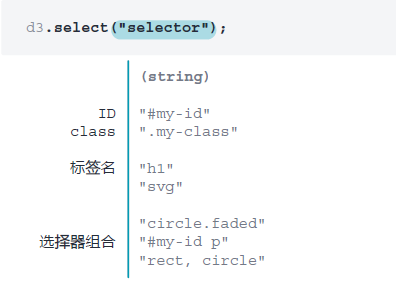
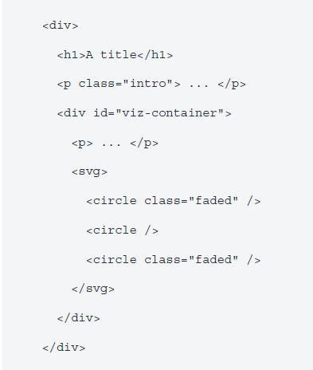
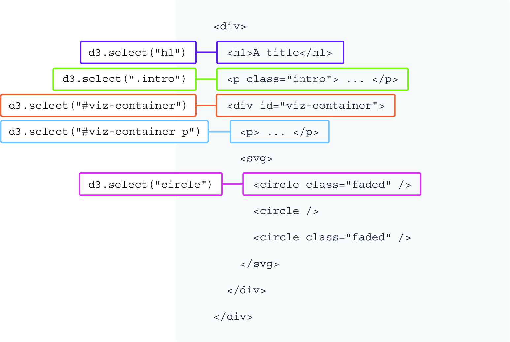
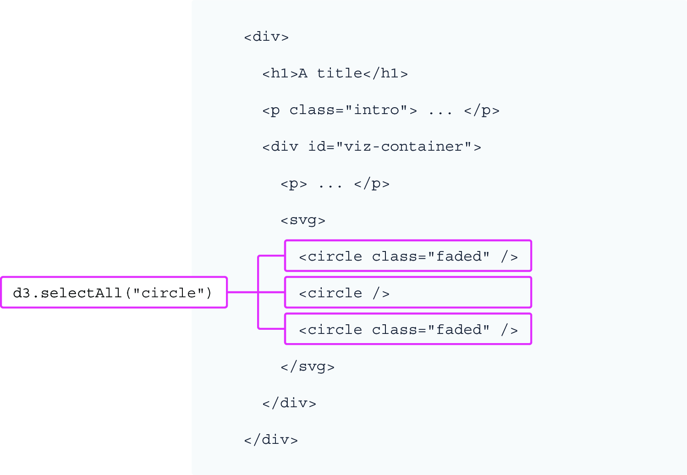
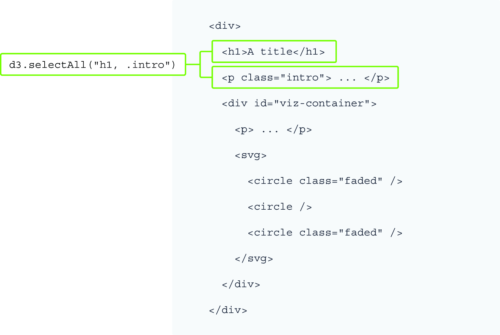

## 2.3 用 D3 选中页面元素

在构建 D3 项目时往往会频繁操作 DOM，而任何 DOM 操作都是从选择集开始的。选择集就像从 DOM 抓取某个元素一样以备后用。通常有两种方法获取选择集： `d3.select()` 和 `d3.selectAll()`。

`d3.select()` 方法以一个选择器作参数，并返回与该选择器匹配的第一个元素。该方法可从 `d3` 对象上链式调用，用于选择单个元素。如图 2.4 所示，选择器参数可以是一个类属性、一个 ID、一个标签名称，也可以是它们的任意组合，这与 CSS 选择器的用法完全相同。

<br/>**图 2.4 D3 的 select() 方法**<br/><br/>

以如图 2.5 所示的虚构 DOM 样本为例，它由一个包含 `h1` 标题的 `div` 元素、一个样式类为 `intro` 的段落元素、以及一个 ID 为 `viz-container` 的 `div` 组成；该 `div` 又将另一个段落和一个 SVG 容器包裹在一起。而该 SVG 容器又包含三个 `circle` 元素，其中第一个和最后一个的样式类均为 `faded`：

<br/>**图 2.5 一个虚构的 DOM 样本**<br/><br/>

如果要选择 `h1` 标题，可将其标签选择器传入 `d3.select()` 方法：

```js
d3.select("h1");
```

同理，如果要选中样式类为 `intro` 的段落，或 ID 为 `viz-container` 的 `div` 元素，可以分别使用各自的类或 ID 作选择器。与 CSS 选择器一样，类名前要加一个英文句点（`.`），ID 前要加一个哈希标记（`#`）：

```js
d3.select(".intro");
d3.select("#viz-container");
```

还可以使用组合选择器。例如，要选中 `div` 中 ID 为 `viz-container` 的段落元素，可以在两个选择器之间留一个空格：

```js
d3.select("#viz-container p");
```

这种组合选择器的操作与链式调用两次 `select()` 方法等效：

```js
d3.select("#viz-container").select("p");
```

这里需要牢牢记住一点：`d3.select()` 只返回 DOM 中与选择器相匹配的 **第一个元素**。如图 2.6 所示，示例 DOM 中有三个圆形元素。但选择集 `d3.select("circle")` 只返回第一个 `circle` 元素而忽略其他元素：

<br/>**图 2.6 d3.select() 方法返回的 DOM 元素**<br/><br/>

但如果想在一个选择集中包含多个元素，又该怎么实现呢？这时可以使用 `d3.selectAll()` 方法。`d3.selectAll()` 的工作原理与 `d3.select()` 类似，只是它会返回与其选择器相匹配的所有 DOM 元素。如图 2.7 所示，在示例 DOM 中执行 `d3.selectAll("circle")` 方法，将返回 DOM 中包含的所有 `circle` 元素：

<br/>**图 2.7 d3.selectAll() 方法返回的 DOM 元素**<br/><br/>


有时，还可以像在 CSS 中那样对多个选择器字符串分组，并用逗号分隔——了解这一点也会很有用。例如下面的这段代码，同时选中了 `h1` 标题和样式类为 `intro` 的段落，效果如图 2.8 所示：

```js
d3.selectAll("h1, .intro");
```

大多数情况下，获取到的选择集都会赋给 JavaScript 常量，以便后续复用与操作。您可以像使用 JavaScript 常量（`const`）或变量（`let`）那样存放 D3 选择集：

```js
const myCircles = d3.selectAll("circle");
```

<br/>**图 2.8 用逗号对选择器进行分组**<br/><br/>

> **访问 D3 模块的官方文档**
>
> D3 由一系列模块（modules）组成，实际工作中既可以独立使用这些模块，也可以根据需要将其进行组合。每个模块都包含完成某些任务的多种方法。
>
> 本章讨论的所有方法都来自 `d3-selection` 模块。该模块在 D3 官方文档（[https://d3js.org/](https://d3js.org/)）上有介绍，这是一份始终值得信赖且持续更新的参考资料。
>
> 如果您是 Web 开发的新手，上述 API 文档一开始可能会让您望而生畏；但只有参考得越多，才可能越容易参透其中技术要点的深意。
