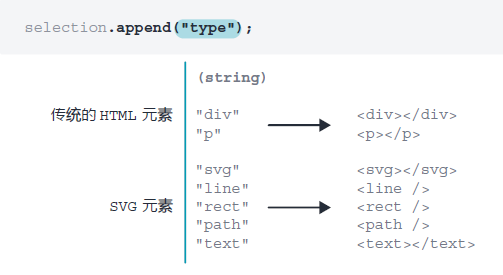
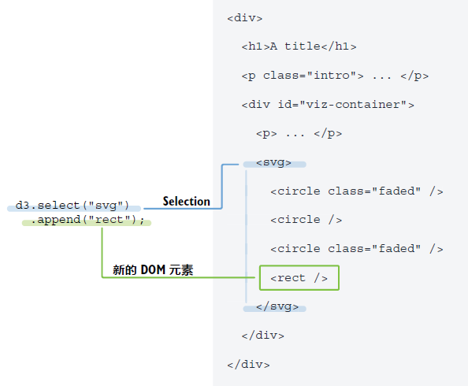
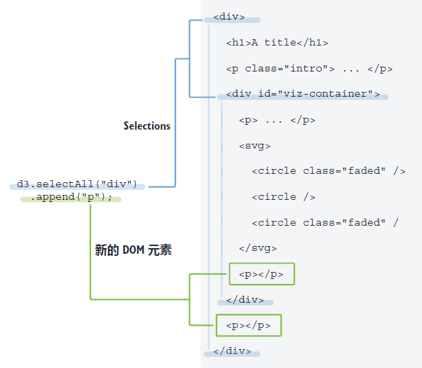
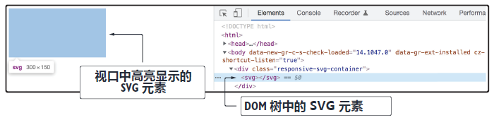

## 2.4 向选择集添加元素

选择集虽好，但如果不对其进行任何操作的话也没太多用处。D3 选择集的一个经典用法是先获取一个选择集，进而将另一个元素追加（append）到该选择集内。尽管 JavaScript 已经提供了追加元素的原生接口，但 D3 让这个操作更加简单流畅。

通过 D3 向选择集添加元素的主要方法是 `selection.append()`。`append()` 方法以新增元素的类型（type）或标签名为参数，并将新元素添加为选择集的最后一个子元素（如图 2.9 所示）：

<br/>**图 2.9 append() 方法**<br/><br/>

回到之前的虚构 DOM 树示例。如果要给 SVG 容器追加一个矩形元素，则可以先获取 SVG 容器的选择集，然后在该选择集上链式调用 `append()` 方法，并将目标节点类型（type，即 `rect` 元素）作为参数传入 `append()` 方法（如图 2.10 所示）。

```js
d3.select("svg").append("rect");
```

<br/>**图 2.10 用 selection.append() 方法将元素添加为选择集的最后一个子元素**<br/><br/>

也可以使用 `d3.selectAll("div")` 来获取包含 DOM 中每个 `div` 节点的选择集，并将段落元素分别添加到每个节点中，如图 2.11 所示：

```js
d3.selectAll("div").append("p");
```

<br/>**图 2.11 与 d3.selectAll() 连用后，append 方法将节点添加到选择集的每个元素中**<br/><br/>

接下来趁热打铁，一起来构建本章前面提到的那个条形图。

首先确认一下，在代码编辑器中打开的仍然是本章源码文件中的 `start` 文件夹，并且本地 Web 服务器正在运行（关于借助 VS Code 的 Live Server 扩展程序启动 Web 服务器的具体方法，请参考 **附录 A**）。然后打开 `index.html` 文件。注意，该文件包含一个类名为 `responsive-svg-container` 的 `div` 元素。

正如第一章所述，大多数 D3 可视化项目都是用 SVG 元素构建的，这里的条形图也不例外。为此，需要一个 SVG 容器，并将 SVG 图形放入其中。我们先来添加 SVG 元素。

Open the `main.js` file contained in the `/js` folder. Using method `d3.select()`, select the `div` with a class of `responsive-svg-container`, and add an SVG element inside this `div`. The following snippet shows how the `append()` method is chained to the selection:

打开 `/js/main.js` 文件。使用 `d3.select()` 方法选中具有 `responsive-svg-container` 类的 `div`，并在该 `div` 中添加一个 SVG 元素，如以下代码所示：

```js
d3.select(".responsive-svg-container")
  .append("svg");
```

保存 `main.js` 文件，并在浏览器中查看效果。此时视口中看不到任何变化，但如果打开浏览器检查工具（如图 2.12 所示），则会看到 SVG 元素已经被精确添加到 DOM 树中，正如我们所希望的那样！

<br/>**图 2.12 向 DOM 树添加 SVG 元素节点效果图**<br/><br/>

下一小节，我们将通过设置 `viewBox` 属性来得到一个响应式的 SVG 容器。

