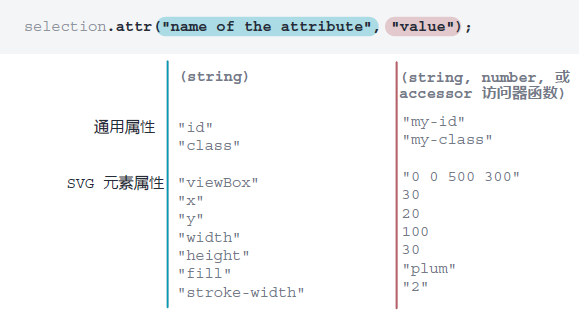
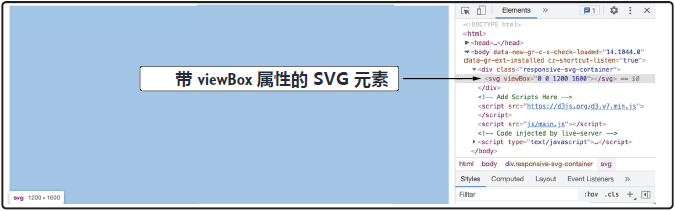
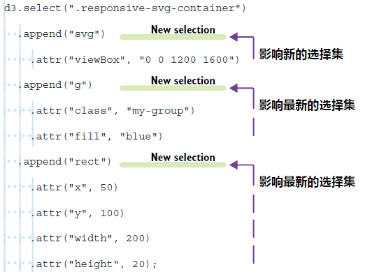
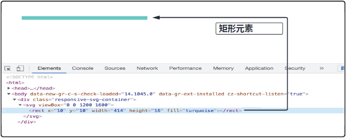

## 2.5 用 D3 设置与修改元素属性

第一章从广度上介绍了主要的 SVG 元素以及控制其位置与尺寸的属性（attribute），还提到作为一名 D3 开发者，需要在代码中设置和修改这些属性。本节就来介绍这些知识。

元素的 `attribute` 属性可以用 D3 的 `selection.attr()` 方法进行设置和修改，其中“`attr`”代表“属性（attribute）”。如图 2.13 所示，`attr()` 方法接受两个参数：第一个是属性的名称，第二个是属性的取值。该取值既可以直接设置，也可以通过访问器（accessor）函数来设置（访问器函数将在第 3 章介绍）。

<br/>**图 2.13 attr() 方法**<br/><br/>

在该条形图练习中，包裹 SVG 容器的 `div` 元素具有类名 `responsive-svg-container` 。如果打开 `/css/main.css` 文件，会看到该样式类应用了响应式 SVG 元素容器所需的所有样式（详见第一章第 1.2.2 小节）。此时容器的最大宽度 `max-width` 为 `1200px`，这也将是条形图的最大宽度。

为了让 SVG 容器在适应其容器的同时保持恒定宽高比，需要设置其 `viewBox` 属性，具体通过 `attr()` 方法来实现。如以下代码所示，传给 `attr()` 方法的第一个参数是属性名称，即 `viewBox`。注意，该名称中的字母“B”是 **大写字母**，这说明该视觉属性（presentation attributes）的名称是区分大小写的，严格遵循驼峰式命名的写法对于浏览器正确识别 `viewBox` 属性至关重要。

`attr()` 的第二个参数为 `viewBox` 属性的取值。它是一个包含四个数字的序列。前两个数字代表了 `viewBox` 的坐标系原点，位于 `(0, 0)`；最后两个数字分别表示 `viewBox` 的宽度和高度。宽度对应 `div` 容器的 `max-width` 属性，因此为 `1200px`；高度暂定为 `1600px`，后续根据需要再作调整。于是 `viewBox` 属性的取值就是 `"0 0 1200 1600"`：

```js
d3.select(".responsive-svg-container")
  .append("svg")
    .attr("viewBox", "0 0 1200 1600");
```

完成 `viewBox` 属性的设置后，保存 `main.js`，并在浏览器检查工具中查看元素节点，会看到 `SVG` 元素已添加了 `viewBox` 属性，如图 2.14 所示。此外，如果将浏览器的视口缩小，`SVG` 元素将在保持其宽高比 `1200:1600` 不变的同时自动适应视口的变化：

<br/>**图 2.14 带 viewBox 属性的 SVG 元素**<br/><br/>

将最新的代码结果存到一个名为 `svg` 的 JavaScript 常量中以备后用：

```js
const svg = d3.select(".responsive-svg-container")
  .append("svg")
    .attr("viewBox", "0 0 1200 1600");
```

注意：每次使用 `.append()` 方法向选择集添加新元素时，都会更改选择集返回的元素。例如，当再次使用常量 `svg` 时，它不会返回带有样式类 `responsive-svg-container` 的 `div` 元素，而是返回新加到里面的 `SVG` 容器。

> [!tip]
>
> **D3 缩进约定**
>
> 继续后面的学习之前，有必要介绍一下 D3 缩进约定。在最后一段代码中，您可能已经注意到了，每个链式调用的方法都是另起一行进行书写。这样做有助于提高可读性，尤其是当两个或三个以上的方法链合在一起使用时。您可能还注意到 `append()` 方法缩进了两个空格，而 `attr()` 方法却缩进了四个。根据 D3 的缩进约定，每引入一个嵌套级别都要增加两个空格的缩进量。
>
> 每次我们向 D3 选择集追加新元素时，都会更新选择集所指定的 DOM 元素。在设置新增元素的属性和样式时，适当的缩进可以帮助我们知晓这些属性和样式都应用在了哪个选择集上。
>
> <br/>**D3 的缩进约定示意图**<br/><br/>
>
> 缩进约定在需要依次添加多个元素时特别方便。假设我们在新增 SVG 元素并设置其 `viewBox` 属性后，需要将一个类名为 `my-group` 的分组元素 `g` 添加到 SVG 容器中，然后再将一个矩形元素添加到该分组元素上，并对矩形元素设置相关属性。如上图所示，实现既定效果需要链式调用多个方法。不过好在有缩进约定，这些链式操作阅读起来很轻松，一眼就能看到每个属性都应用在了哪个选择集或元素上。

条形图（如本例所示）是由众多 SVG 矩形组成的，而这些矩形又是用 `rect` 元素创建的。为了练习选择集和 `attr()` 方法，接下来将向条形图添加一个矩形，用来表示此次调查中以 `D3.js` 为工具的数据可视化从业者人数。如果打开 `/data/data.csv` 文件，会看到有 414 名从业者坚定使用 D3。

回到 `main.js` 文件，首先调用常量 `svg` ，它会返回 SVG 容器。然后在 SVG 容器内添加一个 `rect` 元素。保存并确认该 `rect` 元素已添加成功：

```js
const svg = d3.select(".responsive-svg-container")
  .append("svg")
    .attr("viewBox", "0 0 1200 1600");

svg
  .append("rect");
```

`rect` 矩形元素确实在 DOM 树中，但由于尚未设置其必需属性，因此屏幕上还看不到它。显示 SVG 矩形需要设置四个属性（可参考第一章第 1.2.2 节复习相关概念）。`x` 属性和 `y` 属性决定了该矩形相对于左上角的位置，本例中令其为 `(10, 10)`。矩形的宽度与选择 D3 为工具的从业者数量相对应，为 414；高度则可以是任意数字，本例设为 16。将 414 和 16 分别设为属性 `width` 和 `height` 的值，就能得到一个宽 `414px`、高 `16px` 的矩形，具体设置如下：

```js
svg
  .append("rect")
    .attr("x", 10)
    .attr("y", 10)
    .attr("width", 414)
    .attr("height", 16);
```

最后，将矩形的 `fill` 属性设置为 CSS 颜色名称 `"turquoise"`，并以字符串传入 `attr()` 方法：

```js
svg
  .append("rect")
    .attr("x", 10)
    .attr("y", 10)
    .attr("width", 414)
    .attr("height", 16)
    .attr("fill", "turquoise");
```

注意这里用到的缩进约定：添加矩形时创建的新选择集使用的是两个空格的缩进；而 `attr()` 方法则是四个。这样，就能明显看出这些属性设置会对 `rect` 元素生效。保存项目后，就能在浏览器中看到该矩形，如图 2.15 所示：

<br/>**图 2.15 添加到 SVG 容器的矩形元素**<br/><br/>

