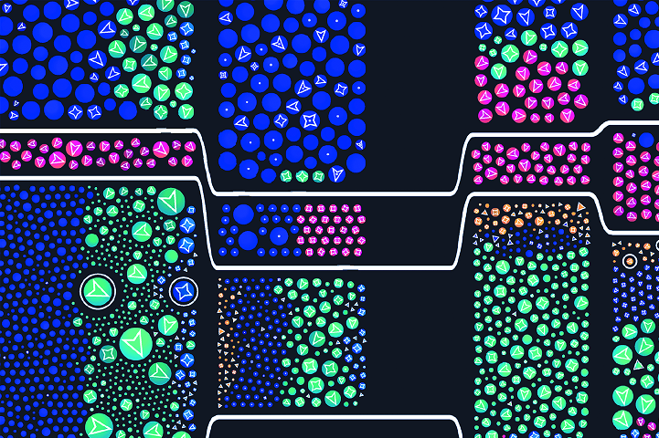

## 2.6 用 D3 设置与修改元素样式

为了让可视化元素拥有想要的外观和感觉，需要为其设置样式。使用传统的 CSS 样式表就是一种不错的方案，通常也是考虑后期可维护性时的优先方案。但有时直接使用 D3 来设置与修改样式属性同样很方便，尤其是在样式随数据动态变化的时候。

D3 通过 `selection.style()` 方法设置与修改元素的样式属性（attribute）。该方法需要两个参数：样式属性的名称及其属性值，如图 2.16 所示：

<br/>**图 2.16 style() 方法**<br/><br/>

回到条形图示例，在 `main.js` 中，在 SVG 容器选择集上链式调用 `style()` 方法，即赋值到常量 `svg` 上的方法。如以下代码所示，使用 `style()` 方法为 SVG 容器应用边框样式，可以赋值为任何想要的属性值。本例中使用简写样式，设置一个宽度 `1px` 的黑色边框：

```js
const svg = d3.select(".responsive-svg-container")
  .append("svg")
    .attr("viewBox", "0 0 1200 1600")
    .style("border", "1px solid black");
```

SVG 容器四周的边框有助于直观了解当前所处的空间区域，并理解 `style()` 方法的工作原理。

保存项目并在浏览器中查看效果。从 DOM 检查工具中找到 SVG 容器，可以看到 `border` 属性（property）被添加到了 `style` 属性（attribute）中，如图 2.17 所示。也就是说 `style()` 方法注入了所谓的行内样式。

<br/>**图 2.17 使用 style() 方法生效的边框样式**<br/><br/>

在处理 SVG 元素时，有些样式可以通过 `attribute` 属性或行内样式来生效，例如 `fill` 和 `stroke` 属性（properties）。至于应该使用 `attr()` 还是 `style()` 方法来设置样式并没有严格的规定，但一些开发人员更愿意保持一致，始终使用 CSS 样式表样式（或行内样式）来设置样式，而不是通过元素的 `attribute` 属性。这也许是一个不错的做法，尤其是在我们希望分开创建形状的代码与设置外观的代码、使得层叠样式更易于管理的时候。本书将使用 `attr()` 和 `style()` 方法以及外部 CSS 文件来设置 SVG 元素的视觉属性。

例如，在 `main.js` 中，在矩形选择集上调用 `style()` 方法，并对该矩形设置与之前不同的填充色 `"plum"`，如以下代码所示：

```js
svg
  .append("rect")
    .attr("x", 10)
    .attr("y", 10)
    .attr("width", 414)
    .attr("height", 16)
    .attr("fill", "turquoise")
    .style("fill", "plum");
```

然后打开 `main.css` 文件，为该矩形添加第三个 `fill` 属性（property），令其颜色值为 `"orange"`：

```css
rect {
  fill: orange;
}
```

此时该矩形拥有三种不同的填充样式：一个是通过元素 `attribute` 属性设置的青绿色 `"turquoise"`；一个是通过行内样式应用设置的深紫色 `"plum"`；最后是通过外部 CSS 样式设置的橙黄色 `"orange"`。当然，实际工作不会这样设置，本例仅供演示。

保存项目，注意观察借助 `style` 属性设置的 `fill` 样式是如何覆盖另两种样式的。在图 2.18 中，您可以看到样式中的层叠规则是如何生效的：行内样式覆盖了其余样式，其次是外部 CSS 样式表设置的样式，最后是通过 `attribute` 属性设置的 `fill` 样式。牢记这一规则将有助于制定适合自己习惯、团队和项目的策略，同时也在遇到下面的问题时摆脱百思不得其解的窘境：为什么这种样式在屏幕上可见、而另一种偏偏就不可见呢？

<br/>**图 2.18 填充样式 fill 同时在 attribute 属性、外部样式表及行内样式应用的效果对比**<br/><br/>

至此，我们已经知道如何获取选择集、如何在 DOM 中添加元素、以及如何给这些元素设置方位与样式。但是，真要像示例这样逐一添加条形图的各个矩形条，效率肯定高不了。等下一章学了数据绑定的相关知识后，就能一次性添加所有的矩形条了。在此之前，需要删除 `main.js` 和 `main.css` 中与矩形相关的代码，让 `main.js` 文件只包含如下所示的代码。第三章将从这里开始构建条形图：

**代码清单 2.2 本章结束时 main.js 的代码内容**

```js
const svg = d3.select(".responsive-svg-container")
  .append("svg")
    .attr("viewBox", "0 0 1200 1600")
    .style("border", "1px solid black");
```


> ### **人物专访：纳迪埃·布雷默（Nadieh Bremer）**
>
> **纳迪埃·布雷默** 是一位数据可视化艺术家。
>
> **【问】能否介绍一下您的背景，以及您是如何进入数据可视化领域的？**
>
> **【Nadieh】** 我毕业时是一名天文学家，之后开始从事数据科学方面的工作。然而，几年后，我意识到自己缺少了工作中富有创意的一面。当我看到别人称他们自己为“数据可视化专家”时，我立刻意识到这正是我可以兼顾的地方：在调查数据、探寻故事、玩转数学的同时发挥自己的创造力。
>
> **【问】在没有 Web 开发背景的情况下，是什么促使您学习 D3？遇到的主要挑战是什么，又是如何克服的呢？**
>
> **【Nadieh】** 我参加了一次 D3.js 研讨会（2013 年），会上人们展示了包括交互在内的 D3 的各种可能性。尤其是在当时，我从未见过这样的新事物，我知道自己也想创建出这样的交互式数据可视化效果。于是便买了一本斯科特·穆雷（Scott Murray）写的书《网络交互式数据可视化》（*Interactive Data Visualization for the Web*，O'Reilly，2017 年），并从那本书开始了 D3 的学习。当时面临的主要挑战是，`HTML` / `CSS` / `JavaScript` 对我来说都是全新的（尽管我知道如何用 R 语言编程）。因此除了 D3 外，我还必须学习这些语言；而且，由于我的无知，我都不知道 D3 的独特之处在哪儿，什么又叫原生 JavaScript（vanilla JavaScript），以致于常常会被卡在一些细枝末节上，不知道如何从网上搜索答案。总的来说，凭借极致的毅力，并确信当时所从事的是自己真正热衷的项目，才让我最终坚持了下来。不知不觉地，我对这些知识的理解也越来越透彻。我花了整整一年的时间才理解了 D3 的“进入-更新-退出”（enter-update-exit）流程，哈哈。
>
> **【问】除了 D3，您还使用其他可视化工具吗？D3 在您当前的数据可视化工作流程中处于什么位置？我看到您在项目中经常用到 R 语言。**
>
> **【Nadieh】** D3 确实是我的主要工具。我 90% 的数据可视化项目都会在开始制作最终视觉效果时加载 D3。此外，我还会使用 JavaScript 和其他一些库，如用于处理颜色的 `Chroma.js` 以及用于处理噪声函数（noise functions）的 `SimplexNoise`。我总是先用 R 语言进行数据分析和数据准备，创建大量简单的图表，以便对这些数据产生独到而深入的理解。但我从不把这些图表作为最终的视觉效果。
>
> - Nadieh 精品项目《太空大战》（[www.visualcinnamon.com/portfolio/space-wars/](https://www.visualcinnamon.com/portfolio/space-wars/)）
>
> <br/>**发表在《科学美国人》杂志的纳迪埃·布雷默的作品《太空卫星的可视化效果》（Visualization of satellites in space)**<br/><br/>
>
> **【问】再来聊聊您为 2020 年 11 月版的《科学美国人》创作的《太空大战》这部作品吧？**
>
> **【Nadieh】** 《太空大战》可视化展示了（当时）仍在太空中活动的所有卫星情况，主要目的是为了显示谁拥有这些卫星、以及可以在哪些轨道上找到它们。通过将每颗卫星视为单独的小圆圈，再按国家和轨道进行分组，可以非常直观地展示卫星本身的详细情况，如重量、年限、所属分类等等。
>
> **【问】能再介绍一下这个项目的创作过程吗？**
>
> **【Nadieh】** 幸好数据是由一位卫星专家收集的，所以我不需要做任何数据处理，只需要进行一些数据分析，就能了解我所掌握的情况。我在一个小册子上记录了一些想法。我知道要在国家和轨道分类上做文章。不过，关于每颗卫星的元数据实在太多，只能分别展示每颗卫星。也不知道从哪里冒出来的想法，但在某个时刻，我绘制了一幅用圆圈表示卫星的树形地图。当最初的想法逐渐明晰起来后，剩下的工作就分成了两个部分：一个是技术部分——如何在树形地图中使用圆圈；另一个是如何让整体设计看起来更美观。一开始效果看起来很糟糕，但后来我花了一些时间从最喜欢的科幻电影中寻找色彩灵感，才找到真正想要的视觉效果。
>
> **【问】在外人看来，您似乎是将 D3 的树形图的绘制手法与力导向图的布局相结合来生成这种可视化效果的，是这样吗？将不同模块的方法有机结合来创建前所未见的布局效果，这也是我最喜欢 D3 的原因之一。看了您在 Skillshare 平台的主讲课程《数据可视化：通过自定义图表获得美感与影响力》（Data Visualization: Customizing Charts for Beauty & Impact），里面也建议大家组合不同类型的图表。**
>
> **【Nadieh】** 没错，就是这样。我利用树形地图的方法来获取每组卫星的预定区域（用 x、y 坐标和宽度、高度来描述）。然后，在每个矩形区域内用力导向图的布局来进行模拟，以便对所有的圆进行定位，确保它们不会相互重叠。想要知道树状地图的每个方框的合理大小，需要用每个圆的表面积（与卫星重量成比例）与一个转换系数相加，有时还需要手动定义一些“神秘数值”（译注：magic number，意指程序中出现的没有任何注解或标明出处的数字），要么这儿改改，要么那儿调调。
>
> 你说得很对，能够创造性地使用 D3 也是我最喜欢它的原因之一！
>
> <br/>**代表卫星的圆圈根据树状地图中的控制区域和轨道类型分组，再利用 D3 的力导向布局计算它们的确切位置**<br/><br/>
>
> **【问】关于用 D3 为纸媒等印刷媒介生成静态可视化作品，您能再分享一下这方面的看法吗？我认为我们在这类问题上的讨论还远远不够！**
>
> **【Nadieh】** 我喜欢创建静态视觉效果，在创作过程中我也几乎一直在用 `D3.js`。对于印刷版视觉效果的创作，有一点很重要，那就是或许应该用 SVG 来完成创作，而不是使用 HTML5 的 canvas 画布。这样，杂志编辑们拿在手里的就是一个可以自由缩放大小的矢量文件。此外，字体和标题这些内容也可以进行调整（比如更换字体）和润色（比如修改文案措辞）。如果将浏览器中的视觉效果带入矢量编辑器，那么绝大部分样式都会被复制过来（我发现 `Illustrator` 在复制 CSS 样式与设置方面做得最好）。
>
> **【问】您与 Shirley Wu 合作完成的项目和《数据草图》一书（Data Sketches，由 A K Peters 出版社于 2021 年出版），启发了我们中的许多人，让我们在数据的处理方面更有创造力。您对初涉该领域的新人有什么建议吗？**
>
> **【Nadieh】** 听到这本书能带给大家启发和灵感，我感到无比欣慰。回想起来还有些奇怪，当初我和 Shirley 开始编著《数据草图》时，曾一度以为它可能是个只有我们和一些亲密的朋友才会去欣赏的愚蠢项目（silly project）呢。
>
> 至于建议，主要有两方面。一个是创作（to create）。尽可能多地去创作可视化作品。每创作一个新的作品，你都会学到新的东西（有时甚至是在不知不觉中）；遇到新的问题或陷阱（pitfalls），要想出新的独具创意的解决方案来克服它们。当我回顾自己在这条道路上的旅程以及沿途创作的可视化作品时，都会清楚地看到自己是如何在编码和创意方面变得更加自信。这些经历和收获又进一步对我的创作产生积极的影响。
>
> 第二个建议，是尝试钻研你真正感兴趣的数据和主题，即便这些数据不是现成的，而是需要（手工）收集的。对自己真正感兴趣的主题进行数据分析，即使遇到技术上或设计上的困难，也会更容易坚持下去。这一点你也可以在《数据草图》一书中得到印证。在数据方面，我们从来不去选那条好走的路，而是一直尝试让兴趣来引导我们。几乎在所有情况下，数据都会不知不觉地出现在某个地方。


