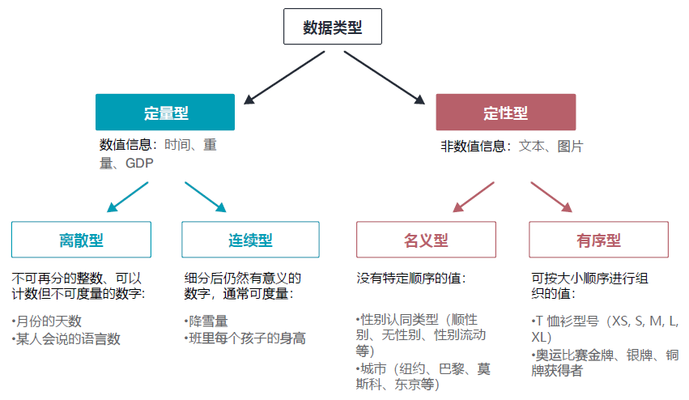

### 3.1.2 数据类型

构建数据可视化主要用到两类数据类型：定量数据和定性数据。定量数据即数字信息，例如时间、重量或国家的国内生产总值（GDP）。如图 3.4 所示，定量数据可以是离散的，也可以是连续的。离散型数据由不可再分的整数组成。例如一家公司可以有 16 名员工，但不能有 16.3 名员工。另一方面，连续型数据可以拆分为更小的单元且仍然有意义，其典型代表如温度。我们既可以说今天是 17℃ ，也可以更精确地测得实际气温为 16.8℃ 。根据经验，连续型数据可以用仪器测量，而离散型数据可以计数，但不必测量。

再来看定性型数据。定性型数据由非数字信息（例如文本）组成。它可以是名义值或序数值。名义值没有特定的顺序，例如性别认同标签或城市名称；而序数值可以按数量大小进行分类。以 T 恤衫尺码为例，人们通常按尺码升序排列（XS、S、M、L、XL）。

数据类型会直接影响用于传递数据的可视化类型：折线图非常适合连续型数据，但不适用于离散值；名义值可以表示一组分类颜色，而顺序值可能会选择连续或发散调色板（diverging color palette）。

选择 D3 比例尺时还得牢记数据类型。线性比例尺用于定量型数据，而对定性型数据 D3 也提供了特定的比例尺。本章 3.4 小节会详细介绍比例尺。

**图 3.4 数据类型的分类**