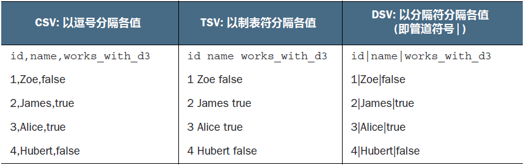
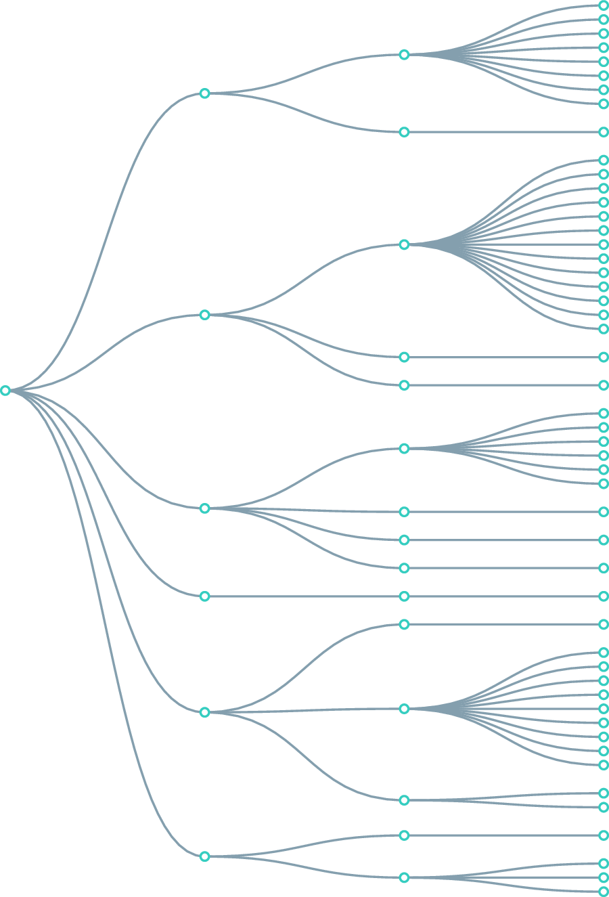
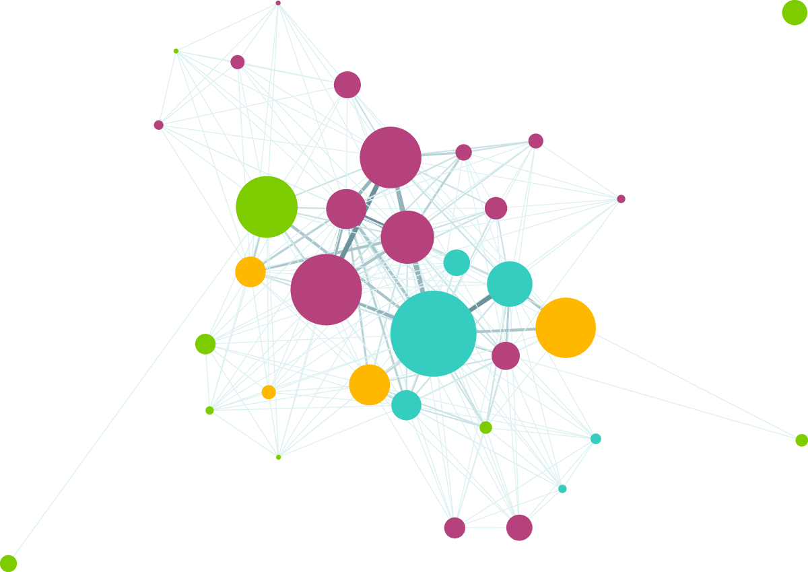
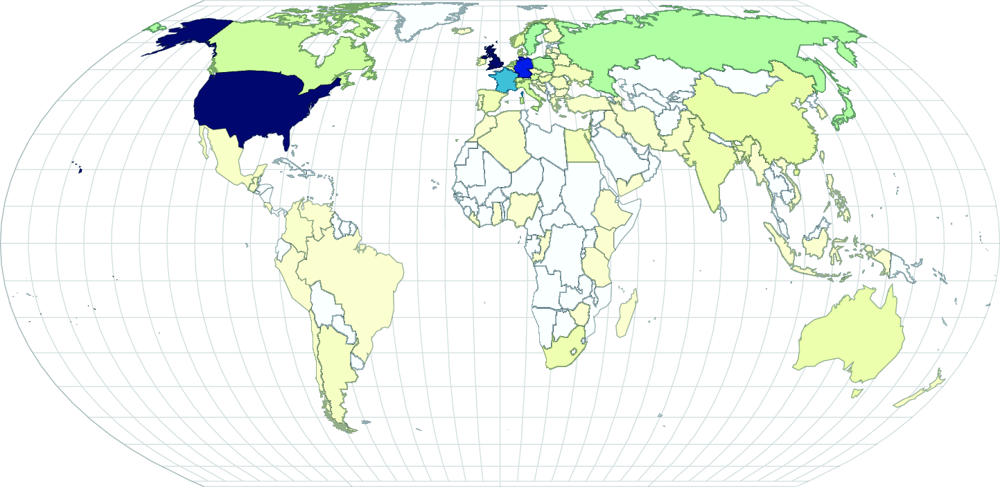

### 3.1.3 数据的格式与结构

目的不同，数据格式化的方式也不尽相同。尽管如此，常见数据往往可归入以下结构：表格型数据、JavaScript 对象（JSON）、嵌套类数据、网络型、地理数据以及原始数据。这些结构并不相互排斥。

#### 1 表格型数据（TABULAR）

表格型数据以多列多行形式呈现，例如电子表格或数据库表格。表格型数据常以特定字符的分隔符（delimiter）进行分隔，分隔符决定了数据的格式。最常见的表格型数据格式是逗号分隔值（CSV）文件，其分隔符为逗号。此外还有制表符分隔值（TSV）文件以及使用特定分隔符（如管道符或分号）的分隔值（即 Delimiter-Separated Values，缩写为 DSV）文件。

例如，从第 1 章的虚拟员工数据集中获取一个数据样本。如果分别将该数据保存为 CSV、TSV 或 DSV 格式文件，则其值将分别用逗号、制表符或其他分隔符进行分隔，如表 3.1 所示。在表格型数据集中，第一行通常为列标题，每行数据则在其后新行中列出。

**表 3.1 以 CSV、TSV 和 DSV 格式表示的分隔数据**



D3 提供了三种不同的函数来加载表格型数据： `d3.csv()` 、 `d3.tsv()` 和 `d3.dsv()`。它们唯一的区别在于：`d3.csv()` 针对逗号分隔文件；`d3.tsv()` 则针对制表符分隔文件；而 `d3.dsv()` 可以指定分隔符。本章及全书用到的多为 `d3.csv()`。

#### 2 JSON 数据（JSON）

JavaScript 对象表示法（JavaScript Object Notation，即 JSON）文件是存储简单数据结构的常用方法。开发人员经常使用它们，尤其是从 API 接口获取信息时，这些站点通常仅提供 JSON 格式的数据。

如果以 JSON 格式而非表格形式存储表 3.1 中的数据，则数据将形如以下对象数组。尽管结构上不是最紧凑的，但对象表示法往往具有显著优点。利用第 1 章介绍过的 JavaScript 点表示法，可以轻松访问数据的键值对（key-value pairs）：

```json
[
  {
    id": 1,
    "name": "Zoe",
    "position": "Data analyst",
    "works_with_d3": false
  },
  {
    "id": 2,
    "name": "James",
    "position": "Frontend developer",
    "works_with_d3": true
  },
  {
    "id": 3,
    "name": "Alice",
    "position": "Fullstack developer",
    "works_with_d3": true
  },
  {
    "id": 4,
    "name": "Hubert",
    "position": "Designer",
    "works_with_d3": false
  }
]
```

D3 使用函数 `d3.json()` 来加载 JSON 格式文件。但即使加载其他类型的表格数据（如 CSV 格式）时，D3 也会将数据转换为对象数组，最终得到类似 JSON 的数据结构。


#### 3 嵌套型数据（NESTED）



**图 3.5 嵌套型数据展示了对象的父/子关系，通常每个对象都有一个子对象数组，并以多种形式表示，例如该树状图。注意，每个对象只能有一个父对象**

嵌套型数据（对象以递归方式作为该对象的子对象）很常见。D3 中许多最直观的布局都是基于嵌套型数据的。这些数据可以表示为树状，如图 3.5 所示，也可以封装在圆圈或方框中。提取嵌套型数据集尽管需要一些额外的处理，但较之数据的灵活性值，这样的努力是值得付出的。本书第 11 章将详细介绍层次型数据。


#### 4 网络型数据（NETWORK）

网络无处不在。无论是社交网络流、交通网络还是流程图的原始输出，网络都是理解复杂系统的强有力工具。网络型数据通常表示为节点链路图，如图 3.6 所示。与地理数据一样，网络型数据也有许多制定标准，但本书重点关注的是节点与边的列表。您还可以借助免费的网络分析工具如 Gephi（可从 [https://gephi.org](https://gephi.org/) 获取）轻松探索更多网络型数据。本书第 12 章介绍网络数据可视化时，将进一步探究网络型数据及其标准。



**图 3.6 网络型数据由对象及其之间的连接构成。对象通常称为节点（nodes）或顶点（vertices），连接则称为边（edges）或连接（links）。网络图通常用力导向算法（force-directed algorithms）实现，本例中该算法通过将连接的节点拉向彼此的方式排列网络**


#### 5 地理型数据（GEOGRAPHIC）

地理型数据以点或形状的形式指代方位，用于创建当下网络上看到的各种在线地图，例图 3.7 所示的世界地图以及 `Observable` 作品集中的地图（详见 [https://observablehq.com/ @d3/gallery#maps](https://observablehq.com/@d3/gallery#maps)）。网络地图令人惊异的得以普及，意味着您可以访问到任意项目可公开访问的海量地理数据信息。地理型数据有一些执行标准，但本书重点关注的仅 `GeoJSON` 和 `TopoJSON` 两种。尽管地理型数据多种多样，但 PostGIS ( [https://postgis.net](https://postgis.net/) ) 等现有地理信息系统（GIS）工具允许开发者将数据转换为 GIS 格式，以便随时交付到网上。本书第 13 章将深入研究地理型数据。



**图3.7 地理型数据存储对象的空间几何形状信息。上图中的每个国家 / 地区都代表一个单独的特征集，并包含其形状描述的值数组信息。地理型数据还可以由点（如城市）或线（如道路）构成**


#### 6 原始数据（RAW）

在探索数据可视化的过程中，往往会发现一切都是数据：图像、文本块和网站的标记……尽管通常使用颜色和大小编码后的形状来表示数据，但在某些情况下，使用线性叙述文本、图像或视频或许是更有效的可视化方式。如果您开发出的应用程序需要受众理解复杂的系统，但又坚持认为文本及图像的操作在某种程度上与基于数字或分类数据的形状展示是分开的，那就很可能丧失了部分交流能力。处理文本和图像时使用的布局和格式化工具（通常与旧的 Web 发布模式相关）在 D3 中也是存在的。