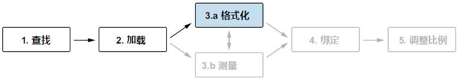
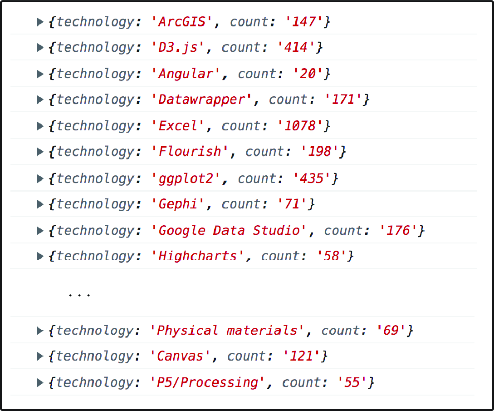

### 3.2.2 格式化数据 Formatting a dataset

本节介绍 D3 处理数据格式的具体方法，对应工作流中的第三步，如图 3.9 所示：



**图 3.9 数据工作流的第三步，从数据格式化开始，以便在构建可视化时使用**

`d3.csv()` 中的回调函数，又称为 **行转换函数（row conversion function）**，能够逐行访问数据。在下面的代码中，`d3.csv()` 的第一个参数为数据路径，第二个参数即为回调函数。该函数将访问到的数据输出到控制台显示。复制本段代码到 `main.js` 并保存项目：

```js
const svg = d3.select(".responsive-svg-container")
  .append("svg")
    .attr("viewBox", "0 0 1200 1600")
    .style("border", "1px solid black");

d3.csv("../data/data.csv", d => {
  console.log(d);
});
```

打开浏览器检查工具，转到控制台（即 Console）标签，将会看到如图 3.10 所示的输出结果。数据逐行记录，每一行都是一个包含 `technology` 和 `count` 的 `JavaScript` 对象：



**图 3.10 获取到数据后，由 d3.csv() 回调函数输出到控制台的部分数据显示情况**

```js
d3.csv("../data/data.csv", d => {
  return {
    technology: d.technology,
    count: +d.count
  };
});
```

这里的关键在于，回调函数中返回的这些键值对（key-value pairs），是数据集加载完毕后唯一可以访问的内容。该策略可以有效过滤原始数据中的无关字段列。但如果需要保留的列过多，逐一返回目标键值对可能稍显冗余。这时可能需要跳过回调函数中的处理逻辑，待 D3 返回完整数据集后再统一进行格式化。完整数据集的具体访问方法将在下一节进行介绍。
