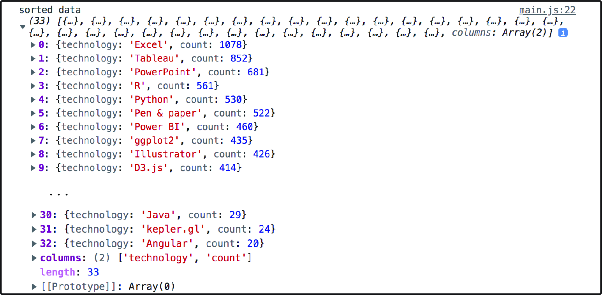

### 3.2.3 测量数据集  Measuring a dataset

D3 数据工作流的第三步还可以包含一个可选操作，即数据测量，如图 3.11 所示。尽管逐行读取数据很实用，但有时也需要访问整个数据集。这就要用到 `JavaScript` 的期约接口 `Promise` 了。`Promise` 是异步操作的结果，并以对象的形式存在。例如函数 `d3.csv()` 返回的对象。读取 Promise 结果的一个简单方法是调用其 `then()` 方法。


**图 3.11 在第三步的第二小步，可以测量并探索数据**

在以下代码段中，工具函数 `d3.csv()` 链式调用了 `then()` 方法。一旦数据加载完毕，Promise 即转为 **兑现（fulfilled）** 状态，完整数据集将在 `then()` 方法中的回调函数中备用。按如下代码将该数据集一次性输出到控制台，并保存项目：

```js
d3.csv("../data/data.csv", d => {
  return {
    technology: d.technology,
    count: +d.count
  };
}).then(data => {
  console.log(data);
});
```

在控制台中，您会看到一个被转换为对象数组的完整数据集，其中的每个对象对应 CSV 原始数据集中的某一行。此时 D3 让该数据集变为可迭代对象，对于后续可视化开发非常有用。如图 3.12 所示，还可以确认计数值已正确转为数字形式。查看数组最后一项，还能看到经过 D3 处理后的原始 CSV 数据的列标题数组。尽管我们的条形图小练习暂不需要，但它偶尔也可以派上用场。


**图 3.12 完整的数据集以对象数组的形式记录在控制台中**

在数据工作流的第 `3.a` 步骤中，我们已经完成了数据格式化的工作，此时仍然可以利用 D3 来探索并测量获取到的数据。测量数据的特定维度有助于提前做好相关准备工作。

虽然从何处开始探索数据并没有严格的规范，但从数据集 Promise 的 `then()` 方法切入不失为一个好思路。首先要考察数据集包含了多少种技术。这可以通过数组的 `length` 属性直接查看。打印到控制台，将得到结果 `33`。也就是说，条形图将包含 33 个矩形元素：

```js
d3.csv("../data/data.csv", d => {
  ...
}).then(data => {
  console.log(data.length);   // => 33（数据集包含的总行数）
});
```

此外，我们还想知道哪种技术最受欢迎，以及有多少从业人员在定期使用它；最热门的有了，最冷门的情况又如何？这些指标都可以通过 `d3.max()` 和 `d3.min()` 函数获得。如以下代码段所示，这些函数都接受两个参数：第一个参数是包含这些极值的可迭代对象（即数据集本身），由 `Promise` 提供；第二个参数是一个 **访问器函数（accessor function）**，用于指定参与比较的健（本例中即为 `count`）。

若要在控制台中分别输出最大值和最小值，同样可利用 `Promise` 的 `then()` 方法，分别得到结果 `1078` 和 `20`：

```js
d3.max(data, d => d.count)      // => 1078
d3.min(data, d => d.count)      // => 20
d3.extent(data, d => d.count)   // => [20, 1078]
```

> **注意**
>
> 还可以使用 `d3.extent()` 方法，它接受相同的参数并返回一个包含最小值和最大值的结果数组。

考察数据中的最大值与最小值有助于预判图表中条形区域的长度，并能预估最高值和最低值之间的差异对比是否易于在屏幕上渲染。

条形图中的数据常按降序排列，这样可读性更强，观众看了也能一目了然，明确哪些技术使用频率较高、哪些较低。`JavaScript` 的原生方法 `sort()` 可以轻松实现排序。它接受一个 **比较函数（compare function）** 作参数，如以下代码所示。该函数用于比较两个技术的 `count` 值，参数 `a` 和参数 `b` 分别表示参与比较的两个技术对象。若 `b` 中的 `count` 值大于 `a` 中的，则 `b` 应该排在 `a` 的前面，以此类推：

```js
data.sort((a, b) => b.count - a.count);
```

排序逻辑可以放到 `then()` 方法内。如果打印到控制台，会看到 `Excel` 位于技术列表的首位，计数为 `1078`；其次是 `Tableau`，计数值 `852`；`Angular` 则以 `20` 的最小计数值垫底，如图 3.13 所示。

此外，`d3-array` 模块（详见 [https://d3js.org/d3-array](https://d3js.org/d3-array "点击跳转到官方 d3-array 模块")）还包含大量用来测量及转换数据的实用方法，本书后续将选取一部分进行介绍。但 `d3.max()`、`d3.min()` 与 `d3.extent()` 函数应该是这当中最为常用的。



**图 3.13 输出到控制台并按降序排列的数据集**

完成了数据的加载、转换与测量工作，接下来通常需要将数据集传递给另一个函数进行处理。该函数负责可视化效果的构建。如以下代码段所示，可以看到此时 `main.js` 中的内容；注意观察在 `then()` 方法的末尾，数据是怎样传递给 `createViz()` 函数的。该函数的实现逻辑将在下一节进行介绍。

**代码清单 3.2 数据的加载、转换与测量逻辑（main.js）**

```js
const svg = d3.select(".responsive-svg-container")
  .append("svg")  // 添加一个 SVG 容器
    .attr("viewBox", "0 0 1200 1600")     
    .style("border", "1px solid black");  

d3.csv("../data/data.csv", d => { // 加载数据集
  // 对数据进行格式化处理
  return {
    technology: d.technology,  
    count: +d.count            
  };
}).then(data => {
  // 对数据集进行测量
  console.log(data.length); // => 33
  console.log(d3.max(data, d => d.count)); // => 1078         
  console.log(d3.min(data, d => d.count)); // => 20          
  console.log(d3.extent(data, d => d.count)); // => [20, 1078]

  // 让数据集按降序排列
  data.sort((a, b) => b.count - a.count);

  // 将数据集传给另一个函数作进一步处理
  createViz(data);
});

// 构建条形图的处理函数
const createViz = (data) => {};
```

在结束本节内容前，您可以参照图 3.14 中的内容，简要回顾一下前面学过的数据加载、行转换以及 Promise 等相关概念。总结归纳如下：

1. 加载数据要用到 D3 的数据获取函数（fetch function），如 `d3.csv()`。
2. 数据的格式化是在行转换函数中进行的。
3. 数据加载完毕后，可以通过链式调用 `then()` 方法来访问整个数据集。该方法也是探究数据及执行其他数据操纵的理想场所。
4. 将最终的数据传递给另一个函数，由该函数负责具体的可视化构建。


**图 3.14 D3 中数据加载、转换及测量的实现方法与位置示意图**