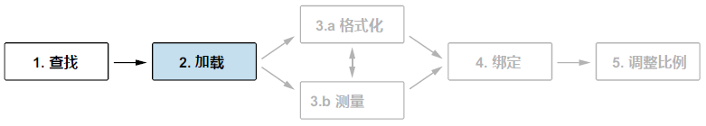

## 3.2 数据准备 Preparing data

有了数据集，下一步就是用 D3 将其 **加载** 到项目中，如图 3.8 中的步骤 2 所示。然后就是确保数据按正确的格式进行处理，其间也可能需要对数据进行多方位的测量。本节介绍的 D3 方法都是为了完成上述这些准备工作的，并为示例中的条形图提供有效数据。

**图 3.8 D3 数据工作流的第二步即利用 D3 的数据获取方法，将数据集加载到项目中**

