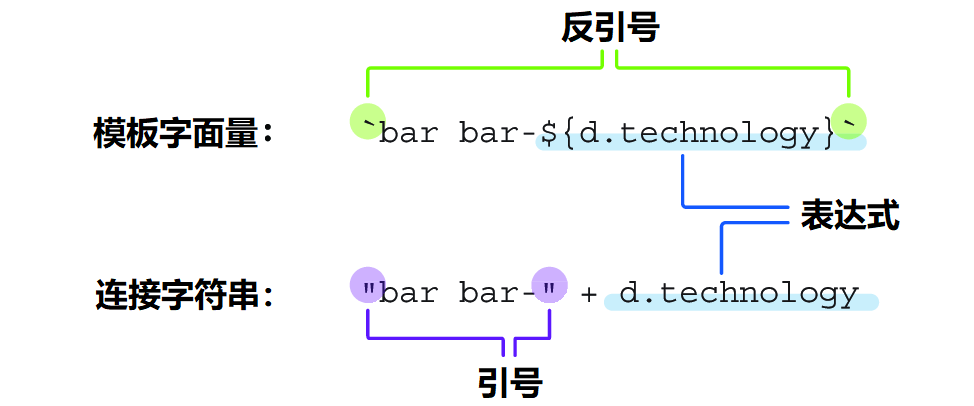
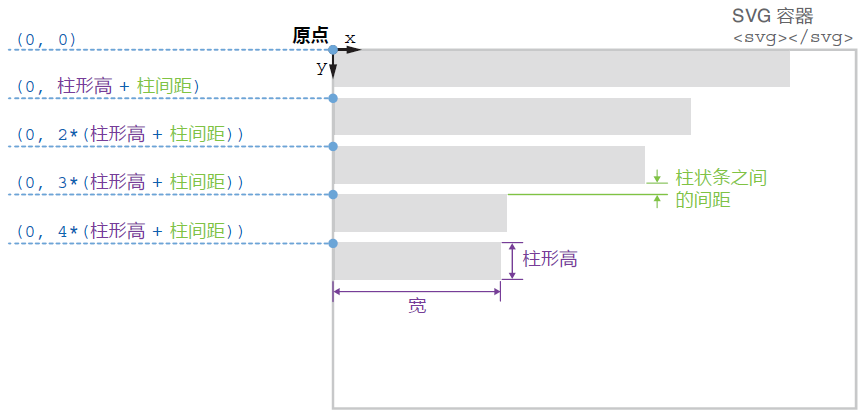
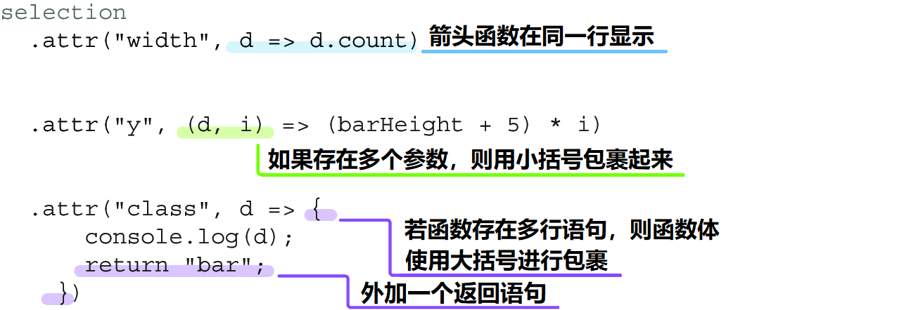

### 3.3.1 利用数据给 DOM 属性动态赋值 Setting DOM attributes dynamically with data

之前讲过，D3 会将加载的 CSV 文件转换成一个可迭代的对象数组结构。利用这个数据结构，就能将其中的每个对象绑定到对应的矩形元素上。这些被绑定的数据不仅控制着新增矩形元素的个数，还可以在执行元素操作时供访问器函数（accessor functions）及其他内置函数直接访问。

下面结合本章的条形图示例来进行演示。在刚才的数据绑定代码后面，再次链式调用一个 `attr()` 方法，目的是给每个矩形元素指定一个 `class` 属性（attribute）。但这里传入第二个参数的不是简单的属性值，而是一个访问器函数，如下列代码所示。

可以看到，这里的访问器函数与其他 JavaScript 函数没什么不同。它返回一个样式类的值，也就是代码中的 `bar`，或者任何需要赋给矩形元素的有效类名：

```js
svg
  .selectAll("rect")
  .data(data)
  .join("rect")
    .attr("class", d => {
      console.log(d);
      return `bar bar-${d.technology}`;
    })
```

该访问器函数接受一个参数 `d`，表示各矩形所绑定的数据项 ***datum***。如果把 `d` 打印到控制台，就会看到包含一门技术及其总票数的每一个对象元素依次输出，就像直接在遍历这些矩形一样。

> [!tip]
>
> **说明**
>
> **模板字面量与连接字符串**
>
> 上面的代码片段（译注：即倒数第 2 行）使用了 **模板字面量（*template literals*）**，也称为 **模板字符串（*template strings*）**，用反引号（&#96;&#96;）进行引用。它用于将传统的 JavaScript 字符串与表达式相结合。其中，表达式以一个美元符号 `$` 开头，并用大括号包起来，如 `${表达式}`：
>
> 
>
> **模板字面量与连接字符串对比**
>
> 将表达式与字符串组合在一起，您可能更容易想到连接字符串，虽然这种写法老套了点，但也没什么问题。如上图所示，在连接字符串中，字符串的两边使用了引号（`""`），而表达式的连接则用的是加号（`+`）。其实两种写法都可以，但模板字面量正在成为新主流。

绑定数据的这种访问机制，对于矩形位置和大小的设置而言十分有利。条形图最终要实现如图 3.18 所示的垂直堆叠效果：每个矩形宽（`width` 属性）表示选用该工具的从业者数量，对应绑定数据的 `count` 值；矩形越长，选用该技术的人就越多，反之亦然。另一方面，矩形的高（`height` 属性）则是固定的，并且在垂直方向上相互留有一定间隙。



**图 3.18 找出每个矩形左上角位置的通用公式**

若将柱形的高度值赋给常量 `barHeight`，则可以用下面的代码来设置矩形的宽高。注意属性 `width` 的设置，仔细观察回调函数的用法以及获取绑定数据的 `count` 值的实现过程：

```js
const barHeight = 20;
svg
  .selectAll("rect")
  .data(data)
  .join("rect")
    .attr("class", d => {
      console.log(d);
      return "bar";
    })
    .attr("width", d => d.count)
    .attr("height", barHeight)
```

然后，矩形位置的设置则需要分别计算出其 `x` 属性和 `y` 属性的值。这里的 `x` 和 `y` 分别表示各矩形元素在 `SVG` 容器坐标系中左上角的坐标。如图 3.18 所示，矩形与 `SVG` 父容器的左边界对齐，也就是说其 `x` 属性始终为 `0`。

与此同时，`y` 属性的值则需要算一算了——
第 1 个矩形条的左上角位于 `SVG` 容器的顶部，此时 `y` 值为 `0`；
第 2 个矩形位于第 1 个的正下方，与上一个矩形的左上角相距一个单位的柱形高度，外加一部分间距（切记，`SVG` 元素的 y 坐标是向下为正）；
第 3 个矩形的位置还要低一些，其 `y` 坐标的值为两个柱形高度，外加两倍的垂直间距。
如图 3.18 所示，可以观察出 `y` 值满足的某种规律。任一矩形的 `y` 值，应该等于在它之前的矩形数，乘以条形高度与垂直间距的和。

这样，在 `y` 属性的回调函数中，需要用到第二个循环参数，通常命名为 `i`，表示 **索引（*index*）**。前面介绍过，使用访问器函数就像在循环遍历被绑元素的数据。在 `JavaScript` 的循环语法中，通常可以访问到每个当前元素的索引，即它们在循环数组中的位置再减 1（`JavaScript` 中的数组索引是从 0 开始的）。入一下代码片段所示，利用索引来计算每个矩形元素的垂直位置，并相互预留出 `5px` 的间隙：

```js
const barHeight = 20;
svg
  .selectAll("rect")
  .data(data)
  .join("rect")
    .attr("class", d => {
      console.log(d);
      return "bar";
    })
    .attr("width", d => d.count)
    .attr("height", barHeight)
    .attr("x", 0)
    .attr("y", (d, i) => (barHeight + 5) * i)
```

上述代码在访问器函数中，使用了 `JavaScript` 的 **箭头函数（*arrow function*）** 语法（即 `ECMAScript 6`，也叫 `ES6` 语法）。当函数只用到一个参数时，比如设置第 6 行的 `class` 属性与第 10 行的 `width` 属性，则不需要小括号；而当参数存在多个时，则必须用小括号包起来（如最后一行用于设置 `y` 属性的 `(d, i)`）。另外，访问器函数如果存在多行语句，则函数体必须用大括号（`{}`）括起来，同时必须存在返回语句（如代码段第 6 行至第 9 行对 `class` 属性的设置）；而对于简单的单行函数，则无需大括号与返回语句（如第 10 行设置属性 `width` 的写法）。如图 3.19 所示，这些语法规则可以总结归纳如下：



**图 3.19 箭头函数的用法示意图**

保存并重新加载项目，会看到如图 3.20 所示的矩形顺次排列。终于看着有点像条形图了！


**图 3.20 利用数据对各矩形进行定位并调整其大小后的渲染效果**

> [!tip]
>
> **提示**
>
> 下一节将介绍分段比例尺（band scales）在计算条形元素垂直位置时的具体用法。但是像本节这样手动计算各矩形元素位置的做法也很有意义。开发 D3 项目时经常需要进行这样的元素定位计算，因此熟悉这类任务是很有必要的。刚开始接触可能不太轻松，但加以时日练习，就能彻底掌握其中的要领。应对这些计算的最佳方法之一，是将可视化中的其中几个元素画在一张纸上，然后找出它们在 `SVG` 父级坐标系中的位置坐标，如上图 3.18 所示。这项练习能帮助您更好地理解可视化项目的构建过程，尤其是处理复杂项目的时候。

接下来，需要设置矩形元素的 `fill` 属性来给上面的条形图上色，让画面看起来更美观。以下代码段使用了 CSS 内置的天蓝色 `skyblue`。当然也可以填充您喜欢的任意颜色：

```js
svg
  .selectAll("rect")
  .data(data)
  .join("rect")
    ...
    .attr("fill", "skyblue");
```

最后，在检查一下绑定到矩形的数据，识别出 D3.js 对应的那个数据项。为此，需要用到 JavaScript 的三目运算符（ternary operator）：如果当前技术是 `D3.js`，则给 `fill` 属性填充黄绿色 `"yellowgreen"`；否则填充为天蓝色 `"skyblue"`，如图 3.21 所示。

```js
  ...
  .attr("fill", d => d.technology === "D3.js" ? "yellowgreen" : "skyblue");
```


**图 3.21 给 D3.js 对应的条形元素填充绿色，其余则填充蓝色**

这样，示例中的条形图就初步成型了。目前每个矩形的宽度都是直接用的数据本身的值，这种做法可能并不太实用。想象一下：要是数据中的数值是以百万为单位，难道也像这样对应到矩形宽度上吗？下一节将介绍比例尺相关的知识，看看它们在  D3 项目中是如何处理数据值与视觉属性之间的对应关系的。

