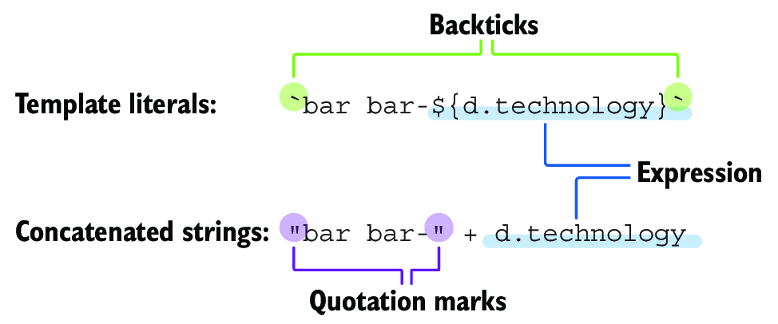
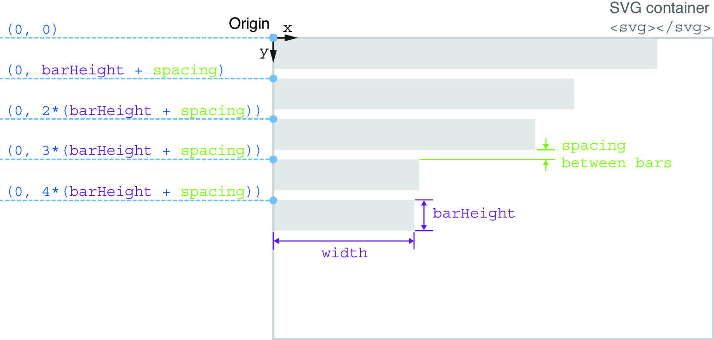
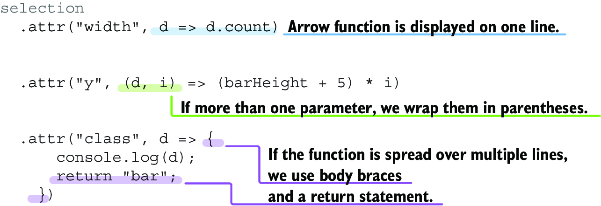
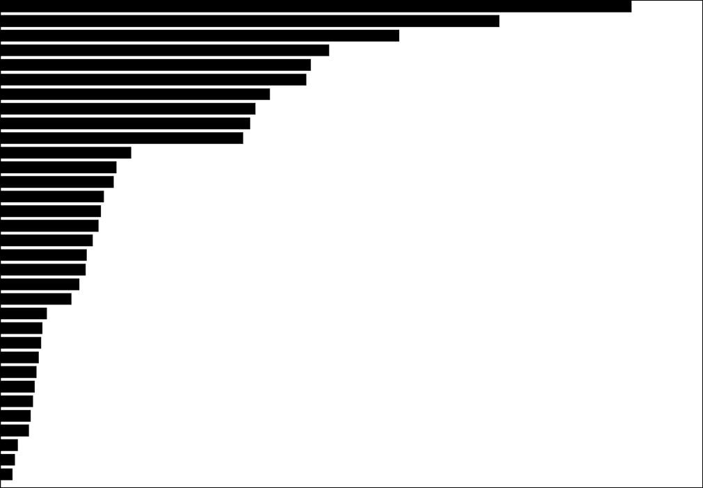
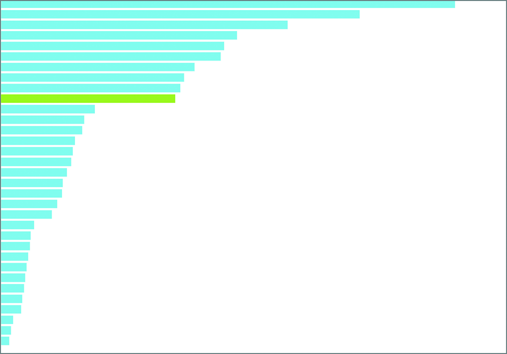

### 3.3.1 Setting DOM attributes dynamically with data 3.3.1 动态设置 DOM 属性与数据

We mentioned earlier that after loading the CSV file into our project, D3 converted it into an iterable data structure, hence an array of objects. Then we bound each object from the iterable data structure to a rectangle element. This bound data not only adds the correct number of rectangle elements to the DOM but also can be accessed when we manipulate the rectangles with inline or accessor functions.
我们之前提到，在将 CSV 文件加载到我们的项目中后，D3 将其转换为可迭代的数据结构，因此是一个对象数组。然后，我们将可迭代数据结构中的每个对象绑定到矩形元素上。这些绑定的数据不仅可以向 DOM 添加正确数量的矩形元素，还可以在我们使用内联或访问器函数操作矩形时进行访问。

Let’s see it in action for our bar chart. After the data-binding pattern, chain an `attr()` method to the rectangles selection. We’ll use it to add a `class` attribute to each rectangle, but instead of simply passing the value as the second parameter, we’ll enter the accessor function.
让我们在条形图中看看它的实际应用。在数据绑定模式之后，将一个`attr()`方法链接到矩形选择上。我们将用它为每个矩形添加一个`class`属性，但我们不会简单地将值作为第二个参数传递，而是输入访问器函数。

As you can see in the following snippet, the accessor function is structured as any JavaScript function and returns the value of the class, which is `"bar"` or any class name that you want to give to the rectangles:
如您在以下代码片段中所见，访问器函数的结构与任何 JavaScript 函数相同，并返回类的值，即 `"bar"` 或您想要赋予矩形的任何类名：

```js
svg
  .selectAll("rect")
  .data(data)
  .join("rect")
    .attr("class", d => {
      console.log(d);
      return `bar bar-${d.technology}`;
    })
```

The accessor function exposes the parameter `d`, for *datum*, which is the data bound to each rectangle. If you log `d` into the console, you’ll see that each datum object, containing a technology and a count, is logged one after the other, precisely as if we were *looping* through the rectangles and their data.
访问器函数暴露了参数 `d`，用于 *datum*，这是绑定到每个矩形的数据。如果你将 `d` 记录到控制台，你会看到每个数据对象，包含一个技术和一个计数，依次被记录，就像我们在 *循环* 通过矩形及其数据一样。

> ##### Template literals vs. concatenated strings 模板字面量与连接字符串
>
> In the previous snippet, we used template literals, also known as template strings, delimited with backticks (````). They are used to combine traditional JavaScript strings with expressions, and the expressions are preceded by a dollar sign and wrapped in curly braces (`${expression}`).
> 在前面的代码片段中，我们使用了模板字面量，也称为模板字符串，用反引号（````）分隔。它们用于将传统的 JavaScript 字符串与表达式结合，表达式前面有一个美元符号，并用大括号包裹（`${expression}`）。
>
> 
>
> ##### Using template literals versus concatenated strings 使用模板字面量与连接字符串
>
> You might be more familiar with concatenated strings, an older but correct way to combine expressions with strings. As shown in the previous figure, in a concatenated string, the strings are wrapped in quotation marks (`""`) and joined with the expression using plus signs (`+`). Both approaches are acceptable, but template literals are becoming the norm.
> 您可能对连接字符串更熟悉，这是一种较旧但正确的将表达式与字符串结合的方式。如前图所示，在连接字符串中，字符串用引号包裹（`""`），并通过加号（`+`）与表达式连接。这两种方法都是可以接受的，但模板字面量正成为常态。

This way of accessing the bound data is advantageous for setting the position and size of each rectangle. We know that we want to stack the rectangles vertically in our bar chart, as shown in figure 3.18. The `width` attribute of each rectangle represents the number of practitioners that use a tool, stored in the `count` key of the bound data. The longer the rectangle, the more the technology is used, and vice versa. On the other hand, their `height` attribute is constant, and there’s a little bit of vertical space between each rectangle.
这种访问绑定数据的方式对于设置每个矩形的位置和大小是有利的。我们知道我们想在条形图中垂直堆叠矩形，如图 3.18 所示。每个矩形的 `width` 属性表示使用某个工具的从业者数量，存储在绑定数据的 `count` 键中。矩形越长，技术使用得越多，反之亦然。另一方面，它们的 `height` 属性是恒定的，并且每个矩形之间有一点垂直空间。



##### Figure 3.18 Finding a formula for the position of the top-left corner of each rectangle 图 3.18 找到每个矩形左上角位置的公式

If we store the height of the bars in a constant named `barHeight`, we can set the `width` and the `height` attributes of the rectangles selection as follows. Note how we access the `count` value bound to each rectangle with a callback function when setting the `width` attribute:
如果我们将柱子的高度存储在一个名为 `barHeight` 的常量中，我们可以如下设置矩形选择的 `width` 和 `height` 属性。注意在设置 `width` 属性时，我们如何通过回调函数访问绑定到每个矩形的 `count` 值：

```js
const barHeight = 20;
svg
  .selectAll("rect")
  .data(data)
  .join("rect")
    .attr("class", d => {
      console.log(d);
      return "bar";
    })
    .attr("width", d => d.count)
    .attr("height", barHeight)
```

Then we need to set the position of the rectangles by calculating their `x` and `y` attributes, which represent the position of their top-left corners within the coordinate system of the SVG container. If you refer to figure 3.18, you’ll see that the rectangles are aligned with the left border of the SVG parent, meaning that their `x` attribute is always 0.
然后我们需要通过计算矩形的 `x` 和 `y` 属性来设置矩形的位置，这些属性表示它们在 SVG 容器坐标系统中左上角的位置。如果你参考图 3.18，你会看到矩形与 SVG 父容器的左边界对齐，这意味着它们的 `x` 属性始终为 0。

For the `y` attribute, we need to perform a small calculation. The top-left corner of the first rectangle is positioned at the top of the SVG container, where `y` is equal to 0. The second rectangle is positioned below the first one, with a distance corresponding to the height of the bars plus a little spacing (remember that the y coordinate of SVG elements goes from top to bottom). The third rectangle is again lower, at a y position corresponding to the height of two rectangles plus two times the vertical spacing between those rectangles. In figure 3.18, we can see a pattern taking shape. The y position of each rectangle corresponds to the number of rectangles before it, multiplied by the bars’ combined height and vertical spacing.
对于`y`属性，我们需要进行一个小计算。第一个矩形的左上角位于 SVG 容器的顶部，此时`y`等于 0。第二个矩形位于第一个矩形的下方，距离对应于条形的高度加上一点间距（请记住，SVG 元素的 y 坐标是从上到下的）。第三个矩形再次位于更低的位置，y 坐标对应于两个矩形的高度加上这两个矩形之间的两倍垂直间距。在图 3.18 中，我们可以看到一个模式正在形成。每个矩形的 y 位置对应于它之前的矩形数量，乘以条形的总高度和垂直间距。

To make this calculation in the callback function of the `y` attribute, we have access to a second parameter, often named `i`, for *index*. We’ve already stated that in the accessor function, it’s as if we were looping through the data of the bound elements. In JavaScript loops, we generally have access to the index of each item, corresponding to their position in the looped array minus 1 (arrays are zero-indexed in JavaScript). In the following snippet, we use the index to calculate the vertical position of each rectangle and leave 5 px of empty space between each rectangle:
在`y`属性的回调函数中进行此计算时，我们可以访问第二个参数，通常命名为`i`，表示*索引*。我们已经说明，在访问器函数中，就好像我们在循环遍历绑定元素的数据。在 JavaScript 循环中，我们通常可以访问每个项目的索引，对应于它们在循环数组中的位置减去 1（数组在 JavaScript 中是零索引的）。在以下代码片段中，我们使用索引来计算每个矩形的垂直位置，并在每个矩形之间留出 5 像素的空白：

```js
const barHeight = 20;
svg
  .selectAll("rect")
  .data(data)
  .join("rect")
    .attr("class", d => {
      console.log(d);
      return "bar";
    })
    .attr("width", d => d.count)
    .attr("height", barHeight)
    .attr("x", 0)
    .attr("y", (d, i) => (barHeight + 5) * i)
```

In the accessor functions, we use JavaScript arrow functions (ECMAScript 6 [ES6] syntax). When only one parameter is used, such as for the `class` and the `width` attribute, it doesn’t require parentheses. When multiple parameters are used, they need to be wrapped in parentheses, such as `(d,i)` for the `y` attribute. In addition, accessor functions that spread over multiple lines require body braces (`{}`) and a return statement (e.g., for the `class` attribute), while simple, single-line functions don’t need them (e.g., for the `width` attribute). These rules are summarized in figure 3.19.
在访问器函数中，我们使用 JavaScript 箭头函数（ECMAScript 6 [ES6] 语法）。当只使用一个参数时，例如 `class` 和 `width` 属性时，不需要括号。当使用多个参数时，需要用括号包裹，例如 `(d,i)` 用于 `y` 属性。此外，跨多行的访问器函数需要有函数体大括号 (`{}`) 和返回语句（例如，对于 `class` 属性），而简单的单行函数则不需要它们（例如，对于 `width` 属性）。这些规则在图 3.19 中进行了总结。



##### Figure 3.19 Formatting arrow functions 图 3.19 格式化箭头函数

Save your project, and you’ll see your rectangles take their place, as in figure 3.20. This is starting to look like a bar chart!
保存您的项目，您将看到矩形按位置排列，如图 3.20 所示。这开始看起来像一个条形图！



##### Figure 3.20 Rectangles positioned and sized with data 图 3.20 使用数据定位和调整大小的矩形

> **tip** In the next section, you’ll learn how band scales can calculate the vertical position of each bar for you. But knowing how to determine the bars’ position on your own is a valuable exercise. When we build D3 projects, we regularly have to make such small calculations of the position of elements on the screen, so it’s important to get comfortable with the task. It might not be easy at first, but with practice, you’ll get the hang of it! One of the best ways to approach such calculations is to draw a few elements from your visualization on a piece of paper and find their position within the coordinate system of the SVG parent, as we did earlier in figure 3.18. This exercise will help you better understand how your visualizations are built, which will be especially handy when you work on complex projects.
> **提示** 在下一部分中，您将学习如何使用带状刻度计算每个条形的垂直位置。但是，自己确定条形的位置是一个有价值的练习。当我们构建 D3 项目时，我们经常需要进行这样的元素在屏幕上位置的小计算，因此熟悉这个任务是很重要的。起初可能不容易，但通过练习，您会掌握它！处理这些计算的最佳方法之一是将您的可视化中的几个元素画在纸上，并找到它们在 SVG 父级坐标系统中的位置，就像我们在图 3.18 中所做的那样。这个练习将帮助您更好地理解您的可视化是如何构建的，这在您处理复杂项目时尤其有用。

Now we’ll make our graph a little more joyful by giving a blue color to the bars using their `fill` attribute. In the following snippet, we provide them with the CSS color name `"skyblue"`. Feel free to use another color if you prefer:
现在我们将通过使用它们的 `fill` 属性为条形图赋予蓝色，使我们的图表更加欢快。在下面的代码片段中，我们为它们提供了 CSS 颜色名称 `"skyblue"`。如果你更喜欢其他颜色，请随意使用：

```js
svg
  .selectAll("rect")
  .data(data)
  .join("rect")
    ...
    .attr("fill", "skyblue");
```

As a last step, let’s interrogate the data bound to the rectangles to identify the one corresponding to D3.js. To do so, we use a JavaScript ternary operator that checks if the technology bound to the current rectangle is `"D3.js"`. If this is the case, the CSS color `"yellowgreen"` is given to the `fill` attribute; otherwise, `"skyblue"` is used, as in figure 3.21:
作为最后一步，让我们检查绑定到矩形的数据，以识别与 D3.js 对应的那个。为此，我们使用一个 JavaScript 三元运算符，检查绑定到当前矩形的技术是否是 `"D3.js"`。如果是这样，CSS 颜色 `"yellowgreen"` 将被赋给 `fill` 属性；否则，将使用 `"skyblue"`，如图 3.21 所示：

```js
  ...
  .attr("fill", d => d.technology === "D3.js" ? "yellowgreen" : "skyblue");
```



##### Figure 3.21 The bar corresponding to D3.js is colored in green, while the other ones are blue. 图 3.21 与 D3.js 对应的条形为绿色，而其他条形为蓝色。

Our bar chart is really taking shape. Currently, we’re directly using data to set the width of each rectangle, but this approach isn’t always practical. Imagine if the numbers in the data were in the order of millions—we wouldn’t be able to use these values directly. In the next section, we’ll introduce scales, which are how we map data values into visual attributes in D3 projects.
我们的柱状图正在逐渐成型。目前，我们直接使用数据来设置每个矩形的宽度，但这种方法并不总是实用。想象一下，如果数据中的数字是以百万为单位的——我们将无法直接使用这些值。在下一部分中，我们将介绍比例尺，它们是我们如何在 D3 项目中将数据值映射到视觉属性的。