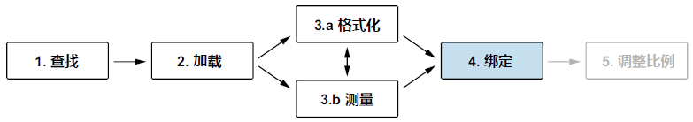
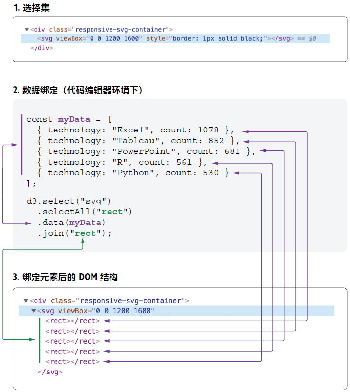

## 3.3 将数据绑定到 DOM 元素 Binding data to DOM elements

接下来学习 D3 最激动人心的一个核心知识点：**数据绑定**。数据绑定能将数据（即单个数据项）与 DOM 元素关联起来。例如我们的条形图示例，其中的每个 `rect` 元素，都与问卷结果中的某项技术的投票总数相关联。



**图 3.15 D3 数据工作流第四步：创建可视化 DOM 元素并实现数据绑定**

绑定数据需要按照以下代码的格式来书写。该写法由 **选择集** 链式调用的三个 D3 接口方法（`selectAll()`、`data()` 与 `join()`）构成。

```css
selection
  .selectAll("selector")
  .data(myData)
  .join("element to add");
```

再结合我们的条形图示例分析一下这段代码。示例项目需要根据数据集中的每一行（也称为 `datum`，即数据项）创建一个矩形元素。数据绑定的这种写法，就是在告诉 D3 每一个矩形元素要与某个数据项一一对应。

回到 `main.js` 文件，在函数 `createViz()` 内部创建一个与页面 SVG 容器相对应的 D3 选择集，并赋给常量 `svg`。该选择集就是后续添加矩形元素的容器。接着链式调用 `selectAll()` 方法，并传入一个待新增的元素标签名，即 `"rect"`。`selectAll()` 方法可以接受任意 CSS 选择器作为参数，元素的标签名称往往是最常用的：

```js
const createViz = (data) => {
  svg
    .selectAll("rect")
};
```

您也许好奇：怎么选了一组根本不存在的元素？这就是被业内称之为 **空选择集（*empty selection*）** 的概念。但此时 D3 还不知道需要添加多少个矩形元素，这就得再链式调用一个 `data()` 方法，并将上一节处理过的数据集（`data`）传进去。这样一来 D3 才会给数据集中的每一行创建一个 `rect` 元素：

```js
svg
  .selectAll("rect")
  .data(data)
```

最后，这些矩形元素通过 `join()` 方法正式进入 DOM 对象：

```js
svg
  .selectAll("rect")
  .data(data)
  .join("rect")
```

保存项目，并在浏览器的调试工具中检查 DOM 结构。如图 3.16 所示，SVG 容器中此时包含 33 个矩形元素，每一个都对应数据集的中某项技术。


**图 3.16 完成数据绑定并添加到页面 DOM 结构中的矩形元素截图**

整个数据绑定的详细过程如图 3.17 所示。从选择集开始，这里就是 SVG 容器；然后调用 `selectAll()` 方法创建一个空选择集，传入我们的标签选择器；接着再调用 `data()` 方法；最后通过 D3 的 `join()` 方法给每个数据项添加一个对应的矩形元素。完成数据绑定的选择集实现了元素与数据的特定 **组合（*combination*）**。后续每当复用该选择集中的元素，或者对其执行某些 DOM 操作，都能直接访问到元素对应的数据。



**图 3.17 数据绑定过程示意图**


> [!tip]
>
> **数据绑定的另一种写法**
>
> 如果上网搜索 D3 的代码示例，想必会碰到下面这样的写法。这是 D3 数据绑定的另一种写法，与本节介绍的略有不同。其中链式调用的方法为 `.enter().append()`，而不是 `join()`：
>
> ```js
> selection
>   .selectAll("selector")
>   .data(myData)
>   .enter().append("element type");
> ```
>
> 虽然使用 `.enter().append()` 仍然有效，但该写法从 D3 第 6 版开始，基本就被 `join()` 所替代了。在代码的底层实现中，`join()` 方法不仅能够根据数据处理这些有待添加到选择集中的元素，还进一步考虑了很多细节：会有多少新元素进入 DOM、有多少元素退出 DOM、以及有多少元素正在 DOM 中更新。这种更为复杂、更加精细化的模式设计，以其对可视化数据不断演变本质的准确把控，而在众多交互式可视化项目实践中脱颖而出、独占鳌头。此外，除了全面考虑数据绑定涉及的这些相关细节，`join()` 写起来也比之前的 `.enter().append()` 更简单。
>
> 本书将在第 7 章《交互式可视化》中详细介绍这种更精巧复杂的数据绑定模式。此刻您只需要知道，D3 的早期版本在绑定数据的写法上，和本节介绍的版本略有不同即可。这些历史版本的代码今后大概率可能还将继续发挥余热，被您碰到。

