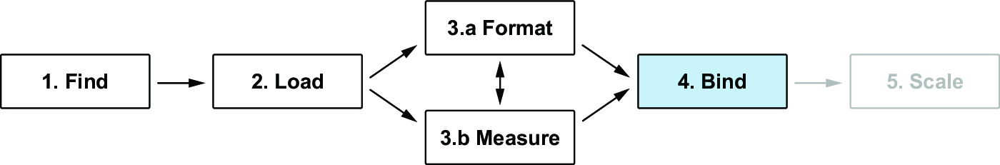
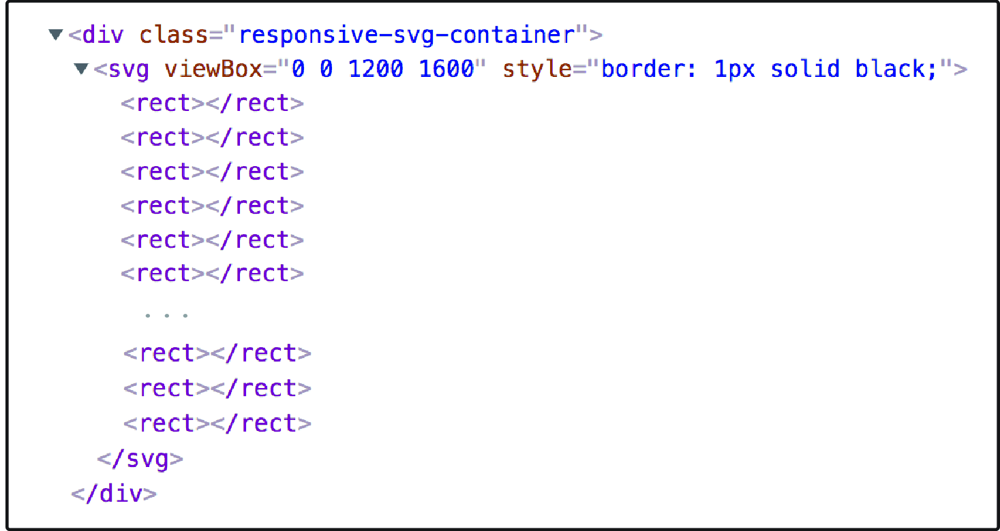
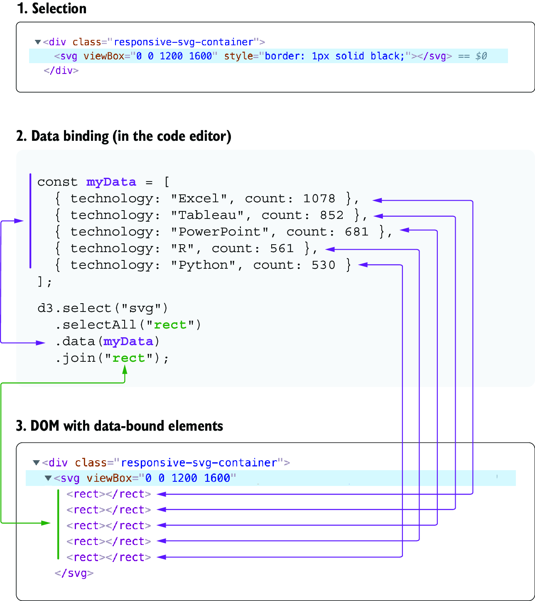

## 3.3 Binding data to DOM elements 3.3 将数据绑定到 DOM 元素

We’re now ready to introduce one of the most exciting features of D3: data binding. With data binding, we can couple datum (a single piece of data) to DOM elements. For instance, each SVG `rect` element composing our bar chart will be coupled with a technology and its corresponding count value. At the data-binding step of the data workflow (the fourth step in figure 3.15), the visualization really starts to come to life—and that’s always a joyful moment for a visualization developer!
我们现在准备介绍 D3 最激动人心的功能之一：数据绑定。通过数据绑定，我们可以将数据（单个数据项）与 DOM 元素关联。例如，构成我们条形图的每个 SVG `rect` 元素将与一种技术及其对应的计数值关联。在数据工作流的数据绑定步骤（图 3.15 中的第四步），可视化真正开始生动起来——这对可视化开发者来说总是一个快乐的时刻！



##### Figure 3.15 The fourth step of the D3 data workflow consists of creating and binding data to DOM elements that will be the core of the visualization. 图 3.15 D3 数据工作流程的第四步是创建并将数据绑定到将成为可视化核心的 DOM 元素。

To bind data, you only need to use the pattern shown in the next snippet, which is composed of three methods (`selectAll()`, `data()`, and `join()`) chained to a selection:
要绑定数据，您只需使用下一个代码片段中显示的模式，该模式由三个方法（`selectAll()`、`data()` 和 `join()`）链式调用到一个选择中：

```css
selection
  .selectAll("selector")
  .data(myData)
  .join("element to add");
```

We’ll use our bar chart exercise to explain the data-binding pattern. In this visualization, we need one rectangle element for each row in our dataset, also called a datum. With the data-binding pattern, we tell D3 that each rectangle element should correspond to a datum.
我们将使用我们的条形图练习来解释数据绑定模式。在这个可视化中，我们需要为数据集中每一行（也称为数据项）创建一个矩形元素。通过数据绑定模式，我们告诉 D3 每个矩形元素应对应一个数据项。

Go back to `main.js`, and inside the function `createViz()`, call the selection corresponding to the SVG container and saved in the constant named `svg`. The selection is where our rectangles will be added. Now chain a `selectAll()` method to the selection, and pass the type of element that we want to add as a parameter, which is an SVG `rect` element. You can pass any CSS selector to the `selectAll()` method, but using an element type is common:
返回到 `main.js`，在函数 `createViz()` 内部，调用对应于 SVG 容器的选择，并将其保存在名为 `svg` 的常量中。选择是我们将添加矩形的地方。现在将 `selectAll()` 方法链接到选择，并将我们想要添加的元素类型作为参数传递，即 SVG `rect` 元素。您可以将任何 CSS 选择器传递给 `selectAll()` 方法，但使用元素类型是常见的：

```js
const createViz = (data) => {

  svg
    .selectAll("rect")

};
```

You might wonder why we’re selecting elements that don’t even exist yet! This is what we call an *empty selection*. But D3 doesn’t know yet how many rectangles it needs to add. This is why we chain the `data()` method and pass our dataset as a parameter. Now D3 knows that it needs to create one `rect` element for each row in the data:
你可能会想知道为什么我们选择的元素甚至还不存在！这就是我们所说的*空选择*。但是 D3 还不知道需要添加多少个矩形。这就是我们链接`data()`方法并将数据集作为参数传递的原因。现在 D3 知道它需要为数据中的每一行创建一个`rect`元素：

```js
svg
  .selectAll("rect")
  .data(data)
```

Finally, the rectangles enter the DOM with the `join()` method:
最后，矩形通过 `join()` 方法进入 DOM：

```js
svg
  .selectAll("rect")
  .data(data)
  .join("rect")
```

Save your file, and take a look at the DOM in the inspector. In figure 3.16, you can see that the SVG container now contains 33 rectangles, one for each technology in the dataset.
保存您的文件，然后在检查器中查看 DOM。在图 3.16 中，您可以看到 SVG 容器现在包含 33 个矩形，每个矩形对应数据集中的一种技术。



##### Figure 3.16 Data-bound rectangles added to the DOM 图 3.16 添加到 DOM 的数据绑定矩形

Figure 3.17 illustrates the data-binding process. We start with a selection, here the SVG container. Then we create an empty selection with the `selectAll()` method and pass a selector. We pass the dataset to the `data()` method. Finally, D3 appends one rectangle for each datum via the `join()` method. Once the data binding is complete, the selection becomes the *combination* of the elements and the data together. Whenever we reuse or manipulate elements from this selection, we have access to their corresponding data!
图 3.17 说明了数据绑定过程。我们从一个选择开始，这里是 SVG 容器。然后，我们使用 `selectAll()` 方法创建一个空选择并传递一个选择器。我们将数据集传递给 `data()` 方法。最后，D3 通过 `join()` 方法为每个数据添加一个矩形。一旦数据绑定完成，选择就成为元素和数据的 *组合*。每当我们重用或操作来自此选择的元素时，我们都可以访问它们对应的数据！



##### Figure 3.17 The data-binding process 图 3.17 数据绑定过程


> ##### Another data-binding pattern 另一种数据绑定模式
>
> If you search for D3 code examples on the web, you’ll undoubtedly come across a slightly different data-binding pattern where the `.enter().append()` methods are used instead of `.join()`:
> 如果你在网上搜索 D3 代码示例，你无疑会遇到一种略有不同的数据绑定模式，其中使用了 `.enter().append()` 方法，而不是 `.join()`：
>
> ```js
> selection
>   .selectAll("selector")
>   .data(myData)
>   .enter().append("element type");
> ```
>
> Although the `.enter().append()` approach is still valid, it has mainly been replaced by `.join()` since Version 6 of D3. Under the hood, the `join()` method not only handles the elements to add to the selection based on data but also considers how many new elements are entering the DOM, how many are exiting, and how many are being updated. This more complex pattern is particularly powerful in interactive visualizations, where the data displayed in the visualization is evolving. By taking care of all of these aspects of data binding, `join()` is simpler to use than the previous `.enter().append()` approach.
> 尽管 `.enter().append()` 方法仍然有效，但自 D3 版本 6 以来，它主要被 `.join()` 替代。在底层，`join()` 方法不仅根据数据处理要添加到选择中的元素，还考虑了有多少新元素进入 DOM，有多少元素退出，以及有多少元素正在更新。这种更复杂的模式在交互式可视化中尤其强大，因为可视化中显示的数据是不断演变的。通过处理数据绑定的所有这些方面，`join()` 的使用比之前的 `.enter().append()` 方法更简单。
>
> We’ll discuss this more complex approach in chapter 7. For now, it’s only important for you to know that prior versions of D3 used a slightly different data-binding pattern and that you’re likely to meet code that is still using it.
> 我们将在第七章讨论这种更复杂的方法。现在，您只需知道 D3 的早期版本使用了略有不同的数据绑定模式，并且您可能会遇到仍在使用它的代码。

