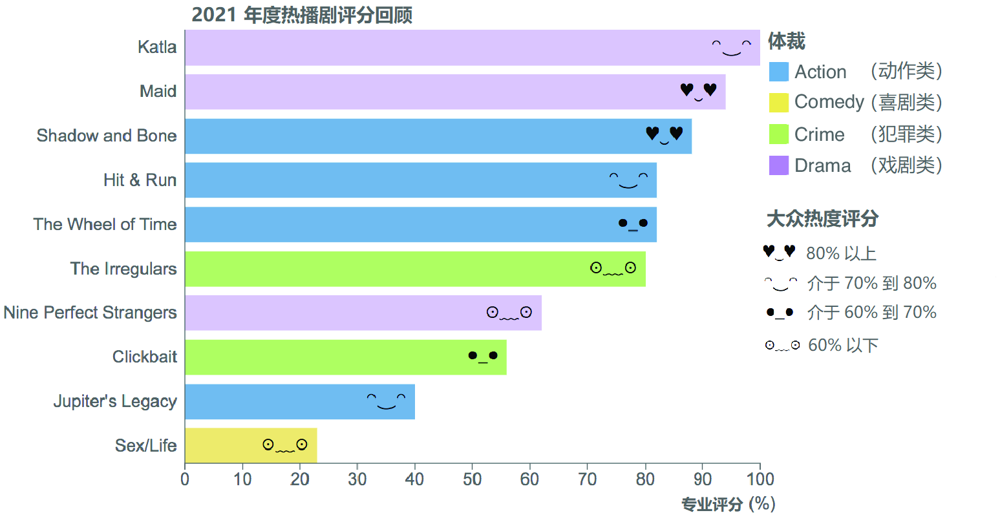

### 3.4.1 比例 Scales

比例尺是将数据中的一个值作为输入（input）并返回一个输出值的函数。该输出值可以直接用来设置数据可视化元素的尺寸大小、位置或者颜色。说得再具体些，输入数据是 **定义域（*domain*）** 中的一份子；定义域是该数据能取到的值的某个范围。在屏幕上，定义域又被映射到某个 **值域（*range*）** 上；而值域则是输出值能取到的值的某个范围。

D3 提供了多个比例尺函数，它们各自接收不同种类的定义域与值域。以线性比例尺 `d3.scaleLinear()` 为例，要初始化该比例尺函数，需要链式调用 `domain()` 和 `range()` 方法，并将包含所有可能性的数值范围作为参数传入，参数类型为一个有序数组，里面分别包含一个最小值与一个最大值：

```js
const myScale = d3.scaleLinear()
  .domain([0, 200])
  .range([0, 20]);
```

得到的比例尺函数与 JavaScript 其他函数相比没什么不同。将定义域中的某个值作为参数传入，函数则会从值域中返回一个对应的结果：

```js
myScale(100) => 10
```

比例尺的输入与输出值既可以是 **连续的（*continuous*）** 也可以是 **离散的（*discrete*）**。连续值可以在预定范围内的任意位置存在，例如 0 到 100 之间的某个浮点数，或者介于 2020 年 6 月到 2021 年1 月之间的某个日期等等。一个连续的定量型数据可被视为一个可滑动的刻度尺；另一方面，离散型输入与输出则对应一组预设值，例如现有 T 恤的尺码型号一般为 XS 特小号、S 小号、M 中号、L 大号以及 XL 加大号，或者颜色类型包含蓝色、绿色、黄色和红色等等。定性型数据就如同将物品放入不同的盒子，每个物品只能放入一个盒子。

在 D3 中，定量数据往往与一个有着连续型定义域（continuous domain）的比例尺相关联；相反，定性数据则对应某个离散型定义域（discrete domain），通常是一个由所有可能的值所构成的数组。同理，一个有着连续型输出结果的比例尺可在指定的值域内取到任意值；而离散型输出只能返回预设值列表中的某个结果。

根据连续与离散、输入与输出等概念，可将 D3 比例尺分为以下四类：

- 具有连续型输入、连续型输出的比例尺；
- 具有离散型输入、离散型输出的比例尺；
- 具有连续型输入、离散型输出的比例尺；
- 具有离散型输入、连续型输出的比例尺。

假设我们在谷歌上搜索 2021 年推出的电视剧，并将前 10 个结果汇总到一个数据集中（即撰写本章时笔者进行的一个练习操作），然后分别搜集每部电视剧的体裁、“烂番茄”热度得分（译注：“烂番茄”即 Rotten Tomatoes，一个专注于影视节目评价的知名网站，1998 年成立于美国。）、专业影评人综合评分、以及可收看平台，将得到一个如下表 3.2 所示的数据集。其中既包含连续型数据（如观众评分和影评人评分），同时也有离散型数据（如体裁与可收看平台）。要绘制如图 3.23 所示的条形图，需要利用 D3 比例尺分别对上述每个维度进行处理。请注意，该条形图旨在演示 D3 比例尺的不同类型及其用法，您无需亲自创建。

> [!tip]
>
> **译注**
>
> **烂番茄（Rotten Tomatoes）** 网站是美国一家专注于线上影视评论的知名网站，于 1998 年 8 月由加州大学伯克利分校的三名本科生 Senh Duong、Patrick Y. Lee 和 Stephen Wang 联合创办。虽然“烂番茄”一名与观众投掷烂番茄以反对拙劣的舞台表演的做法有关，但三人起这个名字的直接灵感据称来自 1992 年的一部加拿大电影《*Léolo*》中的一个类似场景。（摘自 [维基百科](https://en.wikipedia.org/wiki/Rotten_Tomatoes)）

**表 3.2 谷歌推荐的 2021 年度热播电视剧**

|         剧名 `*`         |  体裁  | 大众评分 (%) | 专业评分 (%) | 观看平台 |
| :----------------------: | :----: | :----------: | :----------: | :------: |
| *Nine Perfect Strangers* | Drama  |      59      |      62      |  Prime   |
|          *Maid*          | Drama  |      88      |      94      | Netflix  |
|         *Katla*          | Drama  |      78      |     100      | Netflix  |
|    *Jupiter’s Legacy*    | Action |      73      |      40      | Netflix  |
|       *Hit & Run*        | Action |      72      |      82      | Netflix  |
|     *The Irregulars*     | Crime  |      54      |      80      | Netflix  |
|    *Shadow and Bone*     | Action |      89      |      88      | Netflix  |
|       *Clickbait*        | Crime  |      64      |      56      | Netflix  |
|        *Sex/Life*        | Comedy |      34      |      23      | Netflix  |
|   *The Wheel of Time*    | Action |      64      |      82      |  Prime   |

数据来源：[www.rottentomatoes.com](https://www.rottentomatoes.com/)（`*`：为演示起见，剧名、体裁、观看平台等维度均不作翻译）



**图 3.23 2021 年度热播剧专业点评与大众评分对比：四个维度均由相应的比例尺处理绘制而成**

条形图中的每个矩形都对应一部热播剧，其长度与专业影评人给出的平均得分成正比。为了计算各矩形条的长度，需要使用上述 D3 比例尺中的第一类。其输入参数为专业影评人评分，输出则是一个连续型数值，对应该矩形条长度。

这个比例的定义域为 0% 到 100% 之间（即专业评分的取值范围），与之对应的矩形条长度值域为（以像素为单位）：

```properties
定义域 => [0, 100] 输入的最小值和最大值，单位：%
值域  => [0, 500] 对应输出的最小值和最大值，单位：像素
```

再来看矩形条的颜色。它代表每部剧的体裁。要给不同的热播剧上色，需要用到第二类比例尺：输入数据为离散型数值（即体裁），输出为离散型数值（即对应的颜色）。该比例尺的定义域是一个由不同体裁构成的数组，值域则是一个对应的颜色名称数组：

```properties
定义域 => ["Drama", "Action", "Crime", "Comedy"]  输入值的取值范围
值域 => ["purple", "blue", "green", "yellow"]  对应输出的取值范围
```

此外，每个矩形条的末端还用了一个表情符号来表示大众热度评分情况。热度得分超过 80% 的电视剧将显示成一个“心形眼”表情符号（`♥‿♥`）；热度在 70% 到 80% 之间的，则显示一个微笑表情（`⌒‿⌒`）；热度在 60% 到 70% 的，则显示为一个中性表情（`●_●`）；而热度不足 60% 的电视剧则会得到一个苦闷的表情（`⊙﹏⊙`）。于是我们就得到了一组连续的输入，即大众热度评分；以及一组离散的输出，即对应的表情符号：

```properties
定义域 => [60, 70, 80] 输入值的临界点
值域  => ["⊙﹏⊙", "●_●", "⌒‿⌒", "♥‿♥"] 对应的输出结果
```

最后要处理的，是矩形条的方位计算——各矩形条沿图表纵轴均匀分布。方位的计算，需要借助上述第四类 D3 比例尺：接受离散型输入（即剧名），并返回一个连续型输出（即纵轴坐标值）：

```properties
定义域 => ["Nine Perfect Strangers", "Maid", "Katla", ...] 输入值列表
值域  => [0, 500] 对应输出的最小值和最大值，单位：像素
```

由此可见，每一类比例尺都包含多个比例尺函数，撰写本书时，`d3-scale` 模块已经提供了 20 个以上的现成比例尺函数（详见 [https://d3js.org/d3-scale](https://d3js.org/d3-scale)）。本章将重点介绍 `d3.scaleLinear()` 和 `d3.scaleBand()` 函数，因为它们在 D3 开发中最常用，并且本章的示例条形图也需要依靠它们来实现。本书还将介绍许多其他的比例尺工具。想了解更多 D3 现有比例尺函数的概述性介绍、以及有利于手头项目比例尺函数合理选型的决策树，详见本书 **附录 B**（待翻译）。