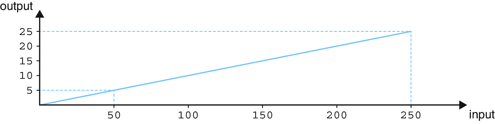
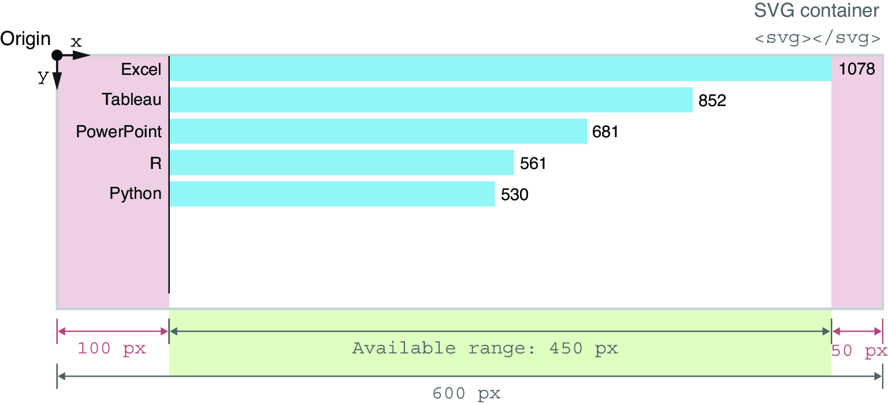
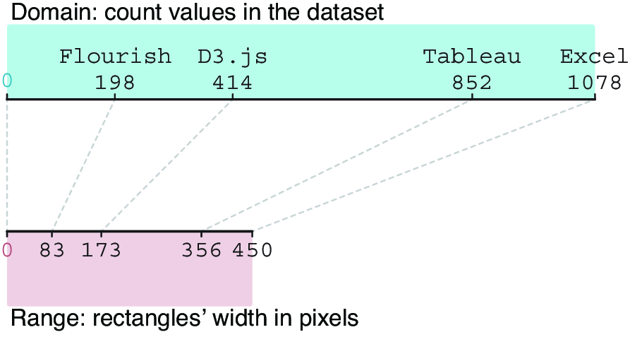

### 3.4.2 线性比例尺 Linear scale


The type of scale that we use most often when developing D3 projects is, without a doubt, the linear scale (`d3.scaleLinear()`). This scale takes a continuous domain as an input and returns a continuous range of outputs:
我们在开发 D3 项目时最常用的比例尺无疑是线性比例尺（`d3.scaleLinear()`）。该比例尺将连续的域作为输入，并返回连续的输出范围：

```js
const myLinearScale = d3.scaleLinear()
  .domain([0, 250])
  .range([0, 25]);
```

The output of a linear scale is directly proportional to its input, as depicted in figure 3.24. In the previous snippet, the domain covers any value between 0 and 250, while the corresponding range of outputs contains values between 0 and 25. If we call this scale function with an argument of 100, it returns 10. Similarly, if we pass a value of 150, it returns 15:
线性刻度的输出与其输入成正比，如图 3.24 所示。在前面的片段中，定义域涵盖 0 到 250 之间的任何值，而相应的输出范围包含 0 到 25 之间的值。如果我们用 100 作为参数调用这个刻度函数，它返回 10。同样，如果我们传入 150 的值，它返回 15：

```js
myLinearScale(100) => 10
myLinearScale(150) => 15
```

Let’s get back to our bar chart exercise. In the previous section, we’ve used the count values from the data to set the `width` attribute of each rectangle. It worked fine because the counts were relatively small numbers, but using a scale to translate values from the data into SVG attributes is generally more practical.
让我们回到我们的条形图练习。在上一节中，我们使用数据中的计数值来设置每个矩形的 `width` 属性。这很好用，因为计数值相对较小，但使用比例将数据中的值转换为 SVG 属性通常更为实用。



##### Figure 3.24 The output of a linear scale is linearly proportional to the input. 图 3.24 线性刻度的输出与输入成线性比例。

```js
const svg = d3.select(".responsive-svg-container")
  .append("svg")
  .attr("viewBox", "0 0 600 700")
  ...
```

In addition, modify the value of the `max-width` property of the `div` with a class of `responsive-svg-container` in `main.css`:
此外，修改 `max-width` 属性的值，针对 `div`，其类为 `responsive-svg-container`，在 `main.css` 中：

```js
.responsive-svg-container {
  ...
  max-width: 600px;
  ...
}
```

If you save your project and go to your browser, you’ll see that the first three bars of the chart are larger than the SVG container and that their tips are hidden. We’ll fix that with a linear scale that will map the count values onto the space available in the SVG container, while leaving free space for labels.
如果您保存项目并打开浏览器，您会看到图表的前三个条形比 SVG 容器大，且它们的顶部被隐藏了。我们将通过线性比例尺来解决这个问题，该比例尺将计数值映射到 SVG 容器中可用的空间，同时为标签留出空白。

We first declare a constant named `xScale` because this scale will be responsible for sizing and positioning elements along the x-axis. We then call function `d3.scaleLinear()` and chain the `domain()` and `range()` methods.
我们首先声明一个名为 `xScale` 的常量，因为这个比例将负责沿 x 轴调整元素的大小和位置。然后我们调用函数 `d3.scaleLinear()` 并链接 `domain()` 和 `range()` 方法。

The possible `count` values from our dataset extend from 0, the theoretical minimum, to 1,078, the highest count corresponding to Excel as a data visualization technology. Note that we use 0 instead of the actual minimum count from the dataset. Like in most charts, we want our x-axis to start at 0. We pass the minimum and maximum values from our domain to the `domain()` method as an array (`[0,` `1078]`).
可能的 `count` 值来自我们的数据集，范围从 0（理论最小值）到 1,078（对应于 Excel 作为数据可视化技术的最高计数）。请注意，我们使用 0 而不是数据集中的实际最小计数。与大多数图表一样，我们希望 x 轴从 0 开始。我们将域中的最小值和最大值作为数组传递给 `domain()` 方法（`[0,``1078]`）。

Now we need to assess the horizontal space available, hence the range of the scale. Figure 3.25 shows the first five bars of the graph. You should not see the labels on the left and the right side of the chart on your project yet. We’ve added them to this illustration only to show why we need additional space.
现在我们需要评估可用的水平空间，因此需要确定比例范围。图 3.25 显示了图表的前五个条形。您在项目中不应看到图表左侧和右侧的标签。我们仅在此插图中添加它们，以说明为什么我们需要额外的空间。



##### Figure 3.25 Assessing the horizontal space available for the bars 图 3.25 评估条形图可用的水平空间

We already know that the SVG container has a total width of 600 px. We want to leave 100 px of free space to the left for the technology labels and 50 px to the right for the count labels. This means that the length of the bars can range between 0 px and 450 px.
我们已经知道 SVG 容器的总宽度为 600 像素。我们希望左侧留出 100 像素的空白用于技术标签，右侧留出 50 像素用于计数标签。这意味着条形的长度可以在 0 像素到 450 像素之间变化。

We can now declare `xScale`, with a domain varying between 0 and 1078 and a range between 0 and 450. Add the linear scale inside function `createViz()` before the data binding’s code:
我们现在可以声明 `xScale`，其域在 0 到 1078 之间，范围在 0 到 450 之间。在数据绑定的代码之前，在函数 `createViz()` 内添加线性比例尺：

```js
const createViz = (data) => {

  const xScale = d3.scaleLinear()
    .domain([0, 1078])
    .range([0, 450]);

  // Data-binding
  ...
}
```

We’ve mentioned that we can call D3 scales like any other JavaScript function. We pass a value from the domain as an argument, and the function returns the corresponding value from the range. For example, if we pass the value `1078` to `xScale`, corresponding to Excel’s count value, the scale will return `450`. If we pass `414`, the number of practitioners that use D3, the scale returns `172.82`, the width in pixels of the bar corresponding to D3.js:
我们提到过，我们可以像调用其他 JavaScript 函数一样调用 D3 比例。我们将域中的一个值作为参数传递，函数返回范围中的相应值。例如，如果我们将值 `1078` 传递给 `xScale`，对应于 Excel 的计数值，比例将返回 `450`。如果我们传递 `414`，即使用 D3 的从业人员数量，比例将返回 `172.82`，对应于 D3.js 的条形宽度（以像素为单位）：

```js
xScale(1078)   // => 450
xScale(414)    // => 172.82
```

Try it for yourself by logging in to the console the output returned by the scale for a few values from the dataset and see if they correspond to the values in figure 3.26.
亲自尝试一下，登录控制台，查看规模返回的数据集中几个值的输出，看看它们是否与图 3.26 中的值相对应。



##### Figure 3.26 Count values from the data mapped by the linear scale into the bars’ width 图 3.26 将数据通过线性刻度映射的计数值转换为条形的宽度

Now that our scale is declared, we can start using it to calculate the width of each rectangle in our bar chart. Find the line of code where the `width` attribute of the rectangles is set. Like in the next snippet, instead of using the `count` value directly, call `xScale()`, and pass the count value as an argument. Change the value of the `x` attribute to `100` to translate the rectangles to the right, and leave space for the technology labels shown in figure 3.25:
现在我们的比例已确定，我们可以开始使用它来计算条形图中每个矩形的宽度。找到设置矩形的 `width` 属性的代码行。就像在下一个代码片段中一样，不要直接使用 `count` 值，而是调用 `xScale()`，并将计数值作为参数传递。将 `x` 属性的值更改为 `100`，以将矩形向右移动，并为图 3.25 中显示的技术标签留出空间：

```js
svg
  .selectAll("rect")
  .data(data)
  .join("rect")
    ...
    .attr("width", d => xScale(d.count))
    ...
    .attr("x", 100)
    ...
```

Save your project, and note how the bars fit within the SVG container and how whitespace is preserved for the labels on each side of the bars.
保存您的项目，并注意条形图如何适应 SVG 容器，以及条形图两侧标签的空白是如何保留的。

You now know how to use D3 scales! Although there are a lot of different types of scales available in D3, the principles of how to declare and use them remain similar. Switching from one scale to another only requires you to know the type of data accepted by the domain and the expected range.
你现在知道如何使用 D3 比例尺了！虽然 D3 中有很多不同类型的比例尺，但声明和使用它们的原则仍然相似。从一种比例尺切换到另一种只需要你知道域接受的数据类型和预期范围。

