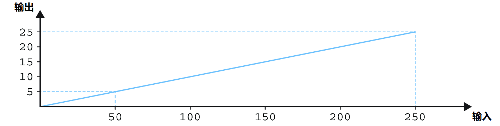
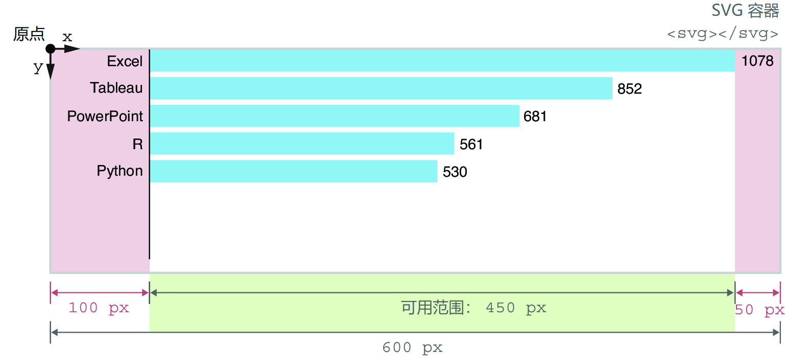

### 3.4.2 线性比例尺 Linear scale

开发 D3 项目最常用的比例尺，毫无疑问，就是 **线性比例尺**（`d3.scaleLinear()`）。该比例尺以连续的定义域作为输入，并以连续型的值域作为输出：

```js
const myLinearScale = d3.scaleLinear()
  .domain([0, 250])
  .range([0, 25]);
```

线性比例尺的输出与输入成正比，如图 3.24 所示。在上一段代码中，定义域声明为包含 0 到 250 之间的任意值；值域则声明为包含 0 到 25 之间的任意值。若以 100 为参数调用该函数，则返回 10。同理，若传入 150，则返回 15：

```js
myLinearScale(100) => 10
myLinearScale(150) => 15
```

回到本章示例。前面介绍过，数据集中的计数值（`count`）用于设置矩形条的 `width` 属性。这么做固然不错，毕竟计数值不大；但更常见的做法是利用比例尺工具将数据集中的值转换为 SVG 的属性值：



**图 3.24 线性比例尺的输出与输入呈线性比例关系**

```js
const svg = d3.select(".responsive-svg-container")
  .append("svg")
  .attr("viewBox", "0 0 600 700")
  ...
```

此外，还要在 `main.css` 样式表文件中修改响应式容器元素的最大宽度，即类名为 `responsive-svg-container` 的 `div` 元素属性 `max-width`：

```css
.responsive-svg-container {
  ...
  max-width: 600px;
  ...
}
```

刷新页面，会看到图表区前三个矩形条溢出了 SVG 容器。这个问题可以通过线性比例尺来解决。它可以将实际的计数值映射为 SVG 容器中可用的空间尺寸，并为图表标签预留足够的位置。

由于该比例尺函数用于将元素的大小沿 x 轴排布，因此首先声明一个常量 `xScale`，然后调用 `d3.scaleLinear()` 方法，紧接着链式调用 `domain()` 和 `range()` 方法。

`count` 的取值范围，根据整理好的数据集，为 0（理论最小值）到 1,078（即对应 Excel 的得票数）。请注意，这里用的是 0 而非数据集中的实际最小值，因为与大多数图表一样，x 轴将从 0 开始绘制。因此传入 `domain()` 方法的参数为处理后的边界值数组（即 `[0, 1078]`）。

接着需要计算可用的水平距离，并以此为比例尺函数的值域。前五个矩形条的显示效果如图 3.25 所示。此时您本地的页面应该看不到图中那样的左右标签，图 3.25 只是为了演示预留额外空间的必要性：



**图 3.25 计算条形图可用的水平距离**

已知 SVG 容器总宽度为 `600px`，左侧预留 `100px` 用于显示“技术”（`technology`）标签，右侧预留 `50px` 用于计数（`count`）标签，则矩形条的长度范围介于 `0` ~ `450px` 之间。这样 `xScale` 的定义域和值域都有了。在数据绑定的代码之前、`createViz()` 函数的内部添加如下比例尺函数：

```js
const createViz = (data) => {

  const xScale = d3.scaleLinear()
    .domain([0, 1078])
    .range([0, 450]);

  // Data-binding
  ...
}
```

前面讲过，D3 比例尺函数的用法与其他 JavaScript 函数一样，传入定义域中的某个值，则返回该值对应的值域结果。例如，传入 `1078`，它对应 `Excel` 的票数值，则函数返回 `450`；若传入 `414`，即 D3 的得票数，则返回 `172.82`，对应矩形条的绘制宽度（以像素为单位）：

```js
xScale(1078)   // => 450
xScale(414)    // => 172.82
```

您可以在控制台亲自尝试一下，传入下图给出的几个定义域取值，看看计算结果与图 3.26 给出的结果是否一致：


**图 3.26 利用线性比例尺将数据集中的 count 值映射为条形图的宽度值**

比例一旦确定，就可以用它来计算条形图中各个矩形条的宽度了。定位到设置矩形条 `width` 属性的那行代码，如以下代码所示，不要直接使用 `count` 值，而是传入一个函数，并将调用 `xScale()` 的结果返回；接着再将属性 `x` 改为 `100`，表示将矩形条统一右移 `100px` 以便绘制技术标签：

```js
svg
  .selectAll("rect")
  .data(data)
  .join("rect")
    ...
    .attr("width", d => xScale(d.count))
    ...
    .attr("x", 100)
    ...
```

最后保存项目，再次回顾条形图适应 SVG 容器尺寸的方式，以及复盘条形图两侧的标签空白的设计过程，以加深印象。

这就是 D3 线性比例尺的用法。虽然 D3 还提供了其他不同类型的比例尺工具函数，但万变不离其宗。要从一种比例尺切换到另一种，只需要知道接受的定义域是什么数据类型的，以及期望的值域范围是什么就行了。
