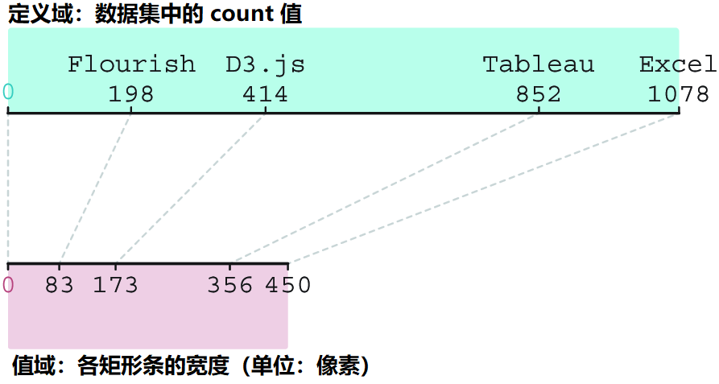
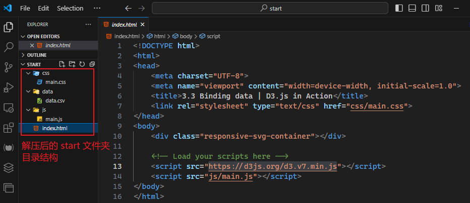
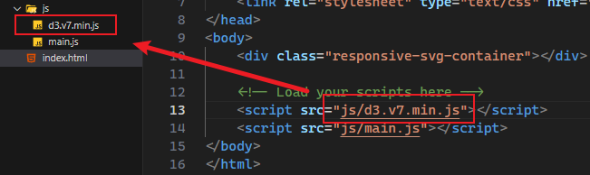
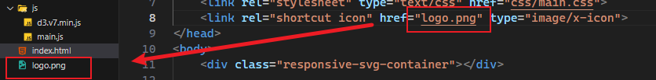
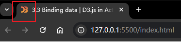
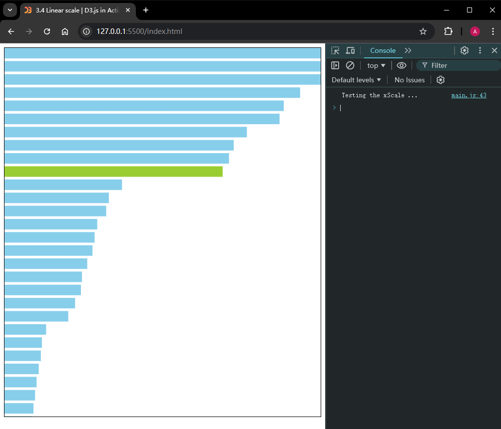
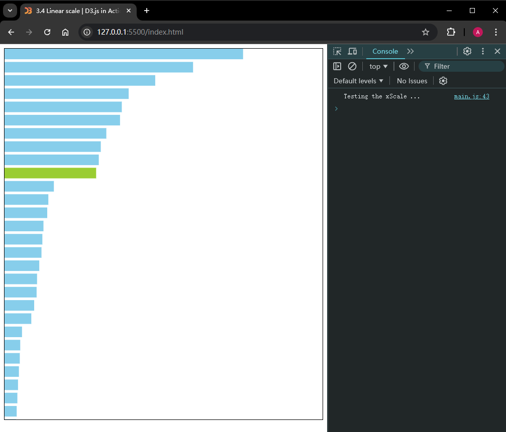
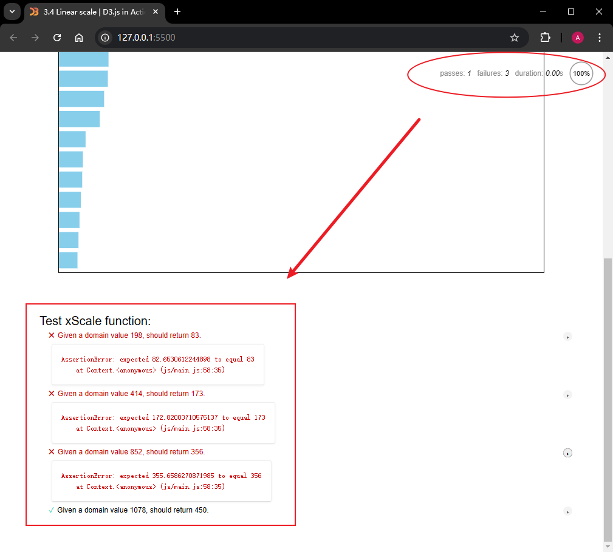
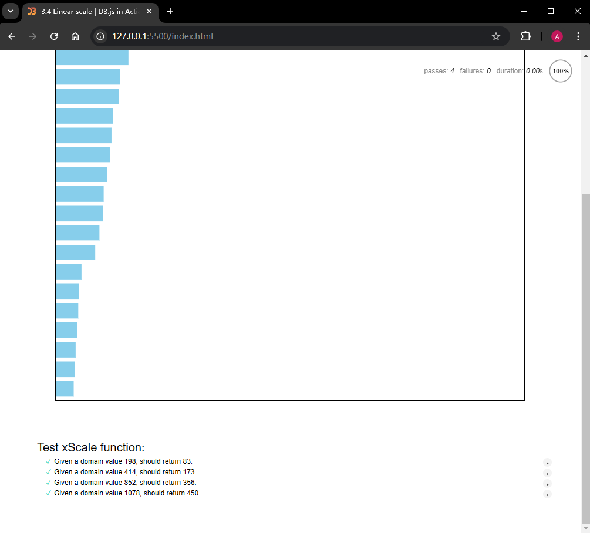

# 3.4.2.1 D3 线性比例尺数据测试实战

---

> [!tip]
>
> **前言**
>
> 之前一直在鼓励大家跟着我的介绍把专栏里的代码和数据放到本地跑一跑。想着前面这些基础过于简单，就没当回事。昨天讲到线性比例尺（点 [这里](https://blog.csdn.net/frgod/article/details/142644729) 查看原文），作者又让大家测试，刚好也想试试在浏览器环境运行测试工具 `Mocha`，就顺便动手试了试。没想到问题还挺多的。算是抛砖引玉吧。


## 1 需求描述

按照 3.4.2 小节最后一张截图（如下所示），将图中的测试数据放到本地实测一遍，看看 D3 的线性比例尺函数是否能得到同样的结果。



**图 1 《D3.js in Action》第 3.4.2 节最后的示意图里给出的测试数据**

写成代码就是：

```js
xScale(198) // => 83
xScale(414) // => 173
xScale(852) // => 356
xScale(1078) // => 450
```


## 2 项目基础环境搭建

根据我自己上传的【[附件](https://download.csdn.net/download/frgod/89817503)】，解压后用 `VSCode` 打开里面的 `start` 文件夹，初始界面应该是这样的：



**图 2 解压文件后用 VSCode 打开 start 文件夹看到的初始目录结构**

既然是本地化改造，D3 的 CDN 远程引用就改成本地引用，于是 `index.html` 就成了这样：



**图 3 将 D3 的 CDN 远程调用改为本地引用**

一不做二不休，再给这个本地项目配个 D3 官方图标：



**图 4 从 D3 官网（https://d3js.org/）搬过来的图标（防止 Live Server 首次启动报 404 错误）**

效果还不赖：



**图 5 添加 D3 图标后的浏览器标签效果**

原来标签页上面的标题还是 3.3 小节的，既然是实测练习，就一起更新了吧：

```html
<title>3.4 Linear scale | D3.js in Action</title>
```

接着，是按要求修改样式表 `main.css`：

**代码清单 DIY-1 修改后的 main.css**

```css
.responsive-svg-container {
  margin-inline: auto;  /* 使用 CSS3 的逻辑属性*/
  width: 100%;
  max-width: 800px;  /* 宽度改小到 800px 即可 */
}
```

然后是精简 `main.js` 的代码：

**代码清单 DIY-2 精简后的页面绘图逻辑**

```js
// Append a SVG container
const svg = d3.select(".responsive-svg-container")
  .append("svg")
    .attr("viewBox", "0 0 600 700")  // 同步改小 viewBox 的尺寸
    .style("border", "1px solid black");

// Load, format and measure the dataset
d3.csv("../data/data.csv", d => ({
  technology: d.technology,
  count: +d.count
})).then(data => {
  data.sort((a, b) => b.count - a.count);
  createViz(data);
});

// Create the bar graph
const createViz = (data) => {

  // 创建 X 轴的比例尺函数
  const xScale = d3.scaleLinear()
    .domain([0, d3.max(data, d => d.count)])
    .range([0, 450]); // （= 600 - 100 - 50 (px)）

  // 运行测试
  testXScale(xScale);

  // Use data-binding to append rectangles
  const barHeight = 20;
  svg.selectAll('rect')
    .data(data)
    .join('rect')
      .attr('class', d => `bar bar-${d.technology}`)
      .attr('width', d => d.count)
      .attr('height', barHeight)
      .attr('x', 0)
      .attr('y', (d, i) => (barHeight + 5) * i)
      .attr('fill', d => d.technology === 'D3.js' ? 'yellowgreen' : 'skyblue');

};

// 测试 xScale 函数
const testXScale = (xScale) => {
  console.log('Testing the xScale ...');
};
```

作为对比，先看看使用比例尺函数前的效果：



**图 6 比例尺调用前绘制的条形图效果**

此时只需修改一行 JS 代码就能让比例尺生效（即上段代码第 33 行）：

```js
svg.selectAll('rect')
// ...
    .attr('width', d => xScale(d.count))
// ...
```

效果如下：



**图 7 比例尺调用后绘制的条形图效果**

至此，3.4.2 小节的主线任务就完成。接下来是我给自己定的支线任务，这是本次测试的核心环节：用 `Mocha` 在本地搭一个测试环境，验证原文的图 3.26 中那四组数据。


## 3 Mocha 测试环境搭建

首先引入测试库 `Mocha.js` 及断言工具库 `Chai.js`，由于是用在浏览器客户端（即写入 `<script>` 标签），因此这两个库 **必须是 UMD 版本**（这个坑我帮各位提前踩了）。最后再引入 `Mocha` 的样式表 `mocha.css`（同样从 CDN 下载到本地，URL：[https://unpkg.com/mocha/mocha.css](https://unpkg.com/mocha/mocha.css)），于是 `index.html` 就改成了：

```html
<head>
	<meta charset="UTF-8">
	<meta name="viewport" content="width=device-width, initial-scale=1.0">
	<title>3.4 Linear scale | D3.js in Action</title>
	<link rel="stylesheet" type="text/css" href="css/main.css">
	<link rel="shortcut icon" href="logo.png" type="image/x-icon">
	<!-- Load Mocha CSS -->
	<link rel="stylesheet" href="css/mocha.css">
</head>
<body>
	<div class="responsive-svg-container"></div>
	<div id="mocha"></div><!-- test result container -->

	<!-- Load your scripts here -->
	<script src="js/d3.v7.min.js"></script>
	<script src="js/main.js"></script>
	<!-- use Mocha to test linear scale xScale -->
	<script src="js/mocha.js"></script>
    <script src="js/chai.min.js"></script>
</body>
```

接着再来实现具体的测试逻辑，对 `testXScale` 函数做如下改造：

```js
const testXScale = (xScale) => {
  // console.log('Testing the xScale ...');
  const testData = new Map([
    [198, 83],
    [414, 173],
    [852, 356],
    [1078, 450]
  ]);

  mocha.setup('bdd');
  const { expect } = chai;

  // 测试用例
  describe('Test xScale function:', () => {
    testData.forEach((expected, domain) => {
      it(`Given a domain value ${domain}, should return ${expected}.`, () => {
        expect(xScale(domain)).to.equal(expected);
      });
    });
  });

  // 运行测试
  mocha.run();
};
```

注意，`describe` 和 `it` 原语都是 `Mocha` 的全局函数，不用像 `expect` 那样声明。利用 Live Server 重新启动项目（快捷键：<kbd>Alt</kbd> + <kbd>L</kbd><kbd>O</kbd>），页面滚动到最后，将看到如下效果：



**图 8 因计算值存在误差，四组数据有三组未能通过测试**


## 4 测试结果分析

原来，D3 线性比例尺只能对观测点数据作 **近似处理**，除了端点位置能完全相等，其余计算值在拟合过程中都是存在误差的。

这也很好理解，得票数 `count` 按比例缩放到 `450px` 以内的宽度显示，肯定存在分母除不尽的情况，加之 `JavaScript` 自身浮点数就有精度误差，中间的计算值和原始数据完全相同的概率极低。

此时，不妨设置一个误差边界（比如 `1`），只要实际误差不超过这个边界，就算通过测试：

```js
describe('Test xScale function:', () => {
  testData.forEach((expected, domain) => {
    it(`Given a domain value ${domain}, should return ${expected}.`, () => {
      // expect(xScale(domain)).to.equal(expected);
      const actual = xScale(domain);
      const diff = Math.abs(actual - expected);
      expect(diff).to.be.lessThan(1);
    });
  });
});
```

这样就全部通过了：



**图 9 许用误差放宽到 1 时的数据实测情况：四组数据均测试通过**

另外，`d3.csv()` 方法除了 `Promise` 这种风格，还支持 `async-await` 语法糖：

```js
// Load, format and measure the dataset
const drawBarChart = async () => {
  const csvData = await d3.csv('../data/data.csv');
  const data = csvData.map(({technology, count}) => ({
        technology, 
        count: +count
      }))
      .sort((a, b) => b.count - a.count);

  createViz(data);
};
drawBarChart();
```

这个版本的 JS 代码我也放到项目文件里了（即 `main0.js`），需要的小伙伴可以尝试尝试。


## 5 结语

真是应了那句老话 ——

> ***纸上得来终觉浅，绝知此事要躬行。***

