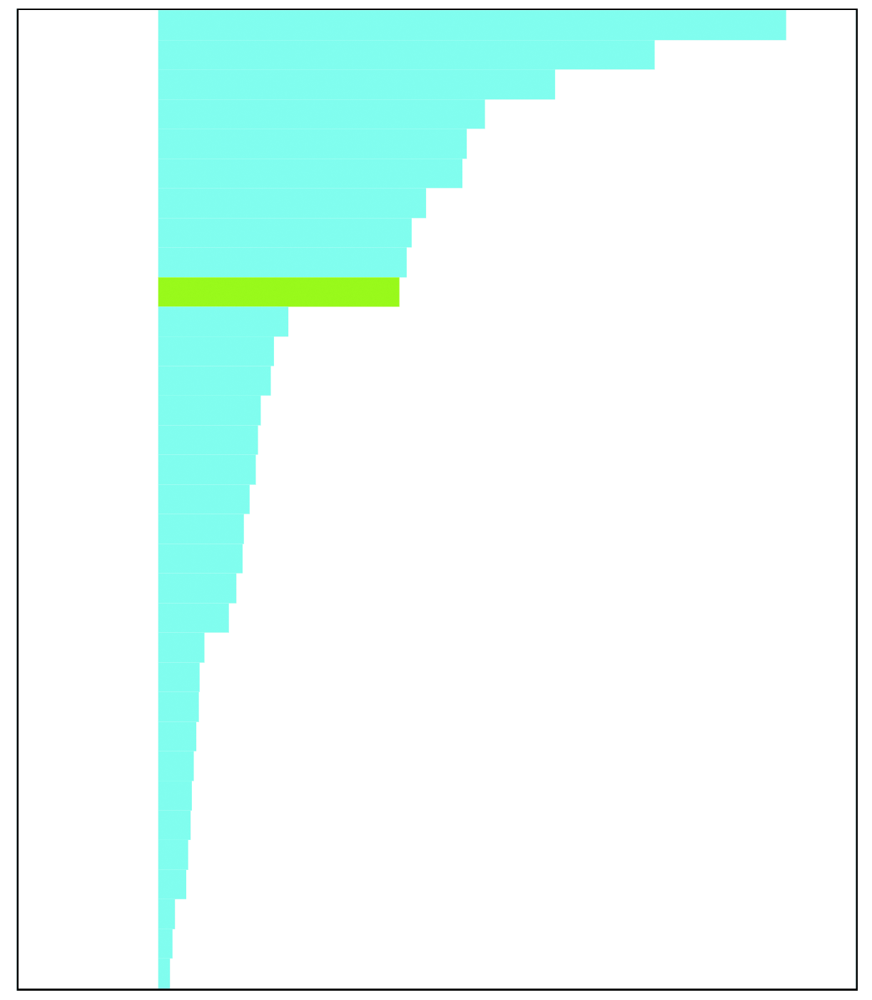
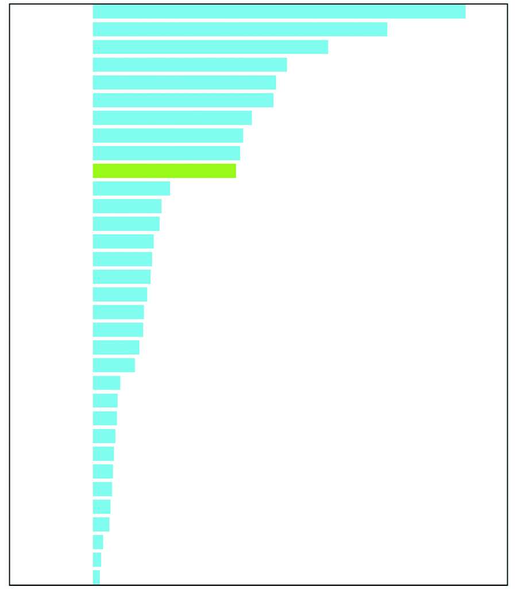
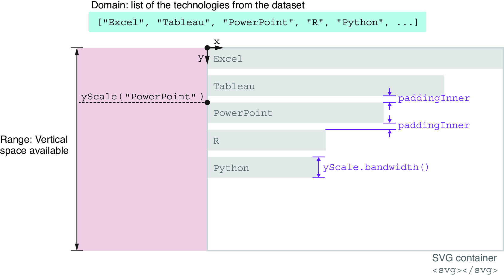

### 3.4.3 分段比例尺 Band scale

The second type of scale we’ll need for our bar chart is a band scale. Band scales are from the fourth family: they accept a discrete input and return a continuous output. D3’s band scale is especially useful for distributing the rectangles of a bar chart within the available space.
我们为条形图需要的第二种刻度是带状刻度。带状刻度属于第四类：它们接受离散输入并返回连续输出。D3 的带状刻度特别适合在可用空间内分布条形图的矩形。

To declare a band scale, we call function `d3.scaleBand()`. In the following code snippet, we save the scale into a constant named `yScale` because this scale is responsible for distributing elements along the y-axis. The domain of our band scale is an array containing all the technologies from our dataset. We generate this array with the JavaScript `map()` function. (Go back to section 1.2.5 if you need a refresher on when and how we use the `map()` function.) Then our range covers all the vertical space available, from 0 px at the top of the SVG container, to 700 px at the bottom of the SVG container:
要声明一个带状比例尺，我们调用函数 `d3.scaleBand()`。在以下代码片段中，我们将比例尺保存到一个名为 `yScale` 的常量中，因为这个比例尺负责沿 y 轴分配元素。我们的带状比例尺的定义域是一个包含我们数据集中所有技术的数组。我们使用 JavaScript 的 `map()` 函数生成这个数组。（如果您需要回顾何时以及如何使用 `map()` 函数，请返回第 1.2.5 节。）然后我们的范围覆盖所有可用的垂直空间，从 SVG 容器顶部的 0 像素到 SVG 容器底部的 700 像素：

```js
const yScale = d3.scaleBand()
  .domain(data.map(d => d.technology))
  .range([0, 700]);
```

Add the band scale inside `createViz()`, before the code related to data binding. When called with a technology from the dataset, the band scale returns the vertical position of the corresponding rectangle. For example, if we pass the string `"Excel"` to `yScale`, it returns `0`. This makes sense because the bar that corresponds to Excel is the first one at the top of the graph. Similarly, if we call `yScale` passing the value `"D3.js"`, it returns `272.72`, which is the vertical position of the top-left corner of the bar corresponding to D3:
在`createViz()`内部添加带状比例尺，放在与数据绑定相关的代码之前。当使用数据集中的技术调用时，带状比例尺返回相应矩形的垂直位置。例如，如果我们将字符串`"Excel"`传递给`yScale`，它返回`0`。这很有道理，因为与 Excel 对应的条形图是图表顶部的第一个条形。同样，如果我们调用`yScale`并传递值`"D3.js"`，它返回`272.72`，这是与 D3 对应的条形图左上角的垂直位置：

```js
yScale("Excel")   // => 0
yScale("D3.js")   // => 272.72
```

Do you remember the calculations we had to perform earlier to set the `y` attributes of the rectangles? Thanks to the band scale, we can now set this attribute extremely easily by passing the name of the technology that is bound to each rectangle to `yScale`:
你还记得我们之前为了设置矩形的 `y` 属性而进行的计算吗？多亏了带状刻度，我们现在可以通过将绑定到每个矩形的技术名称传递给 `yScale` 来非常轻松地设置这个属性：

```js
svg
  .selectAll("rect")
  .data(data)
  .join("rect")
    ...
    .attr("y", d => yScale(d.technology))
    ...
```

Band scales also have a very handy method, `bandwidth()`, that returns the thickness of the bars, which is proportional to the number of bars and the space available. In our bar chart, this thickness corresponds to the `height` attribute of the rectangles. You can see in the next snippet how calling the `bandwidth()` method on the band scale returns the `height` attribute:
带状刻度还有一个非常方便的方法，`bandwidth()`，它返回条形的厚度，这与条形的数量和可用空间成正比。在我们的条形图中，这个厚度对应于矩形的`height`属性。您可以在下一个代码片段中看到，调用带状刻度上的`bandwidth()`方法返回`height`属性：

```js
svg
  .selectAll("rect")
  .data(data)
  .join("rect")
    ...
    .attr("height", yScale.bandwidth())
    ...
```

Save your project, and take a look at it in the browser. As you can see in figure 3.27, the bars cover all the vertical space available in the SVG container, but the absence of padding between them makes the graph look cramped and difficult to read.
保存您的项目，并在浏览器中查看它。如图 3.27 所示，条形图占据了 SVG 容器中所有可用的垂直空间，但它们之间缺乏填充使得图表看起来拥挤且难以阅读。

We can fix it by setting the `paddingInner()` property of the band scale, which specifies the amount of padding between each band and accepts values between `0` and `1`. Here we give it a value of `0.2`, for 20% of the height of the bands:
我们可以通过设置带尺度的 `paddingInner()` 属性来修复它，该属性指定每个带之间的填充量，并接受 `0` 和 `1` 之间的值。这里我们给它一个 `0.2` 的值，表示带高度的 20%：

```js
const yScale = d3.scaleBand()
  .domain(data.map(d => d.technology))
  .range([0, 700])
  .paddingInner(0.2);
```

Once we’re done, our bar chart layout breathes a little more, as you can see in figure 3.28. That’s much better!
一旦我们完成，条形图布局看起来更加宽松，如图 3.28 所示。这样好多了！

Figure 3.29 gives a recap of how the band scale works. First, it takes a domain, the list of technologies from our dataset, and distributes it within the range, the vertical space available in the SVG container. The vertical position of the top-left corner of each rectangle can be retrieved by calling the scale function and passing the technology as an argument (`yScale("PowerPoint")`). Similarly, we can obtain the height of the bars by calling the `bandwidth()` method on the scale (`yScale.bandwidth()`). Finally, by default, the padding between the bars is 0. We can tell D3 the amount of padding that we want between each band by setting the `paddingInner()` property of the band scale and giving it a value between `0` and `1`.
图 3.29 回顾了带状比例尺的工作原理。首先，它获取一个域，即我们数据集中技术的列表，并在范围内分布，即 SVG 容器中可用的垂直空间。每个矩形的左上角的垂直位置可以通过调用比例尺函数并传递技术作为参数来获取 (`yScale("PowerPoint")`)。同样，我们可以通过在比例尺上调用 `bandwidth()` 方法来获得条形的高度 (`yScale.bandwidth()`)。最后，默认情况下，条形之间的填充为 0。我们可以通过设置带状比例尺的 `paddingInner()` 属性并给它一个介于 `0` 和 `1` 之间的值来告诉 D3 我们希望每个带之间的填充量。



##### Figure 3.27 Bars distributed with a band scale and without padding 图 3.27 带有带状刻度且没有填充的条形图



##### Figure 3.28 Bars distributed with a band scale and with padding 图 3.28 带有带状刻度和填充的条形图



##### Figure 3.29 How the band scale distributes the list of technologies within the available vertical space 图 3.29 带状刻度如何在可用的垂直空间内分配技术列表