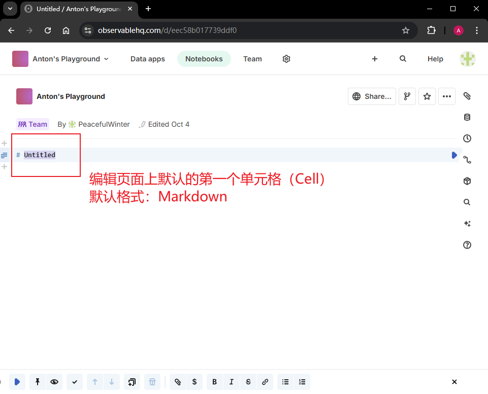

# 3.4.2.2 DIY实战：使用 Observable 在线绘制 D3 条形图


> **写在前面**
>
> 作为本书第三章的有益补充，一名合格的数据可视化从业者应该时刻关注业界最新前沿趋势、主流观点、最佳实践等等。这当中就必然包括 `Observable` 网站资源的合理利用。前面第一章介绍 `Observable` 笔记本功能（`Notebooks`）时，由于作者感觉偏离了本书重点，于是草草几句就结束了。今天就给大家打个样，去探探这个由 `D3.js` 创始人打造的 `Observable` 平台的深浅。

## 1 需求描述

根据目前的专栏进度，第三章的示例条形图除了数据标签还没实现，其他的部件基本都实现了。这次索性就把 D3 工作流那几个节点（如下图所示）从头到尾在 `Observable` 上实现一遍。


**图 1 要同步在 Observable 实现一遍的 D3 数据工作流关键节点**


## 2 操作步骤

首先登录 `Observable` 平台：[https://observablehq.com/](https://observablehq.com/)。用邮箱注册一个帐户或者直接关联 GitHub 帐号即可。登录成功后，从个人主页右上方新建的一个笔记本，如图 2 所示：


**图 2 新建一个 Observable 笔记**

在弹出窗口中为这个新笔记指定一个工作空间（**Workspace**），就相当于一个顶层文件夹。通常默认会选中一个，也可以手动指定。右边的模板就选默认的空白模板（**Blank**）即可，如图 3 所示：


**图 3 为新笔记文件指定一个工作空间**

点击 <kbd>Create notebook</kbd> 按钮，就正式进入 `Observable` 记事本的编辑页面了。此时会看到一个默认的 `Markdown` 格式的单元格，如图 4 所示：



**图 4 进入 Observable 记事本编辑页看到的第一个单元格**

那就用 `Markdown` 来一个华丽的标题吧，输入：`# Ch3.4.3.1 DIY: Demo Bar Chart`，然后按 <kbd>Shift</kbd> + <kbd>Enter</kbd> 快速执行，就有了下面的标题：


**图 5 使用 Markdown 语法添加的记事本一级标题**


### 2.1 加载数据

完成上面的准备工作后，就可以加载数据了。原始的 CSV 数据集需要先上传到 `Observable` 网页，即右侧那个回形针图标：


**图 6 将 CSV 原始数据集上传到 Observable 页面**

上传完毕后，可以看到这个文件的相关信息，显示还未被使用：


**图 7 文件上传完毕时的页面提示信息**

这个数据集该怎么加载，变成我们需要的对象数组呢？熟悉 `Python Jupyter Lab` 的朋友肯定很熟悉这样的界面，其实 `Observable` 就是一个 `JavaScript` 版的 `Jupyter Lab`，所有数据操作都在单元格内进行。`Observable` 提供了 `FileAttachment` 接口来加载数据，要在 `JavaScript` 单元格内这样写：

```js
FileAttachment('data.csv')
```

但这样得到的数据值全是字符串类型的，因此还需要调用一个 `csv()` 方法，并传入一个配置项，实现简单格式的自动转换：

```js
FileAttachment('data.csv').csv({typed: true});
```

然后将结果赋给一个常量 `data`。注意，这里无需添加 `const` 或 `let` 关键字，声明的变量类似 Excel 里的单元格的值，可以全局引用。此外，`Observable` 的单元格严格遵循“单一职责”原则，因此最好写成 `IIFE` 形式：

```js
data = (async function(){
  const data = await FileAttachment('data.csv')
      .csv({typed: true});
  return data.sort((a, b) => d3.descending(a.count, b.count));
})();
```

这样，数据加载 + 转换 + 排序就一气呵成轻松实现了！我这里的排序还用到了一个新的工具函数：`d3.descending(a.count, b.count)`。仔细看，其实我并没有手动导入 D3 这个库，之所以能直接使用，是因为 `Observable` 已经内置了最新版的 `D3.js`（别人好歹是创始人，这点特权还是有的）。最后执行单元格的效果如下：


**图 8 完成数据加载、转换、排序后的 Observable 页面效果截图**


### 2.2 数据绑定

刚才一个单元格就实现了 D3 工作流的三个节点（即查找（文件上传）、加载、格式化），个人感觉比手动去调 `Promise` 省事多了。下一步就该定义 SVG 容器并绑定数据了。`Observable` 单元格支持三大基本类型：`JavaScript` 型、`HTML` 型以及 `Markdown` 型。按照书中的方法创建一个 `div` 元素倒也不是不行，只要在 `HTML` 格式的单元格里创建 `div`，再把样式写到一个 `style` 标签里就搞定了。但是 `Observable` 提供了更快的方式：

```js
chart = {
  const svg = d3.create('svg')
    .attr('viewBox', `0 0 600 700`)
    .style('border', '1px solid black')
    .style('max-width', 800)
    .style('margin-inline', 'auto');

  return svg.node();
}
```

这段代码的最后一句，相当于导出 DOM 节点并赋值给变量 `chart`。同样按下 <kbd>Shift</kbd> + <kbd>Enter</kbd>，页面立刻渲染出了指定的容器：


**图 10 执行 d3.create() 方法可以快速创建 SVG 容器**

因此，数据绑定逻辑只要稍加改动就行了：


**图 11 改造后的 createViz 方法及其调用的写法**

剩下的工作就简单多了（其实整体来讲也没啥难度）。


### 2.3 调整比例

于是来到 D3 数据标准工作流的最后一环：调整比例大小。先定义好两个比例尺：

```js
const xScale = d3.scaleLinear()
  .domain([0, data[0].count])
  .range([0, 450]);

const yScale = d3.scaleBand()
  .domain(data.map(d => d.technology))
  .range([0, 700])
  .paddingInner(0.2);
```

由于 `data` 已经按 `count` 票数值降序排列，这里水平方向的定义域上边界就是 `data[0].count` 。接着再使用 D3 的数据绑定语法完成条形图的渲染：

```js
const byTechName = ({technology: t}) =>
  (t === 'D3.js') ? 'yellowgreen' : 'skyblue';
svg.selectAll('rect')
  .data(data)
  .join('rect')
    .attr('x', 100)
    .attr('y', d => yScale(d.technology))
    .attr('height', yScale.bandwidth())
    .attr('width', d => xScale(d.count))
    .attr('fill', byTechName);
```

这里填充色的设置做了点小改动，提出了一个访问器函数（accessor function）`byTechName`，这样写起来更紧凑。最终完整的 `createViz` 逻辑如下：

```js
createViz = (data, svg) => {
  // Declare D3's scale functions
  const xScale = d3.scaleLinear()
    .domain([0, data[0].count])
    .range([0, 450]);
  
  const yScale = d3.scaleBand()
    .domain(data.map(d => d.technology))
    .range([0, 700])
    .paddingInner(0.2);  // the gap size between 2 bars
  
  // data binding logics ...
  const byTechName = ({technology: t}) =>
    (t === 'D3.js') ? 'yellowgreen' : 'skyblue';
  svg.selectAll('rect')
    .data(data)
    .join('rect')
      .attr('x', 100)
      .attr('y', d => yScale(d.technology))
      .attr('height', yScale.bandwidth())  // i.e. bar height
      .attr('width', d => xScale(d.count))
      .attr('fill', byTechName);
  
  return svg.node();
};
```

运行该单元格，上面定义的 `chart` 单元格就渲染出了想要的条形图：


**图 12 最终在 Observable 的记事本页面渲染出的条形图效果**


## 3 小结 & 复盘

以上演示内容还只是 `Observable` 平台功能的冰山一角，根据最新发布的新闻，`Observable` 不久前已经上线了自己的云平台 `Observable Cloud`，可以像 `GitHub`、`npm` 那样在线托管自己的可视化项目，并且提供了大量实用的工具，比如接入了 AI 的能力，专为数据应用量身打造的线上工作流等等。浏览过程中，我发现 D3 官网还没有和 `Vue.js` 做集成的相关内容，而且 Notebook 页面好像对 `Mocha.js` 这类测试框架不是很友好，目前只测通了断言库 `Chai.js`。窃以为，这些地方恰恰蕴藏着大量的机遇，值得各位 D3 爱好者们前来探索！

最后还是梳理成要点，谈谈这趟试水 `Observable` 平台的切身体会吧：

1. 大胆尝试 `Observable` 环境，遇到问题再小心求证；
2. 多使用 `Observable` 提供的便捷接口、工具函数。`D3.js` 的官方入门文档（[https://d3js.org/getting-started](https://d3js.org/getting-started)）是个不错的切入口；
3. 积极拥抱 D3 生态，不要拘泥于一本书、或者某个单一的环境；
4. `Observable` 创建的记事本还能共享给多人访问，实现同步编辑、实时预览；
5. 多从线上的优秀案例学习 `D3.js` 的不同写法，取长补短，融会贯通。
