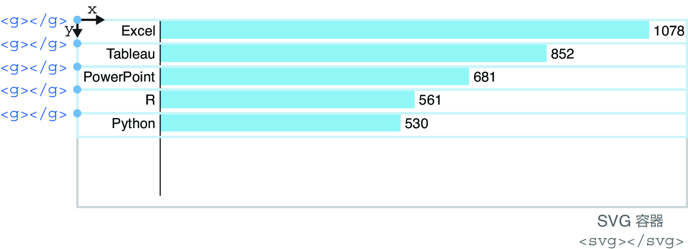
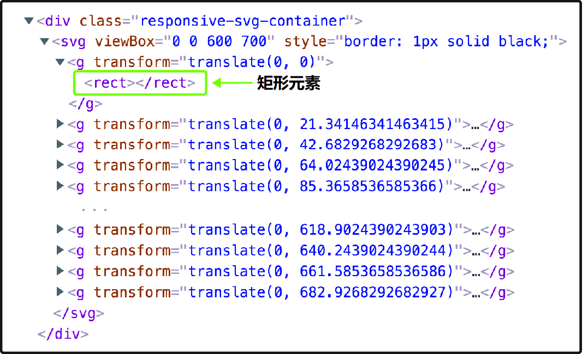
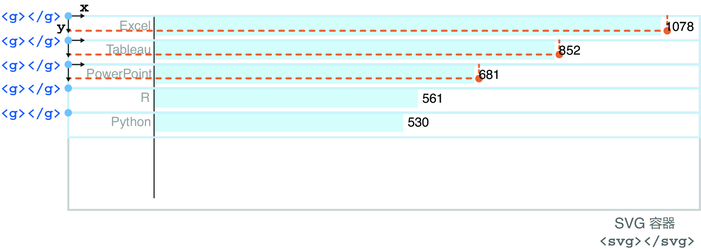

## 3.5 加注图表标签 Adding labels to a chart

示例条形图就快做完了，但目前还不知道哪个矩形条对应哪个技术，也不知道矩形条的长度代表哪些票数。这些问题只要给图表加两组标签（label）就能解决：第一组列出技术名称，放在左侧；第二组则显示各矩形条对应的 `count` 票数值，分别放到各矩形条的最右端。

在基于 SVG 的可视化项目中，标签的制作可以通过 SVG 文本元素（`text`）实现：先将各矩形条分别与两个文本元素相结合，然后将其一同嵌入 SVG 的某个分组元素（group）内。根据第 1 章 1.2.2 节介绍的 SVG 分组元素的知识，这里可以用分组元素将多个子元素视为一个整体进行平移，以便于后续将绑定数据传递给它的后代元素。

接下来需要稍微重构一下代码。首先注释掉与矩形条元素相关的所有代码行，留待后用。在 JavaScript 中，单行注释以双斜杠（`//`）开头，而多行注释则以 `/*` 开始、以 `*/` 结束。

再回到处理数据绑定的那部分代码。此时应该让数据绑定到 SVG 的分组元素（`g`）上，而不是之前的矩形条上。然后将该选择集赋给一个常量 `barAndLabel`：

```js
const barAndLabel = svg
  .selectAll("g")
  .data(data)
  .join("g");
```

为了让矩形条与标签元素同步移动，可以利用 `transform` 属性让各分组元素做垂直平移（vertical translation）。`transform` 变换属性（attribute）上的 `translate` 平移属性（property）接受两个参数：水平平移量，设为 `0`；以及垂直平移量，这里设为各矩形条的垂直坐标，由之前定义好的分段比例尺函数 `yScale` 计算得到：

```js
const barAndLabel = svg
  .selectAll("g")
  .data(data)
  .join("g")
    .attr("transform", d => `translate(0, ${yScale(d.technology)})`);
```

虽然 SVG 的分组元素没有可视化的图形表示，也不以占据某个有界空间的形式存在，但我们仍然可以将其想象成能够封装所有子元素的内容盒。借助 `transform` 属性，这些分组元素实现了垂直方向的均匀排布，如图 3.30 所示。各矩形条及其标签元素将相对于它们所在的父级分组元素进行定位：



**图 3.30 封装了矩形条与标签等后代元素的分组元素在 SVG 容器内的定位情况**

一切就绪后，就可以重新添加矩形条了。如下所示，调用选择集 `barAndLabel`，并将矩形元素添加进去：

```js
const barAndLabel = svg
  .selectAll("g")
  .data(data)
  .join("g")
    .attr("transform", d => `translate(0, ${yScale(d.technology)})`);

barAndLabel
  .append("rect");
```

由于该选择集包含多个分组元素，D3 会分别给每个分组添加一个矩形元素。保存项目并使用检查工具进行查看，确认它们都已经添加到了 DOM 结构中，如图 3.31 所示：



**图 3.31 添加到每个分组元素里的矩形元素示意图**

现在可以取消刚才的注释，把它们用到新加的 `rect` 元素上。D3 数据绑定的一大好处，是绑定的数据会传递给分组内的所有后代元素。因此矩形条依然可以像之前那样拿到数据，唯一的区别是，矩形的 `y` 属性要设为 `0`，因为分组元素已经带着它完成了垂直平移：

```js
barAndLabel
  .append("rect")
    .attr("width", d => xScale(d.count))
    .attr("height", yScale.bandwidth())
    .attr("x", 100)
    .attr("y", 0)  // 矩形不用再做垂直平移，其定位相对于其父级分组元素的位置
    .attr("fill", d => d.technology === "D3.js" ? "yellowgreen":"skyblue");
```

这时就能看到各个矩形条了，效果和之前完全相同（详见图 3.28）。

> **译注**
>
> 为方便查看新的条形图效果，我这里直接附上图 3.28：
>
> 

接下来能可以正式添加标签了！再次调用选择集 `barAndLabel`，将 SVG 文本元素分别添加进去。由于各标签需要展示每个对应的技术名称，因此需要再链式调用一次 `text()` 方法。该方法只接受一个参数：文本元素要显示的文本内容。本例则需要根据每个绑定的数据项动态设置对应的文本内容：

```js
barAndLabel
  .append("text")
    .text(d => d.technology);
```

内容设置好后，再用 `x` 和 `y` 属性给每个标签定位。先来看水平方向，各标签末端要同矩形条的起始位置对齐。矩形条从 `100px` 开始，于是可以把文本元素放在大约 `96px` 的位置，与矩形条保持 `4px` 的间距。然后令其 `text-anchor` 属性（attribute）的值为 `end`，实现标签右对齐。这样 `x` 属性值就代表了各标签的末端位置，如图 3.32 所示：


**图 3.32 各技术标签的定位计算示意图**

再来看垂直方向。由于各标签的定位相对于所在的父级分组元素，只需稍向下平移即可与矩形条居中对齐。注意，SVG 文本元素的垂直定位是相对于它的基线（baseline）而言的。经反复试错与微调，最终给定的 `y` 值为 `12` 像素。位置的微调可以在浏览器的检查工具（inspector）里快速实现：

```js
barAndLabel
  .append("text")
    .text(d => d.technology)
    .attr("x", 96)
    .attr("y", 12)
    .attr("text-anchor", "end");
```

最后，在根据各自的喜好，调用 `style()` 方法设置文本标签的 `font-family` 与 `font-size` 属性，分别确定字体及字号。本例使用的字体为 11 号无衬线字体，如图 3.33 所示：

```js
barAndLabel
  .append("text")
    .text(d => d.technology)
    .attr("x", 96)
    .attr("y", 12)
    .attr("text-anchor", "end")
    .style("font-family", "sans-serif")
    .style("font-size", "11px");
```


**图 3.33 加注了技术标签的条形图效果**

接着，再在矩形条的另一端添加一组标签，显示该技术在问卷调查中的得票数，做法与添加技术名称标签类似。先调用 `barAndLabel` 选择集常量，然后在每个分组元素内添加一个文本元素，再通过链式调用的 `text()` 方法给每项技术指定相应的 `count` 值：

```js
barAndLabel
  .append("text")
    .text(d => d.count)
```

由于计数标签位于矩形条的末端，而矩形条的水平坐标可以通过 `xScale` 函数计算得到。再加上矩形条两边的间距（左边为预留的 `100px`，后边同样保持 `4px` 间隔），这样技术标签的 `x` 属性就能确定了。垂直方向，也令其下移 `12px`，如图 3.34 所示：

```js
barAndLabel
  .append("text")
    .text(d => d.count)
    .attr("x", d => 100 + xScale(d.count) + 4)
    .attr("y", 12)
```



**图 3.34 计数标签的定位计算示意图**

接着，再给技术标签设置 `font-family` 和 `font-size` 属性。注意，计数标签的字号为 `9px`，比技术名称的字号 `11px` 小一些，目的是为了让两组标签保持视觉上的层次感。较大的标签更吸引眼球，也便于让观众理解得票数是次于技术名称的样式设计。

```js
barAndLabel
  .append("text")
    .text(d => d.count)
    .attr("x", d => 100 + xScale(d.count) + 4)
    .attr("y", 12)
    .style("font-family", "sans-serif")
    .style("font-size", "9px");
```

最后一步，再在条形图左侧绘制一条垂直线，作为垂直方向的轴线。在以下代码片段中，我们将这条线段添加到 SVG 容器内。该线段的起点坐标 `(x1, y1)` 为 `(100, 0)`，即 SVG 容器的顶部；终点坐标 `(x2, y2)` 则位于 `(100, 700)`，即容器底部。再指定好线条的描边色，让轴线显示出来：

```js
svg
  .append("line")
    .attr("x1", 100)
    .attr("y1", 0)
    .attr("x2", 100)
    .attr("y2", 700)
    .attr("stroke", "black");
```

如果再把 SVG 容器的边框去掉，最终条形图的效果就应该如图 3.35 所示。该项目也托管到了 GitHub ，可以访问 [http://mng.bz/mjor](http://mng.bz/mjor) 进行访问。值得一提的是，本章给标签预留间距的做法并不常用。业内更通用的实现方案是遵守 **D3 外边距约定（D3 margin convention）**，具体内容将在下一章进行介绍，后续章节也将按这种写法来进行讲解。


**图 3.35 最终实现的在线版 D3 条形图效果，详见：http://mng.bz/mjor**

恭喜您完成了本章的学习——知识点着实很密集！如果还没有掌握讲过的所有概念，也不必过于担心。后续章节还将继续提到这些概念，相信很快就能融会贯通 。


---

> ##### Interview with Krisztina Sz**ű**cs 与克里斯蒂娜·苏茨的访谈
>
> Szűcs is a data visualization designer.
> Szűcs 是一名数据可视化设计师。
>
> *Can you tell us a little bit about your background and how you discovered D3.js?
> 你能告诉我们一些关于你的背景以及你是如何发现 D3.js 的事吗？*
>
> I don’t have a background in coding; I have a masters in graphic design but used a bit of ActionScript in the Flash era. First, I used processing for dataviz, but when I found out online in 2012 that everyone was using this new thing called d3.js and that it was very good for data visualization, I decided to give it a try and learn it.
> 我没有编程背景；我有一个平面设计的硕士学位，但在 Flash 时代使用过一些 ActionScript。起初，我使用 Processing 进行数据可视化，但当我在 2012 年在线发现每个人都在使用这个叫做 d3.js 的新东西，并且它非常适合数据可视化时，我决定尝试学习它。
>
> *How did you learn D3? What were your main challenges, and how did you overcome them?
> 你是如何学习 D3 的？你遇到了哪些主要挑战，如何克服它们的？*
>
> I’m not very keen on learning new libraries or languages. I prefer to learn just one, then use it forever (ha ha). I’m usually very upset when a shiny new thing appears, and it seems to become standard, and I cannot deny anymore that I need to invest the time to learn it.
> 我对学习新的库或语言不是很热衷。我更喜欢只学习一个，然后永远使用它（哈哈）。当一个闪亮的新事物出现，并似乎成为标准时，我通常会感到非常沮丧，我无法再否认我需要花时间去学习它。
>
> So when d3.js appeared, everyone started to talk about it. I already knew that I wanted to create interactive data visualizations, so I decided this was going to be the one (and only one) thing that I was going to learn.
> 所以当 d3.js 出现时，大家都开始讨论它。我已经知道我想创建交互式数据可视化，所以我决定这将是我唯一要学习的东西。
>
> I remember it was more difficult than I expected. I followed the tutorials from *Interactive Data Visualization for the Web* by Scott Murray and then tried to apply what I learned in my own projects. The tutorials worked when I followed every step, but when I finally tried to use those examples with my own data, they failed—because most of the time my real datasets were too complex, and I struggled a lot making them work with d3.js.
> 我记得这比我预期的要困难得多。我跟随了 Scott Murray 的《Web 交互式数据可视化》中的教程，然后尝试将我学到的知识应用到自己的项目中。当我按照每一步进行时，教程是有效的，但当我最终尝试用自己的数据使用那些示例时，它们失败了——因为大多数时候我的真实数据集太复杂，我在使它们与 d3.js 配合工作时遇到了很多困难。
>
> Also, I wanted to create big, unusual visuals from day one, and there were no specific tutorials for those, so it was difficult for me to figure out how to get from the simple bar charts to the unconventional, complicated designs that I had in my mind. I just practiced until I could get the result where every part looked the way I imagined.
> 此外，我想从第一天起就创建大型、独特的视觉效果，但没有具体的教程，因此我很难弄清楚如何从简单的条形图过渡到我脑海中那些非常规、复杂的设计。我只是不断练习，直到每个部分看起来都如我所想。
>
> *Do you use visualization tools other than D3? What’s the place of D3 in your current data visualization workflow?
> 你使用除了 D3 以外的可视化工具吗？D3 在你当前的数据可视化工作流程中占据什么位置？*
>
> I use design tools like Figma to design the look of my visualizations. And I also use Excel and Python, mostly when I work with my datasets or I collect my data.
> 我使用像 Figma 这样的设计工具来设计我的可视化效果。我还使用 Excel 和 Python，主要在处理我的数据集或收集数据时。
>
> When I use design tools, I have a designer mindset, and I do not think about the limitations I have to face or all the challenges I’ll need to solve when I will actually develop the visualization. This helps me not to limit my ideas, and I can create better visuals this way. When the visual look is ready as a static picture, then I switch to “developer mindset,” and I just try to re-create everything as I saw in my designs. Sometimes I make adjustments, but when I design something that is challenging to develop, I force myself to solve the coding problem and not go back and change the design to something simple just to make coding easier for myself. I’ve also found that for me this is the best way to learn D3.js.
> 当我使用设计工具时，我拥有设计师的思维方式，不会考虑我必须面对的限制或在实际开发可视化时需要解决的所有挑战。这帮助我不限制我的想法，这样我可以创造出更好的视觉效果。当视觉效果作为静态图片准备好后，我就切换到“开发者思维”，我只是试图重新创建我在设计中看到的一切。有时我会进行调整，但当我设计一些开发起来具有挑战性的东西时，我会强迫自己解决编码问题，而不是回去把设计改成简单的东西，以便让编码对我来说更容易。我还发现，这对我来说是学习 D3.js 的最佳方式。
>
> *Featured project: Animated Sport Results* (https://krisztinaszucs.com/)
> 特色项目：动画体育成绩 (https://krisztinaszucs.com/)
>
> 
>
> ##### Animated visualization of the Men’s 200 m Backstroke competition at the 2022 FINA World Championship 2022 年国际泳联世界锦标赛男子 200 米仰泳比赛的动画可视化
>
> *Please describe your project “Animated Sport Results.”
> 请描述您的项目“动画体育结果”。*
>
> I was planning to create a project for the 2020 Olympic Games. This is a big world event that many people are interested in, and sport result data is an available resource. I thought that if I created one match visualization, then I would be able to reuse it again many times for other sport events like world championships or even for other sport disciplines that use similar scoring rules.
> 我计划为 2020 年奥运会创建一个项目。这是一个许多人感兴趣的大型世界事件，体育比赛结果数据是一个可用的资源。我想，如果我创建一个比赛可视化，那么我就可以在许多其他体育赛事中重复使用它，比如世界锦标赛，甚至是其他使用类似计分规则的体育项目。
>
> I also wanted the viewers to relive the excitement of a match by not disclosing the final result at the start; I wanted to slowly show the progress.
> 我还希望观众在开始时不透露最终结果，以重温比赛的兴奋感；我想慢慢展示进展。
>
> I love similar visualizations from Chartball.com and the *New York Times*, and those were my inspirations for this project.
> 我喜欢来自 Chartball.com 和纽约时报的类似可视化，这些是我这个项目的灵感来源。
>
> *Can you explain the process of creating this project?
> 你能解释一下创建这个项目的过程吗？*
>
> When I started to work on this project, I knew that I was going to create an animation, and the style would be minimalist with a hint of red, which I connected to Japan in my head (the Olympics were held in Tokyo in 2020).
> 当我开始着手这个项目时，我知道我将要创建一个动画，风格将是极简主义，并带有一丝红色，这让我在脑海中联想到日本（2020 年奥运会在东京举行）。
>
> 
>
> ##### Multiple data visualizations created by Krisztina Sz**ű**cs for the “Animated Sport Results” project 由 Krisztina Szűcs 为“动画体育成绩”项目创建的多个数据可视化
>
> But I didn’t know which sport event I was going to visualize, so I created a bunch of sketches for different sport disciplines like high jump, long jump, javelin or hammer throw, running, indoor cycling, etc. . . . also something for water polo, which was a score progress visualization (bottom-right image in figure 2.19). I quickly realized that the score progress visualization would be the one that I could reuse the most, and once I was happy with the look, I moved on to coding it.
> 但我不知道要可视化哪个体育赛事，所以我为不同的体育项目创建了一些草图，比如跳高、跳远、标枪或铁饼、跑步、室内自行车等等……还有水球的东西，这是一个得分进度可视化（图 2.19 右下角的图像）。我很快意识到得分进度可视化是我可以重复使用的最多的，一旦我对外观满意，就开始编码。
>
> Of course, this was months before the Olympics, and I didn’t have any data yet, so I used previous Olympic results as sample data. I also created a UI for myself around the main visualization that made it easy for me to quickly switch between color palettes or datasets.
> 当然，这是在奥运会前几个月，我还没有任何数据，所以我使用了之前的奥运会结果作为样本数据。我还为自己创建了一个用户界面，围绕主要可视化，使我能够轻松快速地在颜色调色板或数据集之间切换。
>
> I was ready weeks before the Olympics, and the UEFA European Football Championship happened around that time, so even though I created my visualization for 10+ goal matches, I tried to test it with soccer results. I loaded soccer data files, and the visualization worked even with 1-3 goals. I also extended visualization with the penalty scores around this time.
> 我在奥运会前几周就准备好了，而欧洲足球锦标赛恰好在那个时候举行，所以尽管我为 10 个以上进球的比赛创建了可视化，我还是尝试用足球结果进行测试。我加载了足球数据文件，即使是 1-3 个进球，可视化也能正常工作。我还在这个时候扩展了可视化，加入了点球得分。
>
> 
>
> ##### Score progress visualization exploring the results from the 2021 European Football Championship 得分进度可视化，探索 2021 年欧洲足球锦标赛的结果
>
> But when the Olympics started, I could not get the data for the matches because they were published in a PDF format on the official website. I was able to create and publish only two to three animations because getting the data from the PDF was a tedious manual process which I didn’t plan for. This taught me that I should have looked for better data sources, and luckily other events like world championships or sport associations’ websites had better and more accessible data. I created a lot more of these animations after the Olympics when I had better data sources.
> 但当奥运会开始时，我无法获取比赛数据，因为它们以 PDF 格式发布在官方网站上。我只能创建和发布两到三个动画，因为从 PDF 中获取数据是一个繁琐的手动过程，我没有提前计划好。这让我明白我应该寻找更好的数据来源，幸运的是，其他赛事如世界锦标赛或体育协会的网站有更好且更易获取的数据。在奥运会之后，当我有了更好的数据来源时，我创建了更多这样的动画。
>
> *Did you create the animations with D3, or do you use another library or tool?
> 你是用 D3 创建动画，还是使用其他库或工具？*
>
> I only used D3.js, but for exporting the images I recorded my screen with a screen recording software—ScreenToGif.
> 我只使用了 D3.js，但为了导出图像，我使用屏幕录制软件 ScreenToGif 录制了我的屏幕。
>
> *You have such a recognizable style! How did it evolve over time? Any trick on finding “your voice” in the field of data visualization?
> 你有如此独特的风格！它是如何随着时间演变的？在数据可视化领域找到“你的声音”有什么技巧吗？*
>
> Learning graphic design in university gave me the basics, but current graphic design trends (print, brand design, packaging design, typography) also influence my style a lot. I browse graphic design sites daily looking for inspiration. When I find a visual element or pattern that I really like, I immediately start to think “This could be a dataviz.”
> 在大学学习平面设计让我掌握了基础，但当前的平面设计趋势（印刷、品牌设计、包装设计、排版）也对我的风格产生了很大影响。我每天浏览平面设计网站寻找灵感。当我发现一个我非常喜欢的视觉元素或图案时，我会立刻开始思考“这可以是一个数据可视化。”
>
> Of course, not every visual trend can work with a chart, but I learn a lot while I try to figure out how it could be possible to re-create a specific but unusual look in D3.js.
> 当然，并不是每种视觉趋势都能与图表配合，但我在尝试弄清楚如何在 D3.js 中重新创建一种特定但不寻常的外观时学到了很多。
>
> *Which tips would you share with our readers about learning D3 and creating personal projects?
> 您会与我们的读者分享哪些关于学习 D3 和创建个人项目的建议？*
>
> Separate the design and the coding phase in your process. Design the final look first while deliberately avoiding thinking about how difficult it will be to develop what you’ve created. This way, you’ll always encounter new problems that you need to solve and you’ll learn lots of new tricks.
> 在您的过程中，将设计和编码阶段分开。首先设计最终的外观，同时故意避免考虑开发您所创建的内容将有多困难。这样，您将始终遇到需要解决的新问题，并且您将学到许多新技巧。
>
> If design is not your strong suit, you can always search for a great visualization and then just try to re-create it from scratch as practice.
> 如果设计不是你的强项，你可以随时寻找一个很好的可视化，然后尝试从头开始重新创建它作为练习。
