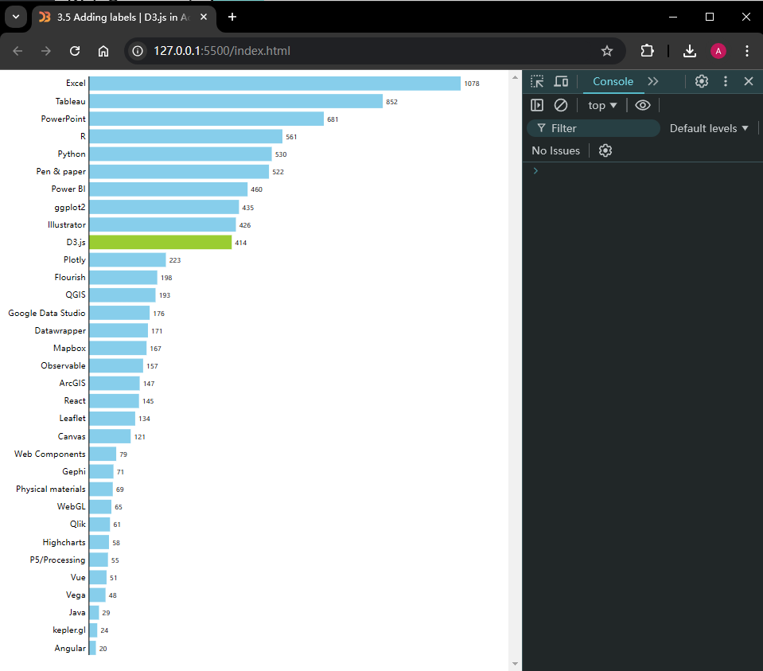

## 3.5 加注图表标签 Adding labels to a chart

示例条形图就快做完了，但目前还不知道哪个矩形条对应哪个技术，也不知道矩形条的长度代表哪些票数。这些问题只要给图表加两组标签（label）就能解决：第一组列出技术名称，放在左侧；第二组则显示各矩形条对应的 `count` 票数值，分别放到各矩形条的最右端。

在基于 SVG 的可视化项目中，标签的制作可以通过 SVG 文本元素（`text`）实现：先将各矩形条分别与两个文本元素相结合，然后将其一同嵌入 SVG 的某个分组元素（group）内。根据第 1 章 1.2.2 节介绍的 SVG 分组元素的知识，这里可以用分组元素将多个子元素视为一个整体进行平移，以便于后续将绑定数据传递给它的后代元素。

接下来需要稍微重构一下代码。首先注释掉与矩形条元素相关的所有代码行，留待后用。在 JavaScript 中，单行注释以双斜杠（`//`）开头，而多行注释则以 `/*` 开始、以 `*/` 结束。

再回到处理数据绑定的那部分代码。此时应该让数据绑定到 SVG 的分组元素（`g`）上，而不是之前的矩形条上。然后将该选择集赋给一个常量 `barAndLabel`：

```js
const barAndLabel = svg
  .selectAll("g")
  .data(data)
  .join("g");
```

为了让矩形条与标签元素同步移动，可以利用 `transform` 属性让各分组元素做垂直平移（vertical translation）。`transform` 变换属性（attribute）上的 `translate` 平移属性（property）接受两个参数：水平平移量，设为 `0`；以及垂直平移量，这里设为各矩形条的垂直坐标，由之前定义好的分段比例尺函数 `yScale` 计算得到：

```js
const barAndLabel = svg
  .selectAll("g")
  .data(data)
  .join("g")
    .attr("transform", d => `translate(0, ${yScale(d.technology)})`);
```

虽然 SVG 的分组元素没有可视化的图形表示，也不以占据某个有界空间的形式存在，但我们仍然可以将其想象成能够封装所有子元素的内容盒。借助 `transform` 属性，这些分组元素实现了垂直方向的均匀排布，如图 3.30 所示。各矩形条及其标签元素将相对于它们所在的父级分组元素进行定位：


**图 3.30 封装了矩形条与标签等后代元素的分组元素在 SVG 容器内的定位情况**

一切就绪后，就可以重新添加矩形条了。如下所示，调用选择集 `barAndLabel`，并将矩形元素添加进去：

```js
const barAndLabel = svg
  .selectAll("g")
  .data(data)
  .join("g")
    .attr("transform", d => `translate(0, ${yScale(d.technology)})`);

barAndLabel
  .append("rect");
```

由于该选择集包含多个分组元素，D3 会分别给每个分组添加一个矩形元素。保存项目并使用检查工具进行查看，确认它们都已经添加到了 DOM 结构中，如图 3.31 所示：


**图 3.31 添加到每个分组元素里的矩形元素示意图**

现在可以取消刚才的注释，把它们用到新加的 `rect` 元素上。D3 数据绑定的一大好处，是绑定的数据会传递给分组内的所有后代元素。因此矩形条依然可以像之前那样拿到数据，唯一的区别是，矩形的 `y` 属性要设为 `0`，因为分组元素已经带着它完成了垂直平移：

```js
barAndLabel
  .append("rect")
    .attr("width", d => xScale(d.count))
    .attr("height", yScale.bandwidth())
    .attr("x", 100)
    .attr("y", 0)  // 矩形不用再做垂直平移，其定位相对于其父级分组元素的位置
    .attr("fill", d => d.technology === "D3.js" ? "yellowgreen":"skyblue");
```

这时就能看到各个矩形条了，效果和之前完全相同（详见图 3.28）。

> **译注**
>
> 为方便查看新的条形图效果，我这里直接附上图 3.28：
>
> 

接下来能可以正式添加标签了！再次调用选择集 `barAndLabel`，将 SVG 文本元素分别添加进去。由于各标签需要展示每个对应的技术名称，因此需要再链式调用一次 `text()` 方法。该方法只接受一个参数：文本元素要显示的文本内容。本例则需要根据每个绑定的数据项动态设置对应的文本内容：

```js
barAndLabel
  .append("text")
    .text(d => d.technology);
```

内容设置好后，再用 `x` 和 `y` 属性给每个标签定位。先来看水平方向，各标签末端要同矩形条的起始位置对齐。矩形条从 `100px` 开始，于是可以把文本元素放在大约 `96px` 的位置，与矩形条保持 `4px` 的间距。然后令其 `text-anchor` 属性（attribute）的值为 `end`，实现标签右对齐。这样 `x` 属性值就代表了各标签的末端位置，如图 3.32 所示：


**图 3.32 各技术标签的定位计算示意图**

再来看垂直方向。由于各标签的定位相对于所在的父级分组元素，只需稍向下平移即可与矩形条居中对齐。注意，SVG 文本元素的垂直定位是相对于它的基线（baseline）而言的。经反复试错与微调，最终给定的 `y` 值为 `12` 像素。位置的微调可以在浏览器的检查工具（inspector）里快速实现：

```js
barAndLabel
  .append("text")
    .text(d => d.technology)
    .attr("x", 96)
    .attr("y", 12)
    .attr("text-anchor", "end");
```

最后，在根据各自的喜好，调用 `style()` 方法设置文本标签的 `font-family` 与 `font-size` 属性，分别确定字体及字号。本例使用的字体为 11 号无衬线字体，如图 3.33 所示：

```js
barAndLabel
  .append("text")
    .text(d => d.technology)
    .attr("x", 96)
    .attr("y", 12)
    .attr("text-anchor", "end")
    .style("font-family", "sans-serif")
    .style("font-size", "11px");
```


**图 3.33 加注了技术标签的条形图效果**

接着，再在矩形条的另一端添加一组标签，显示该技术在问卷调查中的得票数，做法与添加技术名称标签类似。先调用 `barAndLabel` 选择集常量，然后在每个分组元素内添加一个文本元素，再通过链式调用的 `text()` 方法给每项技术指定相应的 `count` 值：

```js
barAndLabel
  .append("text")
    .text(d => d.count)
```

由于计数标签位于矩形条的末端，而矩形条的水平坐标可以通过 `xScale` 函数计算得到。再加上矩形条两边的间距（左边为预留的 `100px`，后边同样保持 `4px` 间隔），这样技术标签的 `x` 属性就能确定了。垂直方向，也令其下移 `12px`，如图 3.34 所示：

```js
barAndLabel
  .append("text")
    .text(d => d.count)
    .attr("x", d => 100 + xScale(d.count) + 4)
    .attr("y", 12)
```


**图 3.34 计数标签的定位计算示意图**

接着，再给技术标签设置 `font-family` 和 `font-size` 属性。注意，计数标签的字号为 `9px`，比技术名称的字号 `11px` 小一些，目的是为了让两组标签保持视觉上的层次感。较大的标签更吸引眼球，也便于让观众理解得票数是次于技术名称的样式设计。

```js
barAndLabel
  .append("text")
    .text(d => d.count)
    .attr("x", d => 100 + xScale(d.count) + 4)
    .attr("y", 12)
    .style("font-family", "sans-serif")
    .style("font-size", "9px");
```

最后一步，再在条形图左侧绘制一条垂直线，作为垂直方向的轴线。在以下代码片段中，我们将这条线段添加到 SVG 容器内。该线段的起点坐标 `(x1, y1)` 为 `(100, 0)`，即 SVG 容器的顶部；终点坐标 `(x2, y2)` 则位于 `(100, 700)`，即容器底部。再指定好线条的描边色，让轴线显示出来：

```js
svg
  .append("line")
    .attr("x1", 100)
    .attr("y1", 0)
    .attr("x2", 100)
    .attr("y2", 700)
    .attr("stroke", "black");
```

如果再把 SVG 容器的边框去掉，最终条形图的效果就应该如图 3.35 所示。该项目也托管到了 GitHub ，可以访问 [http://mng.bz/mjor](http://mng.bz/mjor) 进行访问。值得一提的是，本章给标签预留间距的做法并不常用。业内更通用的实现方案是遵守 **D3 外边距约定（D3 margin convention）**，具体内容将在下一章进行介绍，后续章节也将按这种写法来进行讲解。


**图 3.35 最终实现的在线版 D3 条形图效果，详见：http://mng.bz/mjor**

恭喜您完成了本章的学习——知识点着实很密集！如果还没有掌握讲过的所有概念，也不必过于担心。后续章节还将继续提到这些概念，相信很快就能融会贯通 。

> **译注**
>
> 实测时发现，左边标签的字号取 `11px` 时部分标签显示不全，调整为 `10px` 正常。相应的得票数标签也最好该小些，设为 `8px` 比较合适（相关源码已同步上传到 CSDN 下载资源）：
>
> 
>
> **补图 1 本地实测并重新调整字号后的 D3 条形图效果**

---

> **人物专访：克里斯蒂娜·苏茨（Krisztina Szűcs）**
>
> **苏茨（Szűcs）** 是一名数据可视化设计师 [^1]。
>
> **【问】能否介绍一下您的背景，以及您是如何发现 D3.js 的？**
>
> **【Szűcs】** 好的。我并没有编程相关的背景，我拿的是平面设计的硕士学位，只是在 Flash 盛行的时代接触过一些 `ActionScript`。起初，我用的是 `Processing` [^2] 来进行数据可视化的创作；但当我在 2012 年上网时，发现几乎人人都在尝试这个叫 d3.js 的新鲜事物，并且它还非常适合做数据可视化，我这才决定试着去学习它的。
>
> **【问】那您是怎样学习 D3 的呢？其间都遇到过哪些主要困难，后来又是怎么克服它们的呢？**
>
> **【Szűcs】** 我对学习新的工具库或者语言其实并不很热衷，反倒更喜欢只学一门，然后一直用下去（哈哈）。当一个崭新的新事物闪亮登场时，我通常会很不高兴，因为它貌似成了业内的新标配，而我自己也再无法将它拒之门外，不得不投入时间和精力去学习了解它了。
>
> 因此，当 D3.js 出现时，每个人都开始谈论起它来。我那会儿也已经知道自己想要创建的，是具有交互效果的数据可视化作品，所以就做了个决定：学习 D3 是我当时必须得拿下的一件事，也是唯一的一件。
>
> 我记得这比我预想的要困难得多。我按照 ***Scott Murray*** 编写的教程《Web 交互式数据可视化》（*Interactive Data Visualization for the Web*） 进行学习，然后尝试将所学应用到自己的项目中。一开始按照教程的每一步来操作，这些知识都很有用；可当我最终尝试用自己的数据来应用这些示例时，却遭遇了失败——因为大多数情况下我的真实数据集都太复杂了，在让这些数据与 D3.js 有机结合的过程中，我着实遇到了不小的困难。
>
> 此外，我从一开始就想制作大型的、与众不同的视觉效果，而当时并没有专门的教程，所以一时也很难弄明白如何从简单的柱状图过渡到我脑海中那些非常规的复杂设计。我也只能反复练习与尝试，直到每个部分都和我想象中的效果一致才肯罢休。
>
> **【问】除了 D3 之外，您还用过其他可视化工具吗？在您当前的数据可视化工作流程中，D3 大概处在一个怎样的位置？**
>
> **【Szűcs】** 我用过像 `Figma` 这样的设计工具来设计我的可视化作品外观；同时还用过 `Excel` 和 `Python`，主要是进行一些数据集的处理或者收集方面的工作。
>
> 在使用设计工具时，我会抱着设计师的心态，先不去想那些在实际开发可视化作品时必须要面对的限制条件、或者不得不解决的所有难题。这有助于我避免限制自己的想法，从而构建出更好的视觉效果。当视觉效果以静态图片的形式呈现出来后，我就会切换到“开发者思维”，尝试重新创建我在设计稿中看到的一切。有时我会做一些调整，但当我设计的东西在开发时遭遇挑战，我会强迫自己先去解决代码方面的难题，而不是先给编程一路开绿灯，回头再把设计改成简单的东西。我还发现，对我来说这是学习 D3.js 的最佳方法。
>
> 【佳作赏析：动画版体坛赛事（详见：[https://krisztinaszucs.com/](https://krisztinaszucs.com/)）】
>
> 
>
> **图 1 国际泳联 2022 世锦赛男子 200 米仰泳比赛的动画演示截图**
>
> **【问】和我们说说您创作的这部作品（*Animated Sport Results*，动画版体坛赛事）吧。**
>
> **【Szűcs】** 我当时本来一直打算为 2020 年奥运会创作一部可视化作品。国际泳联 2022 年举办的这次世锦赛刚好就是个吸引了很多人关注的一项盛大国际体育赛事，并且里面的赛事数据资源也是现成的。我想，要是能创建一个与比赛相关的可视化作品，那么今后就可以在其他体育赛事（比如世锦赛）、甚至其他使用类似计分规则的体育项目中多次复用了。
>
> 我也希望观众能重温比赛的精彩，所以没有一开始就公布最终结果，而是慢慢地展示比赛的进程。
>
> 我很喜欢 [Chartball.com](https://www.chartball.com/) [^3] 网站和《纽约时报》上类似的可视化设计，它们都是我这部作品的灵感来源。
>
> **【问】您能再分享分享下面这部作品的创作过程吗？**
>
> **【Szűcs】** 刚开始着手这个项目时，我就明确了自己要创作的是一部动画版的作品，并且主打极简主义风格。作品中要带有一抹红色，这让我在脑海中联想到了日本（2020 年奥运会就是在东京举办的）。
>
> 
>
> **图 2 Krisztina Szűcs 为其作品《Animated Sport Results》准备的可视化设计草图**
>
> **【Szűcs】** 然而我并不知道具体要为哪项体育赛事构建可视化项目，所以就依次为跳高、跳远、标枪、铁饼、跑步、室内自行车……等不同的体育项目绘制了许多草图，最后还为水球项目设计了一版和得分进度相关的可视化效果（即上图右下角那幅）。不久我就意识到，得分进度可视化将会是我复用频率最高的一个设计，一旦对外观感到满意，我就开始着手写代码了。
>
> 当然，当时离奥运会还有几个月，我还没拿到任何数据，所以用了上届奥运会的比赛成绩作为样本数据。此外，我还给自己创建了一个以可视化主体效果为中心的用户界面，以便在调色板或数据集之间快速切换。
>
> 我在奥运会开幕的前几周便做好了准备，刚好欧洲足球锦标赛也在那段时间举行。尽管我的可视化作品都是为进球数在十个以上的赛事设计的，但还是准备用足球比赛的结果来进行预演。我加载了足球比赛的数据文件，即使只有 1 ~ 3 个进球，可视化也能正常工作。其间我还做了些改进，引入了点球得分相关的可视化效果。
>
> 
>
> **图 3 根据 2021 年欧洲足球锦标赛的结果而尝试创作的得分情况可视化效果截图**
>
> **【Szűcs】** 但奥运会开赛后，我无法拿到最新的比赛数据，因为数据都是以 PDF 格式发布在官方网站上的。这期间由于从 PDF 获取数据是一个相当繁琐的手动过程，这是我始料未及的，因此只成功制作并发布了两三个动画作品。这次经历也让我明白，应该去寻找更好的数据源进行创作。所幸其他赛事，比如世锦赛或体育协会的网站可以提供质量更好、也更易获取的数据源。在奥运会结束后，我拿到了更好的数据源，才创作出了更多这样的动画作品。
>
> **【问】您是用 D3 创作的这些动画，还是用了其他的什么库或者工具？**
>
> **【Szűcs】** 我只用了 `D3.js`，但为了导出图片，我还用了录屏软件 `ScreenToGif` 来录制屏幕。
>
> **【问】您的作品风格极具辨识度，它们是怎么逐步演变过来的呢？在数据可视化领域有没有什么诀窍可以树立像您的作品这样的影响力（*your voice*）呢？**
>
> **【Szűcs】** 我在大学期间学习的平面设计知识无疑为我打下了坚实的基础，但当下的平面设计趋势（印刷、品牌设计、包装设计、排版等等）也对我的设计风格产生了很大影响。每天我都会浏览平面设计相关的网站来不断捕捉灵感。每当发现非常喜欢的视觉元素或设计图案，我就会立即开始思考“这可能是个不错的可视化应用（dataviz）”。
>
> 当然，并不是所有的视觉趋势都可以用图表来表示；但我在努力弄清怎样借助 `D3.js` 来重塑某些特定而又不寻常的外观效果的过程中，收获了很多东西。
>
> **【问】您在学习 D3 和创建个人项目方面，有没有什么想与读者朋友们分享的技巧呢？**
>
> **【Szűcs】** 要注意将设计和编码阶段分开（Separate the design and the coding phase in your process）。先设计出最终的外观效果，与此同时要主动屏蔽那些让你觉得后续开发阶段实现起来会有多么困难的任何想法。这样，才能不断遇到需要解决的新问题，从而学到很多新技巧。
>
> 如果设计不是你的强项，作为日常练习也可以随时去搜寻一些优秀的可视化作品，然后试着从头开始重新创作一遍。


---

[^1]: 更多专访人物信息，可参阅 ***Krisztina Szűcs*** 的个人网站：[https://krisztinaszucs.com/](https://krisztinaszucs.com/)
[^2]: **Processing** 是一个基于 **Java** 的开源编程语言和环境，旨在通过简化代码来帮助艺术家和设计师创造视觉艺术和交互作品。更多详情，详见 **Processing** 官方：[https://processing.org/](https://processing.org/)
[^3]: Chartball 是一个专注于体育统计数据可视化的知名网站，提供直观的图表和分析工具，尤其是篮球和棒球相关的赛事数据。详见网站首页：[https://www.chartball.com/](https://www.chartball.com/)


