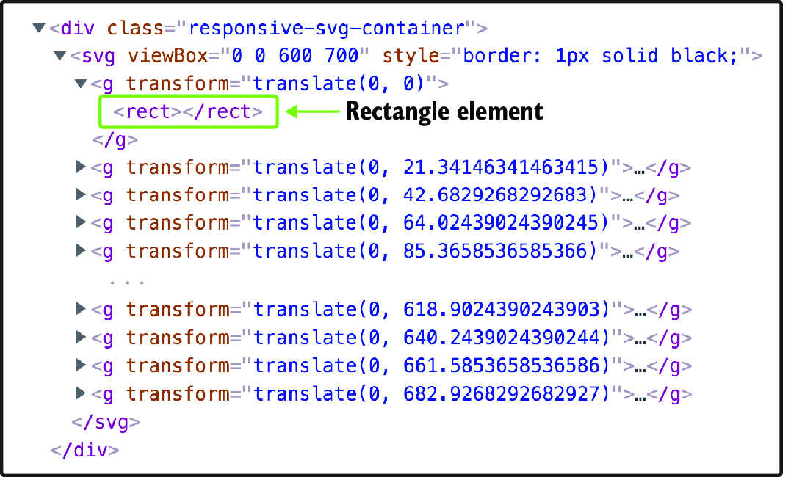
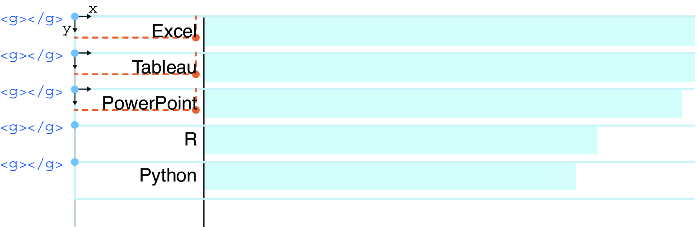
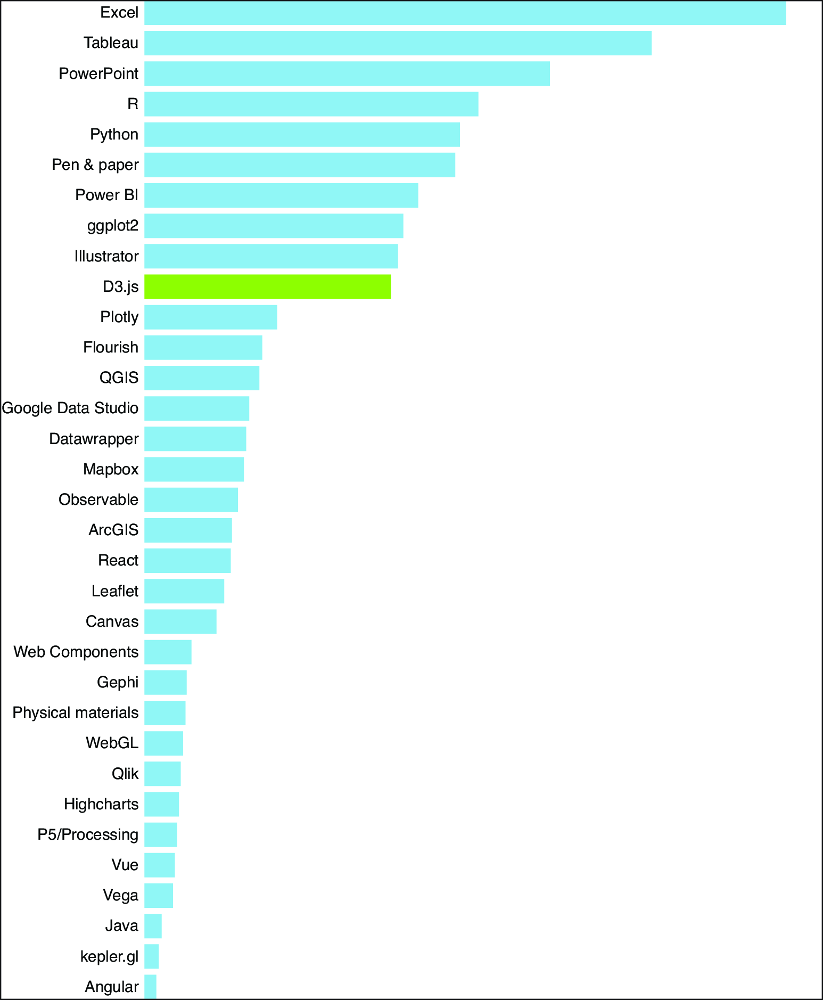
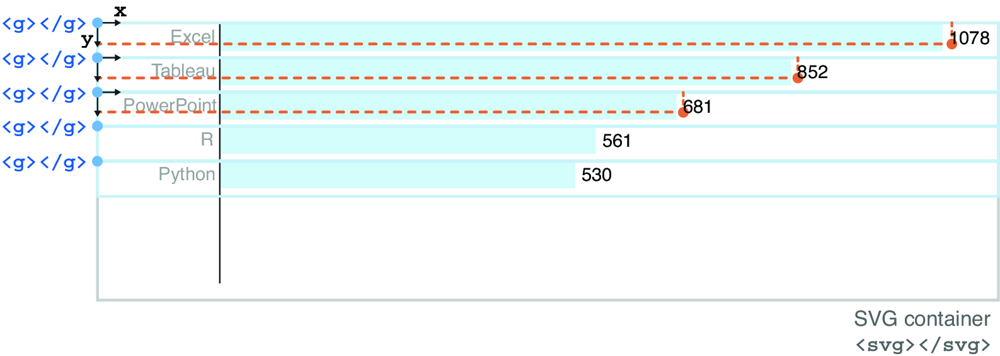
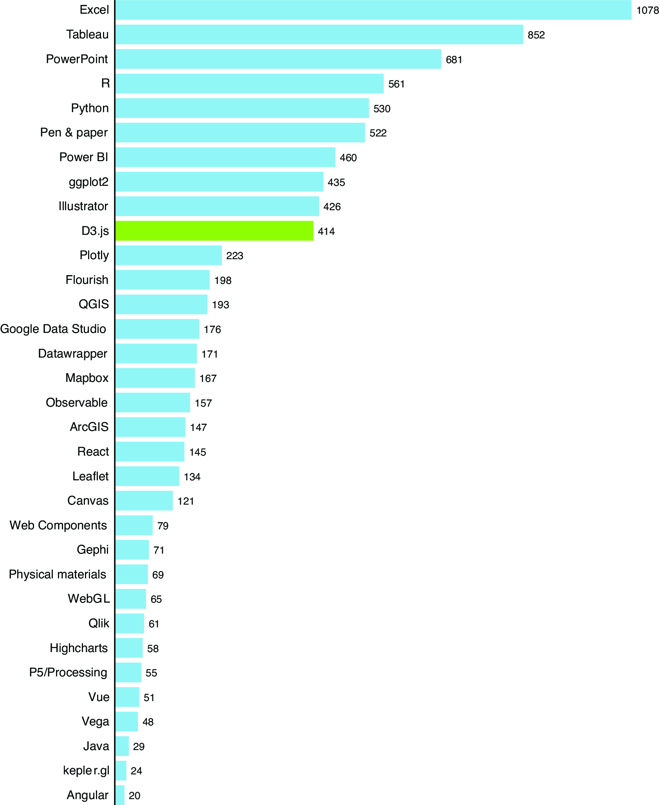
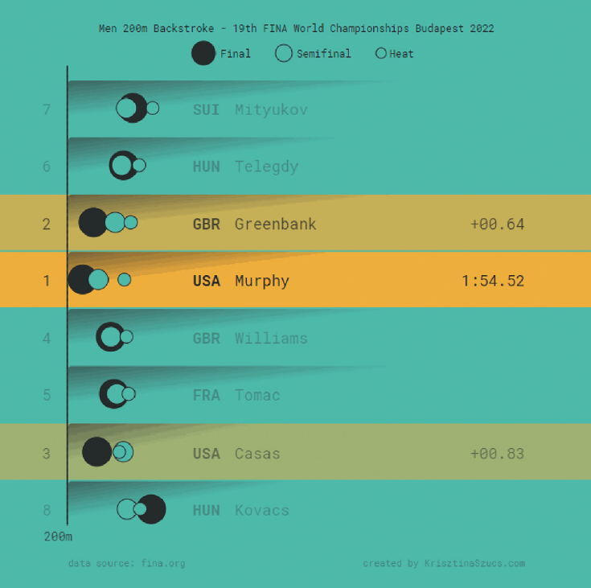
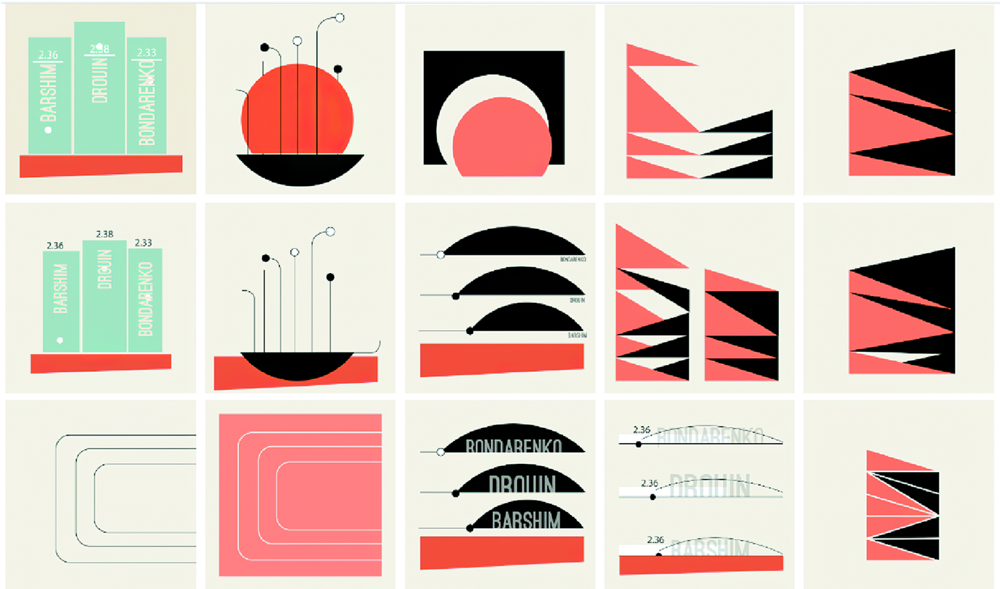
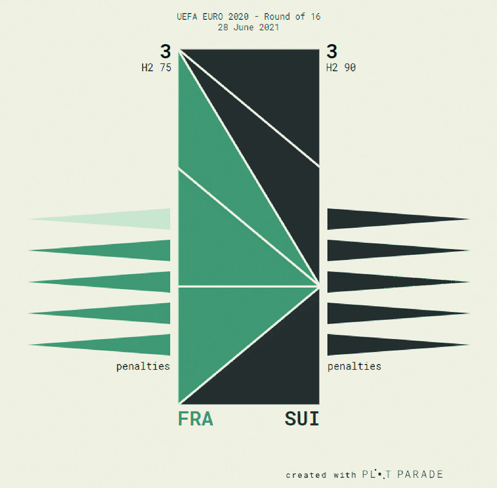

## 3.5 加注图表标签 Adding labels to a chart

Our bar chart is almost complete, but it’s currently impossible to know which rectangle corresponds to which technology and which values the lengths of the bars represent. We’ll rectify this by adding two sets of labels to the chart. The first set of labels will be the name of the technologies listed on the left side. The second one will be the count associated with each bar and positioned at the tip of the rectangles.
我们的柱状图几乎完成，但目前无法知道哪个矩形对应于哪个技术，以及条形的长度代表哪些值。我们将通过向图表添加两组标签来纠正这一点。第一组标签将在左侧列出技术名称。第二组标签将是与每个条形相关的计数，并位于矩形的顶部。

In SVG-based visualizations, we make labels with SVG text elements. We’ll have two text elements combined with each rectangle and will nest each rectangle and its related labels into an SVG group. If you remember our discussion about SVG groups from chapter 1, section 1.2.2, we use groups to move multiple elements as one. They are also handy for passing bound data to their descendants, as you’ll see here.
在基于 SVG 的可视化中，我们使用 SVG 文本元素制作标签。我们将每个矩形与两个文本元素结合，并将每个矩形及其相关标签嵌套到一个 SVG 组中。如果你还记得我们在第 1 章第 1.2.2 节关于 SVG 组的讨论，我们使用组来将多个元素作为一个整体移动。它们对于将绑定数据传递给其后代也很方便，正如你在这里看到的。

Let’s start by refactoring our code a little bit. First, comment out all the lines related to the attributes of the rectangle elements. We’ll reuse them in a few minutes. In JavaScript, single-line comments start with two forward slashes (`//`), while multiline comments start with `/*` and end with `*/`.
让我们先稍微重构一下我们的代码。首先，将与矩形元素属性相关的所有行注释掉。我们将在几分钟内重用它们。在 JavaScript 中，单行注释以两个斜杠（ `//` ）开头，而多行注释以 `/*` 开始并以 `*/` 结束。

Now go back to the data-binding piece of code. Instead of binding data onto rectangles, use SVG groups (`g`). We also save the selection in a constant named `barAndLabel`:
现在回到数据绑定的代码部分。不要将数据绑定到矩形上，而是使用 SVG 组 ( `g` )。我们还将选择保存到一个名为 `barAndLabel` 的常量中：

```js
const barAndLabel = svg
  .selectAll("g")
  .data(data)
  .join("g");
```

For the rectangles and their labels to move together, we apply a vertical translation to each group via the `transform` attribute. The `translate` property of the transform attribute takes two parameters: the horizontal translation, which we set to `0`, and the vertical translation, which corresponds to the vertical position of each bar. Note how we call the `yScale` function to find this position, exactly as we did previously for the rectangles:
为了使矩形及其标签一起移动，我们通过 `transform` 属性对每个组应用垂直平移。变换属性的 `translate` 属性接受两个参数：水平平移，我们设置为 `0` ，以及垂直平移，对应于每个条形的垂直位置。注意我们如何调用 `yScale` 函数来找到这个位置，正如我们之前对矩形所做的那样：

```js
const barAndLabel = svg
  .selectAll("g")
  .data(data)
  .join("g")
    .attr("transform", d => `translate(0, ${yScale(d.technology)})`);
```

Although SVG groups have no graphical representation and don’t exist as a bounded space, we can imagine them as boxes that encapsulate all of their child elements. Thanks to the `transform` attribute, the groups are spread over the vertical height of the SVG container, as illustrated in figure 3.30. The position of the rectangle and labels will be relative to their parent group.
尽管 SVG 组没有图形表示，并且不存在作为一个有界空间，但我们可以将它们想象成封装所有子元素的盒子。由于 `transform` 属性，这些组在 SVG 容器的垂直高度上展开，如图 3.30 所示。矩形和标签的位置将相对于它们的父组。


##### Figure 3.30 Groups positioned within the SVG container and encapsulating their descendent rectangle and labels 图 3.30 组在 SVG 容器内的位置，封装其后代矩形和标签

Now that our groups are ready, let’s add back the rectangles. Call the `barAndLabel` selection, and append rectangle elements into it:
现在我们的组已经准备好了，让我们添加回矩形。调用 `barAndLabel` 选择，并将矩形元素附加到其中：

```js
const barAndLabel = svg
  .selectAll("g")
  .data(data)
  .join("g")
    .attr("transform", d => `translate(0, ${yScale(d.technology)})`);

barAndLabel
  .append("rect");
```

Because the bar selection contains multiple group elements, one for each datum, D3 understands that it needs to add one rectangle element into each group. Save your project and look at the markup with the inspector tool. Confirm that the groups and rectangles have been added to the DOM, as in figure 3.31.
因为条形选择包含多个组元素，每个数据一个，D3 理解它需要在每个组中添加一个矩形元素。保存你的项目并使用检查工具查看标记。确认组和矩形已添加到 DOM，如图 3.31 所示。



##### Figure 3.31 Rectangle elements appended into groups 图 3.31 矩形元素附加到组中

You can now uncomment the rectangles’ attribute methods and apply them to the newly added `rect` elements. What is neat about data binding is that the bound data is passed to the descendent elements of the groups. We still have access to the data, exactly as we did before. The only difference is that because the vertical translation has already been applied to the groups, the `y` attribute of the rectangles can be set to `0`:
您现在可以取消注释矩形的属性方法，并将其应用于新添加的 `rect` 元素。数据绑定的一个好处是绑定的数据会传递给组的后代元素。我们仍然可以访问数据，正如之前一样。唯一的区别是，由于垂直平移已经应用于组，矩形的 `y` 属性可以设置为 `0` ：

```js
barAndLabel
  .append("rect")
    .attr("width", d => xScale(d.count))
    .attr("height", yScale.bandwidth())
    .attr("x", 100)
    .attr("y", 0)  // The rectangles don’t need a vertical translation anymore. Their position is relative to the one of their group parent.矩形不再需要垂直平移。它们的位置相对于其组父级的位置。
    .attr("fill", d => d.technology === "D3.js" ? "yellowgreen":"skyblue");
```

Your rectangles should now be visible on your bar chart and look exactly as they did previously (refer to figure 3.28).
您的矩形现在应该在条形图上可见，并且看起来与之前完全相同（请参见图 3.28）。

We’re ready to add the labels! Call the `barAndLabel` selection again, and append a text element into it. This will add a text element to each group. We want the labels to display the name of the technology related to each rectangle. To do so, chain the `text()` method to the selection. This method accepts one parameter: the text to add to the SVG text element. Here we set the text dynamically based on the data bound to each element:
我们准备添加标签了！再次调用 `barAndLabel` 选择，并将文本元素附加到其中。这将为每个组添加一个文本元素。我们希望标签显示与每个矩形相关的技术名称。为此，将 `text()` 方法链接到选择。此方法接受一个参数：要添加到 SVG 文本元素的文本。在这里，我们根据绑定到每个元素的数据动态设置文本：

```js
barAndLabel
  .append("text")
    .text(d => d.technology);
```

Then we position each label using the `x` and `y` attributes of the text elements. Horizontally, we want the end of the labels to align with the start of each rectangle. Because the rectangles start at 100 px, we can say that the labels should end at around 96 px, leaving 4 px between the end of the labels and the start of the related rectangle. We also use the `text-anchor` attribute with a value of `end` to make the labels right-aligned. This means that the `x` attribute represents the position of the end of each label, as you can see in figure 3.32.
然后我们使用文本元素的 `x` 和 `y` 属性来定位每个标签。在水平方向上，我们希望标签的末端与每个矩形的起始位置对齐。由于矩形从 100 像素开始，我们可以说标签应该在大约 96 像素处结束，标签的末端与相关矩形的起始位置之间留有 4 像素的间距。我们还使用 `text-anchor` 属性，值为 `end` ，使标签右对齐。这意味着 `x` 属性表示每个标签的末端位置，如图 3.32 所示。



##### Figure 3.32 Calculating the position of the technology labels 图 3.32 计算技术标签的位置

Vertically, the position of each label is relative to its parent group. We need to move them down slightly until they are centered with the bars, keeping in mind that text elements are vertically positioned in reference to their baseline. Here we apply a translation of 12 px. Note that the values of the `x` and `y` attributes don’t come out of thin air. We found these numbers by having a rough idea of where we wanted to display the labels and testing a few values until we found the right ones. The browser’s inspector is a great place to make such quick assessments:
垂直方向上，每个标签的位置相对于其父组。我们需要稍微向下移动它们，直到它们与条形图居中，同时要记住文本元素是相对于其基线垂直定位的。在这里，我们应用了 12 像素的平移。请注意， `x` 和 `y` 属性的值并不是凭空而来的。我们通过大致了解想要显示标签的位置，并测试几个值，直到找到合适的值。浏览器的检查器是进行这种快速评估的好地方：

```js
barAndLabel
  .append("text")
    .text(d => d.technology)
    .attr("x", 96)
    .attr("y", 12)
    .attr("text-anchor", "end");
```

Finally, we can set the `font-family` and `font-size` properties of the labels based on our preference and using the `style()` method. Here we use a sans-serif font with a size of 11 px. You can see the result in figure 3.33:
最后，我们可以根据我们的偏好和使用 `style()` 方法设置标签的 `font-family` 和 `font-size` 属性。在这里，我们使用大小为 11 像素的无衬线字体。您可以在图 3.33 中看到结果：

```js
barAndLabel
  .append("text")
    .text(d => d.technology)
    .attr("x", 96)
    .attr("y", 12)
    .attr("text-anchor", "end")
    .style("font-family", "sans-serif")
    .style("font-size", "11px");
```



##### Figure 3.33 Bar chart with technology labels 图 3.33 带有技术标签的条形图

We can now add a label at the rectangles’ tip, representing how many times a technology was selected in the survey. The procedure is very similar to the one used for the technology labels. First, we call the `barAndLabel` constant, which contains the groups’ selections, and append another text element into each group. The text of each label is set to the `count` value of each technology via the `text()` method:
我们现在可以在矩形的顶端添加一个标签，表示在调查中选择该技术的次数。这个过程与用于技术标签的过程非常相似。首先，我们调用 `barAndLabel` 常量，它包含了各组的选择，然后在每个组中附加另一个文本元素。每个标签的文本通过 `text()` 方法设置为每项技术的 `count` 值：

```js
barAndLabel
  .append("text")
    .text(d => d.count)
```

Because the count labels are positioned at the tip of each rectangle, we can calculate their horizontal position by calling `xScale()`, which returns the length of the bars. We also add a little bit of padding at the end of the bars (4 px) and take into account that there is a space of 100 px at the left of the rectangles. Vertically, the count labels are also pushed down with 12 px, as shown in figure 3.34:
因为计数标签位于每个矩形的尖端，我们可以通过调用 `xScale()` 来计算它们的水平位置，该函数返回条形的长度。我们还在条形的末尾添加了一些填充（4 像素），并考虑到矩形左侧有 100 像素的空隙。垂直方向上，计数标签也向下推移了 12 像素，如图 3.34 所示：

```js
barAndLabel
  .append("text")
    .text(d => d.count)
    .attr("x", d => 100 + xScale(d.count) + 4)
    .attr("y", 12)
```



##### Figure 3.34 Calculating the position of the count labels 图 3.34 计算计数标签的位置

Finally, we set the `font-family` and `font-size` properties using the `style()` method. Notice how the font size of the count labels (9 px) is smaller than the one of the technology labels (11 px). We proceed this way to maintain the visual hierarchy between the two types of labels. The larger labels will catch the attention first, and the viewers will understand that the count labels are secondary to the technology labels:
最后，我们使用 `style()` 方法设置 `font-family` 和 `font-size` 属性。请注意，计数标签的字体大小（9 像素）小于技术标签的字体大小（11 像素）。我们这样做是为了保持两种标签之间的视觉层次。较大的标签会首先吸引注意力，观众会理解计数标签是次于技术标签的。

```js
barAndLabel
  .append("text")
    .text(d => d.count)
    .attr("x", d => 100 + xScale(d.count) + 4)
    .attr("y", 12)
    .style("font-family", "sans-serif")
    .style("font-size", "9px");
```

As a final step, let’s add a vertical line to the left of the bars to act as a vertical axis. In the following code snippet, we append the line into the SVG container. The starting position of the line `(x1, y1)` is at `(100, 0)`, the top of the SVG container, and its ending position `(x2, y2)` is at `(100, 700)`, the bottom of the container. We also need to specify the stroke’s color for the line to be visible:
作为最后一步，让我们在条形图左侧添加一条垂直线，作为垂直轴。在以下代码片段中，我们将这条线添加到 SVG 容器中。线的起始位置 `(x1, y1)` 在 `(100, 0)` ，即 SVG 容器的顶部，结束位置 `(x2, y2)` 在 `(100, 700)` ，即容器的底部。我们还需要指定线条的颜色，以便线条可见：

```js
svg
  .append("line")
    .attr("x1", 100)
    .attr("y1", 0)
    .attr("x2", 100)
    .attr("y2", 700)
    .attr("stroke", "black");
```

If you remove the border from the SVG container, your bar chart should look like the one in figure 3.35 and on the GitHub hosted project (http://mng.bz/mjor). Note that the approach we used in this chapter to preserve whitespace for labels is not conventional. We normally use the D3 margin convention, a concept we’ll introduce in the next chapter and use throughout the rest of the book.
如果您从 SVG 容器中移除边框，您的条形图应该看起来像图 3.35 以及 GitHub 托管项目（http://mng.bz/mjor）中的那样。请注意，我们在本章中用于保留标签空白的做法并不常规。我们通常使用 D3 边距约定，这是一个我们将在下一章中介绍并在本书其余部分中使用的概念。



**Figure 3.35 Completed bar chart (http://mng.bz/mjor) 图 3.35 完成的条形图 (http://mng.bz/mjor)**

Congrats on making it to the end of this chapter—it was a dense one! Don’t worry too much if you haven’t yet mastered all the concepts we’ve discussed. We’ll keep using these concepts in different contexts, and they will soon become second nature.
恭喜你完成了这一章——内容很密集！如果你还没有掌握我们讨论的所有概念，不用太担心。我们会在不同的上下文中继续使用这些概念，它们很快就会变得自然而然。


---

> ##### Interview with Krisztina Sz**ű**cs 与克里斯蒂娜·苏茨的访谈
>
> Szűcs is a data visualization designer.
> Szűcs 是一名数据可视化设计师。
>
> *Can you tell us a little bit about your background and how you discovered D3.js?
> 你能告诉我们一些关于你的背景以及你是如何发现 D3.js 的事吗？*
>
> I don’t have a background in coding; I have a masters in graphic design but used a bit of ActionScript in the Flash era. First, I used processing for dataviz, but when I found out online in 2012 that everyone was using this new thing called d3.js and that it was very good for data visualization, I decided to give it a try and learn it.
> 我没有编程背景；我有一个平面设计的硕士学位，但在 Flash 时代使用过一些 ActionScript。起初，我使用 Processing 进行数据可视化，但当我在 2012 年在线发现每个人都在使用这个叫做 d3.js 的新东西，并且它非常适合数据可视化时，我决定尝试学习它。
>
> *How did you learn D3? What were your main challenges, and how did you overcome them?
> 你是如何学习 D3 的？你遇到了哪些主要挑战，如何克服它们的？*
>
> I’m not very keen on learning new libraries or languages. I prefer to learn just one, then use it forever (ha ha). I’m usually very upset when a shiny new thing appears, and it seems to become standard, and I cannot deny anymore that I need to invest the time to learn it.
> 我对学习新的库或语言不是很热衷。我更喜欢只学习一个，然后永远使用它（哈哈）。当一个闪亮的新事物出现，并似乎成为标准时，我通常会感到非常沮丧，我无法再否认我需要花时间去学习它。
>
> So when d3.js appeared, everyone started to talk about it. I already knew that I wanted to create interactive data visualizations, so I decided this was going to be the one (and only one) thing that I was going to learn.
> 所以当 d3.js 出现时，大家都开始讨论它。我已经知道我想创建交互式数据可视化，所以我决定这将是我唯一要学习的东西。
>
> I remember it was more difficult than I expected. I followed the tutorials from *Interactive Data Visualization for the Web* by Scott Murray and then tried to apply what I learned in my own projects. The tutorials worked when I followed every step, but when I finally tried to use those examples with my own data, they failed—because most of the time my real datasets were too complex, and I struggled a lot making them work with d3.js.
> 我记得这比我预期的要困难得多。我跟随了 Scott Murray 的《Web 交互式数据可视化》中的教程，然后尝试将我学到的知识应用到自己的项目中。当我按照每一步进行时，教程是有效的，但当我最终尝试用自己的数据使用那些示例时，它们失败了——因为大多数时候我的真实数据集太复杂，我在使它们与 d3.js 配合工作时遇到了很多困难。
>
> Also, I wanted to create big, unusual visuals from day one, and there were no specific tutorials for those, so it was difficult for me to figure out how to get from the simple bar charts to the unconventional, complicated designs that I had in my mind. I just practiced until I could get the result where every part looked the way I imagined.
> 此外，我想从第一天起就创建大型、独特的视觉效果，但没有具体的教程，因此我很难弄清楚如何从简单的条形图过渡到我脑海中那些非常规、复杂的设计。我只是不断练习，直到每个部分看起来都如我所想。
>
> *Do you use visualization tools other than D3? What’s the place of D3 in your current data visualization workflow?
> 你使用除了 D3 以外的可视化工具吗？D3 在你当前的数据可视化工作流程中占据什么位置？*
>
> I use design tools like Figma to design the look of my visualizations. And I also use Excel and Python, mostly when I work with my datasets or I collect my data.
> 我使用像 Figma 这样的设计工具来设计我的可视化效果。我还使用 Excel 和 Python，主要在处理我的数据集或收集数据时。
>
> When I use design tools, I have a designer mindset, and I do not think about the limitations I have to face or all the challenges I’ll need to solve when I will actually develop the visualization. This helps me not to limit my ideas, and I can create better visuals this way. When the visual look is ready as a static picture, then I switch to “developer mindset,” and I just try to re-create everything as I saw in my designs. Sometimes I make adjustments, but when I design something that is challenging to develop, I force myself to solve the coding problem and not go back and change the design to something simple just to make coding easier for myself. I’ve also found that for me this is the best way to learn D3.js.
> 当我使用设计工具时，我拥有设计师的思维方式，不会考虑我必须面对的限制或在实际开发可视化时需要解决的所有挑战。这帮助我不限制我的想法，这样我可以创造出更好的视觉效果。当视觉效果作为静态图片准备好后，我就切换到“开发者思维”，我只是试图重新创建我在设计中看到的一切。有时我会进行调整，但当我设计一些开发起来具有挑战性的东西时，我会强迫自己解决编码问题，而不是回去把设计改成简单的东西，以便让编码对我来说更容易。我还发现，这对我来说是学习 D3.js 的最佳方式。
>
> *Featured project: Animated Sport Results* (https://krisztinaszucs.com/)
> 特色项目：动画体育成绩 (https://krisztinaszucs.com/)
>
> 
>
> ##### Animated visualization of the Men’s 200 m Backstroke competition at the 2022 FINA World Championship 2022 年国际泳联世界锦标赛男子 200 米仰泳比赛的动画可视化
>
> *Please describe your project “Animated Sport Results.”
> 请描述您的项目“动画体育结果”。*
>
> I was planning to create a project for the 2020 Olympic Games. This is a big world event that many people are interested in, and sport result data is an available resource. I thought that if I created one match visualization, then I would be able to reuse it again many times for other sport events like world championships or even for other sport disciplines that use similar scoring rules.
> 我计划为 2020 年奥运会创建一个项目。这是一个许多人感兴趣的大型世界事件，体育比赛结果数据是一个可用的资源。我想，如果我创建一个比赛可视化，那么我就可以在许多其他体育赛事中重复使用它，比如世界锦标赛，甚至是其他使用类似计分规则的体育项目。
>
> I also wanted the viewers to relive the excitement of a match by not disclosing the final result at the start; I wanted to slowly show the progress.
> 我还希望观众在开始时不透露最终结果，以重温比赛的兴奋感；我想慢慢展示进展。
>
> I love similar visualizations from Chartball.com and the *New York Times*, and those were my inspirations for this project.
> 我喜欢来自 Chartball.com 和纽约时报的类似可视化，这些是我这个项目的灵感来源。
>
> *Can you explain the process of creating this project?
> 你能解释一下创建这个项目的过程吗？*
>
> When I started to work on this project, I knew that I was going to create an animation, and the style would be minimalist with a hint of red, which I connected to Japan in my head (the Olympics were held in Tokyo in 2020).
> 当我开始着手这个项目时，我知道我将要创建一个动画，风格将是极简主义，并带有一丝红色，这让我在脑海中联想到日本（2020 年奥运会在东京举行）。
>
> 
>
> ##### Multiple data visualizations created by Krisztina Sz**ű**cs for the “Animated Sport Results” project 由 Krisztina Szűcs 为“动画体育成绩”项目创建的多个数据可视化
>
> But I didn’t know which sport event I was going to visualize, so I created a bunch of sketches for different sport disciplines like high jump, long jump, javelin or hammer throw, running, indoor cycling, etc. . . . also something for water polo, which was a score progress visualization (bottom-right image in figure 2.19). I quickly realized that the score progress visualization would be the one that I could reuse the most, and once I was happy with the look, I moved on to coding it.
> 但我不知道要可视化哪个体育赛事，所以我为不同的体育项目创建了一些草图，比如跳高、跳远、标枪或铁饼、跑步、室内自行车等等……还有水球的东西，这是一个得分进度可视化（图 2.19 右下角的图像）。我很快意识到得分进度可视化是我可以重复使用的最多的，一旦我对外观满意，就开始编码。
>
> Of course, this was months before the Olympics, and I didn’t have any data yet, so I used previous Olympic results as sample data. I also created a UI for myself around the main visualization that made it easy for me to quickly switch between color palettes or datasets.
> 当然，这是在奥运会前几个月，我还没有任何数据，所以我使用了之前的奥运会结果作为样本数据。我还为自己创建了一个用户界面，围绕主要可视化，使我能够轻松快速地在颜色调色板或数据集之间切换。
>
> I was ready weeks before the Olympics, and the UEFA European Football Championship happened around that time, so even though I created my visualization for 10+ goal matches, I tried to test it with soccer results. I loaded soccer data files, and the visualization worked even with 1-3 goals. I also extended visualization with the penalty scores around this time.
> 我在奥运会前几周就准备好了，而欧洲足球锦标赛恰好在那个时候举行，所以尽管我为 10 个以上进球的比赛创建了可视化，我还是尝试用足球结果进行测试。我加载了足球数据文件，即使是 1-3 个进球，可视化也能正常工作。我还在这个时候扩展了可视化，加入了点球得分。
>
> 
>
> ##### Score progress visualization exploring the results from the 2021 European Football Championship 得分进度可视化，探索 2021 年欧洲足球锦标赛的结果
>
> But when the Olympics started, I could not get the data for the matches because they were published in a PDF format on the official website. I was able to create and publish only two to three animations because getting the data from the PDF was a tedious manual process which I didn’t plan for. This taught me that I should have looked for better data sources, and luckily other events like world championships or sport associations’ websites had better and more accessible data. I created a lot more of these animations after the Olympics when I had better data sources.
> 但当奥运会开始时，我无法获取比赛数据，因为它们以 PDF 格式发布在官方网站上。我只能创建和发布两到三个动画，因为从 PDF 中获取数据是一个繁琐的手动过程，我没有提前计划好。这让我明白我应该寻找更好的数据来源，幸运的是，其他赛事如世界锦标赛或体育协会的网站有更好且更易获取的数据。在奥运会之后，当我有了更好的数据来源时，我创建了更多这样的动画。
>
> *Did you create the animations with D3, or do you use another library or tool?
> 你是用 D3 创建动画，还是使用其他库或工具？*
>
> I only used D3.js, but for exporting the images I recorded my screen with a screen recording software—ScreenToGif.
> 我只使用了 D3.js，但为了导出图像，我使用屏幕录制软件 ScreenToGif 录制了我的屏幕。
>
> *You have such a recognizable style! How did it evolve over time? Any trick on finding “your voice” in the field of data visualization?
> 你有如此独特的风格！它是如何随着时间演变的？在数据可视化领域找到“你的声音”有什么技巧吗？*
>
> Learning graphic design in university gave me the basics, but current graphic design trends (print, brand design, packaging design, typography) also influence my style a lot. I browse graphic design sites daily looking for inspiration. When I find a visual element or pattern that I really like, I immediately start to think “This could be a dataviz.”
> 在大学学习平面设计让我掌握了基础，但当前的平面设计趋势（印刷、品牌设计、包装设计、排版）也对我的风格产生了很大影响。我每天浏览平面设计网站寻找灵感。当我发现一个我非常喜欢的视觉元素或图案时，我会立刻开始思考“这可以是一个数据可视化。”
>
> Of course, not every visual trend can work with a chart, but I learn a lot while I try to figure out how it could be possible to re-create a specific but unusual look in D3.js.
> 当然，并不是每种视觉趋势都能与图表配合，但我在尝试弄清楚如何在 D3.js 中重新创建一种特定但不寻常的外观时学到了很多。
>
> *Which tips would you share with our readers about learning D3 and creating personal projects?
> 您会与我们的读者分享哪些关于学习 D3 和创建个人项目的建议？*
>
> Separate the design and the coding phase in your process. Design the final look first while deliberately avoiding thinking about how difficult it will be to develop what you’ve created. This way, you’ll always encounter new problems that you need to solve and you’ll learn lots of new tricks.
> 在您的过程中，将设计和编码阶段分开。首先设计最终的外观，同时故意避免考虑开发您所创建的内容将有多困难。这样，您将始终遇到需要解决的新问题，并且您将学到许多新技巧。
>
> If design is not your strong suit, you can always search for a great visualization and then just try to re-create it from scratch as practice.
> 如果设计不是你的强项，你可以随时寻找一个很好的可视化，然后尝试从头开始重新创建它作为练习。
