# 3.5.1 DIY实战：在 Observable 实现带数据标签的 D3 条形图并改造单元测试模块


## 1 起因

学完了第三章，我也在本地实测了一遍，效果还不错。于是就想着同步更新一下放到 `Observable` 上的版本。没曾想竟然在单元测试模块卡住了：`Observable` 居然不支持 `Mocha.js` 这样的测试框架，无法使用全局的 `describe` 和 `it` 方法来写测试套件！除了支持 `Chai.js` 断言库的 `CDN` 引入，其余效果都得自己封装。网上倒是有几个现成的案例，但要么过于简单，只是粗略对断言模块 `expect` 方法的封装 [^1]：

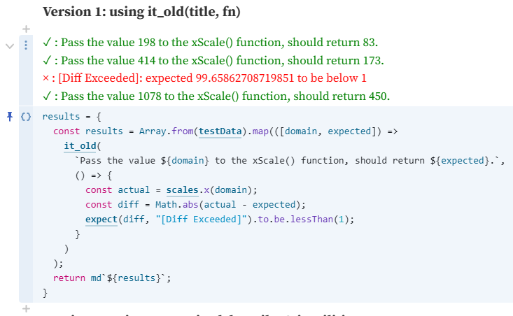

**图 1 对 Jest 的 expect 断言做简单封装的效果图**

要么又过于复杂 [^2]：

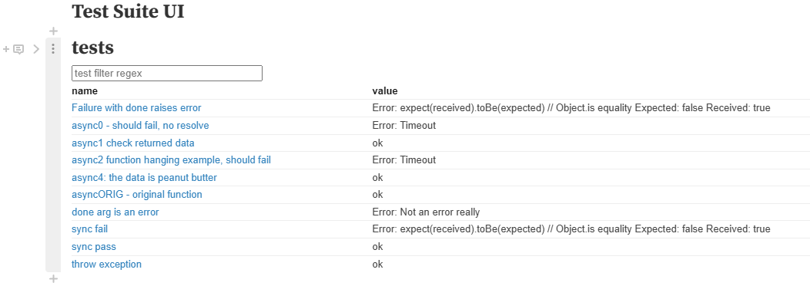

**图 2 同样基于 Jest 的 expect 断言实现的一套定制测试框架**

而我只希望能用上 `describe` 和 `it`，最后将单元测试写到一个测试套件（suite）里，大致长这样：

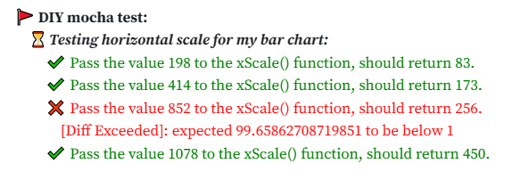

**图 3 希望通过组合 describe 和 it 方法实现的单元测试效果**

没办法，`Observable` 这方面还不成熟，还得自力更生。


## 2 经过

### 2.1 完成条形图剩余部分——绘制数据标签

参考上一节做好的版本（详见我的《[3.4 小节 DIY 实战：使用 Observable 在线绘制 D3 条形图](https://blog.csdn.net/frgod/article/details/142708748)》），先把带标签的 D3 条形图画出来。

和上次一样，先上传 `data.csv` 原始数据集，然后转成 `Observable` 可以使用的对象数组：

```js
data = {
  const csv = await FileAttachment("data.csv").csv({typed: true});
  return csv.sort((a, b) => d3.descending(a.count, b.count));
}
```

接着定义两个方向上的比例尺，放到一个 `JavaScript` 对象里备用：

```js
scales = {
  const x = d3
    .scaleLinear()
    .domain([0, d3.max(data, (d) => d.count)])
    .range([0, 450]);

  const y = d3
    .scaleBand()
    .domain(data.map((d) => d.technology))
    .range([0, 700])
    .paddingInner(0.2);

  return { x, y };
}
```

然后就可以绘制条形图了，定义一个图表变量 `chart`：

```js
chart = {
  const svg = d3
    .create("svg")
    .attr("viewBox", "0 0 600 700")
    .attr("width", "100%")
  // .style('border', '1px solid black');

  const groups = svg
    .selectAll("g")
    .data(data)
    .join("g")
      .attr("transform", (d) => `translate(0, ${scales.y(d.technology)})`);

  // append rects
  appendRect(groups);

  // append tech name labels
  appendTechNameLabels(groups);

  // append count labels
  appendCountLabels(groups);

  // data binding part
  appendAxisLine(svg);

  return svg.node();
}
```

由于要加注两组标签，要用到 `SVG` 的分组元素（`g`），这里需要现将数据绑定到每个 `<g>` 元素上（如第 8 行所示）。然后用 `groups` 选择集分别完成矩形条、名称标签以及数据标签的绑定与绘制。为了方便查看，我把它们都提到了单独的单元格来处理（践行“单一职责”原则）。

先是技术名称标签。我再原书内容的基础上，把 `D3.js` 对应的得票数也设置了一些样式（加粗、变色、调整字号）：

```js
function appendCountLabels(groups) {
  // Define predicates
  const target = 'D3.js';
  const fontSizeHightD3 = ({technology: t}) => 
    (t === target) ? '9px' : '8px';
  const fontWeightByTechName = ({technology: t}) => 
    (t === target) ? 700 : 400;
  const fillColorByTechName = ({technology: t}) => 
    (t === target) ? 'yellowgreen' : '#000';

  // Append labels
  groups
    .append('text')
      .attr('x', d => 100 + scales.x(d.count) + 4)
      .attr('y', 12)
      .text(d => d.count)
      .style('font-family', 'sans-serif')
      .style('font-weight', fontWeightByTechName)
      .style('font-size', fontSizeHightD3)
      .style('fill', fillColorByTechName);
}
```

效果还不赖：


**图 4 升级版的 D3 数据标签效果**

接着绘制纵轴标签（对应各技术名称）：

```js
function appendTechNameLabels(groups) {
  groups
    .append('text')
      .attr('x', 96)
      .attr('y', 12)
      .attr('text-anchor', 'end')
      .text(d => d.technology)
      .style('font-family', 'sans-serif')
      .style('font-size', '10px');
}
```

然后是矩形条：

```js
function appendRect(groups) {
  const byTechName = ({technology: t}) => 
    t === 'D3.js' ? 'yellowgreen' : 'skyblue';

  groups
    .append('rect')
      .attr('x', 100)
      .attr('y', 0)
      .attr('height', scales.y.bandwidth())
      .attr('width', d => scales.x(d.count))
      .attr('fill', byTechName);
}
```

最后是纵轴的那条直线：

```js
function appendAxisLine(svg) {
  svg
    .append('line')
      .attr('x1', 100)
      .attr('y1', 0)
      .attr('x2', 100)
      .attr('y2', 700)
      .attr('stroke', 'black');
}
```

然后 <kbd>Shift</kbd> + <kbd>Enter</kbd> 一键出图：

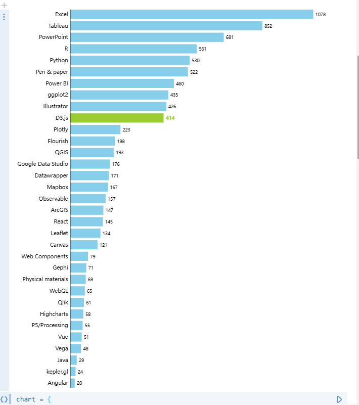

**图 5 最终在 Observable 平台绘制的加注了图表标签的 D3 条形图效果**


### 2.2 用 AI 提示重构单元测试模块

接下来才是本篇的重头戏——自己封装一套 `describe` 方法和 `it` 方法。还好 `Observable` 支持断言库 `Chai.js` 的导入，可能在 **[Mike Bostock](https://bost.ocks.org/mike/)** 大神看来，只要把断言结果放到单元格里就行了，干嘛要写成 `describe` 嵌套 `it` 的结构呢？对于想用 JS 的循环结构来写测试的码畜的想法，大神可能无暇顾及：

```js
// 这是我精心构建的测试数据（多么优雅~我居然还会用 Map）
testData = new Map([
  [198, 83],
  [414, 173],
  [852, 256], // backup: 852 -> 356
  [1078, 450]
]);
```

本来【图1】是出不来效果的，因为 `it_old` 方法最初的定义是这样的：

```js
/**
 * Test helper to display test title into the notebook
 */
function it_old(title, testFunction) {
  try {
    testFunction.call(this);
    return html`<div style="color:green;" >✓ : ${title || "Test passing "}</div>`;
  } catch (err) {
    return html`<div style="color:red;" >× : ${err.message}</div>`;
  }
}
```

如果不逐个返回运行的结果，就会乱套：

```js
invalidResults = {
  it_old("test1", () => expect(2).to.be.lessThan(1));
  it_old("test2", () => expect(5).to.be.lessThan(1));
  it_old("test3", () => expect(10).to.be.lessThan(1));
  it_old("test4", () => expect(100).to.be.lessThan(1));
}
```

运行单元格后看不到任何报错：

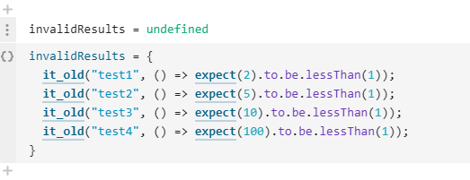

**图 6 无法将测试结果正确显示到页面旧版 it 方法**

这么一来，我要封装的 `it` 方法和 `describe` 方法，必须自动收集这样的断言结果才行，而且还得在后台完成，不然太 low，与我的码畜风格相悖。于是我想到了 `ES6` 引入的 `class` 语法糖，先把 `describe` 和 `it` 定义的回调函数收集到类的一个成员数组，运行的时候再用 `this` 去挨个遍历它们，结果放到另一个数组，最后用统一的渲染函数交卷，不就搞定了吗？

想法成形，下一步就让机智的 AI 帮我出个 0.1 版吧。果然，不抱太大希望的情况下往往有惊喜，居然帮我把 `beforeHooks` 和 `afterHooks` 都实现了（先不论对错，这么端正的态度就值得表扬）：

```js
class TestSuite {
    constructor(name) {
        this.name = name;
        this.tests = [];
        this.beforeHooks = [];
        this.afterHooks = [];
    }

    describe(name, fn) {
        const suite = new TestSuite(name);
        fn.call(suite);
        this.tests.push(suite);
    }

    it(name, fn) {
        this.tests.push({ name, fn });
    }

    before(fn) {
        this.beforeHooks.push(fn);
    }

    after(fn) {
        this.afterHooks.push(fn);
    }

    async run() {
        console.log(`Running suite: ${this.name}`);
        
        // Run before hooks
        for (const hook of this.beforeHooks) {
            await hook();
        }

        for (const test of this.tests) {
            if (typeof test.fn === 'function') {
                try {
                    await test.fn();
                    console.log(`✔️ ${test.name}`);
                } catch (error) {
                    console.error(`❌ ${test.name}`);
                    console.error(error);
                }
            } else {
                // Recursively run nested suites
                await test.run();
            }
        }

        // Run after hooks
        for (const hook of this.afterHooks) {
            await hook();
        }
    }
}

// 使用示例
const suite = new TestSuite('My Test Suite');

suite.describe('Array', function() {
    this.before(() => {
        console.log('Setting up before tests...');
    });

    this.after(() => {
        console.log('Cleaning up after tests...');
    });

    this.it('should add items', async () => {
        const arr = [];
        arr.push(1);
        if (arr.length !== 1) throw new Error('Test failed');
    });

    this.it('should remove items', async () => {
        const arr = [1];
        arr.pop();
        if (arr.length === 0) throw new Error('Test failed');
    });
});

suite.run();
```

直接放到 `Observable` 单元格运行，虽然有很多小问题，但总算还像那么回事：

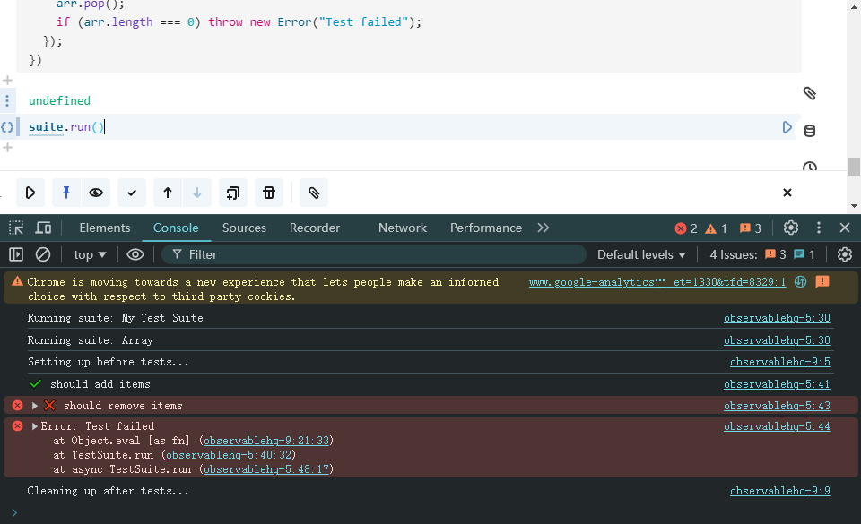

**图 7 根据 AI 提示词生成的制定代码效果截图**


### 2.3 集成 Chai.js 的 expect 断言

AI 版本过于粗糙，需要调整几个地方：

1. 控制台输出需要改为页面显示；
2. 各单元测试结果需要分别收集起来；
3. 测试套件和用例描述也得放到结果里；
4. 统一整体输出样式（颜色、缩进等）。

逐一解决这些小瑕疵，于是就有了 `v1.0` 版的测试类 `MyMocha`：

```js
// Define customized Mocha class
class MyMocha {
  constructor(name) {
    this.name = name;
    this.tests = [];
    this.results = [md`<div style="font-weight: 700;">🚩 ${name}</div>`];
    this.beforeHooks = [];
    this.afterHooks = [];
  }

  describe(name, fn) {
    const suite = new MyMocha(name);
    fn.call(suite);
    this.tests.push(suite);
    this.results.push(
      md`<div style="font-weight: 700; text-indent: 1em;">⏳ <i>${name}</i></div>`
    );
  }

  it(name, fn) {
    this.tests.push({ name, fn });
  }

  before(fn) {
    this.beforeHooks.push(fn);
  }

  after(fn) {
    this.afterHooks.push(fn);
  }

  // show the results altogether in markdown format
  async showResults() {
    await this.run();
    return md`${this.results}`;
  }

  isFunction(fn) {
    return typeof fn === "function";
  }

  async run() {
    console.log(`Running suite: ${this.name}`);

    // Run before hooks
    for (const hook of this.beforeHooks) {
      await hook();
    }

    for (const test of this.tests) {
      if (this.isFunction(test.fn)) {
        try {
          await test.fn();
          this.results.push(
            html`<div style="color: green; text-indent: 2em;">✔️ ${test.name}</div>`
          );
        } catch (error) {
          this.results.push(
            html`<div style="color:red; text-indent: 2em;">❌ ${test.name}</div>`
          );
          this.results.push(
            html`<div style="color: red; text-indent: 3em;">${error.message}</div>`
          );
        }
      } else {
        // Recursively run nested suites
        await test.run();
      }
    }

    // Run after hooks
    for (const hook of this.afterHooks) {
      await hook();
    }
  }
}
```

然后把 `Chai.js` 导入，再把 `expect` 断言提出来：

```js
chai = import("https://unpkg.com/chai/chai.js");
expect = chai.expect.bind(chai);
```

写个测试看看：

```js
suite = {
  const testData = new Map([
    [198, 83],
    [414, 173],
    [852, 256], // backup: 852 -> 356
    [1078, 450]
  ]);

  const suite = new MyMocha("DIY mocha test:");
  const it = suite.it.bind(suite);
  const describe = suite.describe.bind(suite);

  describe("Testing horizontal scale for my bar chart:", () => {
    testData.forEach((expected, domain) => {
      it(`Pass the value ${domain} to the xScale() function, should return ${expected}.`, () => {
        const actual = scales.x(domain);
        const diff = Math.abs(actual - expected);
        expect(diff, "[Diff Exceeded]").to.be.lessThan(1);
      });
    });
  });

  return suite.showResults();
}
```

效果还行：

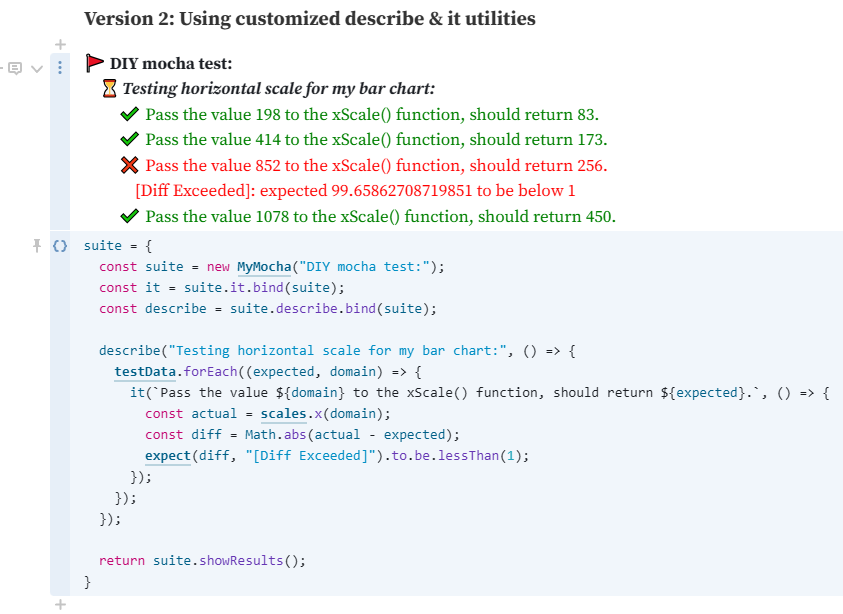

**图 8 集成了 Chai.js 的 expect 断言后的测试用例运行结果**


### 2.4 导出定制的 MyMocha 类及相关断言方法

既然都测试通过了，就可以考虑放到一个新的 Notebook 里，供其它记事本导入了。咱也模仿一下其他网友的套路，搞个标题和用法示例：

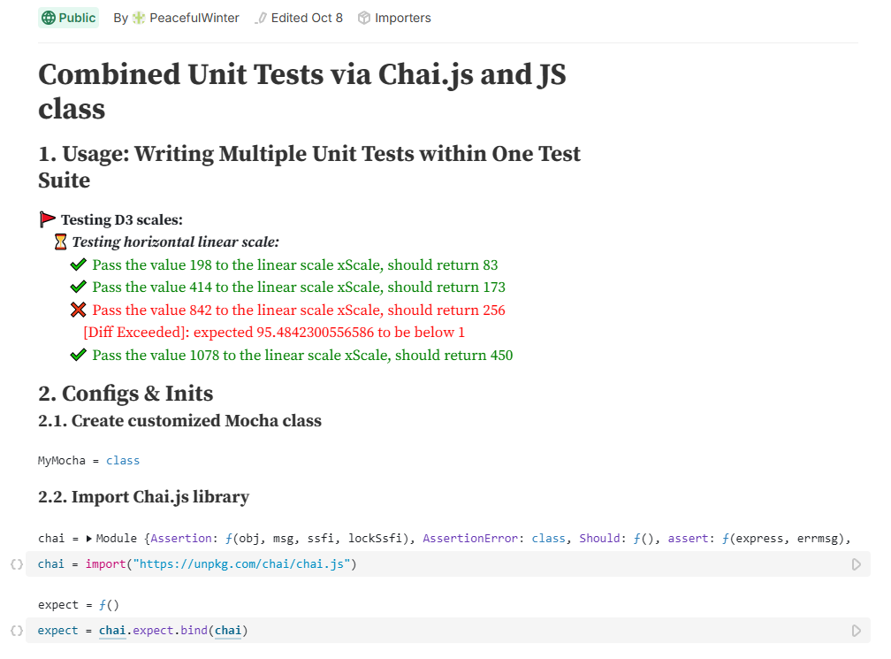

**图 9 拟用于导出 MyMocha 类和 expect 断言的通用 Notebook 页面**

然后将该页面设置为公开访问，并根据 `Observable` 的官方文档，用规定的导入语法再写一版测试：

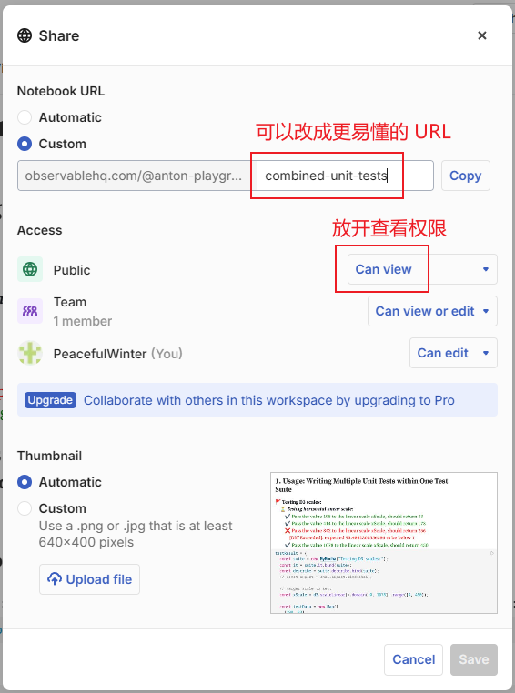

**图 10 将 Notebook 记事本页面设置为公开访问**

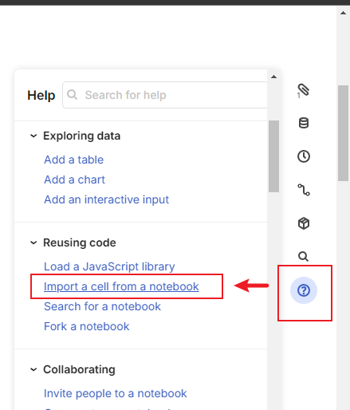

**图 11 从页面右侧边栏的官方文档找到导入其他记事本单元格的写法**

按照官方文档，导入要这么写：

```js
import { MyMocha, expect } from "@anton-playground/combined-unit-tests"
```

再测一遍，结果发现一个 Bug：渲染完成后没有及时清空本次测试结果，导致重复运行后上次的结果也在里面。于是切回公共页面改改渲染函数的逻辑，勉强算是 v1.1 版吧：

```js
// show the results altogether in markdown format
async showResults() {
  await this.run();
  const results = md`${this.results}`;
  this.tests = this.tests.filter((t) => !this.isFunction(t.fn));
  this.results = [];
  return results;
}
```

再测，大功告成：

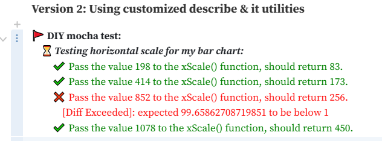

**图 12 最终通过导入公共记事本的自定义方法实现的测试套件的实际效果**


## 3 小结

虽然成功模拟了 `Mocha.js` 里的 `describe` 和 `it` 原语，但毕竟逻辑过于简单，稍微上点有难度的测试就不够用了，而且写法上也没有 `Mocha.js` 那么自然，对于锚定的几个 `hooks` 钩子也无暇验证。这个 Notebook 就算抛砖引玉吧，以后对 `TDD` 和 `BDD` 了解得更深入了再来升级。

两个记事本页面我都共享出来，方便大家学习交流（可以 Fork 到自己的工作空间（Workspace）进行修改）：

- 定制的 `MyMocha` 测试类：[https://observablehq.com/@anton-playground/combined-unit-tests](https://observablehq.com/@anton-playground/combined-unit-tests)
- 加注标签的条形图并通过线性比例尺单元测试的示例页：[https://observablehq.com/@anton-playground/my-bar-chart-with-chaijs](https://observablehq.com/@anton-playground/my-bar-chart-with-chaijs)


---

[^1]: 搜到一篇对 Jest 的 expect 方法的轻量级封装案例，详见：[Spencer: Unit testing inside a notebook](https://observablehq.com/@spensaur/unit-testing-inside-a-notebook)
[^2]: 详见：[Tom Larkworthy: Reactive Unit Testing and Reporting Framework](https://observablehq.com/@tomlarkworthy/testing) 

