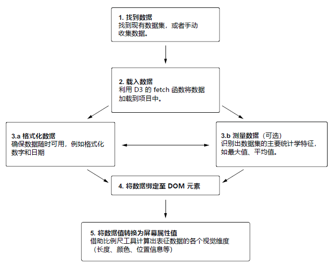

# 第三章 数据的处理

> **本章概要**
>
> - 识别数据类型及数据集格式
> - 数据的加载、格式化与测量
> - 将数据绑定到 DOM 元素
> - 利用比例尺将数据转换为视觉属性
> - 图表标签的添加

任何数据可视化的共同基础，很明显，是数据的 **存在**。作为数据可视化的开发者，我们需要理解并处理遇到的各种类型的数据和数据集，并据此生成想要的可视化效果。本章将从数据的查找入手，讨论适用于大多数 D3 项目的数据基本工作流程，如图 3.1 所示。这些数据可能有不同的类型，例如名义数据（nominal data）或有序数据（ordinal data）；也可能具有不同的数据集格式，例如 CSV 或 JSON 文件。在这个阶段，通常需要进行大量的数据准备和清理工作，但它们不再本书的讨论范围之内。

一旦数据集组装完成，就可以利用 D3 对数据进行加载、格式化、测量等操作，进而基于这些数据来生成视觉元素，通常是以 SVG 图形的形式呈现。这个强大的过程称为数据绑定（data binding）。我们将用它来生成第二章条形图需要的所有矩形。

数据集中包含的值未必会直接展示到屏幕上。可能由于数字过大而无法直接用作视觉元素的像素值，又或者可能希望用颜色来呈现特定的值，这时就需要用到 D3 的比例尺了。本章将讨论不同类型的比例尺及其用法。最后，我们将应用线性比例尺（linear scales）和分段比例尺（band scales）来定位和调整条形图中的矩形大小（柱状图参见 http://mng.bz/mjor）。

**图 3.1 D3 数据工作流示意图**

图 3.2 为本章将要介绍的 D3 数据工作流的简化版示意图：

**图 3.2 D3 数据工作流简图**