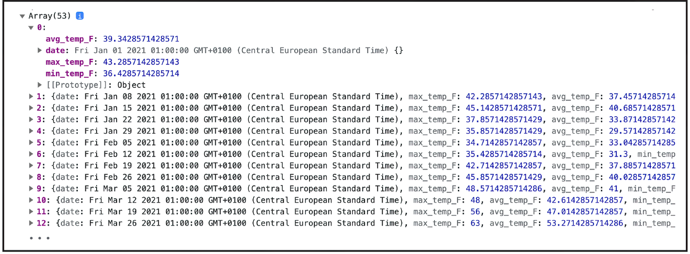

## 4.1 坐标轴的创建 Creating axes

开发一个数据可视化项目通常需要对 SVG 容器中的可用空间进行合理规划。您可能一上来就忍不住想要实现一些酷炫的特效作为可视化项目的核心内容，但是，相信我，在此之前稍加准备将为您省出不少的创作时间——不光可视化开发如此，所有的编程任务乃至生活中的方方面也是如此！在规划阶段，不仅要考虑图表本身，还要考虑那些有助于让图表一目了然的辅助因素，比如坐标轴、数据标签、图例等等。

本节将介绍边距约定的相关知识，旨在对这些不同要素的空间分配情况进行合理规划。之后会介绍一些方法来给 D3 图表添加坐标轴，并进一步了解构成 D3 坐标轴的相关 SVG 元素。这些知识最终都将应用到上面的图 4.1 所示的折线图中。

正式开始之前，请先准备好本章的源码文件。如果还没有下载，可以从本书的 `GitHub` 仓库进行下载（[http://mng.bz/Xqjv](http://mng.bz/Xqjv)）[^2]。代码都在 `chapter_04` 文件夹中，已按章节进行组织，练习本章内容，请在您的代码编辑器中打开 `4.1-Margin_convention_and_axes/start` 文件夹，并启动本地 Web 服务器。本地开发环境的设置方法，请参考 **附录 A**（译注：待翻译，推荐使用 VSCode 的 Live Server 插件快速初始化）。您也可以在本章源码根目录下的 `README` 文件中找到更多与本项目文件夹结构相关的详细介绍。

> **重要提醒**
>
> 在使用本章代码进行同步练习时，请务必记得让代码编辑器要么只打开一个 `start` 文件夹，要么只打开一个 `end` 文件夹。如果将本章所有示例代码视为同一个项目，并通过 `Live Server` 扩展插件来搭建本地服务器环境，则项目启动时引用的数据文件路径将会失效。

项目代码将写在 `line-chart.js` 文件中。首先利用 `d3.csv()` 方法加载每周气温数据集：

```js
d3.csv("../data/weekly_temperature.csv");
```

上一章介绍过，D3 加载表格类数据集时执行的类型转换（type conversion）可能会影响值的类型。要是数据集中的数字转成了字符串，则需要改回数字类型以便后续操作。我们也学过，`d3.csv()` 的回调函数由于可以逐行访问数据，正是处理类型问题的理想场所。本节再介绍一个不用在回调里手动转换类型的小技巧：在回调函数的位置调用 `d3.autoType` 方法。该函数能够检测日期、数字等常见的数据类型，并将其自动转换成相应的 JavaScript 类型：

```js
d3.csv("../data/weekly_temperature.csv", d3.autoType);
```

值得注意的是，`d3.autoType` 可能会由于数据类型的不确定性而出错。例如一个四位数 `2023`，既可以是数字类型，也可能是日期型。这是 `d3.autoType` 会按数字进行转换，而您却希望按日期解析。因此有必要在数据加载完毕后进行双重验证。更多详细，可以参考发表在 `Observable` 上的一篇写得很棒的文章：[https://observablehq.com/@d3/d3-autotype](https://observablehq.com/@d3/d3-autotype)。

为此，可以继续使用 `JavaScript` 的 `Promise` 来访问加载的数据集，然后将其输出到控制台，以确认日期都正确转成了 JavaScript 日期格式，而气温值则转成了数字，如图 4.2 所示：

```js
d3.csv("../data/weekly_temperature.csv", d3.autoType).then(data => {
  console.log("temperature data", data);
});
```



**图 4.2 得益于 d3.autoType，日期和气温都转换成了正确的数据类型**

由于数据加载是个异步过程（D3 加载并访问数据的具体方法，详见第三章有关内容），这里仍然选用 `JavaScript` 的 `Promise` 接口来访问数据集。确认格式无误后，就可以开始本章图表的构建了。

`line-chart.js` 文件已经包含了一个名为 `drawLineChart()` 的函数，创建折线图的代码就将写到那儿。按以下代码的写法，在 `JavaScript` 的 `Promise` 回调函数中调用 `drawLineChart()` 方法，并将数据集传入该方法：

```js
d3.csv("../data/weekly_temperature.csv", d3.autoType).then(data => {
  console.log("temperature data", data);
  drawLineChart(data);
});
```

上述工作一切就绪后，接下来就正式开始边距约定（margin convention）相关的学习。


---

[^2]: 本章要用到的源码我会上传到 CSDN，方便大家在本地同步练习。


