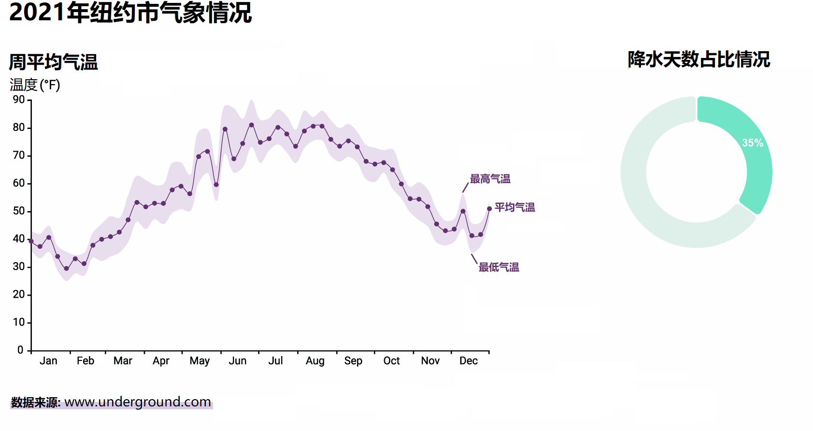

# 第四章 直线、曲线与弧线的绘制 Drawing lines, curves, and arcs

> **本章概要**
>
> - 图表轴线的添加与边距约定的应用
> - 使用直线生成器函数绘制线形图
> - 利用数据点插值将直线变为曲线
> - 使用面积生成工具绘制面积图
> - 使用圆弧生成工具创建弧线

想必您已经熟悉了数据可视化中常见的 SVG 图形：直线（line）、矩形（rectangle）和圆（circle）；并且还能从零开始利用矩形来绘制一个条形图。然而，这些基本图元所能绘制的作品毕竟有限；为了实现更复杂的可视化效果，人们通常会使用 SVG 路径（path）。正如本书第一章介绍的那样，SVG 的路径元素是所有 SVG 元素中灵活性最高的，几乎可以实现任何形式的渲染效果。因而它在 D3 项目中的应用也极为广泛，其中最简单的一类便是直线和曲线的绘制，或者在环形图中创建圆弧。

SVG 路径元素的形状是由它的 `d` 属性决定的。该属性由一组指令组成，它们描述了路径元素的起点与终点、变向时的曲线类型、路径是开口的还是封闭的等等。这些因素可能会让 `d` 属性写得很长，复杂度也会随之迅速攀升。通常情况下，该属性值都不会让开发人员亲自来写，而是交给 D3 的图形生成工具（shape generator）去实现。

本章将构建如图 4.1 所示的可视化项目——一个与温度变化趋势相关的线形图，以及反映 2021 年纽约降水天数占比情况的一组可视化弧线图。您可以查看该项目的线上版，网址为：[http://mng.bz/5orB](http://mng.bz/5orB)；项目数据则来自 Weather Underground 网站（[www.wunderground.com](www.wunderground.com)）[^1]。

**图 4.1 本章实现项目：2021 年纽约市温度变化及全年降水天数占比情况可视化**

本章将利用 D3 的图形生成函数来创建这两种可视化效果。首先来了解一下 D3 的边距约定（margin convention）以及给图表添加坐标轴的相关知识。

[^1]: **Weather Underground** 是美国一家提供实时天气数据和详细天气预报的在线平台，由 Jeff Masters 和其他气象爱好者于 1995 年创建，总部位于美国加州旧金山，依托于大量私人气象站，用户可以获得准确的地方性天气信息和恶劣天气警报，同时支持社区参与，鼓励用户分享天气数据

